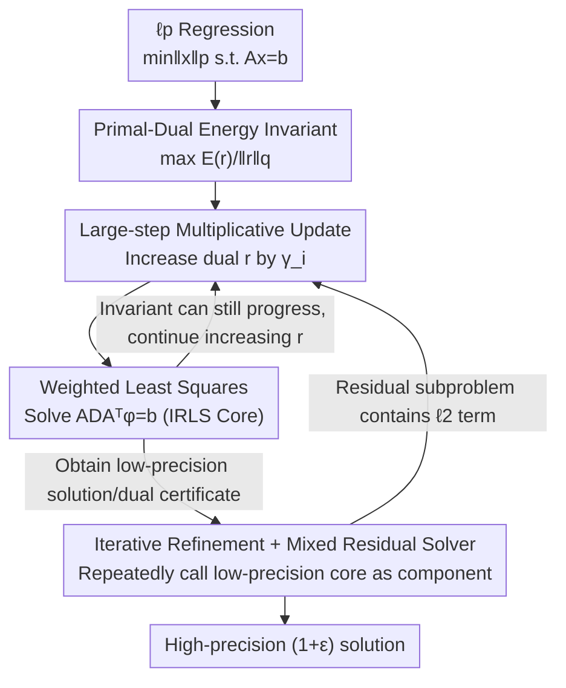

# Improved ℓp Regression via Iteratively Reweighted Least Squares

**Conference**: ICLR 2026  
**OpenReview**: [https://openreview.net/forum?id=l5zZ2EEijD](https://openreview.net/forum?id=l5zZ2EEijD)  
**Code**: Reuses https://github.com/fast-algos/pIRLS (Experiments built upon this implementation)  
**Area**: Optimization Theory / Convex Optimization  
**Keywords**: $\ell_p$ regression, Iteratively Reweighted Least Squares (IRLS), Primal-Dual, Iterative Refinement, Linear System Solving

## TL;DR
This paper introduces a novel IRLS algorithm for $\ell_p$ regression with $p \in (1, \infty)$ from a primal-dual perspective. By employing a lightweight multiplicative update rule, it achieves an iteration complexity of $O\!\big(p^2 n^{\frac{p-2}{3p-2}}\log\frac{n}{\epsilon}\big)$. This marks the first time a practical IRLS method has attained the optimal iteration bounds previously only held by complex theoretical algorithms, significantly outperforming classical p-IRLS and CVX in experiments.

## Background & Motivation

**Background**: The $\ell_p$ regression problem — minimizing $\|x\|_p$ subject to $Ax=b$ — is a fundamental problem in machine learning extending far beyond classical $p=2$ least squares. it appears in scenarios such as $\ell_p$-Laplacian regularization for semi-supervised learning, graph clustering, and robust regression. The computational cost of leading iterative algorithms for such convex problems is dominated by solving a linear system at each step. Thus, the core metric for efficiency is the number of calls to a linear system solver.

**Limitations of Prior Work**: A "theory vs. practice" gap has persisted in this field. On one hand, algorithms by Adil et al. (SODA 2019 / J. ACM 2024) provide the current best theoretical iteration bound of $O\!\big(p^2 n^{\frac{p-2}{3p-2}}\log\frac{n}{\epsilon}\big)$, but rely on complex subroutines and hyperparameters designed for proofs, making them difficult to implement without extensive manual tuning. On the other hand, the p-IRLS by Adil et al. (NeurIPS 2019) is engineering-friendly and faster than general solvers like CVX, but sacrifices theoretical guarantees, resulting in a worse iteration bound of $O\!\big(p^3 n^{\frac{p-2}{2p-2}}\log\frac{n}{\epsilon}\big)$.

**Key Challenge**: The goal is to combine the practicality of IRLS — solving a single weighted least squares per step with a lightweight implementation — with the optimal theoretical iteration bound. Previous low-precision algorithms generally relied on Taylor expansions of $\|x\|_p^p$ to derive and constrain updates, a path that inherently limits the step size.

**Goal**: To provide an IRLS framework applicable to all $p \in (1, \infty)$ that maintains a lightweight implementation while matching SOTA theoretical iteration bounds.

**Key Insight**: Instead of Taylor expansion, the authors approach the problem through its **dual form**. The problem $\min_{x:Ax=b}\|x\|_{2p}^2$ is reformulated as $\max_{r\ge 0} \frac{E(r)}{\|r\|_q}$, where the energy function $E(r)=\min_{x:Ax=b}\langle r, x^2\rangle$ and $\ell_q$ is the dual norm of $\ell_{p/2}$. The update rules are naturally derived from an "invariant" maintained for the dual objective.

**Core Idea**: By replacing "Taylor expansion" with a "Primal-Dual + Energy Invariant" approach, dual variables can be scaled by large polynomial factors (i.e., taking very large steps) in each iteration. This significantly reduces the number of iterations while maintaining the simplicity of solving one weighted least squares per step.

## Method

### Overall Architecture

The algorithm centers on a recurring core operation: solving a weighted least squares $\min_{x:Ax=b}\langle r, x^2\rangle$ at each iteration, which is equivalent to solving the linear system $ADA^\top\phi=b$ (where $D$ is a non-negative diagonal matrix) — the essence of IRLS. The paper builds two solvers on this core:

- **Low-precision solver (poly $1/\epsilon$, Theorem 1.1)**: Composed of an outer binary search (Algorithm 1) and an inner primal-dual sub-solver (Algorithm 2). It directly solves the scale-free pure $\ell_p$ objective.
- **High-precision solver (log $1/\epsilon$, Theorem 1.2)**: Uses an iterative refinement framework (Algorithm 3) as a shell. Each step reduces the problem to a **mixed $\ell_p + \ell_2$ residual subproblem**, which is solved by a modified IRLS residual solver (Algorithm 4). This residual solver reuses the primal-dual logic from the low-precision version.

In essence, the low-precision primal-dual IRLS serves as the foundation, which the high-precision algorithm embeds as a component within iterative refinement, compressing error dependence from poly $1/\epsilon$ to log $1/\epsilon$. The diagram below illustrates the high-precision pipeline used in experiments:

### Key Designs

**1. Primal-Dual Energy Framework and Invariant: Deriving updates from a dual invariant**

Previous low-precision algorithms derived updates from Taylor expansions of $\|x\|_p^p$, which restricted step sizes. This work adopts a dual perspective: from duality, $\min_{x:Ax=b}\|x\|_{2p}^2=\max_{r\ge0}\frac{E(r)}{\|r\|_q}$, where the energy $E(r)=\min_{x:Ax=b}\langle r,x^2\rangle$ monotonically increases with $r$. Given an estimate $M$ for the optimal value $\|x^*\|_{2p}$, and starting from a uniform initialization $r^{(0)}=\tfrac{1}{n^{1/q}}$, the algorithm focuses on one task: increasing coordinates of $r$ as much as possible without violating the following invariant:

$$E(r^{(t+1)})-E(r^{(t)})\ \ge\ M^2\big(\|r^{(t+1)}\|_q-\|r^{(t)}\|_q\big).$$

The elegance of this invariant is its **coordinate-wise decomposability**, reducing the "global maintenance" to "satisfying a local condition per coordinate." When $r$ can no longer be increased, a small-norm primal solution is found. Conversely, if $\|r\|_q$ grows sufficiently large, the telescoping property of the invariant ensures $\frac{E(r)}{\|r\|_q}\ge\big(\frac{M}{1+\epsilon}\big)^2$, providing an "infeasibility certificate" to increase the estimate $M$. The outer Algorithm 1 performs a binary search for $M$ in the interval $\big[\|x^{(0)}\|_2/n^{\frac12-\frac1{2p}},\ \|x^{(0)}\|_2\big]$, requiring only $O(\log\log n+\log\frac1\epsilon)$ subproblem calls.

**2. Large-step Multiplicative Updates: Moving beyond mirror descent's smoothness constraints**

To maximize the increase of $r$ while maintaining the invariant, the authors define a "cost-effectiveness" measure for each coordinate:

$$\gamma_i^{(t)}=\frac{\|r^{(t)}\|_q^{\,q-1}}{\big(r_i^{(t)}\big)^{q-1}}\cdot\frac{\big(x_i^{(t)}\big)^2}{M^2},$$

and set a threshold. If $\gamma_i^{(t)}$ exceeds the threshold, the coordinate is increased multiplicatively as $r_i^{(t+1)}=r_i^{(t)}\big(\gamma_i^{(t)}\big)^{1/q}$; otherwise, it remains unchanged. Crucially, whereas standard multiplicative weight updates (MWU) or mirror descent require a mirror map or regularization of the $\ell_p$ norm to "smooth" it—which restricts step sizes—this work **refrains from using any mirror map or smoothing**. This allows dual coordinates to jump by large polynomial factors in a single step. This transition from "small steps" to "large jumps" is the source of the iteration reduction from $O(p^3)$ to $O(p^2)$.

**3. Iterative Refinement + Mixed $\ell_p+\ell_2$ Residual Solver: Boosting to log $1/\epsilon$ precision**

To achieve high precision (log $1/\epsilon$), the authors use **iterative refinement**. Given a weak solver that provides a constant-factor approximation for a "mixed $\ell_p$ and $\ell_2$ objective," one can boost multiplicative error from constant to $1+\epsilon$ in $\tilde O_p(\log\frac1\epsilon)$ calls. The technical challenge lies in the residual subproblem $\min_{x:Ax=b}\|x^2\|_p+\langle\theta,x^2\rangle$, as the added $\ell_2$ term $\langle\theta,x^2\rangle$ makes the objective **no longer scale-free**. The authors observe that the $\ell_2$ term does not invalidate the coordinate-wise decomposition lower bound for the objective. Thus, by ensuring $\|r\|_q\le1$ and using **proper dual initialization** and **refined step sizes**, Algorithm 4 can reuse the mechanism of Algorithm 2 for this non-scale-free objective.

## Key Experimental Results

Experiments evaluate the high-precision Algorithm 3 with $\epsilon=10^{-10}$ on MATLAB 2024a. Comparisons include p-IRLS (Adil 2019b) and CVX's SDPT3 and SeDuMi solvers. The primary metrics are **iteration count (linear system solves)** and **runtime**.

### Main Results (Real Datasets, $p=8$, $\epsilon=10^{-10}$)

On six UCI regression datasets, CVX was excluded due to excessive runtime. Comparison with p-IRLS:

| Dataset (Size) | p-IRLS Iterations | Ours (Iterations) | p-IRLS Time(s) | Ours (Time) |
|--------|------|------|------|------|
| CT slices (48150×385) | 48 | **36** | 14.3 | **9.2** |
| KEGG Metabolic (57248×27) | 50 | **42** | 2.5 | **1.7** |
| Power Consumption (1844352×11) | 45 | **36** | 32 | **15.7** |
| Buzz Social Media (524925×77) | 50 | **42** | 28 | **18.1** |
| Protein Property (41157×9) | 44 | **36** | 1.6 | **1.1** |
| Song Year (463811×90) | 45 | **36** | 22.5 | **13.3** |

Ours **outperforms** p-IRLS across all datasets in both iterations and time, with an average speedup of 1–2.6x. On the massive Power Consumption instance, the speedup is approximately 2x.

### Synthetic Data and Scaling Analysis
Comparisons on random matrices and graphs ($\min\|Ax-b\|_p^p$):

| Configuration | Observation |
|------|---------|
| CVX (SDPT3/SeDuMi) | Fewer iterations but much slower. Every step is expensive; significantly slower than both IRLS methods. |
| Scaling $n$ | The performance gap between Ours and p-IRLS widens as $n$ increases. |
| Scaling $p$ | The performance gap widens as $p$ increases, consistent with theoretical $p^2$ vs $p^3$ dependence. |
| Accuracy | All errors are within the specified $\epsilon$ tolerance relative to CVX. |

### Key Findings
- **Dependency on $p$ is the differentiator**: The iteration bound $\propto p^2$ vs $p^3$ makes this method increasingly superior as $p$ grows.
- **Victory via fewer steps**: Since the per-step cost (one linear system solve) is identical for both IRLS methods, the speedup is entirely due to fewer iterations (larger step sizes).
- **CVX Lack of Scalability**: CVX failed or was extremely slow on large instances, highlighting the scalability of the IRLS approach.

## Highlights & Insights
- **Derivation from Invariants**: Rather than forcing a specific update formula, deriving rules from a dual energy invariant ensures the algorithm is both simple and theoretically sound.
- **"Lack of Smoothness" as a Benefit**: Contrary to the intuition that $\ell_p$ norms must be smoothed (via mirror maps), deliberately avoiding smoothing allows for large polynomial coordinate jumps, which is the core insight for Reducing iteration counts.
- **Low-precision Core as a Component**: The structure of embedding a low-precision primal-dual solver as a "weak solver" within iterative refinement is a prime example of building robust algorithms from simple kernels.
- **Bridging Theory and Practice**: This work closes the gap in the Adil et al. series by providing an algorithm that is both theoretically optimal and practically implementable.

## Limitations & Future Work
- **Theory-Practice Gap**: Theoretical bounds for error propagation remain loose in worst-case analysis; some theoretical scaling factors were not observed in practice, suggesting the analysis may be conservative.
- **Focus on High-precision**: The performance of the low-precision Algorithm 2 was not independently evaluated in experiments; its competitiveness in medium-precision tasks is unknown.
- **Linear Solver Dependence**: Practicality depends on the availability of efficient solvers for $A^\top D A$ systems. For poorly structured matrices $A$, the per-step cost could become the bottleneck.
- **Hyperparameters and $p\to\infty$**: Certain threshold and initialization constants remain. The $p = \infty$ case is mentioned but not explored in depth experimentally.

## Related Work & Insights
- **vs. Adil et al. (NeurIPS 2019, p-IRLS)**: Both use one weighted least squares per step. p-IRLS uses Taylor expansion with limited steps ($O(p^3 n^{\frac{p-2}{2p-2}}\log\frac n\epsilon)$); Ours uses dual invariants for large steps, achieving $O(p^2 n^{\frac{p-2}{3p-2}}\log\frac n\epsilon)$.
- **vs. Adil et al. (SODA 2019 / J. ACM 2024)**: Previous works gave the same optimal bound but lacked practical implementations due to complex subroutines. This work reconciles the optimal bound with executable code.
- **vs. Interior Point Methods / CVX**: IPMs require $\tilde O(\sqrt n)$ iterations with expensive steps for $p\notin\{1,2,\infty\}$; Ours' IRLS is orders of magnitude faster on large instances.
- **vs. Mirror Descent / MWU**: This work inherits the spirit of multiplicative updates but avoids mirror maps and smoothing to allow significantly larger steps than standard mirror descent.

## Rating
- Novelty: ⭐⭐⭐⭐⭐ Replaces Taylor expansion with primal-dual energy invariants as the foundation for IRLS.
- Experimental Thoroughness: ⭐⭐⭐⭐ Extensive synthetic and real data across various $n$ and $p$, though only the high-precision version was tested.
- Writing Quality: ⭐⭐⭐⭐ Clear intuition and step-by-step logic; high detail density requires an optimization background.
- Value: ⭐⭐⭐⭐⭐ Successfully bridges the gap between theoretical optimality and engineering practicality for $\ell_p$ regression.

<!-- RELATED:START -->

## Related Papers

- [\[NeurIPS 2025\] Least Squares Variational Inference](../../NeurIPS2025/optimization/least_squares_variational_inference.md)
- [\[ICLR 2026\] Neural Sum-of-Squares: Certifying the Nonnegativity of Polynomials with Transformers](neural_sum-of-squares_certifying_the_nonnegativity_of_polynomials_with_transform.md)
- [\[ICLR 2026\] Hinge Regression Tree: A Newton Method for Oblique Regression Tree Splitting](hinge_regression_tree_a_newton_method_for_oblique_regression_tree_splitting.md)
- [\[ICLR 2026\] Non-Asymptotic Analysis of Efficiency in Conformalized Regression](non-asymptotic_analysis_of_efficiency_in_conformalized_regression.md)
- [\[ICLR 2026\] Distributionally Robust Linear Regression with Block Lewis Weights](distributionally_robust_linear_regression_with_block_lewis_weights.md)

<!-- RELATED:END -->
