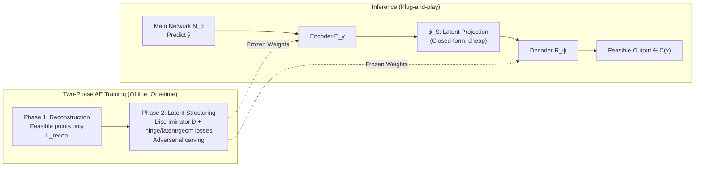

# Improving Feasibility via Fast Autoencoder-Based Projections

**Conference**: ICLR 2026  
**OpenReview**: [https://openreview.net/forum?id=dVlkUtsyg7](https://openreview.net/forum?id=dVlkUtsyg7)  
**Code**: [https://github.com/MOSSLab-MIT/Fast-Autoencoder-Based-Projections](https://github.com/MOSSLab-MIT/Fast-Autoencoder-Based-Projections)  
**Area**: optimization  
**Keywords**: Constrained optimization, Feasibility projection, Amortized optimization, Autoencoder, Adversarial training, Safe Reinforcement Learning  

## TL;DR
Training an autoencoder to "straighten" complex (non-convex) feasible sets into a simple convex latent space (a ball) allows a single forward decoding pass to rapidly correct infeasible neural network outputs back into the feasible region. This achieves near 100% feasibility in sub-millisecond time, serving as a low-latency alternative to traditional projections or solvers.

## Background & Motivation
**Background**: Learning and control systems in robotics, energy systems, and industrial automation often produce outputs that must satisfy complex (frequently non-convex) operational constraints. Three main approaches exist for enforcing constraints in learning systems: penalty methods (adding violations to the objective as regularization), differentiable projections/corrections (embedding exact solvers as network layers), and post-hoc repair (using traditional solvers to pull infeasible solutions back).

**Limitations of Prior Work**: Each approach has significant drawbacks. Penalty methods only "encourage" feasibility without guarantees and often yield solutions with severe violations in practice. Differentiable projections provide feasibility guarantees but are either computationally expensive or highly specialized for specific constraint classes (e.g., only convex or homeomorphic-to-sphere constraints). Post-hoc repair is similarly slow or specialized, and training-test mismatch further degrades end-to-end performance. In short: **No existing method simultaneously satisfies "general constraint classes + low latency + no degradation of end-to-end performance."**

**Key Challenge**: A fundamental trade-off exists between formal feasibility guarantees and inference speed. Strict feasibility requires expensive solvers or iterative processes, while speed often mandates sacrificing these guarantees. However, many real-world scenarios (low-latency control or settings where "near-feasibility" ensures downstream performance) do not require strict guarantees but are hindered by expensive exact projections.

**Goal**: To provide a **data-driven amortized correction mapping** that handles general (including non-convex and disjoint) constraint sets with extremely fast inference, suitable for scenarios where near-feasibility is sufficient and low latency is critical.

**Key Insight**: **Use an autoencoder as an "approximate projector."** While direct projection onto the original feasible set $C(x)$ is expensive, a transformation can be learned to map it to a "simple set" (like a ball) that is trivial to project onto. An autoencoder is trained to encode the feasible set into a **structured convex latent space**. During correction, the network output and parameters are encoded, projected onto the ball in latent space via a cheap closed-form operation, and decoded back into the original space. The entire path is a single forward computation. This autoencoder acts as a **plug-and-play "attachment"** that can be integrated with any standard neural network for end-to-end training.

## Method

### Overall Architecture
The method is named **FAB (Fast Autoencoder-Based projections)**. It considers repeatedly solving parameterized optimization problems $y^\star(x) \in \arg\min_{y\in C(x)} f(y;x)$ (where $x$ is state and $y$ is action in RL), approximating $x\mapsto y^\star(x)$ with a network. The core structure defines the network as $\hat{y}_\theta := \phi_x \circ N_\theta$, where $N_\theta$ is a standard feedforward predictor and $\phi_x$ is a differentiable feasibility correction process. FAB instantiates $\phi_x$ as $\phi_x := R_\psi \circ \phi_S \circ E_\gamma$: the encoder $E_\gamma$ maps the prediction and parameters into a latent space $Z$, $\phi_S$ projects the latent point onto a simple set $S$ (a closed ball of radius 0.5 via closed-form projection), and the decoder $R_\psi$ maps it back. The difficulty lies in training $(\gamma, \psi)$ such that latent points in $S$ decode to points strictly within $C(x)$. FAB employs a **two-phase training** strategy to carve the latent space so that "the latent point is in $S \Leftrightarrow$ the decoded point is in the feasible set."

### Key Designs

**1. Two-Phase AE Training: "Reconstruct Feasible Set" then "Structure Latent Space."** FAB splits training into two distinct steps. Phase 1 uses only feasible points $T_{feas}$ with a standard L2 reconstruction loss $L_{recon}(y,x) = \|y - R_\psi(E_\gamma(y,x))\|_2^2$, ensuring the autoencoder accurately "remembers" the shape of the feasible set. Phase 2 then carves the latent geometry. This decoupled approach prevents the conflicts between reconstruction fidelity and latent space constraints that occur during joint optimization.

**2. Adversarial Latent Space Structuring: Discriminator for Feasibility Boundaries.** Phase 2 introduces a discriminator $D_\xi: I\to[0,1]$ to estimate feasibility. It is trained on labeled data $T_{disc}$ (feasible/infeasible) using negative log-likelihood $L_{disc} = -(c\log D_\xi + (1-c)\log(1-D_\xi))$. The autoencoder and discriminator are trained alternately with **separate losses** rather than a shared minimax objective. The discriminator provides supervision to the autoencoder on the "feasibility boundary," forcing the decoder to learn robust transitions. Ablations show that removing the discriminator ($\text{No } D_\xi$) on the Two Moons distance minimization task causes the feasibility rate to drop from 88.3% to 13.6%.

**3. Three Losses for Latent Geometry: Hinge for placement, Latent for feasibility, Geom for coverage.** The composite loss $L_{struc}$ in Phase 2 includes three specialized terms. The **hinge loss** pulls feasible points into the ball and pushes infeasible points out: $L_{hinge} = c\,\mathrm{ReLU}(\|E_\gamma(y,x)\|_2 - r) + (1-c)\,\mathrm{ReLU}(r - \|E_\gamma(y,x)\|_2)$. This is the most critical loss; removing it drops feasibility from 96.8% to 28.4%. The **latent loss** $L_{latent}(z) = -\log D_\xi(R_\psi(z))$ samples $z\sim S$ and uses the discriminator to ensure points decoded from the ball are feasible. The **geometric regularization** $L_{geom} = \mathrm{Var}_{z\sim\hat{S}}[\log\det(J_z J_z^\top + \varepsilon I_k)]$ ($J_z=\nabla_z R_\psi(z)$) encourages **uniform coverage**, preventing the decoder from collapsing the entire ball onto a small subset of the feasible region.

**4. Multi-Decoder Mixture: Expert weighting for disjoint sets.** As a variant, FAB can utilize $\rho$ decoders $R^{(1)}_{\psi_1},\dots,R^{(\rho)}_{\psi_\rho}$ and a weighting network $M_\omega: Z\to\mathbb{R}^\rho$. It computes mixture weights $\alpha(z)=\mathrm{softmax}(M_\omega(z))$ for a final decoding $R_\psi(z)=\sum_i \alpha_i(z)R^{(i)}_{\psi_i}$. This allows different decoders to specialize in different regions of the latent space, effectively handling **disjoint** feasible sets like Two Moons, which are difficult for a single decoder to map from a connected ball.

## Key Experimental Results

### Main Results (Constrained Optimization, Two Moons Disjoint Set)
5 seeds × 1500 test problems/seed, RTX 4090. ↑Feas: Feasibility, ↓Time: Inference ms, ↓Gap: Optimality gap.

| Method | Quadratic Feas% / Time(ms) | Linear Feas% / Time | Dist.Min. Feas% / Time |
|------|------|------|------|
| Projected Gradient | 80.5 / 79.07 | 76.3 / 48.23 | 79.2 / 69.79 |
| Penalty (Classic) | 20.4 / 78.39 | 10.4 / 61.58 | 14.6 / 38.67 |
| Interior Point | 78.3 / 82.80 | 77.3 / 46.37 | 79.9 / 42.00 |
| Penalty NN | 91.1 / 0.20 | 80.0 / 0.14 | 40.7 / 0.24 |
| FSNet | 98.7 / 4.42 | 98.3 / 3.40 | 99.3 / 4.03 |
| Homeomorphic Proj. | 73.9 / 247 | 76.1 / 240 | 76.1 / 243 |
| **FAB** | **96.8 / 0.55** | **83.5 / 0.43** | **88.3 / 0.41** |
| **FAB: 2 Decoders** | **100.0 / 0.59** | **100.0 / 0.55** | **100.0 / 0.50** |
| **FAB: 3 Decoders** | **100.0 / 0.80** | **100.0 / 0.62** | **100.0 / 0.60** |

Note: FAB inference ranges from 0.4–0.8 ms, which is **2–3 orders of magnitude faster** than Homeomorphic Projection (~240 ms) and an order of magnitude faster than FSNet (~4 ms). Multi-decoder versions reach 100% feasibility on the disjoint Two Moons set.

### Ablation Study (Two Moons)

| Ablation Setting | Quadratic Feas% | Linear Feas% | Dist.Min. Feas% |
|------|------|------|------|
| FAB (Full) | 96.8 | 83.5 | 88.3 |
| Phase 1 Only | 82.5 | 69.9 | 64.1 |
| No Hinge Loss | 28.4 | 18.8 | 28.1 |
| No Discriminator $D_\xi$ | 75.1 | 54.4 | 13.6 |

Removing the hinge loss is catastrophic (feasibility drops to ~20-28%); removing the discriminator significantly harms distance minimization tasks (13.6%).

### Safe RL (Safety Gymnasium, 50 seeds)
SafetyPointGoal2-v0 environment, Cost represents constraint violations (lower is better):

| Algorithm | Reward Mean↑ | Cost Mean↓ | Cost Std↓ |
|------|------|------|------|
| PPO | 13.26 | 167.46 | 87.06 |
| TRPO | 15.58 | 164.14 | 88.43 |
| PPO-LAG | 2.24 | 54.10 | 64.50 |
| TRPO-LAG | 2.37 | 89.04 | 187.67 |
| **PPO-FAB** | **-1.12** | **24.32** | **37.84** |

### Key Findings
- **Speed is the core advantage**: FAB achieves high feasibility in sub-millisecond times, validating the replacement of iterative projections with one-shot decoding.
- **Superior reliability in Safe RL**: PPO-FAB shows the lowest violation cost and standard deviation, though at the expense of a lower (sometimes negative) reward mean.
- **Multi-decoders for disjoint constraints**: While the single-decoder is strong, disjoint sets like Two Moons require mixture decoders to reach 100% feasibility.

## Highlights & Insights
- **Transformation-based projection**: Instead of solving non-convex projections directly, the method learns a homeomorphism-like map to "straighten" sets into a ball. It essentially trades runtime iteration for offline learning.
- **Plug-and-play and end-to-end compatible**: A frozen AE serves as an attachment. During end-to-end training, the main network $N_\theta$ learns to cooperate with the correction map, avoiding the training-test mismatch of post-hoc repair.
- **Precision compared to Homeomorphic Projection**: Previous work was restricted to homeomorphism-to-sphere constraints and required iterative bisection. FAB handles arbitrary continuous sets (including disjoint ones) and uses one-shot decoding.
- **Honest trade-off narrative**: The authors explicitly frame the method as sacrificing formal guarantees for speed, targeting low-latency scenarios where approximate feasibility is sufficient.

## Limitations & Future Work
- **No hard guarantees**: As an approximate projector, FAB cannot provide provable strict feasibility, making it unsuitable for certain safety-critical corner cases.
- **Data dependency**: Effective training requires representative datasets of feasible and infeasible points; coverage gaps degrade performance.
- **Training instability**: Phase 2 adversarial training is sensitive and requires significant hyperparameter tuning.
- **Small scale**: While diverse (4 constraint types, Safety Gym), the benchmarks are relatively small-scale and lack high-dimensional verification.
- **Safety-Reward trade-off**: In RL, the low violation cost comes at a high reward cost.

## Related Work & Insights
- **Amortized optimization**: FAB follows the paradigm of using ML models as fast function approximators to accelerate repeated parameterized optimization.
- **Differentiable projections (DC3/FSNet)**: These embed exact solvers. FAB is a complementary approach from the same research group that prioritizes speed over guarantees.
- **Coordinate transformation**: The "meta-idea" suggests that rather than force-solving hard constraints, one should learn a coordinate system where those constraints become simple.

## Rating
- **Novelty**: ⭐⭐⭐⭐ Using AEs as approximate projectors and carving the latent space via adversarial and hinge losses is a significant, one-shot advancement over iterative baselines.
- **Experimental Thoroughness**: ⭐⭐⭐ Good coverage of constraints and Safety Gym, including complete ablations, though scale is somewhat limited.
- **Writing Quality**: ⭐⭐⭐⭐ Very clear motivation and honest discussion of trade-offs. The logic for the two-phase training is well-supported.
- **Value**: ⭐⭐⭐⭐ Offers a highly practical sub-millisecond alternative to exact projections for real-world low-latency systems.

<!-- RELATED:START -->

## Related Papers

- [\[ICLR 2026\] Fast Data Mixture Optimization via Gradient Descent](fast_data_mixture_optimization_via_gradient_descent.md)
- [\[ICLR 2026\] Improving LLM-based Global Optimization with Search Space Partitioning](improving_llm-based_global_optimization_with_search_space_partitioning.md)
- [\[ICLR 2026\] Improving Online-to-Nonconvex Conversion for Smooth Optimization via Double Optimism](improving_online-to-nonconvex_conversion_for_smooth_optimization_via_double_opti.md)
- [\[ICLR 2026\] Cautious Optimizers: Improving Training with One Line of Code](cautious_optimizers_improving_training_with_one_line_of_code.md)
- [\[NeurIPS 2025\] VIKING: Deep Variational Inference with Stochastic Projections](../../NeurIPS2025/optimization/viking_deep_variational_inference_with_stochastic_projections.md)

<!-- RELATED:END -->
