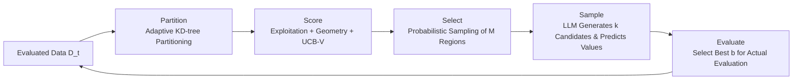

# Improving LLM-based Global Optimization with Search Space Partitioning

**Conference**: ICLR 2026  
**OpenReview**: [https://openreview.net/forum?id=y6nhcCdQYd](https://openreview.net/forum?id=y6nhcCdQYd)  
**Code**: [https://github.com/arberzela/mohollm](https://github.com/arberzela/mohollm)  
**Area**: optimization  
**Keywords**: Black-box optimization, Large Language Models, Space Partitioning, KD-tree, Multi-armed Bandit, Bayesian Optimization  

## TL;DR
HOLLM adaptively partitions the search space into a set of "sub-region meta-arms" using a KD-tree, selects promising local regions via a bandit-style scoring function, and restricts the LLM to sample candidate points only within these small regions. This converts the LLM's weakness in global sampling—characterized by uneven and biased distribution—into a localized low-dimensional sampling advantage, outperforming global LLM sampling and traditional Bayesian optimization on multimodal functions and hyperparameter optimization.

## Background & Motivation

**Background**: Black-box (zero-order/gradient-free) optimization is a common challenge in scenarios such as hyperparameter tuning, molecular design, and policy search. Traditional mainstream methods include Bayesian Optimization (BO, using Gaussian Processes as surrogates + acquisition functions) and evolutionary algorithms. Recently, LLMs have been integrated into optimization frameworks as surrogate models or candidate generators, showing potential without relying on fixed parametric assumptions.

**Limitations of Prior Work**: Direct global sampling by LLMs suffers from two major flaws. First, **LLM sampling exhibits strong bias**: the authors used Gemini-1.5 to simulate uniform sampling on a unit cube; in 2D, the points clustered significantly and failed to fill the space, while in 8D, quantification via Hausdorff distance showed they were far from a true uniform distribution. Second, **LLM suggestions are sparse in high-dimensional spaces**, covering only a small portion of the domain and relying heavily on meticulously designed prompts containing domain priors (dataset statistics, problem descriptions), which makes their robustness suspect in scenarios lacking such priors.

**Key Challenge**: LLMs encode useful "meta-priors" about the typical behavior of functions (such as local unimodality), but it is difficult to extract this prior at a high-dimensional global scale—global queries result in neither uniform coverage nor precision.

**Goal**: To make LLM sampling reliable and well-covered without injecting any domain knowledge, matching or exceeding the performance of SOTA BO/Trust Region methods.

**Core Idea**: **"Partition first, then local sampling"**—decompose the high-dimensional global problem into two steps: "where to sample" + "sampling with LLM in sub-regions." The former is handled by a classic bandit space partitioning (KD-tree + UCB-style scoring) to rationally allocate the budget, while the latter restricts the LLM to small low-dimensional boxes, reducing sampling difficulty and naturally leveraging its local meta-priors.

## Method

### Overall Architecture

HOLLM (Hierarchical Optimization with LLMs) decomposes each iteration into a 5-step loop: **Partition → Score → Select → Sample → Evaluate**. Given evaluated data $D_t=\{(x_i, f(x_i))\}$, the algorithm first adaptively partitions the space into a set of leaves (sub-regions) using a KD-tree. It calculates a score for each leaf to balance exploration and exploitation, randomly selects $M$ promising regions based on these scores, asks the LLM to propose candidate points and predict their values within each region, and finally selects the $b$ globally best points for actual evaluation to update the dataset for the next round.

### Key Designs

**1. Adaptive KD-tree Partitioning: Turning space into a "scaling meta-arm pool."** HOLLM utilizes a KD-tree instead of Delaunay triangulation or Voronoi diagrams, as the latter become infeasible due to dimensionality explosion, while KD-tree construction is $O(t\log t)$. Each internal node selects the dimension $s$ with the largest variance for splitting and uses the mean $\delta$ of that dimension as the threshold to recursively partition the space into axis-aligned hyperrectangles: $X_{\text{left}}=\{x: x_s\le\delta\}$ and $X_{\text{right}}=\{x: x_s>\delta\}$. The maximum capacity of a leaf is $m_t = m_0 + \lfloor\lambda\log(1+t)\rfloor$ (default $m_0=\lceil d/2\rceil$, $\lambda=0$), where logarithmic growth ensures partitioning does not become fine-grained too early. Crucially, **the entire tree is refitted every round**: boundaries drift with the data, and "zooming" occurs automatically where information clusters, avoiding early convergence to local minima. From an infinite-arm bandit perspective, each hyperrectangle is a "meta-arm," and the pool is uncountable, making the discovery of arms part of the learning problem.

**2. Triple Component Scoring: Exploitation + Geometric Exploration + UCB-V Uncertainty.** The score for each leaf is a linear combination of three normalized terms: $B_{\ell,t} = \bar\mu_{\ell,t} + \alpha_t(\beta_1\bar V_{\ell,t} + \beta_2 E_{\ell,t})$. The **exploitation term** uses the maximum improvement observed in the region rather than the mean—$\mu_{\ell,t}=\max_{i\in I_\ell}(f(x_i)-f_{\min}(t)+\varepsilon)$—because black-box objectives are often heteroscedastic, and a single excellent point is more informative than the entire distribution. The **geometric exploration term** uses the $d$-th root of the leaf volume $V_{\ell,t}=(\prod_j(u_{\ell j}-l_{\ell j}))^{1/d}$, effectively the geometric mean of side lengths, which removes dimensional dependence and rewards large, undersampled regions. The **statistical exploration term** is inspired by UCB-V (Upper Confidence Bound with Variance): $E_{\ell,t}=\sqrt{\frac{2\sigma^2_{\ell,t}\max(0,\ln(t/(K_t n_{\ell,t})))}{n_{\ell,t}}} + c\cdot\frac{\max(0,\ln(t/(K_t n_{\ell,t})))}{n_{\ell,t}}$, which concentrates exploration on under-sampled cells relative to the average samples per region $t/K_t$ and adapts to variance—small regions remain worth sampling if variance is high. $\alpha_t$ follows a cosine annealing schedule: early stages mix exploitation with both exploration terms, while late stages see $\bar V$ decay faster than $E$. The score essentially directs the search to: "where I saw good things, where I haven't looked, and where my estimates are uncertain."

**3. Stochastic Selection + LLM Local Generation: Avoiding Premature Convergence + Extracting Local Meta-priors.** In the Select step, the algorithm **does not take the Top-M but samples $M$ leaves without replacement from a categorical distribution** $p_{\ell,t}=B_{\ell,t}/\sum_r B_{r,t}$. This randomness ensures suboptimal leaves are sampled occasionally, mitigating premature convergence on non-convex multimodal functions. As $t$ increases and exploration terms shrink, the distribution naturally sharpens toward empirically optimal leaves. In the Sample step, the LLM is fed a structured prompt containing $D_t$ as in-context examples, the numerical boundaries $(l_{is},u_{is})_{s=1}^d$ of the target cell, and instructions to "suggest $k$ points likely to have high $f$." The LLM returns both candidate positions $\hat x_i$ and predicted function values $\hat f_i$. **Crucially, the LLM receives only dimensions, variable names, boundaries, and examples—no task description or dataset statistics**, deliberately avoiding prompt engineering to prove gains come from the mechanism rather than priors.

## Key Experimental Results

Settings: Starting from $n_0=5$ random points, $T=50$ evaluations, mean ± SE reported over 10 seeds. Default $\alpha_t$ cosine annealing from 1.0 to 0.01, $b=4, M=5, k=5$. Default LLM is Gemini-2.0-Flash. Integrated within the SyneTune framework.

### Main Results

| Task Category | Benchmarks | HOLLM Performance |
|---|---|---|
| Synthetic Functions (6) | Hartmann-3D/6D, Rosenbrock-8D, Rastrigin-10D, Lévy-10D | Consistently outperformed global LLM baseline (especially on multimodal), with smaller variance; matched/exceeded all benchmarks except Rastrigin ($10^{10}$ local minima). |
| HPO (9D Discrete) | FCNet: PROTEIN/NAVAL/PARKINSONS/SLICE | Both HOLLM and global LLM exceeded common optima like BORE/CQR; ~330s per 50 trials, Gemini API cost ~$0.14. |
| Real-world Tasks (Cont.)| Penicillin(7D), VehicleSafety(5D), CarSideImpact(7D) | Highest average rank of **2.42** in Critical Difference Diagram, superior to BORE/CQR(3.25), LLM(3.42), REA(5.58), RS(5.79), BoTorch(6.04), RS+KD-Tree(6.25). |

### Ablation Study (Vehicle Safety, Gemini-2.0-Flash)

| Variant | Change | Conclusion |
|---|---|---|
| HOLLM (UCB1) | Replace UCB-V with UCB1 | Over-explores stable but suboptimal regions; slower convergence and worse final values—proving variance-awareness is key. |
| Exploitation Only | Removed exploration bonus | Weaker than the full version. |
| Exploration Only | Removed exploitation term | Weaker than the full version. |
| Uniform | Uniform selection of regions | **Worst performance**, proving gains come from the scoring function's intelligent budget allocation, not just partitioning or the LLM itself. |

### Key Findings
- **Robustness across LLMs**: When using non-proprietary LLMs like Llama-3.1-8B / 3.3-70B / Qwen3-30B, the global LLM baseline often stagnates, while HOLLM remains competitive with Gemini-2.0-Flash. Localization makes weaker models useful.
- **Noise Resistance**: With $N(0,\sigma^2)$ observation noise, global LLM, TPE, and RS plateau early. HOLLM utilizes local context to obtain more reliable mean estimates, reaching higher target values.
- **Visualization**: In 1D multimodal examples, early partitions are large and exploratory; later, cells refine around the global optimum with concentrated probability mass.

## Highlights & Insights
- **Converting LLM weaknesses into constraints**: LLMs cannot sample globally—so they are restricted to local partitions using a rational bandit strategist. This "division of labor" is elegant.
- **"Max improvement" as exploitation**: Using the best point found rather than the mean aligns with the optimization objective. In black-box settings, one excellent point is more valuable than an averaged distribution, mirroring intuitions in BO acquisition functions and MCTS.
- **Zero prompt engineering as a strong claim**: By deliberately withholding domain information, performance gains are attributed to the mechanism, avoiding critiques concerning "prompt-tuned" results.
- The perspective of an "infinite KD-tree" refitted every round links the engineering refinement to the theoretical language of adaptive tree bandits.

## Limitations & Future Work
- **Strong dependency on LLM proposal quality**: Biased models or inaccurate predicted values can mislead the search and waste expensive evaluations.
- **Cost constraints**: LLM inference and monetary costs limit scalability for high-dimensional, high-budget scenarios (though \$0.14/run is currently affordable).
- **Hyperparameter sensitivity**: Default hyperparameters work well but might require tuning in practice to avoid premature convergence or over-exploration.
- **Lack of formal theoretical guarantees**: Specifically, the lack of regret bounds—which the authors leave for future work—is a weakness compared to pure bandit methods like HOO/UCB-AIR.

## Related Work & Insights
- **Space Partitioning Bandits**: HOO (n-ary tree + UCB selection), UCB-AIR (infinite arms), and adaptive tree bandits. HOLLM's KD-tree + UCB-V combination directly inherits from this line, with the novelty being the integration of LLM-driven sampling.
- **Trust Region BO (TuRBO)**: Maintains multiple dynamic trust regions for high-dimensional optimization; HOLLM's local region focus is similar, but replaces the local GP with an LLM.
- **LLM for Black-box Optimization**: Previous works use prompts for candidate generation, uncertainty estimation, or surrogate replacement. HOLLM differs by **not relying on domain prompts** and **explicitly performing space partitioning**.
- Insight: "Letting strong models work only at reliable local scales while leaving global scheduling to interpretable classic algorithms" is a paradigm transferable to any "locally strong, globally weak" decision/generation scenario.

## Rating
- **Novelty**: ⭐⭐⭐⭐ Combines bandit space partitioning with local LLM sampling systematically; the empirical motivation regarding LLM sampling bias is solid.
- **Experimental Thoroughness**: ⭐⭐⭐⭐ Covers synthetic, HPO, and real-world tasks; tests multiple LLMs and noise levels. Scale is somewhat small ($T=50$, 5-10D), lacking deep dives into much higher dimensions.
- **Writing Quality**: ⭐⭐⭐⭐ The five-step framework is clear, and the physical meaning of the three scoring terms is well-explained.
- **Value**: ⭐⭐⭐⭐ Provides a practical recipe for LLM-based black-box optimization that is prompt-agnostic and robust, offering immediate utility for scientific optimization scenarios.

<!-- RELATED:START -->

## Related Papers

- [\[ICLR 2026\] Compositional Generalization through Gradient Search in Nonparametric Latent Space](compositional_generalization_through_gradient_search_in_nonparametric_latent_spa.md)
- [\[ICLR 2026\] Local Entropy Search over Descent Sequences for Bayesian Optimization](local_entropy_search_over_descent_sequences_for_bayesian_optimization.md)
- [\[ICLR 2026\] Improving Online-to-Nonconvex Conversion for Smooth Optimization via Double Optimism](improving_online-to-nonconvex_conversion_for_smooth_optimization_via_double_opti.md)
- [\[ICLR 2026\] HeuriGym: An Agentic Benchmark for LLM-Crafted Heuristics in Combinatorial Optimization](heurigym_an_agentic_benchmark_for_llm-crafted_heuristics_in_combinatorial_optimi.md)
- [\[ICLR 2026\] Improving Feasibility via Fast Autoencoder-Based Projections](improving_feasibility_via_fast_autoencoder-based_projections.md)

<!-- RELATED:END -->
