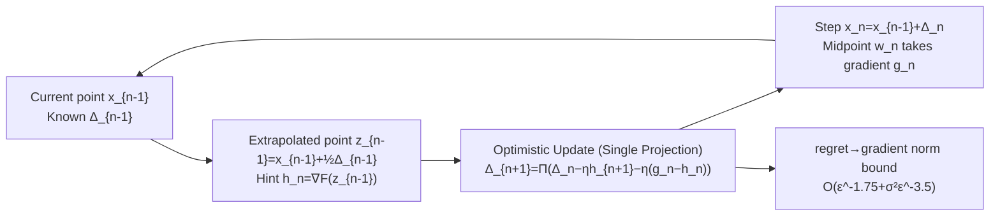

# Improving Online-to-Nonconvex Conversion for Smooth Optimization via Double Optimism

**Conference**: ICLR 2026  
**OpenReview**: [https://openreview.net/forum?id=ZAflv4dxQ9](https://openreview.net/forum?id=ZAflv4dxQ9)  
**Code**: None (Theoretical paper)  
**Area**: optimization  
**Keywords**: Non-convex optimization, online-to-nonconvex, optimistic online learning, first-order methods, stochastic optimization, complexity lower bounds  

## TL;DR
Based on the online-to-nonconvex (O2NC) framework by Cutkosky et al., this paper replaces the complex fixed-point inner loop with a "double optimism" hint function. This results in a unified first-order algorithm reaching $O(\varepsilon^{-1.75}+\sigma^2\varepsilon^{-3.5})$ complexity, achieving both the optimal deterministic rate (removing the logarithmic factor) and the optimal stochastic rate.

## Background & Motivation

**Background**: To find an $\varepsilon$-first-order stationary point of a smooth non-convex function, standard GD requires $O(\varepsilon^{-2})$ and SGD requires $O(\varepsilon^{-2}+\sigma^2\varepsilon^{-4})$, both of which are optimal in their respective settings. However, when **both the gradient and Hessian are Lipschitz continuous**, optimization can be faster: the deterministic optimal rate is $O(\varepsilon^{-1.75})$, and the stochastic optimal rate is $O(\sigma^2\varepsilon^{-3.5})$. The O2NC framework proposed by Cutkosky et al. (2023) reduces "finding a stationary point" to "online learning along the update direction," providing an elegant step toward unification.

**Limitations of Prior Work**: Although the O2NC framework is conceptually beautiful, it has three significant drawbacks. First, the deterministic algorithm relies on a **double-loop solving fixed-point equations** to construct the hint vector for the optimistic learner, introducing an extra $\log(1/\varepsilon)$ factor. Second, the stochastic algorithm assumes the **second moment of stochastic gradients is bounded** $\mathbb{E}\|\nabla f\|^2\le G^2$, which is stronger and more restrictive than the standard bounded variance assumption. Third, different online learning algorithms are used for deterministic and stochastic settings, leading to poor modularity and scalability.

**Key Challenge**: The double-loop in O2NC exists because the hint $h_n$ must be sufficiently close to the true gradient $g_n=\nabla F(w_n)$, while $w_n$ depends on the yet-to-be-determined update direction $\Delta_n$—a cyclic dependency. The original framework uses fixed-point iteration to solve this, at the cost of an extra logarithmic factor in complexity.

**Goal**: To find a **unified first-order algorithm** that is simple, achieves known optimal rates in both deterministic and stochastic settings, and eliminates the redundant logarithmic factor and the overly strong second-moment assumption.

**Core Idea**: **Double Optimism**. The first layer follows standard optimistic online learning—assuming the "difference between the true gradient and the hint changes slowly" $g_{n+1}-h_{n+1}\approx g_n-h_n$. The **second layer of optimism** is introduced in this paper—assuming the "update direction itself changes slowly" $\Delta_n\approx\Delta_{n-1}$ (supported by smoothness). Thus, the **gradient at an extrapolated point** is used directly as the hint. A single gradient call suffices, completely removing the fixed-point inner loop.

## Method

### Overall Architecture

The problem $\min_x F(x)$ is reformulated following O2NC: in each step, update $x_n=x_{n-1}+\Delta_n$, take a (stochastic) gradient $g_n$ at the midpoint $w_n=x_{n-1}+\tfrac12\Delta_n$, and feed the loss $\langle g_n,\Delta\rangle$ to an online learner to select the next direction. Convergence is controlled by "K-shifting regret" (Proposition 2.1). The innovation lies in **the choice of the online learner and the hint function**: a single-projection optimistic gradient update (replacing the original two-projection version) combined with an extrapolated point hint derived from double optimism, along with an adaptive step size version.

### Key Designs

**1. Single-projection optimistic gradient update: compressing two projections into one.** The optimistic template in the original O2NC requires two spherical projections per step, maintaining two sequences $\hat\Delta_n$ and $\Delta_n$. This paper adopts a simpler optimistic gradient variant requiring only one projection:
$$\Delta_{n+1}=\Pi_{\|\Delta\|\le D}\big(\Delta_n-\eta h_{n+1}-\eta(g_n-h_n)\big),\quad n>1.$$
This formula can be interpreted as "making an optimistic prediction with hint $h_{n+1}$ + correcting with observation error $g_n-h_n$," embodying the first layer of optimism (assuming $g_{n+1}\approx h_{n+1}+g_n-h_n$). Its K-shifting regret is given by Lemma 3.1:
$$\mathrm{Reg}_T\le \frac{4KD^2}{\eta}+\frac{5\eta}{2}\sum_n\|g_n-h_n\|^2-\frac{1}{4\eta}\sum_n\|\Delta_n-\Delta_{n-1}\|^2.$$
The key is the **extra negative term** $-\|\Delta_n-\Delta_{n-1}\|^2$, which was discarded in the original framework's analysis—and all of the acceleration in this paper comes from retrieving it.

**2. Extrapolated point hint: one gradient call replaces the entire fixed-point loop.** The goal is to estimate $g_n=\nabla F(w_n)$ using only information prior to $x_{n-1}$, where $w_n=x_{n-1}+\tfrac12\Delta_n$. A naive approach would reuse the previous gradient $h_n=g_{n-1}$, but this only yields $O(\varepsilon^{-11/6})$ because it makes $\|g_n-h_n\|\propto\|\Delta_n+\Delta_{n-1}\|$; the **positive sign** prevents telescoping with the negative term. The second layer of optimism states: since $\Delta_n\approx\Delta_{n-1}$ under smoothness, use the gradient of the **extrapolated point** $z_{n-1}=x_{n-1}+\tfrac12\Delta_{n-1}$ as the hint:
$$h_n=\nabla F(z_{n-1})=\nabla F\big(x_{n-1}+\tfrac12\Delta_{n-1}\big).$$
By Lipschitz gradients, $\|g_n-h_n\|\propto\|w_n-z_{n-1}\|=\tfrac12\|\Delta_n-\Delta_{n-1}\|$, which **exactly matches the negative term in Lemma 3.1**. Thus, $\tfrac{5\eta}{2}\|g_n-h_n\|^2$ can be canceled by $-\tfrac{1}{4\eta}\|\Delta_n-\Delta_{n-1}\|^2$ via telescoping (by setting $\eta\le 1/\sqrt{3L_1}$). The fixed-point inner loop and the $\log(1/\varepsilon)$ factor vanish, requiring only one extra gradient query per step.

**3. Replacing second moment with variance: Naturally unifying deterministic and stochastic.** The stochastic version simply replaces deterministic gradients with stochastic gradients $h_{n+1}=\nabla f(z_n;\xi_n)$ and $g_n=\nabla f(w_n;\xi_n)$. The analysis only adds a term $6\eta T\sigma^2$ (Lemma 3.2). Consequently, **the bounded second-moment assumption $\mathbb{E}\|\nabla f\|^2\le G^2$ is no longer needed, replaced by standard bounded variance $\sigma^2$**. Setting $\sigma^2=0$ automatically recovers the deterministic algorithm, sharing the same algorithm and analysis (Algorithm 1). The final theorem provides a unified complexity $O(\varepsilon^{-1.75}+\sigma^2\varepsilon^{-3.5})$, matching the known optimal $O(\varepsilon^{-1.75})$ in deterministic cases and the lower bound $\Omega(\sigma^2\varepsilon^{-3.5})$ in stochastic cases, interpolating smoothly between them.

**4. Adaptive step size: moving away from global Lipschitz constants and $\sigma$.** The constant step size in Theorem 3.3 depends on global $L_1$ and episode length $T$, which are often too conservative. This paper further designs an AdaGrad-style step size:
$$\eta_n=\frac{\gamma D}{\sqrt{\alpha+\sum_{i=1}^{n\bmod T}\|g_i^k-h_i^k\|^2}},$$
where the denominator is reset at the start of each episode. The challenge is that $\eta_n$ cannot be directly upper-bounded by $1/\sqrt{3L_1}$, so telescoping cannot be applied directly; the authors use a **thresholding** technique (inspired by Kavis et al.): the negative term dominates in iterations with small step sizes, while in iterations with large step sizes, the denominator is small and the accumulation of positive terms is controllable. Theorem 4.2 maintains the same $O(\varepsilon^{-1.75}+\sigma^2\varepsilon^{-3.5})$ **without tuning the learning rate**, and replaces the global $L_1$ with a potentially much smaller local constant $\hat L_1^*$, moving toward solving the open problem of "not needing to know $\sigma^2$" posed by Cutkosky & Mehta.

## Key Experimental Results

As this is a purely theoretical optimization paper, no numerical experiments are provided. The core results are presented as **complexity comparisons**.

### Main Results: Complexity Comparison

| Method | Deterministic | Stochastic | Assumptions | Unified |
|------|--------|------|------|----------|
| GD / SGD | $O(\varepsilon^{-2})$ | $O(\varepsilon^{-2}+\sigma^2\varepsilon^{-4})$ | Gradient Lipschitz | Yes (but not accelerated) |
| Cutkosky & Mehta (2020) | $O(\varepsilon^{-2})$ | $O(\sigma^2\varepsilon^{-3.5})$ | — | No (no deterministic acceleration) |
| O2NC, Cutkosky et al. (2023) | $O(\varepsilon^{-1.75}\log\tfrac1\varepsilon)$ | $O(G^2\varepsilon^{-3.5})$ | Bounded 2nd moment $G^2$ | No (two different algorithms) |
| **Ours** | $O(\varepsilon^{-1.75})$ | $O(\sigma^2\varepsilon^{-3.5})$ | **Bounded variance $\sigma^2$** | **Yes (single algorithm)** |
| Lower Bound (Arjevani et al.) | $\Omega(\varepsilon^{-12/7})$ | $\Omega(\sigma^2\varepsilon^{-3.5})$ | — | — |

### Key Findings

- **Removal of Logarithmic Factor**: The deterministic rate is tightened from $O(\varepsilon^{-1.75}\log(1/\varepsilon))$ to $O(\varepsilon^{-1.75})$.
- **Smooth Interpolation**: In the unified bound $O(\varepsilon^{-1.75}+\sigma^2\varepsilon^{-3.5})$, setting $\sigma=0$ returns the deterministic optimum, while for $\sigma>0$, the stochastic term dominates and matches the lower bound.
- **Complexity**: Only two gradient queries per step (midpoint $w_n$ and extrapolated point $z_n$), significantly simplifying the multi-step fixed-point loop of the original framework.
- **Remaining Deterministic Gap**: A gap of $O(\varepsilon^{-1/28})$ still exists between $O(\varepsilon^{-1.75})$ and the lower bound $\Omega(\varepsilon^{-12/7})$, which is an open gap in this field that remains unclosed.

## Highlights & Insights

- **"Retrieving the discarded negative term" is the pivot of the paper**: In original O2NC analyses, $-\|\Delta_n-\Delta_{n-1}\|^2$ was discarded as redundant. This work realizes that as long as the hint error $\|g_n-h_n\|$ is of the same order as $\|\Delta_n-\Delta_{n-1}\|$, this negative term becomes the source of acceleration—a beautiful example of "analysis-driven algorithm design."
- **Double optimism resolves cyclic dependency naturally**: Using $\Delta_{n-1}$ to extrapolate $z_{n-1}$ to approximate the yet-to-be-determined $w_n$ avoids cyclic dependency and creates a structure suitable for telescoping. This is far more elegant than solving fixed-point equations.
- **Unification yields engineering value**: Deterministic and stochastic settings share the same code, differing only in whether gradients are noisy. Replacing the overly strong second-moment assumption with a standard variance assumption significantly lowers the barrier for practical use.

## Limitations & Future Work

- **Not fully parameter-free**: While the adaptive step size removes explicit dependence on $L_1$ and $\sigma$, the selection of $D$ and $T$ still relies on problem constants. The authors list "further adapting $D, T$ to achieve full parameter-freeness" as a future direction.
- **Deterministic Gap remains**: The gap between $O(\varepsilon^{-1.75})$ and the lower bound $\Omega(\varepsilon^{-12/7})$ means further acceleration might be possible.
- **Lack of numerical validation**: The paper focuses on complexity analysis without validating constant factors or the actual behavior of adaptive step sizes in practical non-convex problems via experiments.
- **Dependence on Hessian-Lipschitz**: Acceleration is entirely built on the second-order smoothness assumption; for problems that are only gradient-Lipschitz, it is no better than standard GD/SGD.

## Related Work & Insights

- **O2NC Framework** (Cutkosky et al. 2023) is the direct starting point; this work simplifies its deterministic subroutine and extends it stochastically. Subsequent works like Zhang & Cutkosky (2024) and Ahn et al. (2024) have incorporated SGD-momentum, Adam, and Schedule-free SGD into O2NC interpretations.
- **Optimistic Online Learning** (Rakhlin & Sridharan 2013; Joulani et al. 2020; Chiang et al. 2012) provides the hint mechanism for the first layer of optimism, upon which this work superimposes the second layer.
- **Contrast with Jiang et al. (2025)**: Both use optimistic OGD on O2NC, but Jiang et al. focus on **Quasi-Newton** in deterministic settings (where the hint is a second-order approximation and online learning occurs in the Hessian matrix space). This work focuses on first-order methods, covers both stochastic and deterministic settings, and uses a fundamentally different hint construction (extrapolated gradient vs. second-order approximation).
- **Accelerated Non-convex First-order Methods** (Carmon et al. 2017; Li & Lin 2022/2023 with restarting) provide the $O(\varepsilon^{-1.75})$ baseline but involve complex derivations and unclear stochastic extensions. This paper achieves these results from a more modular online learning perspective.
- **Insight**: Treating "negative terms discarded by analysis" as potential sources of acceleration and then designing the algorithm to activate them is a methodology worth transferring to other convergence analyses, such as constrained optimization or min-max problems.

## Rating
- **Novelty**: ⭐⭐⭐⭐ — Double optimism + extrapolated point hint is a clean and original idea, replacing the fixed-point inner loop with a single gradient call and achieving the first unified optimal rate for both settings.
- **Experimental Thoroughness**: ⭐⭐⭐ — Purely theoretical work. The complexity proofs are complete and rigorous, but numerical experiments are missing. Constant factors and adaptive step size performance remain unverified (common for theory papers).
- **Writing Quality**: ⭐⭐⭐⭐ — The chain from motivation to limitations to solution is clear. The explanation of why naive hints fail and why extrapolated hints work is well-presented.
- **Value**: ⭐⭐⭐⭐ — Resolves three legacy issues of the O2NC framework (log factor, strong assumptions, dual algorithms). It is a solid advancement in non-convex complexity theory and lowers practical barriers through unification.

<!-- RELATED:START -->

## Related Papers

- [\[ICLR 2026\] Derandomized Online-to-Non-convex Conversion for Stochastic Weakly Convex Optimization](derandomized_online-to-non-convex_conversion_for_stochastic_weakly_convex_optimi.md)
- [\[ICLR 2026\] Faster Gradient Methods for Highly-Smooth Stochastic Bilevel Optimization](faster_gradient_methods_for_highly-smooth_stochastic_bilevel_optimization.md)
- [\[ICLR 2026\] Improving LLM-based Global Optimization with Search Space Partitioning](improving_llm-based_global_optimization_with_search_space_partitioning.md)
- [\[ICLR 2026\] Communication-Efficient Decentralized Optimization via Double-Communication Symmetric ADMM](communication-efficient_decentralized_optimization_via_double-communication_symm.md)
- [\[ICLR 2026\] Online Black-Box Prompt Optimization with Regret Guarantees under Noisy Feedback](online_black-box_prompt_optimization_with_regret_guarantees_under_noisy_feedback.md)

<!-- RELATED:END -->
