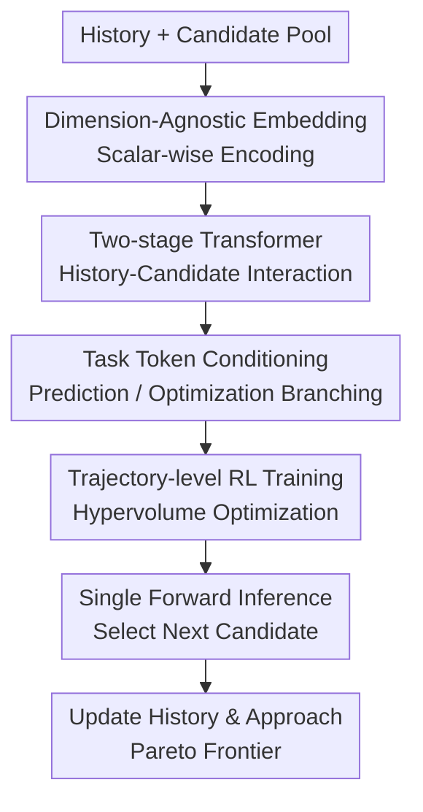

# In-Context Multi-Objective Optimization

**Conference**: ICLR2026  
**OpenReview**: [https://openreview.net/forum?id=odmeUlWta8](https://openreview.net/forum?id=odmeUlWta8)  
**Code**: https://github.com/xinyuzc/in-context-moo  
**Area**: Optimization / Multi-objective Black-box Optimization  
**Keywords**: Multi-objective Optimization, Bayesian Optimization, Amortized Optimization, Transformer, Pareto Frontier  

## TL;DR
TAMO transforms the Multi-Objective Bayesian Optimization (MOBO) workflow—which traditionally requires re-fitting a surrogate and optimizing an acquisition function for every new task—into an offline-trained, dimension-agnostic Transformer policy. During testing, it generates the next query via a single forward pass based only on historical observations and a candidate pool, maintaining comparable or superior Pareto quality across synthetic and real-world tasks while reducing proposal time by approximately $50\times$ to $1000\times$.

## Background & Motivation
**Background**: Multi-objective black-box optimization is prevalent in drug discovery, material screening, automated control, and scientific experiment design. A candidate design $x$ often corresponds to multiple objectives $f(x)=[f_1(x),\ldots,f_{d_y}(x)]$, which are difficult to optimize simultaneously. The dominant sample-efficient approach is MOBO: fitting a probabilistic surrogate (usually a Gaussian Process) for each objective and then selecting the next batch of points using acquisition functions such as qNEHVI, qNParEGO, or qHVKG to approximate the Pareto frontier within a limited budget.

**Limitations of Prior Work**: While effective for expensive experiments, this paradigm entails high deployment costs. For every new problem, one must re-fit the surrogate and re-optimize the acquisition function. Performance is sensitive to choices of kernels, likelihoods, acquisition functions, and initialization strategies. In closed-loop experiments requiring rapid decisions or parallel platforms needing continuous candidates, GP re-fitting and acquisition optimization become significant sources of latency. Furthermore, many acquisition functions only optimize one-step gains; although the hypervolume quality depends on the entire trajectory, traditional methods struggle to explicitly learn how the current step affects future outcomes.

**Key Challenge**: Multi-objective optimization requires reusing experience across tasks, adapting across design spaces and objective counts, and performing long-horizon planning for the final Pareto front. However, the computation and modeling choices of traditional MOBO are largely tied to individual tasks. Existing amortized BO methods have begun shifting computation to offline training, but many still only handle single objectives, retain task-level surrogates while merely amortizing the acquisition, or are restricted by fixed input/output dimensions.

**Goal**: The authors aim to train a "universal optimization policy." In the offline stage, it learns from a vast array of synthetic multi-objective tasks how to select the next query based on history and candidates. For new tasks, instead of fitting a GP or manually selecting an acquisition function, it produces candidates via a direct forward pass. This policy must support variable input dimensions $d_x$ and objective dimensions $d_y$ to function as a plug-and-play optimizer in scientific discovery.

**Key Insight**: The paper observes that multi-objective optimization can be viewed as an in-context sequential decision problem. Historical observations $D_h=\{(x_h,y_h)\}$ serve as the context, the candidate pool $D_q=\{x_q\}$ represents the available actions, and the choice of the next candidate influences the hypervolume of the entire subsequent trajectory. Transformers are well-suited to encode variable-length histories and candidate pools. By designing a dimension-agnostic observation embedder, problems with different $d_x$ and $d_y$ can be mapped into a unified representation space.

**Core Idea**: Use a dimension-agnostic Transformer policy to amortize the multi-objective black-box optimization process directly. Reinforcement learning is employed to maximize the normalized hypervolume over the full transition trajectory, replacing task-specific surrogate fitting and acquisition engineering.

## Method

### Overall Architecture
TAMO (Task-agnostic Amortized Multi-objective Optimization) takes current optimization history $D_h$, a candidate query set $D_q$, the current step $t$, and the total budget $T$ as input. It outputs an acquisition utility for each candidate in the pool, followed by a softmax to obtain the policy $\pi_\theta(x_q\mid D_h,t,T)$. During training, the model performs two types of tasks: in-context prediction (predicting function values of target points using context points to help the backbone learn function landscapes) and optimization policy learning (optimizing normalized hypervolume via REINFORCE over the full trajectory). During testing, only the optimization workflow is retained.

### Key Designs
**1. Dimension-Agnostic Embedding: Handling Varying Input and Objective Dimensions**

TAMO first addresses the issue of varying task structures. A material screening task might have 2 continuous variables and 3 objectives, while a laser-plasma task might have 4 inputs and 3 objectives. A standard Transformer concatenating $x$ and $y$ into fixed vectors would be locked to specific dimensions. The authors map each scalar input dimension and each scalar objective dimension into separate tokens using learnable scalar-to-vector networks $e_x:\mathbb{R}\to\mathbb{R}^{d_e}$ and $e_y:\mathbb{R}\to\mathbb{R}^{d_e}$. These tokens are processed by Transformer layers and mean-pooled across dimension tokens to produce a single observation representation $E\in\mathbb{R}^{d_e}$.

To ensure the model distinguishes between dimensions and avoids confounding features with objectives, random learnable positional tokens $p_x$ and $p_y$ are sampled from a fixed pool and injected into the input and objective dimensions. This preserves cross-dimension generalization while breaking meaningless symmetries.

**2. Two-stage Transformer Decoding: Interaction and Task-Specific Control**

The TAMO backbone is divided into $B_1+B_2$ layers. The first $B_1$ layers inject historical context into the candidates: history tokens undergo self-attention, and candidate tokens perform cross-attention over history. This stage addresses where a candidate lies within the known landscape and which part of the Pareto front it might complete.

The final $B_2$ layers remove history tokens, keeping only candidate/target tokens and a few task-specific tokens. For prediction, tokens include a prediction task token and a token for the target output dimension $p_y^{(k)}$. For optimization, tokens include an optimization task token, a time budget token $g_{time}=\mathrm{MLP}_\theta((T-t)/T)$, and aggregated input dimension tokens $\sum_j p_x^{(j)}$. Attention masks ensure candidate tokens only "see" these task tokens in the final stage, preventing further communication between candidates or access to the full history.

**3. Trajectory-level RL Objective: Rewarding Final Pareto Quality**

Instead of the one-step acquisition goals used in MOBO (e.g., expected hypervolume improvement), TAMO treats optimization as an MDP. The state is $s_t=(D_h,t,T)$, the action is selecting $x_t$ from the candidates, and the reward is based on the proportion of the optimal hypervolume covered by the current Pareto set:

$$
r_t=\frac{\mathrm{HV}(P(D_h)\mid r)}{\mathrm{HV}^*_\tau},\quad
\mathrm{HV}^*_\tau=\mathrm{HV}(P(X)\mid r).
$$

The reference point $r$ is the componentwise worst value of each objective, normalizing rewards to $[0,1]$. The policy maximizes discounted returns $J(\theta)=\mathbb{E}_{\tau\sim p(\tau)}[\mathbb{E}_{\pi_\theta}\sum_{t=1}^T\gamma^{t-1}r_t]$ using REINFORCE. Since training uses synthetic functions, the optimal hypervolume is computable offline, providing stronger signals than real expensive experiments.

**4. Prediction Warm-up and Joint Training**

Training a Transformer policy solely on sparse trajectory rewards is unstable. TAMO incorporates an auxiliary in-context regression task: predicting the distribution of a specific output dimension for target points given a context set $D_c$. The prediction head outputs a $K$-component one-dimensional Gaussian Mixture Model (GMM), maximizing the likelihood of the target values $L^{(p)}(\theta)$.

Training proceeds in two stages: an initial prediction warm-up followed by a joint phase where $L(\theta)=\lambda_p L^{(p)}(\theta)+L^{(rl)}(\theta)$. Ablations confirm that removing the prediction task significantly degrades performance on synthetic tasks.

### Loss & Training
The pre-training task distribution $p(\tau)$ uses synthetic GP functions with $d_x\sim U(\{1,2\})$ and $d_y\sim U(\{1,2,3\})$. Objectives are sampled independently or via multi-task GPs with various kernels (RBF, Matérn). Function values are normalized to $[-1,1]^{d_y}$.

The prediction head uses:

$$
p(y^p_{i,k}\mid x_i^p,D_c)=\sum_{\ell=1}^K\phi_{i\ell}\mathcal{N}(y^p_{i,k};\mu_{i\ell},\sigma_{i\ell}^2).
$$

The policy head computes utility $\alpha_i=\mathrm{MLP}_\theta(\hat{E}_i^q)$ and applies softmax:

$$
\pi_\theta(x_i^q\mid t,T,H_{1:t-1})=\frac{\exp(\alpha_i)}{\sum_{r=1}^{N_q}\exp(\alpha_r)}.
$$

The main model is trained for 400,000 iterations, with 393,500 iterations of prediction warm-up.

## Key Experimental Results

### Main Results
TAMO was compared against BOFormer, qNEHVI, qNParEGO, qHVKG, and Random on synthetic GPs, analytical benchmarks, and a real oil sorbent task. The core metrics were HV-based simple regret and cumulative proposal time.

| Task | Competitors | Pareto / Regret Performance | Proposal Time | Conclusion |
|------|-------------|----------------------------|---------------|------------|
| GP-DX2-DY2 | qNEHVI, qHVKG, etc. | On par with strongest GP baselines | Corrected by $50\times$--$1000\times$ | No quality loss for speed on in-distribution tasks |
| Ackley-Rastrigin | Same | TAMO is strongest or tied | Significantly faster | Good generalization on OOD analytical tasks |
| Ackley-Rosenbrock | Same | TAMO is strongest or tied | Significantly faster | Long-horizon policy assists with complex fronts |
| Branin-Currin | Same | qNEHVI / qNParEGO perform better | Significantly faster | GP length-scale prior mismatch |
| Oil Sorbent | Same | TAMO is best; qNParEGO close | Significantly faster | Synthetic GP pre-training transfers to real materials |

| Generalization | Setup | TAMO Performance | Major Caveat |
|----------------|-------|------------------|--------------|
| Unseen Dimensions | Train $d_x \in \{1,2\}$, Test $d_x=3$ | Regret close to best GP baseline | Confirms dimension-agnostic architecture works |
| LaserPlasma | $d_x=4, d_y=3$ (Real physical) | Better than BOFormer, behind traditional MOBO | Scaling to high-dim real tasks still limited by pre-training |
| Decoupled Observations | Single objective cost = 1 | Close to coupled TAMO on most tasks | Worse when objective optima are highly divergent |

### Ablation Study
- **No Prediction Warm-up**: Simple regret degrades significantly, showing regression is vital for landscape learning.
- **Myopic TAMO ($T=1$)**: Performs worse than standard $T=100$, confirming trajectory rewards encourage better Pareto discovery.
- **Model Size**: Small models (2 layers) are functional but perform worse on difficult tasks compared to standard 8-layer models.

### Key Findings
- TAMO matches GP-based MOBO quality while reducing proposal computation to a single forward pass.
- Dimension-agnostic design allows cross-dimension transfer, though performance on high-dimensional physical tasks still reflects pre-training distribution limits.
- The long-horizon RL objective is crucial; myopic variants and prediction-less variants show that the Transformer architecture alone is insufficient without Pareto-aligned signals.

## Highlights & Insights
- **Full Amortization of MOBO**: Unlike BOFormer, TAMO removes the need for task-level surrogates, making it ideal for high-throughput labs.
- **Input and Output Agnosticism**: Handles variable $d_x$ and $d_y$, paving the way for data-driven pre-training on diverse legacy datasets.
- **Non-myopic Behavior via RL**: By training on trajectory rewards, the policy intrinsically learns when to explore and when to exploit to maximize the final hypervolume.
- **Foundation Policy Philosophy**: TAMO's performance is tied to its pre-training "corpus" (the GP prior), suggesting its utility as a domain-specific foundation optimizer.

## Limitations & Future Work
- **Synthetic Prior Bias**: Current pre-training on GPs may not capture the non-stationarity or discrete structures of all real-world scientific tasks.
- **Candidate Pool Dependence**: Inference relies on a discrete pool $D_q$, which may be restrictive for high-dimensional continuous design spaces.
- **Noise and Constraints**: Real-world experiments involve heteroscedastic noise and complex constraints not yet fully modeled in the policy or training rewards.

## Related Work & Insights
- **vs Traditional MOBO**: TAMO trades the theoretical flexibility of online GP fitting for extreme speed and learned long-horizon planning.
- **vs Neural Processes**: While NPs amortize prediction, TAMO extends this to sequential decision-making, converting "accurate prediction" into "optimal selection."

## Rating
- **Novelty**: ⭐⭐⭐⭐⭐ (End-to-end, dimension-agnostic amortized MOO policy).
- **Experimental Thoroughness**: ⭐⭐⭐⭐☆ (Good coverage of benchmarks, though real-world high-dim tasks show room for improvement).
- **Writing Quality**: ⭐⭐⭐⭐☆ (Clear logic and formal MDP definition).
- **Value**: ⭐⭐⭐⭐⭐ (High potential for automated science and high-throughput screening).

<!-- RELATED:START -->

## Related Papers

- [\[ICLR 2026\] Neural Multi-Objective Combinatorial Optimization for Flexible Job Shop Scheduling Problems](neural_multi-objective_combinatorial_optimization_for_flexible_job_shop_scheduli.md)
- [\[ICML 2026\] Accelerated Multiple Wasserstein Gradient Flows for Multi-objective Distributional Optimization](../../ICML2026/optimization/accelerated_multiple_wasserstein_gradient_flows_for_multi-objective_distribution.md)
- [\[ICML 2026\] Multi-Objective Bayesian Optimization via Adaptive ε-Constraints Decomposition](../../ICML2026/optimization/multi-objective_bayesian_optimization_via_adaptive_varepsilon-constraints_decomp.md)
- [\[ICML 2026\] Diversity-Driven Offline Multi-Objective Optimization via Nested Pareto Set Learning](../../ICML2026/optimization/diversity-driven_offline_multi-objective_optimization_via_nested_pareto_set_lear.md)
- [\[ICLR 2026\] Gradient-Based Diversity Optimization with Differentiable Top-$k$ Objective](gradient-based_diversity_optimization_with_differentiable_top-k_objective.md)

<!-- RELATED:END -->
