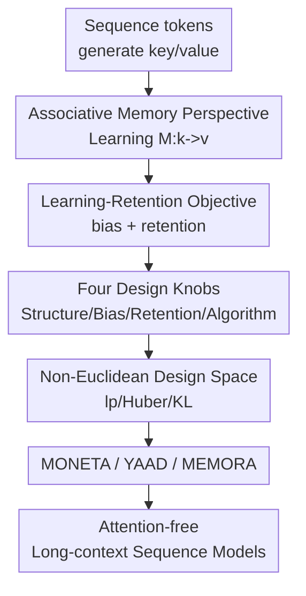

# It's All Connected: A Journey Through Test-Time Memorization, Attentional Bias, Retention, and Online Optimization

**Conference**: ICLR2026  
**OpenReview**: [https://openreview.net/forum?id=gZyEJ2kMow](https://openreview.net/forum?id=gZyEJ2kMow)  
**Code**: To be confirmed  
**Area**: Optimization / Sequence Models / Test-Time Memorization  
**Keywords**: Online Optimization, Associative Memory, Attentional Bias, Memory Retention, Linear RNN  

## TL;DR

This paper proposes MIRAS, a framework that unifies sequence modules like Transformers, linear RNNs, TTT, and Titans as "associative memory via online optimization at test-time." By extending the design axes of attentional bias and retention, it introduces three attention-free models—MONETA, YAAD, and MEMORA—which outperform various modern recurrent baselines in language modeling, commonsense reasoning, and long-context needle recall.

## Background & Motivation

**Background**: For long-context sequence modeling, Transformers remain superior in in-context learning and precise retrieval, but KV cache grows linearly and attention computation grows quadratically with sequence length. Consequently, recent work has shifted towards recurrent or linear recurrent backbones, such as RetNet, Mamba/Mamba2, DeltaNet, Gated DeltaNet, TTT, and Titans, aiming to compress historical context into a fixed-size state or memory to process long sequences with lower complexity.

**Limitations of Prior Work**: On the surface, the formulas for these models differ significantly: some use outer products, some employ forget gates, others utilize the delta rule, and some structure memory as MLPs with parameters updated at test time. Relying solely on architectural names makes it difficult to answer fundamental questions: what is the model "learning" and "forgetting," and why do certain forget gates work stably? Furthermore, existing unified frameworks are often restricted to dot-product similarity, $\ell_2$ regression, or Euclidean regularization, explaining existing methods without naturally generating new designs.

**Key Challenge**: The core conflict in fixed-capacity recurrent memory is between learning new tokens and preserving old information. As new tokens arrive, memory must quickly write new key-value associations; however, each write modifies the same state. Aggressive updates can pollute or overwrite past context. This paper argues that this conflict is not a byproduct of specific architectural tricks but a fundamental trade-off between the "current loss term" and the "regularization term for maintaining the old state" in online optimization.

**Goal**: The authors aim to achieve three things: first, provide a unified associative memory interpretation for Transformers and modern linear RNNs; second, unify forget gates, retention, and test-time memorization within a regularization perspective of online optimization; and third, leverage this perspective to systematically explore non-Euclidean attentional bias and retention gates to achieve more stable memory writing and better long-context performance.

**Key Insight**: Starting from associative memory, the paper views sequence modules as memory operators that learn a mapping $M:k\mapsto v$ at test time. Attentional bias is redefined not just as an attention score but as a learning objective used internally by the memory to decide what to write; retention is redefined not just as a manual forget gate but as a regularization term limiting the current memory from deviating from past states. This abstraction allows various recurrences to be expressed as the same optimization problem.

**Core Idea**: Rewrite memory updates in sequence models using online optimization: attentional bias determines how to learn the current key-value pair, while the retention gate determines how to preserve historical states. This unifies existing architectures and enables new designs based on $\ell_p$, Huber, or KL/f-divergence.

## Method

### Overall Architecture

The framework of MIRAS is straightforward: each layer of the sequence module is viewed as a parameterized memory $M(W, k)$. After input tokens generate keys and values, the model performs one or more online updates to the memory parameters $W$ at test time. The update target is not simply fitting the current token but solving a local optimization problem that balances "remembering the current key-value" and "not destroying old memory."

A MIRAS module is decomposed into four design choices: memory structure determines capacity (e.g., vector, matrix, MLP/GLU); attentional bias determines the learning objective for new information (e.g., dot-product, $\ell_2$, $\ell_p$, Huber); retention gate determines stability regularization (e.g., $\ell_2$, $\ell_q$, KL, or entropy); and memory algorithm determines optimization (e.g., GD, momentum, implicit GD, Newton/Muon). Most existing models are specific combinations of these four choices, while MONETA, YAAD, and MEMORA are three new instances identified in this design space.

### Key Designs

**1. Learning-Retention Perspective: Reformulating Test-time Memory Writing as Online Optimization**

The first step is formalizing associative memory as a mapping learning problem. Given a set of keys $K$ and values $V$, memory $M$ learns to recall values from keys via an objective $L(M(K);V)$. When memory is represented by parameters $W$, each new $(k_t, v_t)$ triggers a test-time parameter update. The simplest gradient descent is $W_t=W_{t-1}-\eta_t\nabla \ell(W_{t-1};k_t,v_t)$, where $\ell(W;k_t,v_t)=L(M(W,k_t),v_t)$.

Crucially, gradient descent is equivalent to a local optimization problem:

$$
W_t=\arg\min_W \langle W-W_{t-1},\nabla \ell(W_{t-1};k_t,v_t)\rangle + \frac{1}{2\eta_t}\|W-W_{t-1}\|_2^2.
$$

The first term approximates "learning the current token," and the second term penalizes "moving too far from old memory." MIRAS generalizes this linear approximation plus $\ell_2$ regularization into a more general form:

$$
W_t=\arg\min_{W\in\mathcal{W}} \tilde{\ell}_t(W;k_t,v_t)+\mathrm{Ret}_t(W,W_{t-1}).
$$

Here $\tilde{\ell}_t$ is the attentional bias and $\mathrm{Ret}_t$ is the retention. This formulation places "how attention focuses," "how RNNs forget," and "how TTT/Titans learn at test-time" under a single optimization semantic.

**2. Decoupling Attentional Bias and Retention: From Interpreting to Generating Models**

Most existing models occupy a small corner: attentional bias uses dot-product or $\ell_2$, and retention uses $\ell_2$ or an equivalent forget gate. The paper shows that Hebbian-like linear attention can be written as dot-product bias with $\ell_2$ retention; DeltaNet/Gated DeltaNet as an MSE objective with local retention; and Titans as a non-linear MSE objective with $\ell_2$ retention and momentum-based GD.

Once this coordinate system is established, the design space is no longer locked to $\ell_2$. For instance, $\ell_p$ attentional bias is $L(M(W,k_t);v_t)=\|M(W,k_t)-v_t\|_p^p$. For a linear mapping $M(W,k_t)=Wk_t$, the update direction includes $\mathrm{Sign}(Wk_t-v_t)\odot |Wk_t-v_t|^{p-1}$. Here $p$ controls how the magnitude of the error affects writing: at $p=1$, updates only consider the sign, preventing extreme errors from dominating memory. Retention can likewise be expanded to $\ell_q$, Bregman divergence, or KL/f-divergence.

**3. Three Instantiated Models: Controlling Memory Pollution via Optimization Geometry**

MONETA, YAAD, and MEMORA are representative models selected from the MIRAS space. All use 2-layer MLP memory (expansion factor 4, GELU, residual, LayerNorm), providing a stronger learnable memory than vector/matrix states.

MONETA uses $\ell_p$ attentional bias and $\ell_q$ retention (ideally $(p,q)=(3,4)$). Its state updates as $A_t=\beta_t A_{t-1}-\eta_t\nabla \ell(W_{t-1};k_t,v_t)$, with $W_t=A_t/\|A_t\|_q^{q-2}$. Higher-order norms change the sensitivity of writing and retention, making it robust against synthetic noise in needle tasks.

YAAD focuses on robustness using Huber loss as attentional bias. When the prediction error $\|M(k_t)-v_t\|$ is below a threshold $\delta_t$, it fits precisely via $\ell_2$; otherwise, it switches to $\ell_1$-like updates to limit damage from outliers. The threshold $\delta_t$ is input-dependent, allowing the model to decide dynamically if an error is a new pattern to learn or a disturbance.

MEMORA constrains memory to a scaled probability simplex, using KL divergence for local retention and Shannon entropy for global retention. The update approximates $W_t \leftarrow c\,\mathrm{Softmax}((1-\lambda)\log W_{t-1}-\eta\nabla \ell(W_{t-1};k_t,v_t))$, treating the memory state as a non-negative measure.

**4. Empirical Loop: Explain, Design, Replace, and Verify**

The authors replace sequence model blocks with these three new memory layers to form pure recurrent, attention-free, and parallelizable models. They are compared against Transformer++, Mamba/Mamba2, DeltaNet, Gated DeltaNet, TTT, RetNet, and others. This answers whether non-Euclidean bias/retention brings benefits in real-world language modeling and long-context tasks.

### Loss & Training

The MIRAS variants are trained as sequence model backbones. Experiments use FineWeb-Edu for language modeling and C4 for scaling patterns. Models range from 120M to 1.3B parameters. Small models are trained on 15B tokens, medium on 30B, and large on 100B. Optimization targets standard next-token prediction. Despite the more complex rules, throughput remains competitive: at 8K context, MEMORA, YAAD, and MONETA achieve approximately 34, 36, and 37 $(10^3\mathrm{T/s})$, similar to Titans or DeltaNet.

## Key Experimental Results

### Main Results

| Model | Size / Tokens | WikiText ppl ↓ | LAMBADA ppl ↓ | HellaSwag acc ↑ | ARC-c acc ↑ | Avg acc ↑ |
|------|---------------|----------------|---------------|-----------------|-------------|-----------|
| Transformer++ | 1.3B / 100B | 18.53 | 18.32 | 50.23 | 35.10 | 52.25 |
| Mamba2 | 1.3B / 100B | 16.56 | 12.56 | 55.67 | 37.88 | 54.89 |
| Gated DeltaNet | 1.3B / 100B | 16.42 | 12.17 | 55.76 | 38.39 | 55.32 |
| Gated DeltaNet-H2* | 1.3B / 100B | 15.91 | 12.55 | 56.88 | 39.07 | 56.18 |
| MONETA | 1.3B / 100B | 15.52 | 11.47 | 56.14 | 40.32 | 56.52 |
| YAAD | 1.3B / 100B | 15.18 | 11.89 | 56.46 | 40.05 | 56.39 |
| MEMORA | 1.3B / 100B | 15.90 | 12.04 | 55.99 | 37.92 | 55.87 |

| Model | S-NIAH-PK 8K ↑ | S-NIAH-N 8K ↑ | S-NIAH-W 4K ↑ | Average ↑ |
|------|----------------|---------------|---------------|--------|
| Mamba2 | 31.0 | 14.2 | 4.2 | 52.0 |
| DeltaNet | 98.6 | 12.8 | 20.0 | 57.9 |
| Gated DeltaNet | 90.0 | 26.4 | 24.4 | 75.8 |
| TTT | 98.0 | 10.2 | 28.0 | 66.1 |
| MONETA | 98.8 | 92.8 | 70.8 | 93.5 |
| YAAD | 94.4 | 93.2 | 67.4 | 92.9 |
| MEMORA | 92.6 | 93.2 | 70.4 | 92.1 |

### Ablation Study

| Config | MEMORA Avg | MONETA Avg | Description |
|------|------------|------------|------|
| Full Architecture | 51.52 | 52.12 | Full MLP memory + retention + RoPE |
| w/o Retention Gate | 49.75 | 50.49 | Performance drops without retention, proving its necessity |
| linear memory | 50.11 | 50.26 | Drop when replacing MLP memory with linear memory |
| w/o RoPE | 51.28 | 51.71 | RoPE is helpful but not the primary driver |

### Key Findings

- All three MIRAS variants outperform most pure recurrent baselines at the 1.3B / 100B token scale. MONETA and YAAD even exceed the average accuracy of the hybrid Gated DeltaNet-H2.
- Needle-in-a-Haystack (NIAH) shows the biggest impact of retention and non-Euclidean bias. MIRAS variants average >92%, while Mamba2, DeltaNet, and TTT score between 52.0 and 66.1.
- In MONETA, $p=3$ is optimal; $p=4$ is worse, suggesting high-order norms provide flexibility but require specific geometric tuning.
- YAAD's Huber loss and input-dependent threshold are critical for robustness against outliers in the context.

## Highlights & Insights

- **Forget gates as regularizers**: MIRAS reinterprets heuristic gate designs as retention regularizers in online optimization, providing a theoretical ground for architectural comparison.
- **Redefining attentional bias**: Bias is viewed as the internal objective function of memory rather than just an attention score. This allows Huber, $\ell_p$, and KL to be candidates for "attention."
- **Non-Euclidean geometry for robustness**: MONETA (high-order norms), YAAD (Huber loss), and MEMORA (simpletic KL) link statistical robustness to memory pollution.
- **Generative Framework**: Unlike frameworks that purely explain existing work, MIRAS successfully produces three distinct, high-performance attention-free models.

## Limitations & Future Work

- While MIRAS unifies many architectures, the empirical focus is on only three instances. Larger design spaces (e.g., Bregman/f-divergence) have not been systematically searched.
- Complex in-context retrieval remains a weakness compared to quadratic Transformers, which still lead in tasks requiring precise per-token access.
- Scaling to larger foundation model sizes (beyond 1.3B) and comparing training stability/cost against highly optimized kernels like FlashAttention remains for future work.

## Related Work & Insights

- **vs Transformer**: Transformers excel at precise retrieval but suffer from quadratic growth. MIRAS compresses history into fixed states, improving efficiency but lagging in complex retrieval.
- **vs Mamba2 / RetNet**: These are viewed as MIRAS instances with dot-product bias and $\ell_2$ retention. MIRAS extends this to non-Euclidean geometries.
- **vs TTT / Titans**: MIRAS abstracts their test-time learning as specific "knobs," showing that Titans is one specific configuration of bias, retention, and optimizer.

## Rating

- Novelty: ⭐⭐⭐⭐⭐ 
- Experimental Thoroughness: ⭐⭐⭐⭐☆ 
- Writing Quality: ⭐⭐⭐⭐☆ 
- Value: ⭐⭐⭐⭐⭐ 

<!-- RELATED:START -->

## Related Papers

- [\[ICML 2026\] Test time training enhances in-context learning of nonlinear functions](../../ICML2026/optimization/test_time_training_enhances_in-context_learning_of_nonlinear_functions.md)
- [\[ICML 2026\] TPV: Parameter Perturbations Through the Lens of Test Prediction Variance](../../ICML2026/optimization/tpv_parameter_perturbations_through_the_lens_of_test_prediction_variance.md)
- [\[CVPR 2025\] Test-Time Augmentation Improves Efficiency in Conformal Prediction](../../CVPR2025/optimization/test-time_augmentation_improves_efficiency_in_conformal_prediction.md)
- [\[ICLR 2026\] Derandomized Online-to-Non-convex Conversion for Stochastic Weakly Convex Optimization](derandomized_online-to-non-convex_conversion_for_stochastic_weakly_convex_optimi.md)
- [\[ICLR 2026\] Landing with the Score: Riemannian Optimization through Denoising](landing_with_the_score_riemannian_optimization_through_denoising.md)

<!-- RELATED:END -->
