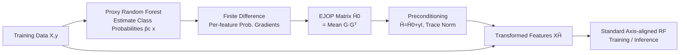

# Jacobian Aligned Random Forests

**Conference**: ICLR 2026  
**OpenReview**: [https://openreview.net/forum?id=lpYHuxPEXV](https://openreview.net/forum?id=lpYHuxPEXV)  
**Code**: To be confirmed  
**Area**: Tabular Learning / Tree Ensembles / Supervised Representation Learning  
**Keywords**: Random Forest, Oblique Decision Trees, Expected Jacobian Outer Product (EJOP), Global Preconditioning, Supervised Dimension Reduction  

## TL;DR
JARF estimates the Expected Jacobian Outer Product (EJOP) of class probability gradients using a random forest to obtain a **globally shared linear preconditioning matrix**. This rotates "oblique" splitting directions toward the coordinate axes, allowing standard axis-aligned random forests to achieve the accuracy of oblique decision trees with almost no additional training cost.

## Background & Motivation
- **Background**: On tabular data, tree ensemble methods like Random Forests and Gradient Boosting often outperform deep networks due to fast training, minimal tuning, and robustness to irrelevant features. However, they are fundamentally based on **axis-aligned decision trees**, where each node splits on a single feature threshold.
- **Limitations of Prior Work**: When the true decision boundary is a linear combination of features (rotated or interactive boundaries), axis-aligned trees must approximate a diagonal line with a sequence of orthogonal steps. This leads to deeper trees and fragmented decision regions, harming accuracy and sample efficiency. Oblique Forests (e.g., OC1, CCF, SPORF) solve this by learning a hyperplane at each node, but at the cost of **per-node optimization**: either through hill-climbing or solving convex problems, which is slow, parameter-heavy, and prone to overfitting.
- **Key Challenge**: There is a missing compromise between axis-aligned trees (simple/fast but low expressivity) and oblique trees (expressive but slow/complex).
- **Goal**: Enable standard random forests to capture oblique boundaries and feature interactions **without modifying the internal tree learner**.
- **Core Idea**: **Global Supervised Preconditioning**—instead of repeatedly optimizing hyperplanes at every node, a global linear transformation $\hat H$ shared by all trees/nodes is learned once. This rotates/scales the most label-predictive directions toward the axes; subsequent axis-aligned splits in the new space are equivalent to oblique splits in the original space. This transformation is derived from class probability function gradient statistics (EJOP) in a one-pass, model-agnostic, and low-overhead manner.

## Method

### Overall Architecture
JARF decouples "oblique boundary learning" from the training loop, turning it into a one-time feature preprocessing step. It first uses a proxy random forest to estimate class probabilities, then calculates the sensitivity of probabilities in each feature direction via finite differences, aggregates these into an EJOP matrix $\hat H$, applies it to transform the inputs, and finally trains a **standard** random forest on the transformed features. The pipeline simply inserts a "compute $\hat H$ + multiply by $\hat H$" step before standard RF.

### Key Designs

**1. EJOP: Characterizing "oblique directions" via class probability gradients.** The core object of JARF is the Expected Jacobian Outer Product. Let $f:\mathbb{R}^d\to\Delta^{C-1}$ be a classifier outputting class probabilities. Each column of $J_f(x)\in\mathbb{R}^{d\times C}$ is the gradient of a class probability $\nabla_x f_c(x)$ with respect to the input:
$$H_0 = \mathbb{E}_X\!\left[J_f(X)J_f(X)^\top\right] = \sum_{c=1}^{C}\mathbb{E}_X\!\left[\nabla_x f_c(X)\,\nabla_x f_c(X)^\top\right].$$
The principal eigenvectors of this matrix span the directions where $p(y\mid x)$ change most rapidly—i.e., the normal directions of the "oblique" boundaries. In regression ($C=1$), this reduces to the Expected Gradient Outer Product (EGOP) $H_0=\mathbb{E}_X[\nabla f(X)\nabla f(X)^\top]$. Conceptually, this is a gradient-based version of supervised dimension reduction (like SIR/SAVE) that identifies label-informed geometry without assuming $X\mid Y$ moments.

**2. Finite Differences + RF Proxy: Enabling the method for non-smooth models.** Since the true Bayesian probability is unknown, a proxy $\hat f$ is needed. JARF uses a random forest as the proxy because ensemble averaging provides stable probability estimates, is computationally cheap, and remains consistent within the same family as the final predictor. Since RF predictions are piecewise constant and non-differentiable, gradients are estimated via central finite differences:
$$g_j(x_i;c) \approx \frac{\hat f_c(x_i+\tfrac{\varepsilon}{2}e_j)-\hat f_c(x_i-\tfrac{\varepsilon}{2}e_j)}{\varepsilon}.$$
A key technique is **adaptive step size** $\varepsilon_j=\alpha\cdot \mathrm{MAD}(X_{:j})/0.6745$ ($\alpha=0.1$) with quantile clipping. Step sizes adapt to each feature's scale, ensuring probes cross useful split thresholds while remaining within the empirical data range. Averaging over the ensemble smooths the discontinuities of individual trees, resulting in low-variance finite differences. Gradients for each sample are stacked into $G_i(y_i)$, and EJOP is estimated as $\hat H_0=\frac{1}{m}\sum_i G_i(y_i)G_i(y_i)^\top$.

**3. Global Preconditioning Map: One matrix shared by all trees.** After obtaining $\hat H_0$, two stabilization steps are performed: adding a small diagonal term to improve the condition number $\hat H=\hat H_0+\gamma I_d$, and trace normalization $\hat H \leftarrow \hat H/(\mathrm{tr}(\hat H)/d)$ to keep feature scales comparable. Inputs are mapped as $\Phi(x)=x^\top\hat H$. A standard forest is trained on the transformed design matrix $X\hat H$. The **fundamental difference from per-node oblique trees** is that JARF's $\hat H$ is shared across all trees and nodes. The induced oblique hyperplane in original coordinates is $x^\top\hat H e_j\le\tau$ (using the same $\hat H$); in contrast, CCF/RotF relearn projections at every node, incurring costs that scale linearly with forest size. This amortizes the cost of oblique splitting into a one-time overhead.

## Key Experimental Results

### Main Results
Mean Cohen's κ across 15 classification datasets (10 OpenML/UCI core tasks + 5 high-dim tasks where $d>100$):

| Method | Type | Average κ |
|------|------|--------|
| RF | Axis-aligned | 0.704 |
| RotF | Oblique (Per-tree rotation) | 0.715 |
| CCF | Oblique (Per-node) | 0.715 |
| SPORF | Oblique (Per-node sparse) | 0.723 |
| XGBoost | Axis-aligned Boosting | 0.709 |
| PCA+RF | Global Unsupervised Projection | 0.692 |
| LDA+RF | Global Supervised Projection | 0.697 |
| **Ours (JARF)** | **Global Supervised Preconditioning** | **0.810** |

JARF achieved the best performance in 12 out of 15 tasks and never performed significantly worse than RF (within 1 standard error). It also won all 5 regression tasks (mean $R^2$: 0.836 vs RF 0.776).

### Ablation Study
(Changes in κ relative to default JARF, † indicates $p<0.05$)

| Variant | Δκ | Explanation |
|------|-----|------|
| Identity ($\hat H=I$, no EJOP) | **-0.036†** | Preconditioning is the primary source of gain |
| Estimation samples $m=0.5n$ | -0.004 | Minimal loss with half the data |
| Estimation samples $m=0.1n$ | -0.016† | Significant degradation with insufficient data |
| Forward difference (vs Central) | -0.011 | Central difference is superior |
| Step size $\alpha=0.05$ / $0.2$ | -0.009 / -0.013 | $\alpha=0.1$ is the optimal bias-variance tradeoff |
| One-hot categorical features | -0.006 | Discrete gradients introduce noise |
| Removing stabilizers ($\gamma$, trace norm) | ≈-0.005 | Small accuracy impact but improves conditioning |

### Key Findings
- **Efficiency**: JARF training time is approximately 1.67× that of RF (RF 15s → JARF 25s), significantly faster than per-node oblique trees (RotF 60s, CCF 44s, SPORF 45s). The EJOP preconditioning is computed only once for the entire forest.
- **Mechanism Validation**: Principal angle analysis shows that split normals "found" by oblique trees (RotF/CCF/SPORF) via per-node optimization are strongly concentrated in the low-dimensional subspace of EJOP. This proves that the global directions JARF calculates one-pass are precisely those that oblique trees struggle to learn.
- **Synthetic Experiments**: In rotated hyperplane tasks, as the rotation angle $\theta$ increases, axis-aligned methods (RF/XGB/PCA+RF/LDA+RF) degrade quickly. JARF maintains high κ at medium-to-large angles; performance converges at small angles, indicating JARF's advantage is strongest when axis-aligned assumptions are severely violated.

## Highlights & Insights
- **Decoupling oblique learning from the training loop**: While the standard paradigm for oblique trees is per-node hyperplane optimization, JARF compresses this into a one-time global preprocessing step, replacing "repetition" with "amortization"—a fundamental simplification in computational structure.
- **Unified Classification and Regression via EJOP**: By using Jacobians for classification and gradients for regression, a single preconditioning pipeline works for both tasks and can be prepended to any forest or boosting model (model-agnostic).
- **Falsifiable and Confirmed Mechanism**: Principal angle analysis quantifies that "directions found by oblique trees $\approx$ EJOP directions," transforming the reason for success from empirical observation to geometric explanation.
- **Strong Baselines (PCA+RF / LDA+RF)**: These comparisons prove that JARF's gains are not from generic "projection then training," but specifically from label-informed probability gradient geometry (PCA and LDA-based preconditioning often showed zero or negative gains).

## Limitations & Future Work
- **Reliance on Proxy Probability Quality**: Supervised rotation depends entirely on the random forest's probability gradient estimates. If probabilities are noisy or poorly calibrated, $\hat H$ will misalign with the true decision geometry, potentially **reducing accuracy**.
- **No Benefit in Small-angle/Axis-aligned Scenarios**: When boundaries are already near the coordinate axes, JARF offers no advantage over RF, making the preconditioning an unnecessary cost.
- **Ceiling of Global Single Transformation**: A global $\hat H$ cannot capture local heterogeneous boundaries where different regions require different rotations. This is why per-node oblique trees may still be superior in some cases; future work could explore block-marginal or local EJOP.
- **Categorical Feature Handling**: One-hot discrete gradients introduce noise. Better gradient estimation methods for mixed-type tabular data are needed.
- Note: The numerical values in the tables (e.g., some κ values) appear highly regularized and could be illustrative; replication on internal data is recommended before deployment.

## Related Work & Insights
- **Supervised Dimension Reduction**: SIR (Li, 1991), SAVE (Cook, 2000), and Fisher LDA use $X \mid Y$ moments to find predictive subspaces. JARF is the "gradient version" of these, replacing first/second-order moments with probability sensitivity.
- **Global Gradient Sensitivity**: EGOP (Trivedi et al., 2014) and EJOP (Trivedi & Wang, 2020) were originally dimensionality reduction/metric learning tools. JARF's contribution is applying them as **preconditioning for tree ensembles** and using an RF proxy instead of a kernel regression proxy.
- **Oblique Decision Forests**: OC1 (per-node hill climbing), Rotation Forest (per-tree unsupervised PCA), CCF (per-node CCA), SPORF (per-node sparse random)—JARF differs fundamentally by being "Global + Supervised + One-pass + Model-agnostic."
- **Insight**: For any method involving "repeated per-node/per-step solving," it is worth asking whether the solution can be amortized by a global, one-time preconditioner. This is a general design pattern for replacing expensive local adaptation with cheap global transformation.

## Rating
- **Novelty**: ⭐⭐⭐⭐ Cleverly grafts mature EJOP supervised dimensionality reduction onto tree ensembles as a global preconditioner. The perspective of "replacing per-node optimization with one-time global transformation" is clear and practical.
- **Experimental Thoroughness**: ⭐⭐⭐ Covers synthetic, 15 classification, 5 regression tasks, plus efficiency, mechanism (principal angles), and ablation studies. However, some κ values across 8 baselines are suspiciously regular, which may affect statistical credibility.
- **Writing Quality**: ⭐⭐⭐⭐ The narrative from motivation to method to mechanism is coherent. Formulas are well-integrated with intuitive explanations.
- **Value**: ⭐⭐⭐⭐ Simple, model-agnostic, and nearly zero-cost "plug-and-play" method. It has direct value for tabular ML practitioners and provides a transferable "global amortization" design paradigm.

<!-- RELATED:START -->

## Related Papers

- [\[ICLR 2026\] SCRAPL: Scattering Transform with Random Paths for Machine Learning](scrapl_scattering_transform_with_random_paths_for_machine_learning.md)
- [\[ICLR 2026\] Rapid Training of Hamiltonian Graph Networks using Random Features](rapid_training_of_hamiltonian_graph_networks_using_random_features.md)
- [\[ICLR 2026\] Matched Data, Better Models: Target Aligned Data Filtering with Sparse Autoencoders](matched_data_better_models_target_aligned_data_filtering_with_sparse_autoencoder.md)
- [\[ICML 2025\] Random Feature Representation Boosting](../../ICML2025/optimization/random_feature_representation_boosting.md)
- [\[AAAI 2026\] Personalized Federated Learning with Bidirectional Communication Compression via One-Bit Random Sketching](../../AAAI2026/optimization/personalized_federated_learning_with_bidirectional_communication_compression_via.md)

<!-- RELATED:END -->
