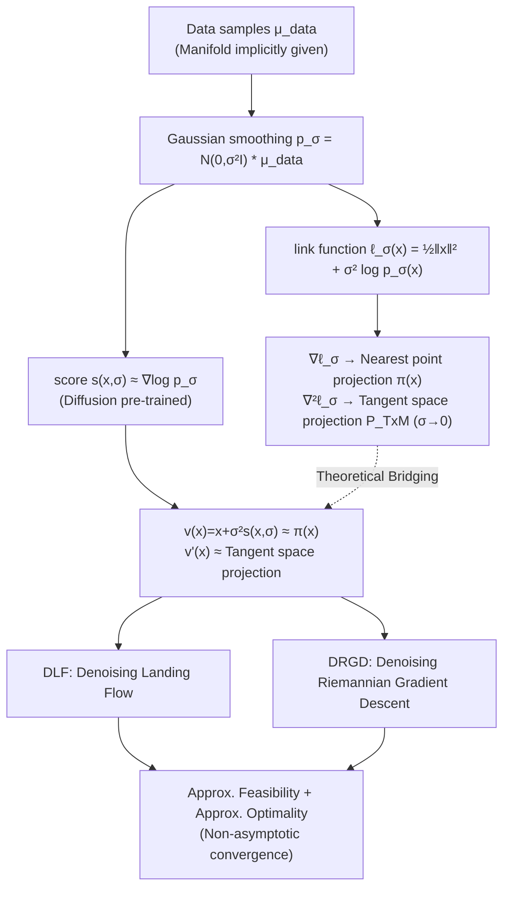

# Landing with the Score: Riemannian Optimization through Denoising

**Conference**: ICLR 2026  
**OpenReview**: [https://openreview.net/forum?id=xZNoeX0z9f](https://openreview.net/forum?id=xZNoeX0z9f)  
**Code**: To be confirmed  
**Area**: optimization  
**Keywords**: Riemannian optimization, diffusion models, score function, data manifold, denoising, data-driven control  

## TL;DR
When a manifold is only implicitly provided via data samples, this paper utilizes the score function and its Jacobian learned by diffusion models to approximate the "nearest point projection" and "tangent space projection" on the manifold. This translates classical Riemannian optimization to scenarios with only data and no explicit geometry, providing two inference-time algorithms (DLF / DRGD) with non-asymptotic convergence guarantees.

## Background & Motivation

**Background**: Classical Riemannian optimization (RO) investigates minimizing an objective $\min_{x\in\mathcal{M}} f(x)$ on an **explicitly known** embedded submanifold $\mathcal{M}\subseteq\mathbb{R}^d$. It ensures iterates remain on the manifold (feasible methods) through geometric operations such as retractions, tangent space projections, and exponential maps. A typical algorithm is Riemannian Gradient Descent: taking a step along the tangent space and then retracting back to the manifold.

**Limitations of Prior Work**: This machinery relies entirely on **explicit geometric operations**. However, under the "data manifold hypothesis," real-world images, system trajectories, or airfoil shapes approximately lie on a low-dimensional manifold that is only **implicitly** provided via a set of samples $\mu_{\text{data}}$—no analytical projection, retraction, or exponential map is available. Consequently, classical RO cannot be directly applied. Existing manifold learning (Isomap, LLE, Autoencoders, GANs) focuses on "learning manifold geometry/coordinates," rather than addressing the constrained optimization problem $\min_{x\in\mathcal{M}}f$.

**Key Challenge**: The gap between mature RO requiring explicit geometry and modern generative/design tasks (airfoil design, additive manufacturing, data-driven control, Bayesian inverse problems) where geometry is implicit. How to recover the geometric operations required for optimization when "only data" is available is the critical missing link for extending RO to these tasks.

**Goal**: Reconstruct the fundamental operations (projection, tangent space projection) needed for Riemannian optimization when the manifold is implicitly given by a data distribution, and design efficient optimization algorithms with convergence guarantees accordingly.

**Key Insight** (**Link function bridging geometry and score**): A link function $\ell_\sigma(x)=\tfrac12\|x\|^2+\sigma^2\log p_\sigma(x)$ is defined to bind the data distribution with geometric quantities, where $p_\sigma=\mathcal{N}(0,\sigma^2 I)*\mu_{\text{data}}$ is the Gaussian-smoothed data distribution. This paper proves that as noise $\sigma\to 0$, $\nabla\ell_\sigma$ converges to the nearest point projection $\pi(x)$ on the manifold, and $\nabla^2\ell_\sigma$ converges to the tangent space projection $P_{T_x\mathcal{M}}$. Since $\nabla\log p_\sigma$ is exactly the **score function** in diffusion models, these geometric operations can be implemented by **directly reusing pre-trained score networks** without any additional training.

## Method

### Overall Architecture
The method consists of two layers: the **theoretical layer** translates "manifold geometric operations" into the "score and its Jacobian"; the **algorithmic layer** designs two inference-time optimization algorithms based on this translation. Given a pre-trained score network $s(x,\sigma)\approx\nabla\log p_\sigma(x)$, $v(x)=x+\sigma^2 s(x,\sigma)$ is used to approximate the nearest point projection $\pi(x)$, and its Jacobian $v'(x)$ approximates the tangent space projection. The entire workflow only requires **forward inference + gradients w.r.t. input** (rather than w.r.t. parameters), allowing manifold optimization to be performed with zero extra training if a pre-trained score is available.

### Key Designs

**1. Link Function: Interpreting the score as a projection operator.** The core of this work is a seemingly simple yet profound equality. For the Gaussian-blurred distribution $p_\sigma=\mathcal{N}(0,\sigma^2 I)*\mu$, Tweedie’s formula yields $x+\sigma^2\nabla\log p_\sigma(x)=\nabla\ell_\sigma(x)=\mathbb{E}\,\nu_{x,\sigma}$ and $I+\sigma^2\nabla^2\log p_\sigma(x)=\nabla^2\ell_\sigma(x)=\tfrac{1}{\sigma^2}\mathrm{Cov}(\nu_{x,\sigma})$, where $\nu_{x,\sigma}$ is the posterior of observing $x$ under noise model $p_\sigma$ and prior $\mu$. Theorem 1 proves that when the support of $\mu$ is a manifold $\mathcal{M}$, these two quantities **uniformly** approximate the nearest point projection and its Jacobian on a tubular neighborhood of $\mathcal{M}$—specifically, $\|\mathbb{E}\,\nu_{x,\sigma}-\pi(x)\|\le K\sigma|\log\sigma|^3$ and $\|\tfrac{1}{\sigma^2}\mathrm{Cov}(\nu_{x,\sigma})-\pi'(x)\|\le K\sigma|\log\sigma|^3$. This transforms geometric operations like "projection" and "retraction" into algebraic operations on the score, derived using fine non-asymptotic estimates of Laplace's method. While prior work observed that the "score is asymptotically orthogonal to the manifold," this work provides **uniform approximation with rates**, enabling convergence analysis for optimization algorithms.

**2. DLF: Denoising Landing Flow (Infeasible path).** Using tangent space projection $P_\sigma(x)=I+\sigma^2\nabla^2\log p_\sigma$ and projection $\pi_\sigma(x)=x+\sigma^2\nabla\log p_\sigma$, DLF defines continuous dynamics $\dot x=-v'(x)\nabla f(v(x))+\eta(v(x)-x)$. In the exact case ($v=\pi_\sigma, v'=P_\sigma$), this is precisely the gradient flow of the penalized objective $F_\sigma^\eta(x)=f(\pi_\sigma(x))+\eta\,d_\sigma(x)$: the first term $P_\sigma\nabla f(\pi_\sigma)$ projects the objective gradient onto the (approximate) tangent space, while the second term $\eta(\pi_\sigma-x)$ is the **landing term** representing a distance penalty to the manifold. It borrows the landing concept from Ablin & Peyré—**not forcing every step to lie on the manifold**, but using the penalty to gradually tighten feasibility, thereby avoiding expensive retractions. Theorem 3 provides a non-asymptotic guarantee: manifold deviation and Riemannian gradient norms are bounded by $\tilde{O}(\sigma)$ plus the score error $\epsilon$. An implementation trick (Remark 4) is that the entire right-hand side requires only **one forward + one backward pass**: calculating $p=v(x)$, then backpropagating $y=\langle v(x),g\rangle$ where $g=\nabla f(p)$ is detached, to obtain $v'(x)\nabla f(v(x))$ in one go.

**3. DRGD: Denoising Riemannian Gradient Descent (Feasible path + Discretization).** Practical computation requires a discrete version. DRGD replaces retraction and tangent space projection in classical Riemannian Gradient Descent with learned $v$ and $v'$: $x_{k+1}=v\!\big(x_k-\gamma_k v'(x_k)\nabla f(x_k)\big)$. Here $v$ serves as an approximate retraction. Theorem 5 provides an average gradient norm bound: $\tfrac1N\sum_k\|\mathrm{grad}_\mathcal{M}f(p_k)\|^2\le 4D/N+(\cdots)\epsilon'$, where $\epsilon'=\epsilon+K\sigma|\log\sigma|^3$. As $N\to\infty$ and geometric error $\epsilon'\to 0$, it converges to zero. When $\epsilon=\sigma=0$, the bound recovers standard results for classical RO under non-convex objectives, showing this framework is a strict generalization of classical RO.

## Key Experimental Results

### Main Results: Data-driven Control (Reference trajectory tracking)
DRGD is validated on a finite-horizon optimal control problem: given input-output trajectory samples of a discrete-time system, find input $u$ such that output $y$ tracks a reference $r$. The objective is $f(u,y)=\sum_k u_k^\top R u_k+(y_k-r_k)^\top Q(y_k-r_k)$. The system behavior manifold $\mathcal{M}_{IO}$ is implicitly given only by measured trajectories.

| System | Time Horizon $N_h$ | Iteration Budget | Key Observation |
|------|-----------|---------|---------|
| Double pendulum | 100 | 3000 | $\|y^*-y_{\text{true}}\|$ is small; solution stays close to the system behavior manifold |
| Unicycle car | 100 | 2500 | $y_{\text{true}}$ tracking of reference $r$ significantly outperforms the best initial $y_0$ in the training set |

Key Conclusion: Using the trajectory with the minimum objective in the training set as the initial value, the input optimized by DRGD yields smaller tracking error when applied back to the real system than any training sample—demonstrating the **generalization capability** of diffusion models (generating feasible solutions better than any training sample).

### Key Findings
- The score and its Jacobian are sufficient to replace explicit retraction and tangent space projection, with approximation accuracy improving systematically as $\sigma\to 0$.
- Optimization can "surpass" training data: the generated feasible points have lower objective values than any sample in the training set, indicating that the strong inductive bias of deep networks is effectively utilized for constrained optimization.
- DRGD is robust to "moderate deviation from the manifold"—it can recover even if intermediate iterations drift away from $\mathcal{M}_{IO}$.

## Highlights & Insights
- **Elegant Conceptual "Translation"**: Reinterpreting the core score of diffusion models as a projection operator in Riemannian optimization connects three worlds: "Geometry (Projection/Tangent Space) ↔ Probability (Posterior Mean/Covariance) ↔ Learning (Score Networks)" via a single link function.
- **Zero-training Inference-time Algorithm**: Any pre-trained score can be used for manifold optimization by taking gradients w.r.t. inputs without touching model parameters—aligning with the current "inference-time scaling" trend.
- **Solid Theory**: Theorem 1 provides uniform approximation with a rate of $\sigma|\log\sigma|^3$, supporting non-asymptotic convergence that cleanly reduces to classical RO results when $\epsilon=\sigma=0$.
- **Distinction between Optimization and Posterior Sampling**: The author specifically discusses the fundamental difference between this constrained optimization and posterior sampling $p_{\text{post}}\propto p_{\text{pre}}\exp(-r/\alpha)$ in classifier guidance. While the latter can push samples off the manifold if $\alpha$ is too small, this work directly enforces manifold constraints.

## Limitations & Future Work
- **Strong Assumptions**: Convergence theorems require the score network to satisfy $L^\infty$ approximation (Equation (7) for $v$ and its Jacobian), which is strong in practice; analysis under weaker $L^2$ errors is left for future work.
- **Unaccelerated Convergence**: DRGD objectives were still decreasing at the iteration limits for the control experiments, indicating relatively slow convergence.
- **Drift in Intermediate Iterates**: The current objective value in DRGD might significantly deviate from the true objective if the iterate drifts from $\mathcal{M}_{IO}$, though experiments show recovery.
- **Algorithm Complexity**: Only gradient flow and gradient descent are implemented; the author envisions pairing learned geometric operations with advanced RO algorithms like Newton or trust-region methods.
- **Experimental Scale**: Main validations involve synthetic manifolds (O(n)) and low-dimensional control systems. High-dimensional real-world data (images, airfoils) remain to be tested despite being cited as primary motivations.

## Related Work & Insights
- **Classical Riemannian Optimization** (Boumal 2023; Absil 2008): This paper is an extension to "implicit manifolds," with feasible (DRGD) and infeasible/landing (DLF) paths corresponding to classical categories.
- **Landing Algorithms** (Ablin & Peyré 2022): DLF directly inherits the idea of replacing step-by-step retraction with a distance penalty.
- **Diffusion Models and Manifold Geometry**: While prior works observed score orthogonality (Stanczuk et al. 2024) or linked the Jacobian to projections on linear manifolds (Ventura et al. 2024), this work systematizes these into a complete "consistent approximation + optimizable" framework.
- **Insight**: Treating the hidden geometric/physical structures within pre-trained large models as differentiable operators (rather than just for sampling) is a paradigm worth promoting. If the score serves as a projection, what other geometric quantities (curvature, geodesics) can be recovered from the Hessian or higher-order derivatives?

## Rating
- **Novelty**: ⭐⭐⭐⭐⭐ Reinterpreting the score as a manifold projection operator and providing the first data-manifold optimization framework based on pre-trained scores is highly original.
- **Experimental Thoroughness**: ⭐⭐⭐ Synthetic $O(n)$ and low-dimensional control systems validate core claims, but high-dimensional real-world experiments are missing.
- **Writing Quality**: ⭐⭐⭐⭐ Logical flow from motivation to theory, algorithms, and experiments is clear. Rigorous theoretical statements, though formula-dense.
- **Value**: ⭐⭐⭐⭐ Provides a guaranteed theoretical interface for "constrained optimization / data-driven design and control using diffusion models," with strong extension value for generative design and control communities.

<!-- RELATED:START -->

## Related Papers

- [\[ICLR 2026\] Riemannian Optimization on Relaxed Indicator Matrix Manifold](riemannian_optimization_on_relaxed_indicator_matrix_manifold.md)
- [\[ICLR 2026\] Scalable Second-Order Riemannian Optimization for K-means Clustering](scalable_second-order_riemannian_optimization_for_k-means_clustering.md)
- [\[ICLR 2026\] Generalizable Heuristic Generation Through LLMs with Meta-Optimization](generalizable_heuristic_generation_through_llms_with_meta-optimization.md)
- [\[ICLR 2026\] Strongly Convex Sets in Riemannian Manifolds](strongly_convex_sets_in_riemannian_manifolds.md)
- [\[ICLR 2026\] Provably Accelerated Imaging with Restarted Inertia and Score-based Image Priors](provably_accelerated_imaging_with_restarted_inertia_and_score-based_image_priors.md)

<!-- RELATED:END -->
