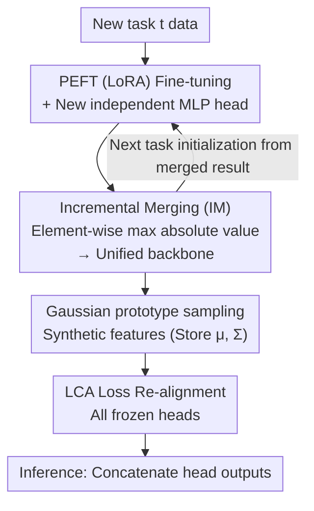

# LCA: Local Classifier Alignment for Continual Learning

**Conference**: ICLR 2026  
**arXiv**: [2603.09888](https://arxiv.org/abs/2603.09888)  
**Code**: [GitHub](https://github.com/tung-tran-kyushu/LCA)  
**Area**: Continual Learning  
**Keywords**: Class-Incremental Learning, Classifier Alignment, Model Merging, Robustness, Pre-trained Models

## TL;DR

This paper proposes the Local Classifier Alignment (LCA) loss function to resolve the classifier mismatch issue caused by incremental backbone merging in continual learning. By simultaneously minimizing classification loss and loss sensitivity within local regions of Gaussian class prototypes, combined with an incremental PEFT merging strategy (IM), the method achieves an overall average accuracy of 85.6% across seven benchmarks, significantly outperforming the state-of-the-art.

## Background & Motivation

**Background**: Class-incremental learning (CIL) based on Pre-trained Models (PTMs) is a dominant paradigm. PTMs provide powerful feature extraction capabilities requiring only lightweight fine-tuning for new tasks; however, naive sequential fine-tuning still suffers from catastrophic forgetting.

**Limitations of Prior Work**: (1) Methods that only fine-tune on the first task (e.g., APER) experience rapid performance decay as tasks increase and distribution shifts grow. (2) Task-wise fine-tuning followed by backbone merging (e.g., EASE, MOS) offers strong comprehensive capabilities but suffers from a mismatch between frozen old classifiers and the merged backbone.

**Key Challenge**: The backbone parameters change after multi-task merging, causing the feature space to no longer align with previously frozen task-specific classifiers, leading to a sharp drop in old task performance. Directly retraining classifiers is infeasible due to the lack of access to old data.

**Key Insight**: Synthetic samples are generated using Gaussian prototypes of classes to realign all classifiers. A key innovation is not only minimizing classification loss but also regularizing the sensitivity of the loss to input perturbations, achieving local robustness and better generalization.

**Design Motivation**: Works like Task Arithmetic and TIES-Merge demonstrate that task-specific models trained independently can form a stronger unified model through parameter merging. Ours incorporates this into CIL by merging only PEFT (LoRA) parameters, maintaining extremely low storage overhead.

**Theoretical Gap**: Existing CIL methods lack theoretical analysis to guide classifier alignment. This paper provides a decomposition theorem for test error, splitting CIL performance into three controllable parts: feature distribution shift, class loss, and robustness.

## Method

### Overall Architecture

LCA decomposes class-incremental learning into three steps: "task-wise training — backbone merging — classifier re-alignment." For each new task, only a set of PEFT (LoRA) parameters is fine-tuned and merged element-wise into a unified backbone. An independent MLP classification head is added for each task. Since merging shifts the feature space and causes mismatch in frozen old heads, synthetic features are sampled from the Gaussian prototypes of each class. The LCA loss is then used to realign all classification heads to the new backbone. This design is governed by a test error decomposition theorem that splits CIL performance into "distribution shift + training error + local robustness," which are controlled by incremental merging and the two terms of the LCA loss, respectively.

### Key Designs

**1. Independent Heads + Gaussian Prototypes: One head per task and one Gaussian per class to prevent overwriting and provide samples for alignment.**

To prevent overwriting old classifiers during new task training, an independent MLP classification head is added for each task, with output dimensions equal to the number of classes in that task. During inference, outputs are concatenated: $h(x) = \text{concat}(h(x;\theta_1^{\text{cls}}), \ldots, h(x;\theta_t^{\text{cls}}))$. Old heads remain frozen and are never modified. Correspondingly, each class is described in the feature space by a Gaussian distribution $\mathcal{N}_i$ (mean and covariance). Since features from pre-trained backbones are highly structured, a single Gaussian approximates the class distribution effectively. The key value of this design is that the alignment phase requires no original data; classification heads are retrained using synthetic features. Storage complexity is $\mathcal{O}(n)$, which is lower than keeping exemplars and avoids privacy concerns.

**2. Incremental Merging (IM): Integrating multi-task knowledge without storing historical parameters.**

If tasks are fine-tuned independently and then merged, historical PEFT parameters must be stored, and merging can be unstable due to distance in parameter space. IM initializes each new task from the previous merged result, keeping neighboring task parameters close (Li et al., 2025). After training, the task vector $\tau_{\text{curr}} = \theta_{\text{peft}_i} - \theta_{\text{peft}_0}$ is calculated and compared element-wise with the cumulative vector $\tau$. Only the dimension with the larger absolute value is kept: $\tau^{(k)} \leftarrow \tau_{\text{curr}}^{(k)}$ if $|\tau_{\text{curr}}^{(k)}| \geq |\tau^{(k)}|$, otherwise $\tau^{(k)}$ remains unchanged. The final backbone is $\theta_{\text{merged}} = \theta_{\text{peft}_0} + \alpha \cdot \tau$. This ensures only one cumulative vector and one current task vector are in memory. The paper also finds that merging only PEFT parameters makes the process significantly more stable, allowing the merging coefficient $\alpha$ to be fixed at 1.0.

**3. LCA Loss: Minimizing classification error and loss sensitivity within prototype neighborhoods.**

After backbone merging, the feature space shifts and old heads mismatch. Since old data is inaccessible, retraining relies on synthetic features sampled from Gaussian prototypes $\mathcal{N}_i$. Simple cross-entropy minimization on synthetic samples is problematic because Gaussian sampling can produce "harmful samples" far from the prototype or near other classes; fitting these hurts generalization and increases inter-class overlap. LCA adds a loss sensitivity regularization term for each class $i$:

$$
L_i = \underbrace{\mathbb{E}_{\boldsymbol{z} \sim \boldsymbol{D}_i}[\ell(h_t, \boldsymbol{z})]}_{\text{Classification Loss}} + \lambda \underbrace{\mathbb{E}_{\boldsymbol{z}, \boldsymbol{z}' \sim \boldsymbol{D}_i}[|\ell(h_t, \boldsymbol{z}) - \ell(h_t, \boldsymbol{z}')|]}_{\text{Loss Sensitivity Regularization}}
$$

The total loss is the average across all seen classes $L(\boldsymbol{D}, h_t) = \frac{1}{C_t} \sum_{i=1}^{C_t} L_i$. The second term measures the difference in loss between two random samples from the same class, penalizing sensitivity to input perturbations and "flattening" the loss surface near prototypes. This weakens the impact of harmful samples—a concept similar to Sharpness-Aware Minimization but applied to classifier alignment. The strength is controlled by $\lambda$; experiments show $\lambda = 0.1$ is stable across all datasets.

**4. Theoretical Error Decomposition: Mapping components to IM and LCA terms.**

To justify the alignment strategy, the paper proves an upper bound for test error. When the backbone is fixed (Theorem 3.1), for a bounded loss $\ell$: $L(P, h_t) \leq L(\boldsymbol{D}, h_t) + \sum_{i=1}^{C_t} \frac{n_i}{n} \bar{\epsilon}_i(h_t) + \ell_{\max} \sqrt{\frac{C_t \ln 4 + 2\ln(1/\delta)}{n}}$, where $\bar{\epsilon}_i(h_t)$ is the local loss robustness term. When considering feature distribution shifts from backbone updates (Theorem 3.2), a Total Variation distance term is added:

$$
L(P_t, h_t) \leq 2\ell_{\max} \text{TV}(P_t, \hat{P}_t) + L(\hat{\boldsymbol{D}}, h_t) + \sum_{i=1}^{C_t} \frac{n_i}{n} \bar{\epsilon}_i(h_t) + \ell_{\max} \sqrt{\frac{C_t \ln 4 + 2\ln(1/\delta)}{n}}
$$

These three terms are controlled by different components: the distribution shift $\text{TV}(P_t, \hat{P}_t)$ is suppressed by IM, the training error $L(\hat{\boldsymbol{D}}, h_t)$ corresponds to the first LCA term, and the robustness term $\bar{\epsilon}_i$ corresponds to the second LCA term.

## Key Experimental Results

### Table 1: Average Accuracy Comparison on 7 Benchmarks (ViT-B/16-IN1K)

| Method | CIFAR100 | IN-R | IN-A | CUB | OB | VTAB | CARS | Overall |
|------|----------|------|------|-----|----|----|------|---------|
| CODA-Prompt | 91.0 | 78.2 | 48.1 | 75.6 | 71.0 | 65.6 | 26.3 | 65.1 |
| DualPrompt | 86.7 | 74.6 | 55.3 | 78.9 | 74.4 | 84.0 | 49.4 | 71.9 |
| EASE | 91.7 | 82.4 | 67.8 | 89.5 | 80.8 | 93.3 | 48.1 | 79.1 |
| MOS | 94.3 | 83.3 | 67.6 | 92.3 | 86.1 | 92.4 | 71.4 | 83.9 |
| SLCA | 93.7 | 85.1 | 45.1 | 90.2 | 82.7 | 91.1 | 74.6 | 80.4 |
| IM (Only merged) | 92.8 | 84.3 | 66.5 | 86.7 | 81.1 | 84.6 | 70.1 | 80.9 |
| **IM+LCA (Ours)** | **94.8** | **85.8** | **75.0** | 90.8 | 81.4 | **95.2** | **76.2** | **85.6** |

### Table 2: Robustness Comparison (CIFAR100-C / CIFAR100-P)

| Metric | IM | IM+LCA | Gain |
|------|-------|---------|------|
| CIFAR100-C Avg. Acc | ~88% | ~90% | +2% |
| CIFAR100-P Avg. Acc | ~86% | ~88.5% | +2.5% |
| CIFAR100-C Severity 5 | Lower | Higher | Significant |
| Overall Robustness Score | Base | Superior | Comprehensive |

### LCA as a Plugin for Other Methods

| Method | Original | +LCA | Effect |
|------|------|------|------|
| SLCA Base | Baseline | SLCA-LCA | Improvements in IN-A, CUB, VTAB, CARS |
| MOS Base | Baseline | MOS-LCA | Multiple datasets improved; 93.1% on CIFAR100 |

## Key Findings

1. **Classifier Alignment is a Key Bottleneck**: The gain from IM to IM+LCA is significant across all 7 datasets, especially on ImageNet-A (+8.5%), indicating that classifier mismatch after backbone merging is a performance bottleneck.

2. **Importance of Robustness Regularization**: The second term of LCA provides +2% and +2.5% robustness gains on CIFAR100-C and CIFAR100-P, with consistent improvements across all 19 corruption types.

3. **Composability of LCA**: LCA can serve as a plug-in for methods like SLCA and MOS. Even without hyperparameter tuning (fixing $\lambda=0.1$), it brings stable improvements.

4. **Effectiveness of Merging Only PEFT Parameters**: Integrating knowledge by merging only LoRA parameters is efficient, requiring no full backbone merging and keeping storage overhead extremely low.

5. **Selection of $\lambda$**: $\lambda=0.1$ is stable across all datasets; excessive $\lambda$ leads to performance drops due to over-regularization, consistent with theoretical expectations.

## Highlights & Insights

- **Loss Sensitivity as a Regularization Objective**: Moving beyond traditional weight regularization or feature alignment, LCA directly constrains the rate of change of the loss function in the input space, "flattening" the loss surface.

- **Theory-Driven Design**: The error decomposition in Theorem 3.2 directly informs the dual-component design of IM+LCA, where each component targets a specific theoretical error term.

- **Synergistic Use of Synthetic Samples**: By only storing means and covariances, the method avoids privacy issues and large storage costs associated with exemplar memory.

- **Concise and Efficient**: The method avoids backbone expansion (like EASE), complex inference (like MOS), or extra buffers. A single alignment step after merging suffices.

## Limitations & Future Work

1. **Alignment-Only Phase**: LCA is currently applied only during alignment. Integrating it into the end-to-end backbone training process might further enhance robustness.

2. **Gaussian Assumption**: Using a single Gaussian per class may fail to capture multi-modal or asymmetric feature distributions in complex fine-grained datasets.

3. **Fixed Backbone Assumption**: Theorem 3.1 assumes a fixed backbone; although Theorem 3.2 introduces distribution shift, it does not fully analyze the dynamics during training.

4. **Limited Context Exploration**: While LCA is general, it was only validated in CIL scenarios, excluding domain-incremental or general classification tasks.

5. **Limited Gain on OB Dataset**: The improvement on OmniBenchmark was marginal (0.3%) and lower than MOS, suggesting potential weaknesses in specific distribution scenarios.

## Related Work & Insights

### vs. EASE (Zhou et al., 2024)
EASE integrates tasks via expandable subspaces and reweights old classifiers. LCA requires no architectural expansion, has lower storage overhead, and directly aligns classifiers using a theoretically grounded loss. IM+LCA significantly outperforms EASE overall (85.6% vs 79.1%).

### vs. MOS (Sun et al., 2025b)
MOS dynamically selects adapters at inference time. IM+LCA completes integration post-training, leading to simpler inference. While MOS performs better on CUB and OB, IM+LCA leads significantly on IN-A, VTAB, and CARS, with higher aggregate accuracy.

### vs. SLCA (Zhang et al., 2023)
SLCA reduces forgetting via low learning rates, but backbone changes still cause mismatch. IM+LCA directly addresses this, particularly on IN-A (75.0% vs 45.1%), and can complement SLCA as a plug-in.

## Rating

- **Novelty**: ⭐⭐⭐⭐ The design of LCA loss is novel—using loss sensitivity as regularization with a theoretical decomposition.
- **Experimental Thoroughness**: ⭐⭐⭐⭐⭐ Comprehensive evaluation across 7 benchmarks, robustness tests, and plug-in validation.
- **Writing Quality**: ⭐⭐⭐⭐ Clear theoretical analysis and concise method description.
- **Value**: ⭐⭐⭐⭐ High practical value due to simplicity as a plug-in without additional storage.

<!-- RELATED:START -->

## Related Papers

- [\[ICLR 2026\] Activation Function Design Sustains Plasticity in Continual Learning](activation_function_design_sustains_plasticity_in_continual_learning.md)
- [\[ICLR 2026\] Local Entropy Search over Descent Sequences for Bayesian Optimization](local_entropy_search_over_descent_sequences_for_bayesian_optimization.md)
- [\[CVPR 2026\] Learning to Learn Weight Generation via Local Consistency Diffusion](../../CVPR2026/optimization/learning_to_learn_weight_generation_via_local_consistency_diffusion.md)
- [\[ICCV 2025\] Federated Continual Instruction Tuning](../../ICCV2025/optimization/federated_continual_instruction_tuning.md)
- [\[ICLR 2026\] MT-DAO: Multi-Timescale Distributed Adaptive Optimizers with Local Updates](mt-dao_multi-timescale_distributed_adaptive_optimizers_with_local_updates.md)

<!-- RELATED:END -->
