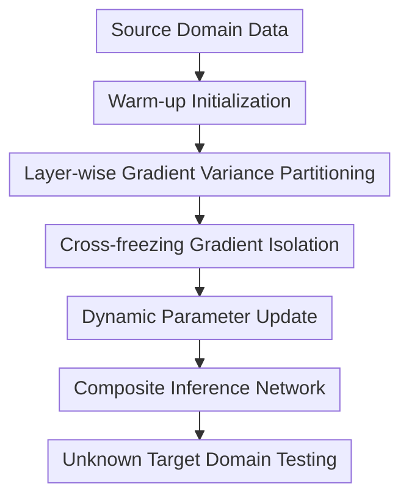

# LDT: Layer-Decomposition Training Makes Networks More Generalizable

**Conference**: ICLR 2026  
**OpenReview**: [https://openreview.net/forum?id=jLpjcY1iry](https://openreview.net/forum?id=jLpjcY1iry)  
**Code**: https://github.com/ZaizuoTang/LDT  
**Area**: Optimization / Training Methods / Domain Generalization  
**Keywords**: Layer-Decomposition Training, Domain Generalization, Gradient Variance, Parameter Stability, Dynamic Parameter Update  

## TL;DR
LDT decomposes network layers into stable and unstable layers based on gradient variance. It employs dual-branch cross-freezing and dynamic EMA updates to sever gradient interference from unstable layers to stable layers, thereby enhancing cross-domain generalization in super-resolution, classification, semantic segmentation, and NLP domain generalization tasks.

## Background & Motivation
**Background**: The goal of domain generalization (DG) is to ensure models remain reliable on unknown target domains when only source domain data is available. Common practices in vision tasks involve either input/feature-level augmentation (e.g., Mixup, CutMix, frequency/style perturbations) or explicitly learning domain-invariant features to suppress domain-related factors and retain stable representations.

**Limitations of Prior Work**: Most existing methods focus on samples, features, or network architectures, while paying insufficient attention to how parameters influence one another. In fine-tuning scenarios, works like LP-FT and DeFT have pointed out that randomly initialized prediction heads can disrupt features of the pre-trained backbone, requiring warm-up or decoupled fine-tuning. However, they usually treat the entire backbone as stable and the entire head as unstable.

**Key Challenge**: This coarse-grained backbone/head partitioning is unreliable. Gradient statistics in the paper demonstrate that some layers inside the backbone exhibit higher gradient variance than the prediction head, suggesting that the assumption "pre-trained backbone is stable, random head is unstable" is only a rough approximation. Once an unstable layer is misclassified as a stable one, its random gradient fluctuations propagate through backpropagation to affect other layers, eventually weakening the network's adaptability to distribution shifts in the target domain.

**Goal**: The authors aim to solve two specific problems. First, how to identify truly volatile unstable layers at a layer-level granularity, rather than relying on module names or network positions. Second, how to train the model after identification so that stable layers are no longer disturbed by the gradients of unstable layers, while still allowing unstable layers to retain necessary learning capacity without being completely frozen.

**Key Insight**: Gradients record the influence of current samples on the direction and magnitude of parameter updates. If a layer generates highly random, high-variance gradients for different samples under the same source domain distribution, the authors consider it sensitive to input distribution. Conversely, low-variance gradients indicate consistent update directions, representing stable and generalizable feature learning signals. Thus, gradient variance serves as the core basis for LDT to distinguish between stable and unstable layers.

**Core Idea**: Use "layer-wise gradient variance" instead of "nominal backbone/head partitioning" to identify unstable layers. Then, through cross-frozen dual-network training and dynamic EMA coefficients generated based on variance ranking, different layers are updated at different cadences according to their stability.

## Method

### Overall Architecture
The training pipeline of LDT involves three steps: first, warm up the prediction head to avoid direct contamination of subsequent gradient statistics by a random head; second, collect gradient variance for each layer on another subset of source samples and partition layers into stable and unstable sets; finally, replicate a primary network and an auxiliary network, using cross-freezing to isolate gradient paths and Dynamic Parameter Update (DPU) to exchange parameters of frozen parts between branches.

After training, LDT does not keep both networks for inference. Instead, it constructs a composite network by taking frozen stable layers from the auxiliary network and frozen unstable layers from the primary network. Thus, while it incurs extra dual-branch overhead during training, the inference phase remains a standard network path.

### Key Designs
**1. Layer-wise Gradient Variance Partitioning: Identifying truly volatile backbone layers**

LDT first splits source domain samples into two subsets $D_S=\{D_{S1},D_{S2}\}$. In the warm-up phase, it initializes the network using $D_{S1}$, primarily to move the prediction head away from its fully random state and prevent skewed variance statistics. Subsequently, it performs forward and backward passes using $D_{S2}$ without updating parameters, saving only the gradients for each layer across different samples.

For each layer, LDT calculates the cross-sample gradient variance $Var_i$. A higher variance indicates that the layer produces more random update directions for samples within the same source distribution, making it more likely to be sensitive to domain shifts. The paper classifies a certain proportion of layers with the highest variance as unstable layers $Name_U$, and the rest as stable layers $Name_S$: $Name_U=TopN(Var, Ratio_U, M)$, $Name_S=Name_{All}-Name_U$. The key is not finding "large gradients" but "layers with inconsistent update directions."

**2. Cross-freezing Dual-branch: Allowing stable and unstable layers unique gradient channels**

After identifying the layer sets, LDT replicates a primary network (PM) and an auxiliary network (AM). In PM, unstable layers are frozen, allowing only stable layers to be updated via task loss. In AM, stable layers are frozen, allowing only unstable layers to be updated. This ensures that stable layer updates are not affected by volatile unstable layers in the same network, and vice versa.

Specifically, the trainable part of PM is $PL^S$ and the frozen part is $\widetilde{PL}^U$; the trainable part of AM is $AL^U$ and the frozen part is $\widetilde{AL}^S$. Each branch performs its own forward pass to obtain $y^P$ and $y^A$, and gradients only update the unfrozen layers: $\Delta P_\theta^S=grad(y^P,y)$, $\Delta A_\theta^U=grad(y^A,y)$. This is more granular than the backbone/head decoupling in DeFT because it protects specifically identified stable layers rather than the entire backbone.

**3. EMA Cross-branch Compensation: Isolating gradients without cutting off parameter synergy**

If only cross-freezing were used, the two branches would become independently trained half-networks, weakening collaboration between layers. LDT uses EMA to pass trainable parameters from one branch to the corresponding frozen layers in the other. Stable layers learned in PM update the frozen stable layers in AM, and unstable layers learned in AM update the frozen unstable layers in PM.

The fixed coefficient version is expressed as $\widetilde{A}_{\theta,t+1}^S=W_f\widetilde{A}_{\theta,t}^S+(1-W_f)P_{\theta,t+1}^S$ and $\widetilde{P}_{\theta,t+1}^U=W_f\widetilde{P}_{\theta,t}^U+(1-W_f)A_{\theta,t+1}^U$. As $W_f$ approaches 1, the frozen layers absorb new parameters from the opposite branch more slowly, equivalent to referencing more history to smooth updates. This design allows LDT to achieve two things simultaneously: isolate disturbances in gradient paths while maintaining coordination between stable and unstable layers at the parameter level.

**4. Dynamic Parameter Update (DPU): Slowing updates for more unstable layers**

The paper further notes that variance magnitudes vary significantly even among stable or unstable layers; using a single EMA coefficient for all layers wastes information. DPU sorts layers by variance in descending order within the stable and unstable sets respectively to get relative rankings $Rank_i^S$ and $Rank_j^U$. These rankings are mapped to layer-specific update coefficients: $W_i^S=W^S_{Base}+Rank^S_{Base}Rank_i^S$ and $W_j^U=W^U_{Base}+Rank^U_{Base}Rank_j^U$.

Default values are $W^S_{Base}=0.99$, $Rank^S_{Base}=0.01$, and for unstable layers $W^U_{Base}=0.999$, $Rank^U_{Base}=0.001$. Intuitively, layers with higher variance need to absorb new parameters more slowly to let history smooth fluctuations, while lower-variance layers can update faster to avoid learning stagnation. DPU extends "layer stability" from a binary label to a continuous update rhythm.

### Loss & Training
The training process consists of two stages. The first stage is stable/unstable layer identification: freeze the backbone, warm up the head for several steps, then unfreeze and collect gradients on $D_{S2}$ without parameter updates to calculate variance and select the top $Ratio_U$ proportion as unstable layers. The paper finds $Ratio_U=0.4$ or $0.5$ works well for super-resolution, while $0.7$ is better for semantic segmentation.

The second stage is cross-freezing training. In each iteration, PM and AM perform forward passes; PM's loss updates stable layers, and AM's loss updates unstable layers. DPU then generates $W^S$ or $W^U$ for each layer based on variance ranking to update frozen layers with the latest parameters from the trainable counterparts. For inference, the model constructed is $M_C=Cat\{\widetilde{AL}^S,\widetilde{PL}^U\}$, and only this composite network is used to predict $y=M_C(x)$.

The authors also provide a single-branch version, LDT-S, in the appendix. LDT-S does not replicate the full dual networks but alternately freezes stable and unstable layers across time intervals within one network, using a CPU weight buffer. Its performance is slightly lower than LDT, but its memory and time costs are close to the baseline.

## Key Experimental Results

### Main Results
LDT was validated across multiple tasks and architectures, including super-resolution (SR), image classification, semantic segmentation, and NLP domain generalization. The most thorough results are in the DRealSR experiments: using Olympus as the source and other cameras as target domains with MambaIR as the backbone.

| Method | Pan | Sony | DSC | IMG | Canon |
|------|-----|------|-----|-----|-------|
| Baseline | 30.81/0.8688 | 30.81/0.8850 | 30.22/0.8753 | 30.01/0.8737 | 30.93/0.8617 |
| LDT | 31.20/0.8631 | 31.25/0.8746 | 31.23/0.8869 | 30.17/0.8730 | 32.33/0.9236 |
| LDT + DPU | 31.36/0.8611 | 32.15/0.8880 | 31.51/0.8865 | 30.57/0.8705 | 32.80/0.9246 |

Compared to other DG or domain adaptation methods, MambaIR + LDT is overall the strongest across five cameras. Notably, on the Sony branch, it improves from DeFT's 31.61/0.8801 to 32.15/0.8880.

| Method | Pan | Sony | DSC | IMG | Canon |
|------|-----|------|-----|-----|-------|
| Wang et al. 2024 | 31.28/0.8626 | 31.53/0.8818 | 31.34/0.8875 | 30.42/0.8775 | 32.72/0.9269 |
| DTAM | 31.23/0.8615 | 31.29/0.8773 | 31.29/0.8864 | 30.32/0.8747 | 32.65/0.9256 |
| START | 31.28/0.8609 | 31.41/0.8774 | 31.29/0.8862 | 30.33/0.8743 | 32.70/0.9261 |
| MambaIR + DeFT | 31.27/0.8632 | 31.61/0.8801 | 31.34/0.8875 | 30.31/0.8726 | 32.40/0.9247 |
| MambaIR + LDT | 31.36/0.8611 | 32.15/0.8880 | 31.51/0.8865 | 30.57/0.8705 | 32.80/0.9246 |

### Ablation Study
Ablations on the partitioning criteria show that gains mainly come from "identifying unstable layers by variance" rather than random splits or gradient means. While random splits occasionally help, gradient isolation fails to work effectively when layers are misclassified.

| Criterion | Pan | Sony | DSC | IMG | Canon | Description |
|----------|-----|------|-----|-----|-------|------|
| Baseline | 30.81/0.8688 | 30.81/0.8850 | 30.22/0.8753 | 30.01/0.8737 | 30.93/0.8617 | Standard fine-tuning |
| Random | 30.96/0.8619 | 30.88/0.8692 | 31.00/0.8858 | 30.02/0.8732 | 32.05/0.9217 | Random partition |
| Mean | 31.18/0.8598 | 31.86/0.8833 | 31.28/0.8854 | 30.47/0.8706 | 32.39/0.9226 | Partition by gradient mean |
| Var/Mean | 31.27/0.8615 | 31.89/0.8849 | 31.37/0.8870 | 30.50/0.8717 | 32.59/0.9248 | Normalized variance |
| Var | 31.36/0.8611 | 32.15/0.8880 | 31.51/0.8865 | 30.57/0.8705 | 32.80/0.9246 | LDT Default |

Efficiency ablations show LDT and DeFT have higher training memory and time due to the auxiliary network, but inference memory remains unchanged. LDT-S brings training costs back to baseline levels while retaining partial performance gains.

### Key Findings
- LDT alone improves PSNR across five DRealSR target cameras; adding DPU further boosts the Sony branch from 31.25 to 32.15, proving layer-specific update coefficients significantly impact generalization.
- Variance partitioning outperforms mean partitioning because large gradients don't necessarily imply instability—they could represent effective learning of new distributions. High variance better characterizes sensitivity to distribution shifts.
- Benefits are not limited to SR. In semantic segmentation (Cityscapes to BDD100K/Mapillary), LDT improves mIoU from DeFT's 42.40/48.38 to 43.68/51.66.
- In image classification, ResNet-50 average accuracy rises from 0.7949 (FT) to 0.8289 (LDT), showing versatility across CNNs, Transformers, and Mamba.
- Hyperparameter $Ratio_U$ is task-sensitive (0.4-0.5 for SR, 0.7 for segmentation).

## Highlights & Insights
- The most valuable insight is shifting "poor generalization" from the sample/feature level to the parameter update level: if a layer's update directions are highly random, it contaminates other layers through backpropagation.
- LDT directly improves upon DeFT by replacing structural priors (backbone/head) with data-driven gradient statistics, discovering hidden unstable layers within the backbone.
- DPU is simple but effective: using ranking instead of complex projection functions to turn variance into EMA coefficients reduces tuning complexity.
- The method is highly transferable; it can be plugged into standard training for any supervised task that generates layer-wise gradients.
- Maintaining a single network for inference is crucial for practical deployment.

## Limitations & Future Work
- LDT requires extra warm-up, gradient statistics, and dual-branch training. The ~20GB training memory might be a hurdle for large models, though LDT-S offers a compromise.
- Stability partitioning depends on $Ratio_U$, which varies across tasks. There is currently no mechanism for automatic selection.
- Statistics come from source domain samples. If the source domain is insufficient, some layers that become unstable in the target domain might not be pre-identified.
- The assumption that high variance equals sensitivity to distribution shift might be affected by batch sampling or loss scale. Future work could integrate Fisher information or curvature for more robust stability estimation.
- While NLP results (Amazon reviews) are provided, the focus remains on vision tasks; testing on LLMs or multimodal models is needed.

## Related Work & Insights
- **vs LP-FT**: LP-FT uses linear probing followed by full fine-tuning to protect pre-trained features. LDT extends this by identifying unstable layers within the backbone.
- **vs DeFT**: DeFT decouples backbone and head via dual branches. LDT moves this decoupling to the layer level based on gradient variance.
- **vs Dropout / DomainDrop**: These operate on structure or feature levels; LDT focuses on inhibiting cross-layer contamination during parameter updates.
- **vs Data Augmentation DG**: Augmentation expands source distributions while LDT alters parameter update paths. They can likely be combined.
- **Insight**: This paper provides a transferable diagnostic perspective: when training for generalization, check if failure stems from a few high-volatility layers. If so, layer-wise isolation may be more effective than global regularization.

## Rating
- Novelty: ⭐⭐⭐⭐ Layer decomposition is not entirely detached from DeFT, but redefining stability via gradient variance and combining it with DPU is a clear and effective entry point.
- Experimental Thoroughness: ⭐⭐⭐⭐⭐ Covers SR, classification, segmentation, and NLP across CNNs, Transformers, and Mamba.
- Writing Quality: ⭐⭐⭐⭐ Clear storyline with sufficient pseudo-code; however, explanations for choosing key hyperparameters like $Ratio_U$ could be deeper.
- Value: ⭐⭐⭐⭐⭐ Highly insightful for DG and fine-tuning, especially suitable for scenarios needing to maintain pre-trained feature stability while adapting to new source domains.

<!-- RELATED:START -->

## Related Papers

- [\[ICLR 2026\] Rapid Training of Hamiltonian Graph Networks using Random Features](rapid_training_of_hamiltonian_graph_networks_using_random_features.md)
- [\[ICLR 2026\] Generalizable Heuristic Generation Through LLMs with Meta-Optimization](generalizable_heuristic_generation_through_llms_with_meta-optimization.md)
- [\[ICLR 2026\] Difference Predictive Coding for Training Spiking Neural Networks](difference_predictive_coding_for_training_spiking_neural_networks.md)
- [\[ICLR 2026\] Deep-ICE: The First Globally Optimal Algorithm for Minimizing 0–1 Loss in Two-Layer ReLU and Maxout Networks](deep-ice_the_first_globally_optimal_algorithm_for_empirical_risk_minimization_of.md)
- [\[ICLR 2026\] Weight Decay May Matter More Than µP for Learning Rate Transfer in Practice](weight_decay_may_matter_more_than_µp_for_learning_rate_transfer_in_practice.md)

<!-- RELATED:END -->
