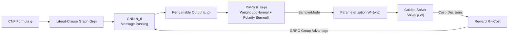

# Learning from Algorithm Feedback: One-Shot SAT Solver Guidance with GNNs

**Conference**: ICLR 2026  
**OpenReview**: [https://openreview.net/forum?id=NfWrLOKnfk](https://openreview.net/forum?id=NfWrLOKnfk)  
**Code**: TBD  
**Area**: combinatorial optimization / SAT solving / GNN + RL  
**Keywords**: SAT solver, branching heuristic, GNN, reinforcement learning, GRPO, RLAF, one-shot guidance  

## TL;DR
A GNN is used in a single forward pass to generate "weights + polarities" for every variable in a SAT formula. These are multiplied into the solver's existing branching score function, and the GNN is trained end-to-end via policy gradient (GRPO) using the solver's own search cost as the reward—a paradigm the authors call RLAF (Reinforcement Learning from Algorithm Feedback). This approach accelerates base solvers by up to $2\times$ across various SAT distributions and outperforms supervised learning schemes based on human-defined heuristics (backbone / UNSAT core).

## Background & Motivation
**Background**: The performance of modern complete SAT solvers (DPLL/CDCL families) relies heavily on branching heuristics—deciding "which variable to pick and which value to try first" at each search step. Heuristics like VSIDS and look-ahead are manually designed scoring functions $\text{Score}(x)$. The optimal heuristic often depends on the specific formula distribution, and tuning for a distribution requires significant expert knowledge and trial-and-error.

**Limitations of Prior Work**: There are two main paths for using machine learning to reform branching heuristics, both with significant drawbacks. First, **supervised prediction of predefined variable properties** (e.g., Selsam & Bjørner predicting UNSAT core members, Wang et al. predicting backbone members). However, these "manually defined importance" measures are not necessarily optimal training targets and fail on certain distributions—for instance, in graph coloring problems, the backbone is always empty due to color permutation symmetry, and in UNSAT 3SAT, the core covers nearly all variables, causing the training target to degenerate into a constant. Second, **pure RL for end-to-end training of branching policies** (e.g., Graph-Q-SAT’s Q-learning, Monte Carlo Forest Search). These methods require **a GNN forward pass for every branching decision**, but GNNs are typically orders of magnitude slower than classical heuristics, limiting these methods to a few early decisions rather than the entire search.

**Key Challenge**: How to enable "learned, distribution-adaptive guidance" to cover every branching decision without paying the expensive overhead of a GNN forward pass at every step—where supervised learning is insufficient and step-by-step RL is too slow.

**Goal**: Design a guidance mechanism that influences all branching decisions, requires only a single GNN forward pass, and learns directly from solving costs without relying on expert supervision.

**Core Idea**:
- **One-shot guidance**: Run the GNN once for the entire formula to produce a pair of parameters $(w, p)$ (weight and polarity) per variable. These parameters are injected into the solver to influence all subsequent branching decisions, amortizing the GNN overhead to near-negligible levels (~0.1s).
- **RLAF (Algorithm Feedback as Reward)**: Model "weight selection" as a single-step MDP where the formula is the state, the weight parameterization is the action, and the reward is the negative solving cost (number of decisions). Train using GRPO without any expert labels.
- **Universal Multiplicative Weight Injection**: Instead of replacing the original heuristic, multiply the learned weights into the existing scores $w(x)\cdot\text{Score}(x)$, making it compatible with any "argmax-score" type branching heuristic.

## Method

### Overall Architecture
The input CNF formula $\phi$ is constructed as a Literal-Clause Graph and passed through a trainable GNN $N_\theta$ via message passing. For each variable, the GNN outputs two real numbers $[\mu(x), \rho(x)]$, which parameterize the weight distribution (LogNormal) and polarity distribution (Bernoulli), respectively, forming the policy $\pi_\theta(\phi)$. Parameters $W=(w, p)$ are sampled (during training) or taken as the mode (during testing) and fed into the modified solver $\text{Solve}(\phi, W)$. The solver multiplies weights into branching scores and uses polarities to decide the initial value assignments. During training, multiple $W$ sets are sampled for the same formula, solvers are run in parallel, and advantages are calculated based on intra-group cost variance to update the GNN via GRPO.

### Key Designs

**1. Multiplicative Weight Injection: Modulation, Not Replacement.** The authors assume the base solver first selects a variable $\hat{x}=\arg\max_x \text{Score}(x)$ and then determines the sign via a secondary heuristic, covering most mainstream heuristics like VSIDS and look-ahead. The modification is simple: assign a positive weight $w:\text{Var}(\phi)\to\mathbb{R}_{>0}$ to each variable and change the selection to $\hat{x}=\arg\max_x w(x)\cdot\text{Score}(x)$ (Eq. 1), with a polarity $p:\text{Var}(\phi)\to\{0,1\}$ determining the first assignment. Crucially, the weight is a **multiplicative scale** rather than a replacement: the score dynamically calculated by the original heuristic (based on current partial assignments, conflict history, etc.) remains unchanged. The GNN merely injects a "variable importance prior" to modulate it, preserving the solver's logic while remaining plug-and-play for any scoring heuristic.

**2. Probabilistic Policy: LogNormal × Bernoulli for Differentiable Sampling.** To train with policy gradients, actions must be samplable and densities must be differentiable. The authors treat the GNN output $\mu(x)$ as the log-mean of the weights, defining $\pi^w_\theta(x)=\text{LogNormal}(\mu(x), \sigma_w)$ (Eq. 2). LogNormal is chosen as it naturally models a unimodal distribution over strictly positive real numbers, ensuring sampled weights are always valid positive scaling factors without manual clipping (Truncated Normal and Poisson were also tested, but LogNormal was more robust). Polarity uses $\pi^p_\theta(x)=\text{Bernoulli}(\text{Sigmoid}(\rho(x)))$ (Eq. 3). All variables are independent, and the joint policy $\pi_\theta(\phi)=\prod_x \pi^w_\theta(x)\times\pi^p_\theta(x)$ (Eq. 4) allows the entire $W$ set to be sampled in parallel. The density factorizes as $\pi_\theta(W|\phi)=\prod_x \pi^w_\theta(w(x)|\phi)\cdot\pi^p_\theta(p(x)|\phi)$ (Eq. 5), allowing direct gradient computation. During testing, the mode $\hat{W}$ is used to eliminate variance and achieve better average performance.

**3. Single-step MDP + GRPO: Solving Cost as Direct Reward.** The optimization goal is to minimize the expected solving cost $\theta^*=\arg\min_\theta \mathbb{E}_{\phi\sim\Omega, W\sim\pi_\theta}[\text{Cost}(\phi, W)]$ (Eq. 6), where $\text{Cost}$ is the number of decisions. This is modeled as a single-step MDP: the formula is the state, choosing $W$ is the action, and the episode terminates immediately with reward $R=-\text{Cost}$ (using decisions instead of CPU time to avoid noise). Training follows GRPO (a simplified PPO without a value network): for each formula $\phi_i$, $M$ sets of parameters are sampled and run. The intra-group normalized relative advantage $\hat{A}_{i,j}=\frac{R(\phi_i, W_{i,j})-\text{mean}(R_i)}{\text{std}(R_i)}$ (Eq. 7) is then used to optimize the clipped objective $L_{\text{PPO}}=\frac{1}{M}\sum_j \min(r_{i,j}\hat{A}_{i,j}, \text{clip}(r_{i,j}, 1-\epsilon, 1+\epsilon)\hat{A}_{i,j})$ (Eq. 8), where $r_{i,j}$ is the ratio of new to old policy probabilities, plus a KL penalty $-\beta\cdot\text{KL}$ (Eq. 10) for stability. The training signal comes entirely from the algorithm's own performance feedback, hence RLAF.

**4. Solver-in-the-Loop Training + Scaling from Easy to Hard.** Since this is online RL, the solver must be in the training loop: with defaults $N=100, M=40$, each GRPO round requires 4,000 solver calls. This necessitates that training data consist of simple instances solvable in seconds on a single CPU+GPU (e.g., 3SAT(200)). The authors' key empirical claim is that **strategies learned on simple instances generalize to much larger and harder instances** (tested up to 3SAT(400), 3COL(600), CRYPTO(10)). Thus, the reliance on simple training problems is not a substantial limitation and provides a path for scaling to industrial-scale problems using distributed clusters.

## Key Experimental Results
Two base solvers were used: the CDCL-based **Glucose** (EVSIDS heuristic, good for structured problems) and the DPLL-based **March** (look-ahead heuristic, among the strongest for random instances). Three distributions: random 3SAT, graph 3-coloring (3COL), and cryptography (CRYPTO, HiTag2 decryption). The GNN has 10 layers with dimension 256, trained for 2,000 GRPO rounds.

### Main Results (Abridged: Decisions/Time, Time includes GNN overhead)

| Distribution | Result | Glucose Time(s) | +RLAF Time(s) | March Time(s) | +RLAF Time(s) |
|---|---|---|---|---|---|
| 3SAT(400) | SAT | 598.35 | **186.70** (-69%) | 7.27 | **5.51** |
| 3SAT(400) | UNSAT | 1895.62 | **1112.71** (-41%) | 27.49 | 27.51 |
| 3COL(600) | SAT | 25.03 | **11.59** | 27.16 | **18.71** |
| 3COL(600) | UNSAT | 193.96 | **155.23** (-24%) | 313.57 | **197.12** |
| CRYPTO(20) | UNSAT | 1.16 | **0.15** (~7.7×) | 0.82 | **0.41** |
| CRYPTO(10) | UNSAT | 162.45 | **64.95** | 467.38 | **169.22** |

### Ablation Study: vs Supervised (backbone / UNSAT core prediction)
- Figure 4 shows that RLAF on Glucose consistently outperforms supervised backbone and UNSAT core prediction schemes in relative runtime.
- Backbone guidance only slightly outperforms RLAF on small 3SAT(300) SAT instances but is overtaken on larger ones; backbone guidance performs significantly worse on UNSAT 3SAT.
- RLAF outperforms core guidance on both graph coloring and cryptography problems. Comparisons with Graph-Q-SAT (unsupervised RL baseline) are provided in the appendix.

### Key Findings
- **Acceleration Magnitude Varies by Distribution**: 3SAT(400) SAT saw a 69% speedup for Glucose and 41% for UNSAT; CRYPTO(20) UNSAT time dropped from 1.16s to 0.15s (~7.7×). GNN forward pass wall-clock time is typically $\le 0.1s$, which is negligible for hard problems.
- **Exceptions**: Although March reduced decisions on UNSAT random 3SAT, the runtime increased slightly—because look-ahead DPLL is already hit extremely hard to improve for UNSAT random instances, and the minor decision gains couldn't offset the GNN overhead (the thinest margin for GNN guidance).
- **Cross-Solver Consistency**: Pearson correlation coefficients for variable weights learned by Glucose vs. March ranged from $r \in [0.73, 0.85]$, suggesting that the models learn **inherent, solver-independent structural properties** of the variables.
- **Self-Discovered Heuristics**: In 3COL/CRYPTO, high-weight variables largely aligned with UNSAT core members—RLAF rediscovered signals relevant to manual heuristics and performed better. In 3SAT, weights did not correlate strongly with backbone, indicating RLAF learned a different, effective function unlike known manual heuristics.

## Highlights & Insights
- **"One-shot" is the key engineering tradeoff to deploy RL guidance for SAT**: Previous step-by-step RL methods were bottlenecked by "GNN being too slow to guide more than a few steps." This work bypasses the bottleneck by "running one forward pass to weight the whole graph," amortizing neural inference costs to negligible levels—a prerequisite for learned guidance to actually beat manual heuristics.
- **Elegance of Multiplicative Injection**: Not touching the internal logic of the original heuristic but multiplying a weight outside the argmax allows the method to be plug-and-play for heterogeneous heuristics like VSIDS and look-ahead, and provides a clear interface for expansion to MIP/CSP "argmax-score" algorithms.
- **Value of the "Algorithm Feedback" Paradigm**: While RLHF/RLVR learn from humans or verifiable answers, RLAF learns from "how fast the algorithm runs." The reward is naturally computable and requires no labels, offering a data-driven path for heuristic design in combinatorial optimization.
- **High Cross-Solver Weight Correlation** is a beautiful secondary piece of evidence, implying that the model learns intrinsic structural information of SAT instances rather than overfitting to a specific solver's quirks.

## Limitations & Future Work
- **Prototype Scale**: Constrained by single-machine CPU+GPU, training used "solved-in-seconds" instances. The cost of 4,000 solver calls per round limits direct training on industrial-scale hard problems; scaling to distributed clusters is the next logical step.
- **GNN Scalability Bottleneck**: Memory and compute overhead for large industrial instances are tight during training, and standard message-passing GNNs are capped by color refinement (1-WL) expressivity. "High expressivity + high scalability" remains a challenge.
- **SOTA CDCL Integration**: Experiments used Glucose/March as prototypes and did not integrate with the most advanced industrial CDCL solvers.
- **Uneven Gains**: On distributions where the solver is already exceptionally strong (e.g., March on UNSAT random 3SAT), GNN overhead may offset or exceed decision improvements.
- **Cross-Domain Potential**: The authors note the method is not limited to SAT; any "argmax-score" heuristic in MIP/CSP could use the same multiplicative weight + RL paradigm, but actual transfer is left for future work.

## Related Work & Insights
- **Supervised Variable Property Guidance**: Selsam & Bjørner (2019) predicted UNSAT cores, Wang et al. (2024) predicted backbones. This work uses them as primary baselines and highlights where their training targets fail across distributions.
- **Step-by-step RL Branching**: Graph-Q-SAT (Kurin et al., 2020) used Q-learning, Cameron et al. (2024) used Monte Carlo Forest Search. Both were limited by "one GNN pass per step" overhead, which this one-shot design addresses.
- **Graph Representation**: Uses the Literal-Clause Graph from Selsam et al. (2019), but the authors emphasize this choice is modular and replaceable.
- **RL Algorithms**: Reuses GRPO (Shao et al., 2024) / PPO (Schulman et al., 2017) popular in LLM fine-tuning, migrating the "learning from feedback" idea from RLHF/RLVR.
- **Insights**: The universal pattern of "heuristic = argmax of a score function" can be unified into an "external multiplicative weight + RL for weights" approach, providing a template for data-driven heuristic design in combinatorial optimization.

## Rating
- **Novelty**: ⭐⭐⭐⭐ — The combination of RLAF (learning from algorithm cost) + one-shot graph-wide guidance + multiplicative weight injection is a clean and uncommon design that cleverly bypasses the overhead of step-by-step RL. While the individual technologies (GNN, GRPO, Literal-Clause Graph) are existing, the synergy and problem modeling are strong.
- **Experimental Thoroughness**: ⭐⭐⭐⭐ — Covers two solver types across three distributions, includes both decisions and wall-clock time (counting GNN overhead), and provides systematic comparisons with supervised and unsupervised baselines, alongside interpretability analysis. The only drawback is the prototype scale.
- **Writing Quality**: ⭐⭐⭐⭐ — The chain from motivation to mechanism to formulas to experiments is clear. Figures 1-3 provide intuitive explanations of solver modification, policy sampling, and GRPO training. Negative results (March-UNSAT) are honestly reported.
- **Value**: ⭐⭐⭐⭐ — Provides a generalizable paradigm for human-label-free, amortized-cost heuristic design. It has clear potential for expansion to MIP/CSP and serves as a strong reference for the combinatorial optimization + ML community.

<!-- RELATED:START -->

## Related Papers

- [\[ICML 2026\] Distribution Alignment for One-Shot Federated Learning via Optimal Transport](../../ICML2026/optimization/distribution_alignment_for_one-shot_federated_learning_via_optimal_transport.md)
- [\[ICLR 2026\] Error Feedback for Muon and Friends](error_feedback_for_muon_and_friends.md)
- [\[AAAI 2026\] PEOAT: Personalization-Guided Evolutionary Question Assembly for One-Shot Adaptive Testing](../../AAAI2026/optimization/peoat_personalization-guided_evolutionary_question_assembly_for_one-shot_adaptiv.md)
- [\[ICLR 2026\] Composite Optimization with Error Feedback: the Dual Averaging Approach](composite_optimization_with_error_feedback_the_dual_averaging_approach.md)
- [\[ICLR 2026\] COLD-Steer: Steering Large Language Models via In-Context One-step Learning Dynamics](cold-steer_steering_large_language_models_via_in-context_one-step_learning_dynam.md)

<!-- RELATED:END -->
