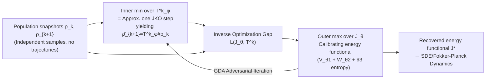

# Learning of Population Dynamics: Inverse Optimization Meets JKO Scheme

**Conference**: ICLR 2026  
**OpenReview**: [https://openreview.net/forum?id=tVJIKd6CLF](https://openreview.net/forum?id=tVJIKd6CLF)  
**Code**: [https://github.com/MuXauJl11110/iJKOnet](https://github.com/MuXauJl11110/iJKOnet)  
**Area**: optimization / Wasserstein gradient flows / generative modeling  
**Keywords**: JKO scheme, inverse optimization, Wasserstein gradient flow, population dynamics, adversarial training  

## TL;DR
This paper proposes iJKOnet, which reformulates the task of "inferring energy functionals from discrete-time population snapshots" as an **inverse optimization problem**. By maximizing the gap between the optimal value of a JKO step and the value at the ground-truth measure, a min-max objective is derived. This allows learning the energy functional driving the Wasserstein gradient flow through standard adversarial end-to-end training, without requiring input-convex neural networks or precomputed optimal transport couplings.

## Background & Motivation
- **Background**: Many scientific problems (single-cell genomics, finance, crowd flows, epidemiology) only provide marginal distribution snapshots of populations at different time points rather than continuous trajectories of individual particles. It is necessary to infer the stochastic dynamics (usually modeled as SDE / Fokker-Planck PDE) governing the evolution from these "independent cross-sections." Wasserstein Gradient Flow (WGF) combined with the JKO implicit discretization scheme is the mainstream theoretical framework for modeling such evolutions.
- **Limitations of Prior Work**: Every JKO step requires solving an optimization problem in the space of probability measures, which is computationally expensive. The first-generation method **JKOnet** writes the task as a bilevel optimization with a complex objective, can only handle pure potential functionals (cannot characterize diffusion/stochasticity), and requires unrolling optimizer steps. The successor **JKOnet\*** replaces the JKO optimization step with first-order optimality conditions, supporting more general energy functionals and reducing complexity, but **it must pre-calculate the optimal transport coupling $\pi_k$ between adjacent snapshots using a discrete OT solver**. Thus, it is not end-to-end, and discrete OT is inaccurate and poorly scalable in high dimensions.
- **Key Challenge**: Pursuing a method that can "express rich energy structures (potential + interaction + diffusion), support end-to-end training, and remain free from constraints like ICNN or precomputed OT"—these three have been mutually exclusive.
- **Goal**: Design a method for recovering energy functionals that does not rely on architectural constraints, does not require precomputing OT couplings, supports end-to-end training, and provides theoretical guarantees.
- **Core Idea**: **Inverse optimization perspective**—since the true sequence satisfies $\rho_{k+1}=\mathrm{JKO}_\tau\mathcal{J}^*(\rho_k)$, for any candidate functional $\mathcal{J}$, the value of the JKO step at the optimum must be $\le$ the value at the ground truth $\rho_{k+1}$, and the difference is always $\le 0$. **Maximizing this gap pushes the candidate functional toward the ground-truth functional**, resulting in a min-max objective.

## Method

### Overall Architecture
iJKOnet is parameterized by two sets of networks: the candidate energy functional $\mathcal{J}_\theta$ (potential $V_{\theta_1}$ + interaction kernel $W_{\theta_2}$ + scalar diffusion coefficient $\theta_3$) and the transport map $T^k_\varphi$ that pushes $\rho_k$ toward the next time step. Minimizing over $T^k$ in the inner loop approximates one JKO step; maximizing over $\mathcal{J}$ in the outer loop pushes the pushed-forward distribution $\hat\rho_{k+1}=T^k_\varphi\!\sharp\rho_k$ toward the true $\rho_{k+1}$, thereby calibrating the energy functional. The overall process is a standard Gradient Descent-Ascent (GDA) adversarial training loop.

### Key Designs

**1. Reformulating JKO recovery as inverse optimization gap maximization: The birth of the min-max objective**. The starting point is the modeling assumption $\rho_{k+1}=\mathrm{JKO}_\tau\mathcal{J}^*(\rho_k)$. By the definition of the JKO step (minimizing $\mathcal{J}(\rho)+\frac{1}{2\tau}d^2_{W_2}(\rho, \rho_k)$ over $\rho$), for any $\mathcal{J}$, it holds that $\min_{\rho_k}\big[\mathcal{J}(\rho_k)+\frac{1}{2\tau}d^2_{W_2}(\rho_k, \rho_k)\big]\le \mathcal{J}(\rho_{k+1})+\frac{1}{2\tau}d^2_{W_2}(\rho_k, \rho_{k+1})$, with equality holding **when $\mathcal{J}=\mathcal{J}^*$**. Moving the right side to the left yields a gap that is always $\le 0$. Maximizing this with respect to $\mathcal{J}$ pushes the candidate toward the true value. After removing constants irrelevant to $\mathcal{J}$, we get $\max_{\mathcal{J}}\sum_k \min_{\rho_k}[\mathcal{J}(\rho_k)-\mathcal{J}(\rho_{k+1})+\frac{1}{2\tau}d^2_{W_2}(\rho_k, \rho)]$. This is the core of the method: instead of solving the JKO optimization or writing first-order optimality conditions, it directly **uses the fact that optimality implies a zero gap as the loss**.

**2. Reducing measure optimization to map optimization via Brenier’s Theorem for a trainable loss**. The inner minimization over $\rho_k$ in the above equation remains in the space of probability measures, which is difficult to optimize directly. Using Brenier’s Theorem, each $\rho_k$ can be written as the push-forward $\rho_k=T^k\!\sharp\rho_k$. Utilizing the upper bound $d^2_{W_2}(\rho_k, \rho)\le\int_X\|x-T^k(x)\|^2 d\rho_k(x)$, the $\min$ over measures is replaced by a $\min$ over transport maps $T^k$. Since the minimizations at each time step are independent, the summation and minimization commute, leading to a computable loss:
$$\max_{\mathcal{J}}\min_{T^k}\ \sum_{k=0}^{K-1}\Big[\mathcal{J}(T^k\!\sharp\rho_k)-\mathcal{J}(\rho_{k+1})+\frac{1}{2\tau}\int_X\|x-T^k(x)\|_2^2\,\rho_k(x)\,dx\Big].$$
The inner optimal map $T^k_{\mathcal{J}}$ precisely pushes $\rho_k$ to $\hat\rho_{k+1}=\mathrm{JKO}_\tau\mathcal{J}(\rho_k)$—**the inner loop "approximates one JKO step using a network"**, which is the key reason iJKOnet can bypass precomputed OT couplings.

**3. Parameterization without architectural constraints + Computable treatment of entropy**. Since the objective (11) no longer requires convexity, the transport map $T^k_\varphi$ can be parameterized by standard MLPs/ResNets, rather than Input Convex Neural Networks (ICNNs) which are difficult to scale to high dimensions like in JKOnet. The energy functional follows the free energy form $\mathcal{J}_\theta(\rho)=V_{\theta_1}(\rho)+W_{theta_2}(\rho)-\theta_3 H(\rho)$, where potential, interaction kernel, and diffusion coefficient are all learnable parameters. Except for the internal entropy term, all components in the loss can be estimated via Monte Carlo. The entropy term $U_{\theta_3}(T^k_\varphi\!\sharp\rho_k)$ is expanded via the change of variables formula into $U_{\theta_3}(\rho_k)-\theta_3\int\log|\det\nabla_x T^k_\varphi(x)|d\rho_k(x)$, where $H(\rho_k)$ is precomputed before training using the Kozachenko–Leonenko nearest neighbor estimator, and the $\log\det$ term is estimated using Hutchinson’s trace estimator or by calculating the full Jacobian.

**4. Upper bound on potential recovery quality (Theoretical Guarantee)**. This is the first work to provide recovery quality analysis for a JKO-based population dynamics solver. Under assumptions such as $K=1$, pure potential, convex $X$, and a modified potential $V_q:=\tau V+\frac12\|\cdot\|^2$ being strictly convex and $\frac{1}{\beta}$-smooth, Theorem 3.1 proves the existence of a constant $C=C(\tau,\beta)$ such that:
$$\int_X\|\nabla V^*(y)-\nabla V(y)\|^2 d\rho_1(y)\le C\,\varepsilon(V),$$
meaning that the smaller the inverse JKO loss gap $\varepsilon(V)$, the closer the **gradient** of the recovered potential is to the true value (ignoring additive constants that do not affect dynamics). These assumptions are not restrictive: smoothness can be guaranteed by smooth activations like CELU/SiLU/SoftPlus, and strict convexity usually holds when the step size $\tau$ is sufficiently small.

## Key Experimental Results

### Main Results: Single-cell RNA-seq (Embryoid Body Dataset)

**5D leave-two-out ($d_{W_2}$ distance, lower is better, reconstruct by removing $t_1, t_3$)**:

| Method | $t_1$ | $t_3$ |
|------|-------|-------|
| DMSB | 1.13 ± 0.082 | 1.45 ± 0.16 |
| MMSB | 1.27 ± 0.028 | 1.57 ± 0.048 |
| TrajectoryNet | 2.03 ± 0.04 | 1.93 ± 0.08 |
| JKOnet\* | 1.361 ± 0.257 | 2.557 ± 0.042 |
| JKOnet\*$_{t,V}$ | 4.414 ± 1.499 | 2.771 ± 0.197 |
| **iJKOnet$_V$ (Ours)** | 1.082 ± 0.011 | 1.147 ± 0.001 |
| **iJKOnet$_{t,V}$ (Ours)** | **0.983 ± 0.037** | **0.849 ± 0.021** |

The time-varying potential version iJKOnet$_{t,V}$ achieves the best performance, significantly outperforming non-JKO baselines like DMSB/MMSB and all JKOnet\* variants.

**100D leave-one-out (MMD distance, lower is better, average of 3 runs)**:

| Method | LO-$t_1$ | LO-$t_2$ | LO-$t_3$ | w/o LO |
|------|----------|----------|----------|--------|
| DMSB | 0.042 ± 0.020 | 0.033 ± 0.003 | 0.040 ± 0.020 | 0.032 ± 0.003 |
| MIOFLOW | 0.23 | 0.90 | 0.23 | 0.23 |
| JKOnet\*$_V$ | 0.220 ± 0.025 | 0.293 ± 0.018 | 0.235 ± 0.006 | 0.229 ± 0.052 |
| **iJKOnet$_V$ (Ours)** | 0.137 ± 0.001 | 0.123 ± 0.001 | 0.097 ± 0.002 | 0.085 ± 0.024 |

iJKOnet$_V$ comprehensively outperforms JKOnet\*. In the w/o LO setting, it performs on par with DMSB but utilizes a **simulation-free, trajectory-cache-free** simpler optimization process, resulting in better execution time.

### Ablation Study / Comparative Analysis (Synthetic Potential Learning, §5.1)

| Dimension of Comparison | Finding |
|----------|------|
| iJKOnet$_V$ vs JKOnet$_V$ (2D unpaired, EMD/Bd²W2-UVP/L2-UVP, 15 potentials) | iJKOnet outperforms JKOnet\* on nearly all potentials. |
| Sample size 2K vs 10K | In most cases, increasing samples improves performance, but some potentials remain difficult to learn even at 10K, highlighting the difficulty of the unpaired setting. |
| paired vs unpaired setting | The authors found that JKOnet\* original code inadvertently preserved particle trajectories (paired); switching to a truly trajectory-free unpaired setting significantly changes performance—pointing out an overlooked evaluation consistency issue. |
| Energy component combination ($V$ / $V{+}U$ / $V{+}W$ / $W{+}U$ / All) | Inductive bias favoring only potential $V$ is the most stable; jointly optimizing interaction + internal energy $(\theta_1,\theta_2,\theta_3)$ tends to be unstable and converges to inaccurate potential estimates. |

### Key Findings
- By changing the JKO step from "explicit solving/first-order optimality" to "inverse optimization gap," end-to-end adversarial training becomes feasible and eliminates errors and scaling bottlenecks caused by precomputed OT couplings.
- Directly recovering interaction and internal energy from samples is indeed difficult (requiring integration over a "function that is itself being estimated"). Thus, restricting to pure potential iJKOnet$_V$ for large-scale experiments is a pragmatic choice.

## Highlights & Insights
- **Perspective Innovation**: Explicitly reducing "inferring energy functionals" to inverse optimization (Optimality $\implies$ Zero Gap) naturally leads to a min-max objective—this is more direct and easier to extend to general energy forms than JKOnet’s bilevel optimization or JKOnet\*’s use of first-order conditions.
- **Removing Two Historical Burdens**: It requires neither ICNN (convexity constraints $\implies$ standard MLP/ResNets can be used, favoring high-dimensional scaling) nor precomputed discrete OT couplings (eliminating an additional error source for true end-to-end learning).
- **First Recovery Quality Theory**: Theorem 3.1 provides a guarantee that the potential gradient recovery error is controlled by the upper bound of the loss gap, filling a gap in the lack of quality analysis for JKO-based population dynamics solvers.
- **Honest Engineering Discovery**: Identifying the implicit paired/unpaired inconsistency in JKOnet\* code has positive value for the credibility of community evaluations.

## Limitations & Future Work
- Internal energy is limited to entropy types and cannot handle other forms; interaction energy is limited to time-invariant scenarios and cannot characterize time-varying interactions.
- It does not support birth–death dynamics, making it difficult to contrast with recent trajectory inference methods that account for cell proliferation/apoptosis.
- Reliance on entropy estimation leads to decreased accuracy in high dimensions; joint optimization of all energy parameters $(\theta_1,\theta_2,\theta_3)$ is prone to instability and inaccurate potentials—the root reason for reverting to pure potential in large experiments.
- Theoretical guarantees currently only cover pure potential ($K=1$); extending these to interaction/internal energy remains an open problem.

## Related Work & Insights
- **JKOnet (Bunne et al., 2022b)**: Recovers population dynamics via bilevel optimization, requiring unrolled optimizers and only supporting potential; iJKOnet inherits its parameterization but removes the bilevel structure.
- **JKOnet\* (Terpin et al., 2024)**: Replaces JKO optimization with first-order optimality conditions and supports more general energies but requires precomputed OT couplings and is not end-to-end; iJKOnet "solves the JKO step" directly via inner minimization, bypassing precomputation.
- **WGF / JKO Theory** (Jordan-Kinderlehrer-Otto 1998, Ambrosio et al. 2008) and ICNN-based solvers (Mokrov 2021, Alvarez-Melis 2022) provide the foundation for gradient flows in measure spaces and variational time discretization.
- **Non-JKO Trajectory Inference Baselines** (TrajectoryNet, MIOFLOW, DMSB, NLSB, MMSB) are the primary benchmarks in single-cell dynamics; iJKOnet achieves comparable or superior results within a simpler, simulation-free framework.
- **Insight**: When the ground truth of a learning problem satisfies the "fixed point/optimal solution of an optimization process," considering reformulating the "recovery target" as an inverse optimization maximizing the "optimality gap" often yields a simpler, end-to-end, and analyzable training objective—a strategy transferable to other implicit modeling/inverse problem scenarios.

## Rating
- **Novelty**: ⭐⭐⭐⭐ Introducing the inverse optimization perspective into JKO population dynamics recovery to derive a clean min-max objective, along with providing the first recovery quality theorem in this direction, is a conceptual breakthrough.
- **Experimental Thoroughness**: ⭐⭐⭐⭐ Synthetic potentials + 5D/100D real single-cell data, including comparisons with multiple JKO and non-JKO baselines and ablations on energy components/sample sizes; however, large experiments are limited to pure potential as interaction/internal energy recovery was not stably validated.
- **Writing Quality**: ⭐⭐⭐⭐ The progression from motivation to derivation, theory, and experiments is clear. The derivation chain of the inverse optimization gap is fully explained, and the paired/unpaired issues in baseline code are honestly addressed.
- **Value**: ⭐⭐⭐⭐ Provides a simpler, end-to-end, scalable, and guaranteed tool for learning stochastic dynamics from snapshots, which has practical significance for scientific scenarios like single-cell genomics where only cross-sectional data is available.

<!-- RELATED:START -->

## Related Papers

- [\[ICLR 2026\] Neural Optimal Transport Meets Multivariate Conformal Prediction](neural_optimal_transport_meets_multivariate_conformal_prediction.md)
- [\[ICML 2026\] Learning Dynamics of Zeroth-Order Optimization: A Kernel Perspective](../../ICML2026/optimization/learning_dynamics_of_zeroth-order_optimization_a_kernel_perspective.md)
- [\[ICLR 2026\] COLD-Steer: Steering Large Language Models via In-Context One-step Learning Dynamics](cold-steer_steering_large_language_models_via_in-context_one-step_learning_dynam.md)
- [\[ICLR 2026\] LoRA meets Riemannion: Muon Optimizer for Parametrization-independent Low-Rank Adapters](lora_meets_riemannion_muon_optimizer_for_parametrization-independent_low-rank_ad.md)
- [\[ICLR 2026\] Predictive Differential Training Guided by Training Dynamics](predictive_differential_training_guided_by_training_dynamics.md)

<!-- RELATED:END -->
