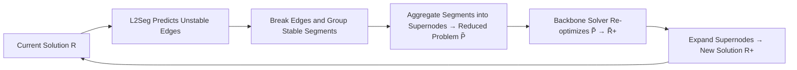

# Learning to Segment for Vehicle Routing Problems

**Conference**: ICLR 2026  
**OpenReview**: [https://openreview.net/forum?id=pN261iTKvr](https://openreview.net/forum?id=pN261iTKvr)  
**Code**: To be confirmed  
**Area**: optimization  
**Keywords**: Vehicle Routing Problem, Neural Combinatorial Optimization, Iterative Search Acceleration, Problem Decomposition, Autoregressive/Non-Autoregressive Models  

## TL;DR
The authors observe that during the search process of iterative VRP solvers, a large number of edges become "stable and unchanged" early on, and repeatedly optimizing them wastes computational resources. They propose the First-Segment-Then-Aggregate (FSTA) decomposition framework to aggregate stable segments into supernodes, allowing the solver to focus only on unstable parts. A neural network called L2Seg (with three variants: autoregressive, non-autoregressive, and synergistic) is trained to identify which segments to aggregate, accelerating SOTA solvers such as LKH-3, LNS, and L2D by 2~7 times.

## Background & Motivation
**Background**: The Vehicle Routing Problem (VRP) is a core NP-hard combinatorial optimization problem in scenarios like logistics and ride-hailing. Currently, the strongest solvers—whether classical heuristics (LKH-3, HGS, LNS) or neural solvers (LEHD, L2D, etc.)—almost all rely on **iterative search** (ruin-and-repair style local search) to progressively refine solutions.

**Limitations of Prior Work**: The authors observe a widely overlooked phenomenon: as the search progresses, **a large portion of edges in the solution stabilize** (i.e., they remain in the solution without changing over several consecutive solver calls), especially in large-scale VRPs with high capacity and long sub-routes. For instance, internal edges of adjacent sub-routes often stay fixed, while only boundary edges frequently recombine. Solvers, however, repeatedly optimize these already stable edges, causing significant computational redundancy and severely hindering scalability.

**Key Challenge**: While stability can be learned end-to-end from the spatial distribution of customers and the structural properties of the solution, **existing solvers lack any mechanism to identify and exploit this stability**. They either perform global re-optimization or blindly shrink the search space using manual rules (k-nearest neighbor pruning, bounded neighborhoods), failing to distinguish "which segments are stable and which are not" in a data-driven manner.

**Goal**: To enable solvers to identify stable segments and skip them, concentrating computational power on unstable parts that truly require re-optimization. This acceleration should be **solver-agnostic** (compatible with classical, neural, or hybrid backbones) and cover multiple VRP variants.

**Core Idea**: **First-Segment-Then-Aggregate (FSTA)** + **Learning to Segment (L2Seg)**. FSTA acts as the "mechanism"—aggregating stable segments into fixed supernodes to reduce problem size and re-optimizing only unstable parts, with theoretical proofs maintaining solution feasibility and monotonicity. L2Seg acts as the "brain"—using a neural network to judge which edges are unstable, featuring the first collaboration between **Autoregressive (AR) and Non-Autoregressive (NAR) models** to balance global vision with local precision.

## Method

### Overall Architecture
The method consists of two layers. The lower layer, FSTA, is a **solver-agnostic decomposition mechanism**: given a current solution, it identifies and breaks unstable edges, groups the remaining stable continuous nodes into segments, and aggregates each segment into one or two supernodes carrying consolidated attributes (total demand, min/max time windows, etc.). This results in a smaller sub-problem $P̃$, which is passed to any backbone solver for re-optimization. Finally, the supernodes are expanded back to the original solution. The upper layer, L2Seg, is an **encoder-decoder neural network** designed to solve the combinatorial judgment problem of "which edges to break" in FSTA, providing three variants: NAR (one-shot global prediction), AR (sequential local refinement), and SYN (synergy between the two).

### Key Designs

**1. FSTA Decomposition: Fixing stable segments with supernodes with theoretical guarantees against solution degradation.** This is the mechanical foundation. Let the CVRP solution be a set of routes $\mathcal{R}=\{R_1,R_2,\dots\}$, where each route is $R_i=(x_0\to x_1^i\to\dots\to x_0)$. Once the set of unstable edges is identified (edges connected to the depot are forced into this set to ensure depot validity), they are broken, and each route is partitioned into several disjoint stable segments $S^i_{j,k}=(x^i_j\to\dots\to x^i_k)$. Each segment is replaced by a supernode $\tilde{S}^i_{j,k}=\{\tilde{x}^i_{j,k}\}$ (or two endpoint supernodes), with attributes being the sum of internal attributes (e.g., demand $d^i_{j,k}=d^i_j+\dots+d^i_k$). The original problem $P$ shrinks to $\tilde{P}$ with fewer nodes, and the solver performs local search only on unstable parts, naturally leading to speedups. Crucially, the authors prove two theorems: **Feasibility** (if aggregated solution $\tilde{\mathcal{R}}_+$ is feasible for $\tilde{P}$ $\implies$ restored solution $\mathcal{R}_+$ is feasible for the original problem) and **Monotonicity** (if $f(\tilde{\mathcal{R}}^1_+)\le f(\tilde{\mathcal{R}}^2_+)$ then $f(\mathcal{R}^1_+)\le f(\mathcal{R}^2_+)$). This means improvements in the reduced problem map directly to improvements in the original problem. This conclusion extends to CVRP, VRPTW, VRPB, 1-VRPPD, and other variants.

**2. Encoder representing graph-level and route-level structures.** AR and NAR share the same encoder. Regarding input features, the authors designed two discriminative features: **angularity** (relative to the depot) and **internality** (the proportion of nearest neighbors belonging to the same route) to better distinguish stable/unstable edges. Edges distinguish between "edges in the current solution" and "edges to k-nearest neighbors." Initial node embeddings are formed by concatenating MLP embeddings with absolute positional encodings $h^{init}_i=\text{Concat}(h^{MLP}_i,h^{POS}_i)$. These pass through a masked Transformer layer (the mask prevents nodes from different routes from attending to each other, injecting local structure) and several GAT layers to inject global graph information $H^{GNN}=\text{GNN}(H^{TFM},E)$.

**3. NAR and AR decoders serving distinct, complementary roles.** The NAR decoder is minimal—an MLP+Sigmoid outputs the instability probability for each node $p^{NAR}=\text{MLP}_{NAR}(H^{GNN})$ in one shot. It has a good global view and is fast but lacks conditional modeling, often marking all edges around an unstable one as unstable. The AR decoder mimics classical local search "k-edge removal and re-insertion" behavior by **alternating between a deletion phase and an insertion phase**: the deletion phase ($t=2k$) selects an unstable edge based on a target node (marking only); the insertion phase ($t=2k+1$) selects a pseudo-edge starting from the previous endpoint as a "bridge" to the next unstable region, resulting in $E_{unstable}=\{e_{\pi_0,\pi_1},e_{\pi_2,\pi_3},\dots\}$. Both phases use GRU for sequence context and multi-head attention for node selection. AR has high local precision but lacks global vision when facing multiple scattered unstable regions.

**4. SYN Synergy: NAR defines the scope, AR refines.** This is a pioneering aspect of the paper—the first time AR and NAR collaborate for decision-making in NCO. SYN inference follows four steps: the problem is split into approximately $|\mathcal{R}|$ sub-problems based on adjacent sub-route pairs; for each sub-problem, NAR predicts global unstable nodes $\hat{y}^{NAR}=\{x_i\mid p^{NAR}_i\ge\eta\}$ ($\eta=0.6$); these nodes are clustered via K-means into $n_{KMEANS}=3$ clusters, with the highest probability node in each cluster serving as the **initial target node** for AR decoding; finally, AR refines unstable edges locally around these points. Training uses **imitation learning**: an iterative solver acts as a look-ahead heuristic, labeling endpoints of edges that change after one round of re-optimization $E_{diff}=(E_R\setminus E_{R_+})\cup(E_{R_+}\setminus E_R)$ as unstable.

## Key Experimental Results

### Main Results: Accelerating three backbone solvers (Large-capacity CVRP)
On 100 large-capacity CVRP instances, all three variants consistently improve each backbone, with SYN performing best (Gain relative to respective backbone):

| Method | CVRP2k Obj.↓ | Gain↑ | CVRP5k Obj.↓ | Gain↑ |
|------|------|------|------|------|
| LKH-3 | 45.24 | 0.00% | 65.34 | 0.00% |
| L2Seg-NAR-LKH-3 | 44.34 | 1.99% | 64.72 | 0.95% |
| L2Seg-AR-LKH-3 | 44.23 | 2.23% | 64.67 | 1.03% |
| **L2Seg-SYN-LKH-3** | **43.92** | **2.92%** | **64.12** | **1.87%** |
| LNS | 44.92 | 0.00% | 64.69 | 0.00% |
| **L2Seg-SYN-LNS** | **43.42** | **3.34%** | **63.94** | **1.16%** |
| L2D | 43.69 | 0.00% | 64.21 | 0.00% |
| **L2Seg-SYN-L2D** | **43.35** | **0.78%** | **63.89** | **0.50%** |

Search curves show that SYN brings **2~7x acceleration**, and accelerated weak solvers can outperform unaccelerated strong solvers (e.g., LKH-3+SYN surpasses original LNS).

### Comparison with SOTA classical/neural baselines (Gap relative to HGS, lower is better)

| Method | CVRP1k Gap↓ | CVRP2k Gap↓ | CVRP5k Gap↓ |
|------|------|------|------|
| HGS | 0.00% | 0.00% | 0.00% |
| LKH-3 | 4.32% | 1.29% | 39.22% |
| SIL | 1.94% | -0.17% | -2.33% |
| L2D | 2.11% | 0.42% | 0.22% |
| NDS | -0.01% | -1.91% | — |
| **L2Seg-SYN-L2D** | **0.07%** | **-2.01%** | **-3.55%** |

The method also leads on VRPTW, with the advantage increasing with scale (-3.14% gap on VRPTW5k).

### Ablation Study

| Method | CVRP2k | CVRP5k |
|------|------|------|
| LNS (backbone) | 44.92 | 64.69 |
| Random FSTA (40%) | 46.24 | 66.72 |
| Random FSTA (60%) | 46.89 | 65.92 |
| L2Seg-SYN w/o Enhanced Features | 43.65 | 64.22 |
| **L2Seg-SYN** | **43.42** | **63.94** |

### Key Findings
- **Random segmentation degrades performance** (Random FSTA higher than backbone), indicating that accurate segmentation is critical; blind aggregation destroys solution quality—justifying the need for learning.
- **Enhanced features (angularity/internality) provide clear contributions**, with performance dropping if removed.
- **SYN > AR > NAR** confirms the logic of "NAR global screening + AR local refinement."
- L2Seg exhibits practical generalization, with zero-shot transfer to clustered customers and heterogeneous demands.

## Highlights & Insights
- **Frames the acceleration problem as a learning task** by targeting "solver redundancy": identifying stable segments rather than directly constructing solutions is a novel and practical perspective.
- **Decouples mechanism (FSTA) and learning (L2Seg)**: FSTA provides mathematical safety with feasibility/monotonicity guarantees, while L2Seg focuses on judgment.
- **Solver-agnostic and plug-and-play**: It can be applied to LKH-3, LNS, and L2D, with greater benefits seen on weaker backbones, showing high engineering value.
- **First joint decision-making between AR and NAR**: Traditionally in NCO, these are used for "NAR divides, AR solves." This work uses NAR to define the scope and AR to refine the same judgment task, offering a new synergy paradigm.

## Limitations & Future Work
- **Reliance on imitation learning with look-ahead labels**: Label quality is constrained by the teacher solver's upper bound; reinforcement learning has not been explored.
- **Static stability assumption**: The method relies on empirical observations of refinement between adjacent routes; its validity for solvers with drastic structural changes or non-local search remains limited.
- **Manual hyperparameters** ($\eta=0.6$, $n_{KMEANS}=3$) may require tuning across different problem scales or distributions.
- Primarily validated on CVRP/VRPTW; while theory covers more complex variants (pickup/delivery, heterogeneous fleet), large-scale empirical evidence is still needed.

## Related Work & Insights
- **VRP Solvers**: Classical heuristics (LKH-3, HGS, LNS) and neural solvers (LEHD, POMO, L2D). This paper highlights the neglected redundant computation in their iterative searches.
- **Large-scale VRP Decomposition**: Manual LNS bounded neighborhoods, sub-path grouping, spatial decomposition, etc. FSTA differs by performing **data-driven, edge-level, cross-route global decomposition**.
- **AR and NAR Models**: NAR is good for global heatmaps but lacks constraint modeling; AR handles sequence dependency well but loses global structure. This paper utilizes their complementarity for "jointly judging stable segments."

## Rating
- **Novelty**: ⭐⭐⭐⭐⭐ — The perspective of "learning to identify stable segments" to accelerate iterative search is fresh, and the AR/NAR hybrid paradigm is pioneering.
- **Experimental Thoroughness**: ⭐⭐⭐⭐ — Covers three backbones, CVRP/VRPTW at multiple scales, and various baselines; missing large-scale empirical tests for more complex variants.
- **Writing Quality**: ⭐⭐⭐⭐ — Clear motivation and layered methodology; detail on AR decoding may be challenging for newcomers.
- **Value**: ⭐⭐⭐⭐⭐ — Solver-agnostic, plug-and-play, with 2~7x speedups, showing significant potential for real-world logistics optimization.

<!-- RELATED:START -->

## Related Papers

- [\[ICLR 2026\] Combination-of-Experts with Knowledge Sharing for Cross-Task Vehicle Routing Problems](combination-of-experts_with_knowledge_sharing_for_cross-task_vehicle_routing_pro.md)
- [\[ICLR 2026\] A Memory-Efficient Hierarchical Algorithm for Large-scale Optimal Transport Problems](a_memory-efficient_hierarchical_algorithm_for_large-scale_optimal_transport_prob.md)
- [\[ICLR 2026\] Convex Dominance in Deep Learning I: A Scaling Law of Loss and Learning Rate](convex_dominance_in_deep_learning_i_a_scaling_law_of_loss_and_learning_rate.md)
- [\[ICLR 2026\] Incentives in Federated Learning with Heterogeneous Agents](incentives_in_federated_learning_with_heterogeneous_agents.md)
- [\[ICLR 2026\] DeepAFL: Deep Analytic Federated Learning](deepafl_deep_analytic_federated_learning.md)

<!-- RELATED:END -->
