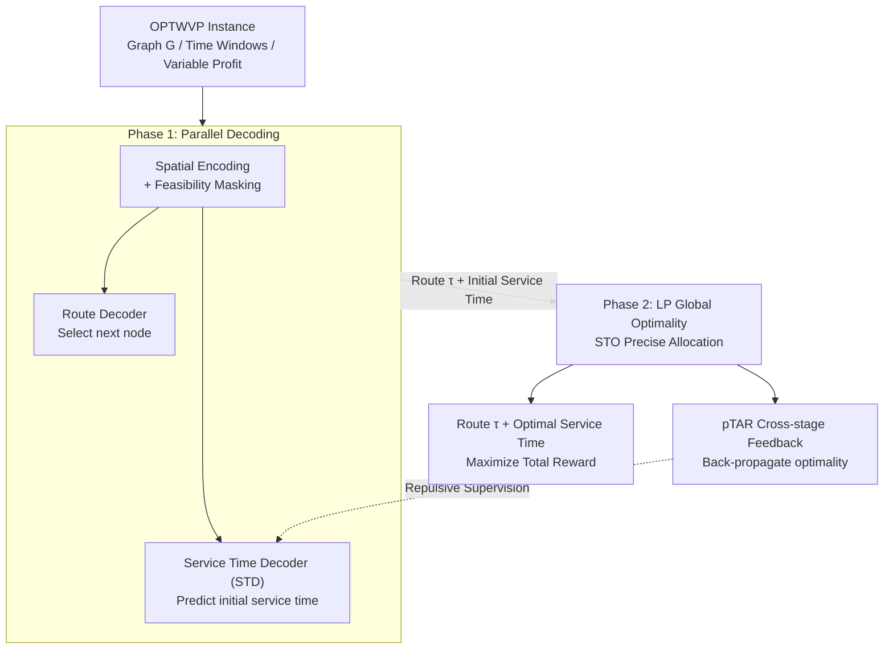

# Learning to Solve Orienteering Problem with Time Windows and Variable Profits

**Conference**: ICLR 2026  
**arXiv**: [2603.06260](https://arxiv.org/abs/2603.06260)  
**Code**: [GitHub](https://github.com/SwonGao/DeCoST)  
**Area**: Combinatorial Optimization / Vehicle Routing  
**Keywords**: Orienteering Problem, Time Windows, Variable Profits, Discrete-Continuous Decoupling, Linear Programming

## TL;DR

DeCoST is proposed as a two-stage learning framework that decouples coupled discrete routing decisions and continuous service time allocation in OPTWVP. The first stage employs a parallel decoder to jointly generate the path and initial service times, while the second stage precisely optimizes service times through Linear Programming (LP) to achieve global optimality. Cross-stage coordination is maintained via pTAR feedback. On 50-500 node OPTWVP instances, DeCoST achieves an optimality gap of only 0.83%-3.31%, with inference speeds up to 45 times faster than meta-heuristics.

## Background & Motivation

**Background**: The Orienteering Problem (OP) is a significant variant of the VRP where a subset of nodes must be selected for visitation within a fixed time budget to maximize total reward. In practical scenarios—such as factory scheduling, logistics, and robot planning—rewards often increase with service time (variable profit), and nodes are only accessible within specific time windows. This gives rise to OPTWVP, which requires simultaneous optimization of discrete routing and continuous service time allocation.

**Limitations of Prior Work**:

1.  **Discrete-Continuous Coupling**: Changes in the route reshape the feasible service time intervals for all nodes, which in turn influences reward and routing decisions. This bidirectional dependency causes the joint search space to expand exponentially.
2.  **Limitations of NCO Methods**: Existing Neural Combinatorial Optimization (NCO) methods typically handle only discrete route selection and lack the capability to allocate continuous variables like service time.
3.  **Myopia of Decomposition**: Simple decomposition results in first-stage routing decisions that fail to foresee optimal service times; subsequent local adjustments are insufficient to correct structural biases.
4.  **Scalability of Meta-heuristics**: Manually designed heuristic rules combined with exhaustive local search require re-solving continuous sub-problems for every route change, leading to high computational costs.

**Key Challenge**: Discrete routing and continuous service times are intrinsically interdependent, yet joint optimization is computationally intractable, and simple decoupling leads to myopic decision-making.

**Goal**: Intelligent decoupling with cross-stage coordination. The first stage perceives continuous variables (parallel decoding of route and time) $\to$ The second stage performs precise optimization (LP global optimality) $\to$ pTAR feedback allows the first stage to "foresee" second-stage consequences.

## Method

### Overall Architecture

DeCoST models OPTWVP as a Constrained Markov Decision Process (CMDP) and splits the originally coupled optimization into two stages. In the first stage, a parallel decoder outputs the discrete route and initial service times simultaneously. In the second stage, with the route fixed, Linear Programming is used to push continuous service time allocation to global optimality. A cross-stage feedback signal then back-propagates the second-stage optimal results to the first stage to avoid myopic routing decisions. Each action includes both the node selection and a normalized service time ratio $a_i = (v^{(i)}, d_{v^{(i)}}/d_{v^{(i)}\max})$. The overall objective is to maximize the expected total reward $\max_{\pi_\theta} J_r(\pi_\theta) = \mathbb{E}_{(\tau,\mathbf{d})\sim\pi_\theta}[R(\tau, \mathbf{d}|\mathcal{G})]$, where $R(\tau, \mathbf{d}|\mathcal{G}) = \sum_{i=1}^{l-1} p_{v^{(i)}} d_{v^{(i)}}$, subject to time budget, maximum service time, and time window constraints.

### Key Designs

**1. Phase 1: Parallel Decoding for Service-time-aware Routing**

Purely route-oriented constructive solvers cannot perceive the gains of subsequent service times when selecting nodes, leading to paths where time cannot be efficiently allocated. DeCoST employs two parallel decoders in the first stage: an attention-based Route Decoder selects the next node, while a Service Time Decoder (STD) synchronously predicts the corresponding initial service time. Consequently, routing decisions consider the impact of service time during generation. To enhance structural understanding, Spatial Encoding incorporates edge features (inter-node distances) as attention biases. Feasibility Masking dynamically filters candidates that violate constraints at each step—excluding nodes that would prevent a timely return to the start or nodes whose arrival time falls outside their specific time windows—ensuring legal paths and significantly compressing the search space.

**2. Phase 2: LP Global Optimality for Precise Allocation**

Once the route $\tau$ is fixed, the remaining continuous service time allocation task reduces to a Linear Programming problem: $\max_{\mathbf{s},\mathbf{d}} \mathbf{p}^T \mathbf{d}$, subject to $\mathbf{s}^- \leq \mathbf{s} \leq \mathbf{s}^+$, $\mathbf{0} \leq \mathbf{d} \leq \mathbf{d}_{\max}$, and $(I-U)\mathbf{s} + \mathbf{d} + \mathbf{t} \leq \mathbf{0}$. Instead of a general-purpose LP solver, the authors propose a Service Time Optimization (STO) algorithm using a greedy strategy: nodes are sorted by unit profit, maximum feasible service time is allocated sequentially, and subsequent start times are updated. It is mathematically proven that this greedy solution is the global optimum for this LP (Theorem 4.1). Since the process supports parallel computation, the second stage is both precise and fast—serving as the key component that reduces the gap from 23.0% to 2.28% in ablation studies.

**3. pTAR Cross-stage Feedback: Back-propagating Optimality**

The risk of decoupling is that the first stage might remain unaware of how the second stage reallocates time, leading to reasonable-looking but inefficient routes. To address this, the authors define the profit-weighted Time Allocation Ratio (pTAR) $pTAR(\mathbf{d}) = \sum_{i \in \tau} \frac{p_i d_i}{t_i}$ to evaluate the profit efficiency of a solution. It measures how much reward is returned per unit of travel cost. A repulsive supervision loss is added: $\mathcal{L}_{pTAR} = -(pTAR(\hat{\mathbf{d}}) - pTAR(\mathbf{d}^*))^2$, deliberately distancing the STD prediction $\hat{\mathbf{d}}$ from the conditional LP optimum $\mathbf{d}^*$ of a specific route. This is done because different routes have different conditional optima; forcing the STD to converge early to one would stifle exploration. The repulsive term encourages the first stage to "foresee" second-stage consequences and explore strategies broadly rather than simply copying a conditional optimum. The final training objective weights the REINFORCE loss and pTAR loss: $\mathcal{L}_{total} = \beta_1 \mathcal{L} + \beta_2 \mathcal{L}_{pTAR}$.

## Key Experimental Results

### Main Results: Performance Across OPTWVP Scales

| Method | Category | n=50, TW100 Score (Gap) | n=100, TW100 Score (Gap) | n=50, TW500 Score (Gap) |
| :--- | :--- | :--- | :--- | :--- |
| B&C (Gurobi) | Exact | 15.2 (0.00%) | 26.1 (0.00%) | 51.9 (0.00%) |
| Greedy-PRS | Heuristic | 12.9 (15.7%) | 21.9 (16.2%) | 46.1 (11.4%) |
| ILS | Meta-heuristic | 14.5 (4.34%) | 24.9 (4.2%) | 47.8 (7.82%) |
| POMO | NCO | 11.3 (25.3%) | 11.5 (55.7%) | 31.3 (39.6%) |
| GFACS | NCO | 12.3 (18.6%) | 25.2 (3.38%) | 47.4 (8.57%) |
| **Ours (DeCoST)** | **NCO** | **15.1 (1.06%)** | **25.6 (1.97%)** | **51.4 (0.83%)** |

DeCoST achieves the smallest optimality gap (0.83%-3.31%) across all settings, significantly outperforming other NCO and meta-heuristic methods. POMO performs worst (Gap up to 55.7%) as it does not handle service time allocation.

### Large-scale Experiments (n=500, TW=100)

| Method | Score | Gap | Runtime (ms) |
| :--- | :--- | :--- | :--- |
| B&C (Gurobi) | 82.3 | 0.00% | 68,400 |
| ILS | 78.2 | 4.98% | 8,803 |
| POMO | 58.6 | 28.8% | 747 |
| **Ours (DeCoST)** | **79.6** | **3.31%** | **1,329** |

At a scale of 500 nodes, DeCoST maintains a 3.31% gap, with inference speeds 6.6x faster than ILS and 51x faster than Gurobi.

### Ablation Study (n=50, TW=100)

| Config | SE | STO | SL | Score | Gap |
| :--- | :--- | :--- | :--- | :--- | :--- |
| Baseline (POMO) | ✗ | ✗ | ✗ | 11.3 | 25.3% |
| + Spatial Encoding | ✓ | ✗ | ✗ | 11.6 | 23.0% |
| + STO | ✓ | ✓ | ✗ | 14.9 | 2.28% |
| **DeCoST (Full)** | **✓** | **✓** | **✓** | **15.1** | **1.06%** |

STO is the most critical component, reducing the Gap from 23.0% to 2.28%; pTAR supervision further improves it to 1.06%.

## Highlights & Insights

-   **"Decoupled but Coordinated" Philosophy**: Rather than simply separating two optimization problems, DeCoST implements information exchange through pTAR feedback, achieving higher efficiency than joint optimization and better quality than independent optimization.
-   **Exploitation of LP Global Optimality**: The continuous part has an exact LP solution once the route is fixed. Identifying and proving this "fortunate" structure in OPTWVP is a key contribution.
-   **Impact on the NCO Field**: Most NCO research focuses on purely discrete problems; DeCoST is among the first to systematically address discrete-continuous hybrid optimization in NCO.
-   **STO as a Universal Plugin**: The second stage of DeCoST can be combined with different first-stage constructive solvers, consistently improving the solution quality of various baselines.

## Limitations & Future Work

-   LP global optimality depends on the linear profit function assumption (non-linear profits would require non-linear programming).
-   The gap for large-scale instances (n=500) remains at 3.31%, leaving room for improvement.
-   Hyperparameters for pTAR weighting ($\beta_1, \beta_2$) require manual tuning.

## Rating

-   Novelty: ⭐⭐⭐⭐ (Two-stage decoupling + LP optimality + pTAR feedback)
-   Experimental Thoroughness: ⭐⭐⭐⭐ (Multiple scales/time windows vs exact/heuristic/NCO)
-   Writing Quality: ⭐⭐⭐⭐ (Clear problem definition, mathematical rigor)
-   Value: ⭐⭐⭐⭐ (Directly applicable to combinatorial optimization with continuous variables)

<!-- RELATED:START -->

## Related Papers

- [\[ICLR 2026\] Deep Latent Variable Model based Vertical Federated Learning with Flexible Alignment and Labeling Scenarios](deep_latent_variable_model_based_vertical_federated_learning_with_flexible_align.md)
- [\[ICLR 2026\] LMask: Learn to Solve Constrained Routing Problems with Lazy Masking](lmask_learn_to_solve_constrained_routing_problems_with_lazy_masking.md)
- [\[ICML 2026\] On the Expressive Power of GNNs to Solve Linear SDPs](../../ICML2026/optimization/on_the_expressive_power_of_gnns_to_solve_linear_sdps.md)
- [\[ICML 2026\] Test time training enhances in-context learning of nonlinear functions](../../ICML2026/optimization/test_time_training_enhances_in-context_learning_of_nonlinear_functions.md)
- [\[ICLR 2026\] Exploring Diverse Generation Paths via Inference-time Stiefel Activation Steering](exploring_diverse_generation_paths_via_inference-time_stiefel_activation_steerin.md)

<!-- RELATED:END -->
