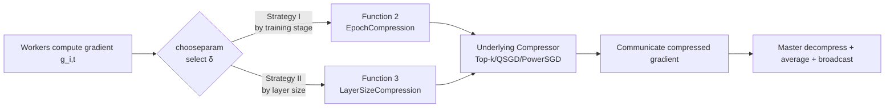

# LEGACY: A Lightweight Dynamic Gradient Compression Strategy for Distributed Deep Learning

**Conference**: ICLR 2026  
**OpenReview**: [https://openreview.net/forum?id=DsBYEO3B8O](https://openreview.net/forum?id=DsBYEO3B8O)  
**Code**: [https://github.com/LEGACY-compression/LEGACY](https://github.com/LEGACY-compression/LEGACY)  
**Area**: optimization / distributed training / gradient compression  
**Keywords**: gradient compression, communication bottleneck, Top-k sparsification, dynamic scheduler, distributed training, federated learning  

## TL;DR
Moving away from parameter-heavy or computationally intensive adaptive compressors, LEGACY utilizes two cost-free signals—"layer size" and "training stage"—to equip any compressor (Top-k, QSGD, PowerSGD, etc.) with a lightweight dynamic scheduler, significantly improving accuracy under the same communication volume.

## Background & Motivation
**Background**: In distributed training of large models, the communication overhead for exchanging gradients between nodes is a primary bottleneck. Various compression techniques such as quantization, sparsification, low-rank approximation, and hybrid methods have been proposed. Among these, Top-k sparsification stands out for its effectiveness, sending only a small fraction of the largest gradient elements (e.g., ResNet-50 on ImageNet can approach uncompressed accuracy by sending only 0.36%).

**Limitations of Prior Work**: Although Top-k has been established for nearly a decade, the industry lacks a clear "recipe" for choosing $k$. It typically sends a fixed amount of data each round, lacking adaptability. Hard-thresholding, while dynamically adjusting transmission volume and offering better convergence guarantees, shifts the problem to tuning the threshold $\lambda$. Furthermore, mainstream approaches employ uniform compression across all layers throughout the entire training process. Few existing works on adaptive compression (e.g., CAT, Accordion, L-Greco) rely on expensive gradient statistics or complex searches, making them difficult to deploy.

**Key Challenge**: The goal is to achieve a balance between aggressive compression (saving communication) and precision (preserving accuracy). While adaptive methods can theoretically achieve this, they often come at the cost of hard-to-tune hyperparameters or heavy runtime computation—defeating the purpose of "saving" resources through compression.

**Goal**: Guided by Occam’s Razor, the objective is to find a simple and efficient strategy to quickly select suitable compression parameters for each layer without relying on complex gradient statistics.

**Core Idea**: By plotting the compression rates of various layers in ResNet-18/NCF during training relative to iterations and layer size, two cost-free heuristics were identified: **(1) Sensitivity to compression is higher at the beginning of training and lower at the end; (2) Large layers possess more redundancy and can be compressed aggressively, while small layers are critical and require lighter compression.** Based on these two factors, a dynamic scheduler is designed to guide compression parameter selection without any online gradient statistics.

## Method

### Overall Architecture
LEGACY is not a new compressor but a **scheduler** wrapped around any $\delta$-compressor (where smaller $\delta$ indicates more aggressive compression). Given a set of compression levels from loose to tight $\{\delta_i\}_{i=1}^p$ and corresponding thresholds $\{\lambda_i\}_{i=1}^p$ (representing iteration counts or layer sizes), the scheduler uses a `chooseparam` function to dynamically pick the appropriate $\delta$ for each layer every round. This process is built upon the standard error-feedback-free communication flow (Algorithm 1), replacing only the parameter selection step, thus remaining transparent and non-intrusive to both optimizers and compressors.

### Key Designs
The authors substantiate empirical intuition through convergence analysis of compressed GD, resulting in two executable scheduling strategies and a simplified version.

**1. Convergence analysis for determining "when" and "where" to relax compression**: Under smooth and strongly convex assumptions, the iterative descent of compressed GD is $\mathbb{E}\|x_{t+1}-x^*\|^2 \le (1-2\mu\eta+\eta^2\mu L(2-\delta_t))\|x_t-x^*\|^2$. The gap compared to ideal uncompressed descent is $\Delta = \mu\eta^2 L(1-\delta_t)\|x_t-x^*\|^2$. This $\Delta$ is amplified by both $(1-\delta_t)$ and $\|x_t-x^*\|^2$. The conclusion is straightforward: in the early stages where $\|x_t-x^*\|^2 \gg 0$, $\delta_t \to 1$ (light or no compression) is necessary to control the error; in later stages where $\|x_t-x^*\|^2 \approx 0$, even $\delta_t \approx 0$ (aggressive compression) causes little harm. The PL non-convex case (Lemma 2) yields the same conclusion, turning the "training stage" heuristic into a theoretically grounded design principle.

**2. Strategy I (EpochCompression)**: This strategy gradually increases compression intensity as training progresses. Given thresholds $\{\lambda_i\}$ increasing with iterations/epochs, Function 2 returns $\delta_j$ corresponding to the "smallest threshold satisfying $t \le \lambda_i$." This starts with the loosest level and switches to more aggressive levels over time, aligning with the "initial fidelity, end-stage compression" analysis.

**3. Strategy II (LayerSizeCompression)**: A core observation is that a few large layers dominate communication volume—empirical tests show that the largest 20% of layers account for roughly 90% of the parameter volume, while the remaining 80% of layers account for only 10%. Large layers are over-parameterized and redundant, tolerating aggressive compression. Small layers, while contributing little to communication, carry gradients critical for stable convergence. Function 3 selects $\delta$ based on layer size $|L|$: small layers $\delta_s \approx 1$ (nearly no compression), and large layers $\delta_l \approx \delta$ (aggressive compression). The "bandwidth redistribution" is the key insight: fine-tuning a large layer from $k=10\%$ to $k=9.95\%$ is nearly imperceptible in volume and accuracy for that layer, but the saved budget allows small layers to jump from 10% to 50% or no compression, significantly improving gradient fidelity and stability for the same total communication volume.

**4. S-LEGACY and Combinations**: To further reduce tuning burden, the authors propose Simple-LEGACY (S-LEGACY) and demonstrate that the two strategies can be combined (scheduled by both stage and size), allowing the framework to be used individually or stacked.

## Key Experimental Results

### Main Results (Accuracy Comparison under Equal Communication Volume)

| Setup | Baseline (uniform Top-0.1%) | LEGACY Dynamic Strategy | Gain |
|---|---|---|---|
| ResNet-50 @ ImageNet-1K (Top-1 Acc) | — | +7 ~ +11% | Significant |
| Transformer-XL @ WikiText-103 (Perplexity, Layer Strat) | — | ~26% Relative Reduction | Significant |
| ResNet-18 @ CIFAR-100 (Motivation Exp, Top-1) | Top-k 73.04% / Threshold 73.32% | Close to uncompressed 73.38% | — |
| NCF @ MovieLens-20M (HR@10) | Top-k 91.33% / Threshold 92.7% | Close to uncompressed 95.59% | — |

### Ablation Study

| Dimension | Content |
|---|---|
| Architectures | 7 types: AlexNet / ResNet-9/18/50 / Transformer-XL / NCF / GPT-2 |
| Datasets | 6 types: CIFAR-10/100, ImageNet-1K, WikiText-103, OpenWebText, MovieLens-20M |
| Compressors | Applicable to Top-k, Random-k (sparse), QSGD (quantization), PowerSGD (low-rank) |
| Adaptive SOTA Comparison | 5 types: CAT, Variance-based, Accordion, AdaComp, L-Greco |
| Extreme Scenarios | Resource-constrained (compute/bandwidth), Federated Learning, 100 CPU worker scale |

### Key Findings
- Under the same communication budget, both the "layer strategy" (compressing large layers, releasing small ones) and the "stage strategy" (loose to tight) consistently outperform uniform Top-k. The layer strategy gain is particularly evident in perplexity tasks (~26%).
- LEGACY scales to 100-worker configurations while maintaining strong accuracy under aggressive compression, proving its lightweight scheduling introduces negligible runtime overhead.
- Accuracy rivals or matches adaptive methods that depend on expensive statistics, without requiring any online gradient metrics.

## Highlights & Insights
- **Theoretical Grounding of Empirical Observations**: The two scheduling rules (stage and size) derived from the amplification factors $(1-\delta_t)$ and $\|x_t-x^*\|^2$ in $\Delta$ create a compelling logical loop.
- **Zero-cost Signals**: Layer size is statically known and training stage is a simple counter; neither requires gradient statistics, which is the cornerstone of its "lightweight" nature.
- **Agnostic Design**: As an external scheduler, it can be combined with any $\delta$-compressor and any optimizer, making it highly deployment-friendly.
- **Bandwidth Redistribution Perspective**: Stealing a negligible amount of budget from large layers to supply small layers provides a high-value "free lunch."

## Limitations & Future Work
- Users must pre-define the compression levels $\{\delta_i\}$ and thresholds $\{\lambda_i\}$. While easier to tune than fully adaptive methods, these remain manual priors with uncertain cross-task transferability.
- The theoretical analysis is based on GD under strong convex/PL assumptions, leaving a gap between theory and real-world SGD training for large models; stage switching points remain empirical.
- Primarily designed under the error-feedback-free (EF-free) framework, the synergy with error-feedback methods is not fully explored.
- Using layer size as a proxy for redundancy is coarse and does not account for functional or sensitivity differences between layers (e.g., LayerNorm vs. embedding layers).

## Related Work & Insights
- **Gradient Compression Taxonomy**: Quantization (QSGD, signSGD), Sparsification (Top-k, Random-k, thresholding), Low-rank (PowerSGD), and Hybrid methods. LEGACY operates as a scheduler on top of all these.
- **Adaptive Compression Competitors**: Methods like CAT, Accordion, and L-Greco often rely on gradient statistics. LEGACY replaces their computational cost with "free signals," embodying a pragmatic "good enough" philosophy.
- **Critical Training Phases**: Findings by Achille (2019), Agarwal (2021), and Zhang (2022) regarding "critical periods" in DNN training provide collateral evidence for the stage sensitivity in Strategy I.
- **Insight**: When adaptive methods become too heavy, reconsidering whether "statically available structural signals" can replace expensive online computation is a valuable Occam's Razor approach applicable to other systems needing online tuning (e.g., learning rate scheduling, pruning, mixed precision).

## Rating
- **Novelty**: ⭐⭐⭐⭐ — Not a new compressor but a new scheduling perspective using two free signals instead of expensive statistics, backed by convergence analysis. Practical and novel.
- **Experimental Thoroughness**: ⭐⭐⭐⭐⭐ — 7 models × 6 datasets × 4 compressors, compared against 5 SOTA adaptive methods across distributed, federated, and 100-worker scenarios. Very solid.
- **Writing Quality**: ⭐⭐⭐⭐ — The chain of reasoning from motivation to theory to scheduling functions is clear and well-argued, though the main text relies somewhat on the appendix.
- **Value**: ⭐⭐⭐⭐ — Plug-and-play with zero extra overhead and transparency to existing compressors/optimizers makes it directly valuable for large-scale distributed training deployments.

<!-- RELATED:START -->

## Related Papers

- [\[ICLR 2026\] DeepAFL: Deep Analytic Federated Learning](deepafl_deep_analytic_federated_learning.md)
- [\[ICLR 2026\] Enhancing Communication Compression via Discrepancy-aware Calibration for Federated Learning](enhancing_communication_compression_via_discrepancy-aware_calibration_for_federa.md)
- [\[CVPR 2026\] Dynamic Momentum Recalibration in Online Gradient Learning](../../CVPR2026/optimization/dynamic_momentum_recalibration_in_online_gradient_learning.md)
- [\[ICLR 2026\] Proving the Limited Scalability of Centralized Distributed Optimization via a New Lower Bound Construction](proving_the_limited_scalability_of_centralized_distributed_optimization_via_a_ne.md)
- [\[ICLR 2026\] Towards Dynamic Interleaving Optimizers](towards_dynamic_interleaving_optimizers.md)

<!-- RELATED:END -->
