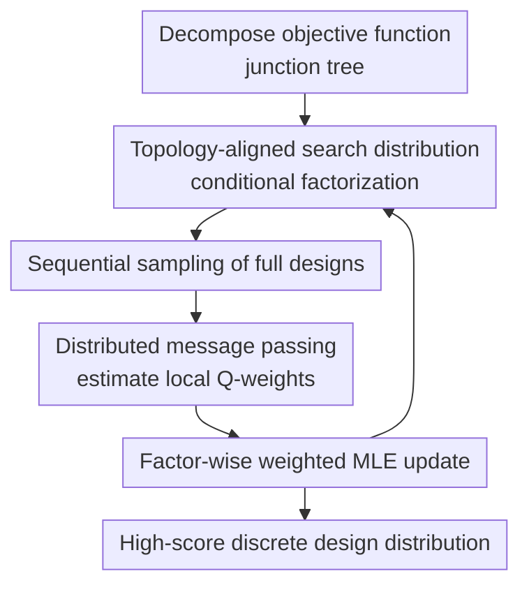

# Leveraging Discrete Function Decomposability for Scientific Design

**Conference**: ICLR2026  
**OpenReview**: [https://openreview.net/forum?id=lndDn7i8W6](https://openreview.net/forum?id=lndDn7i8W6)  
**Code**: https://github.com/james-bowden/DADO  
**Area**: Discrete Optimization / Scientific Design  
**Keywords**: Discrete design, distributional optimization, function decomposition, junction tree, protein design  

## TL;DR
DADO explicitly incorporates the decomposable structure of discrete objective functions in scientific design into the distributional optimization process. By using message passing on a junction tree to provide coordinated weights for each local generative factor, it identifies high-scoring designs in massive discrete search spaces more efficiently than standard Estimation of Distribution Algorithms (EDA).

## Background & Motivation
**Background**: AI-driven scientific design typically involves a given property predictor $f(x)$ and the training of a search distribution or generative model $p_\theta(x)$ biased toward sampling discrete objects with high property scores. Here, $x$ can represent protein sequences, circuit configurations, material combinations, or optical system parameters. The optimization target is not a continuous vector but a combinatorial space of length $L$ with $D$ possible values at each position.

**Limitations of Prior Work**: Directly enumerating all designs is infeasible, as the complexity is $D^L$ (e.g., $20^L$ for protein sequences). Existing EDA or policy optimization methods treat the entire design $x$ as a single sample, weighting it by a global score $f(x)$ to update a joint search distribution. While avoiding enumeration, this approach fails to exploit the internal structure of the objective function. If only a small subset of variables actually interact, joint updates still learn all positions together, causing sample efficiency to collapse in high-dimensional combinatorial spaces.

**Key Challenge**: Many scientific objective functions are not entirely black-box. In proteins, specific active sites may determine catalysis or binding, while other positions primarily stabilize the structure. Circuit and telescope designs often exhibit local interactions induced by topology or physical connections. In other words, $f(x)$ can often be decomposed into a sum of local functions, yet distributional optimization algorithms typically see only a global score, failing to translate "local decomposability" into "local learnability."

**Goal**: Ours aims to address the following: given a known or constructible decomposition of a discrete objective function, how can a search distribution be trained to output a distribution of high-scoring designs (like an EDA) while leveraging local structure to reduce effective search dimensions (like classical graphical model message passing)?

**Key Insight**: The paper observes that classical max-plus message passing can precisely solve for the global optimal design of decomposable functions on a junction tree via dynamic programming. Conversely, distributional optimization in EDA essentially uses weighted maximum likelihood to shift a search distribution. The key entry point of DADO is to merge these concepts: instead of using a global $f(x)$ to weight the entire sample, it first calculates distributed value/$Q$ functions on a junction tree that each local factor needs to observe, then updates the corresponding conditional search distributions separately.

**Core Idea**: Use junction-tree message passing to generate local, coordinated $Q$-weights to replace global sample weights in standard EDA, enabling a decomposition-aware factorized search distribution to optimize more efficiently in discrete scientific design spaces.

## Method

### Overall Architecture
The input to DADO is not an unstructured black-box target but a decomposable discrete objective function. The paper represents it as a sum of node and edge functions on a junction tree $T=(N,E)$: $f(x)=\sum_{i\in N} f_i(\tilde{x}_i)+\sum_{(i,j)\in E} f_{i,j}(\tilde{x}_i,\tilde{x}_j)$, where each $\tilde{x}_i$ is a subset of the original design variables.

The algorithm first roots and orients the undirected junction tree; the search distribution is then factorized according to this tree structure: $p_\theta(x)=p_\theta(\tilde{x}_r)\prod_{(p(i),i)\in E'}p_\theta(\tilde{x}_i|\tilde{x}_{p(i)})$. In each iteration, DADO samples full designs from this distribution, estimates distributed value/$Q$ functions via bottom-up message passing, and updates each search distribution factor using its specific $Q$-weight.

Compared to standard EDA, DADO's loop remains "sample, score, update," but the "scoring" step shifts from a global sample weight to a set of local weights on the junction tree. Thus, while all factors are updated using the same batch of samples, each only learns its respective low-dimensional subproblem, with descendant impacts propagated back via message passing.

### Key Designs
**1. Explicitly capturing scientific objective decomposability with junction trees**

The first step is requiring the structure of the objective function to be explicit rather than inventing a new black-box generative model. If direct interactions between design variables can be represented as a graph, the authors convert it into a junction tree. Each tree node contains a subset of variables, and adjacent nodes may share variables, allowing the objective to be split into node and edge components. This representation is more general than "independent subproblems," as scientific designs often involve local subsystems sharing few variables.

This approach transforms the question of "which variables to consider together" into a topological constraint that the algorithm can exploit. For proteins, the authors construct a junction tree using the residue contact graph predicted by AlphaFold3 and train a property predictor adhering to this decomposition. Consequently, each component of $f(x)$ only evaluates local residue subsets or interactions between adjacent subsets. Even if this decomposition is an approximation of physical laws, it provides sufficient structure for distributional optimization if predictive accuracy is maintained.

**2. Factorizing the search distribution based on the same tree instead of joint learning**

Standard EDA uses a joint search distribution $p_\theta(x)$ covering all variables. With a fixed sample size $K$, each update must estimate the shift of the entire distribution from high-dimensional samples. DADO chooses to have the search distribution mimic the objective's junction tree: a root factor $p_\theta(\tilde{x}_r)$ and non-root factors $p_\theta(\tilde{x}_i|\tilde{x}_{p(i)})$. Sampling begins at the root and proceeds down the tree conditionally, still yielding a complete design $x$.

This factorization is not a simple independent split. Since adjacent nodes share or couple variables, the quality of a child node affects the parent's choices, and the parent's values change the child's local space. DADO maintains conditional dependencies, ensuring each local model handles lower dimensions without severing coordination across components. The paper uses FDA as a baseline to show that factorizing the search distribution alone is insufficient without the appropriate weights from message passing.

**3. Using distributed value / Q functions to transform global objectives into local weighted updates**

Classical max-plus message passing computes $V_i^{\max}(\tilde{x}_{p(i)})=\max_{\tilde{x}_i} Q_i^{\max}(\tilde{x}_i,\tilde{x}_{p(i)})$, aggregating optimal subtree values from leaves to root, then backtracking for the global optimum. However, DADO aims to train the distribution $p_\theta(x)$ rather than directly outputting an argmax. Enumerating max values for each local variable would lead back to combinatorial explosion.

The authors replace "max" with expectations under the search distribution, defining distributed value functions: $V_i^\theta(\tilde{x}_{p(i)})=\mathbb{E}_{p_\theta(\tilde{x}_i|\tilde{x}_{p(i)})}[Q_i^\theta(\tilde{x}_i,\tilde{x}_{p(i)})]$. The corresponding $Q_i^\theta$ includes the current node function, the edge function with the parent, and contributions from all child values. Intuitively, each node receives not just its "local segment score" but the "expected gain for the entire subtree when choosing this local segment under the current search distribution."

This $Q$ serves as the weighted MLE weight for the node's search factor. The root updates $\sum_k W(Q_r(\tilde{x}_r^k))\log p_\theta(\tilde{x}_r^k)$, while non-root nodes update $\sum_k W(Q_i(\tilde{x}_i^k,\tilde{x}_{p(i)}^k))\log p_\theta(\tilde{x}_i^k|\tilde{x}_{p(i)}^k)$. Although factors update seemingly independently, their weights incorporate descendant information via message passing, ensuring local updates serve the global objective.

**4. Maintaining scalable EDA cycles via Monte Carlo estimation and weight shaping**

DADO retains the engineering framework of EDA: sample $K$ designs per round, estimate weights, and perform fixed-step weighted MLE updates. The difference is that expectations in the value functions are approximated using the same batch of samples rather than enumerating all possible values of $\tilde{x}_i$. This allows the algorithm to handle discrete spaces like proteins where $D=20$ and lengths reach hundreds.

In implementation, the authors use a weight shaping function $W(s)=\exp(s/\beta)$ to control optimization dynamics and apply mean-shifting to $Q$ to reduce variance. The paper emphasizes that one should not perform too many gradient steps on the same batch of $Q$ values per round, as $Q$ is only valid near the current $\theta_n$. If search distribution factors change drastically while others rely on old coordination, messages become distorted. The experiments use $G=1$ gradient step per round to maintain a stable "sample-message-update" rhythm.

### Loss & Training
The training objective of DADO can be viewed as decomposed weighted maximum likelihood. Given samples from the $n$-th iteration of the search distribution, the algorithm estimates all $Q_i^{\theta_n}$ using current parameters $\theta_n$ and updates each factor's parameters:

$$
\theta_{r}^{n+1}=\arg\max_{\theta_r}\sum_{k=1}^{K} W(Q_r(\tilde{x}_r^k))\log p_{\theta_r}(\tilde{x}_r^k),
$$

$$
\theta_i^{n+1}=\arg\max_{\theta_i}\sum_{k=1}^{K} W(Q_i(\tilde{x}_i^k,\tilde{x}_{p(i)}^k))\log p_{\theta_i}(\tilde{x}_i^k|\tilde{x}_{p(i)}^k).
$$

Search distribution factors are parameterized using MLP-based autoregressive networks. DADO and FDA use conditional factors decomposed via the junction tree, while standard EDA and PPO use joint autoregressive models unaware of the decomposition. The optimizer is AdamW. In main experiments, the number of EDA iterations is $N=100$, with gradient steps $G=1$ per iteration. Synthetic experiments sample $K=100$ per round, while protein experiments sample $K=1000$. Learning rates and the temperature $\beta$ are tuned per method and objective.

## Key Experimental Results

### Main Results
Two types of experiments were conducted: controllable synthetic discrete functions to verify sample efficiency gains as dimensions increase, and decomposed property predictors trained on real protein data to test the transferability of these advantages to scientific design.

| Experimental Setup | Design Space | Baselines | Main Conclusion | Explanation |
|--------------------|--------------|-----------|-----------------|-------------|
| Synthetic Tree, $L=25, D=20$ | $20^{25}$ | EDA / FDA / PPO / DADO | DADO is faster initially; baselines catch up by round 100. | In low dimensions, standard EDA can compensate for structure lack via iterations. |
| Synthetic Tree, $L=50, D=20$ | $20^{50}$ | EDA / FDA / PPO / DADO | DADO significantly outperforms the strongest baseline. | Sample efficiency of joint distributions fails as dimensionality increases. |
| Synthetic Tree, $L=200, D=20$ | $20^{200}$ | EDA / FDA / PPO / DADO | Gap between DADO and baselines widens further. | Decomposed local subproblems grow much slower than the full combinatorial space. |
| Synthetic Tree, $L=400, D=20$ | $20^{400}$ | EDA / DADO | DADO maintains a superior optimization curve. | Trends scale to very large discrete spaces. |

| Protein Predictor | Length / Alphabet | Samples/Round | DADO Performance | Remarks |
|-------------------|-------------------|---------------|------------------|---------|
| AAV2 capsid | $L=28, D=20$ | $K=1000$ | Outperforms decomposition-unaware baselines | Small JC nodes; decomposition is highly beneficial. |
| Amyloid-beta | $L=42, D=21$ | $K=1000$ | Final mean CI does not overlap with best baseline | Double-mutation data; local interaction assumption is natural. |
| Gcn4 | $L=44, D=20$ | $K=1000$ | DADO converges to higher predicted scores | Robust even with smaller datasets. |
| TDP-43 | $L=84, D=21$ | $K=1000$ | DADO significantly better than baselines | Decomposition value increases with length. |

### Ablation Study
The ablation analysis separates the effects of factorizing the search distribution, using message-passing weights, and graph accuracy. FDA uses the same factorization as DADO but lacks local $Q$ messages. PPO stabilizes standard EDA updates but ignores any junction tree decomposition.

| Config / Analysis | Key Metric | Description |
|-------------------|------------|-------------|
| EDA | Final avg $f(x)$ | Decomposition-unaware; uses global $f(x)$ to update joint distribution; tends to plateau as $L$ increases. |
| FDA | Final avg $f(x)$ | Uses factorized search distribution without message passing; shows factorization helps but isn't the complete solution. |
| PPO | Final avg $f(x)$ | Stabilizes updates via clipped objective but lacks internal coordination on junction trees. |
| DADO | Final avg $f(x)$ / AUC | Combines factorized distribution and local $Q$-weights; best in most synthetic and protein tasks. |
| GB1 contact threshold | Holdout Pearson + Curve | Threshold $t=2.75\text{A}$ preserves signals while reducing complexity, maximizing DADO's edge. |
| Random edge +/- | Holdout Pearson | Predictor accuracy is robust to mild graph perturbations, suggesting perfect prior decomposition isn't mandatory. |

### Key Findings
- DADO's advantage becomes more pronounced as the design space grows. Standard EDA can keep up at $L=25$, but at $L \ge 50$, the sample efficiency of decomposition-aware updates dominates.
- The FDA contrast shows that a factorized search distribution is necessary but not sufficient; local updates require coordination via message passing to account for subtree gains.
- In protein experiments, DADO's superiority is clearest when junction tree nodes are small (AAV, Amyloid, Gcn4, TDP-43). When nodes are larger (GB1, ynzC), variance in $Q$ estimation increases, dampening relative gains.
- The decomposition graph does not need to be perfectly accurate. Varying AlphaFold3 contact thresholds or perturbing edges resulted in holdout Pearson scores within a narrow range, supporting the claim that "approximately useful structures" are enough for DADO.

## Highlights & Insights
- DADO's primary innovation is treating decomposition as a mechanism for "assigning different training weights to different search distribution factors" rather than just model compression. This is more powerful than simple splits because each local signal includes the downstream influence on the global goal.
- Transforming classical message passing from "finding a single point" to "training a distribution of high-scoring designs" is highly insightful. Scientific design often requires a batch of diverse, high-scoring, and experimentally verifiable candidates; distributional optimization accommodates priors, entropy regularizers, or conservative models naturally.
- Using AlphaFold3 contact graphs for protein predictors is a practical choice that doesn't over-promise. The authors show that as long as the decomposition doesn't destroy predictive power, it provides optimization gains, regardless of whether it captures "perfect" biological mechanisms.
- The framework is transferable: circuit design can use wiring topologies, material design can use physical coupling, and combinatorial chemical libraries can use scaffold/substituent structures to define decomposable functions.

## Limitations & Future Work
- DADO depends on an available function decomposition. While protein contact graphs are shown to work, obtaining accurate yet sparse decompositions in fields like circuits or drug discovery remains a challenge.
- Current experiments focus on "optimizing a given predictor" and do not address predictor unreliability in the far regions of design space. In practice, DADO might push distributions into OOD regions, necessitating integration with conservative objectives, priors, active learning, or Bayesian optimization.
- The $Q$ estimation via Monte Carlo relies on sample batches. For large junction tree nodes or complex subtrees, local value variance increases (as hinted by GB1 results). Future work could explore variance reduction techniques.
- For clarity, entropy regularization and pre-trained unconditional models were largely omitted. Combining DADO with CAs, diffusion fine-tuning, or maximum-entropy objectives is a natural next step for maintaining diversity and biological relevance.

## Related Work & Insights
- **vs. Standard EDA**: While EDA weights the entire sample by $f(x)$, DADO splits weights into local $Q$ functions on a junction tree, providing each factor with a more relevant, lower-dimensional learning signal.
- **vs. FDA**: FDA uses factorized distributions but lacks the message passing to generate differentiated weights for those factors; DADO's strength lies in coupling factorization with global coordination.
- **vs. PPO / Policy Optimization**: PPO stabilizes updates but doesn't solve local cooperation under junction tree decompositions. DADO extends weighted regression ideas from policy optimization to structured discrete design.
- **vs. Additive Bayesian Optimization**: High-dimensional BO leverages additive decomposition but usually optimizes acquisitions or surrogates rather than directly training a design distribution. DADO could serve as an inner-loop optimizer for BO acquisitions.
- **vs. Protein Epistasis Modeling**: While epistasis research focuses on estimating the functional landscape, DADO uses such structures as input for the optimizer. Combining the two could lead from landscape estimation to more efficient sequence design.

## Rating
- Novelty: ⭐⭐⭐⭐⭐ Seamlessly integrates junction tree message passing with EDA-style distributional optimization, filling a gap in structural information usage in scientific optimizers.
- Experimental Thoroughness: ⭐⭐⭐⭐ Covers synthetic trees, real proteins, robustness, and runtime, though lacks wet-lab validation or end-to-end comparisons with modern conservative design pipelines.
- Writing Quality: ⭐⭐⭐⭐ Clear progression from simple examples to general junction trees; high notation density might be challenging for readers unfamiliar with graphical models.
- Value: ⭐⭐⭐⭐⭐ Highly insightful for discrete scientific design, particularly as an optimization core for proteins, materials, and circuits with known local interaction structures.

<!-- RELATED:START -->

## Related Papers

- [\[ICLR 2026\] Activation Function Design Sustains Plasticity in Continual Learning](activation_function_design_sustains_plasticity_in_continual_learning.md)
- [\[ICLR 2026\] Unleashing LLMs in Bayesian Optimization: Preference-Guided Framework for Scientific Discovery](unleashing_llms_in_bayesian_optimization_preference-guided_framework_for_scienti.md)
- [\[ICLR 2026\] Submodular Function Minimization with Dueling Oracle](submodular_function_minimization_with_dueling_oracle.md)
- [\[ICLR 2026\] DiffBED: Scaling Bayesian Experimental Design to High-Dimensions](diffbed_scaling_bayesian_experimental_design_to_high-dimensions.md)
- [\[ICLR 2026\] Towards Better Branching Policies: Leveraging the Sequential Nature of Branch-and-Bound Tree](towards_better_branching_policies_leveraging_the_sequential_nature_of_branch-and.md)

<!-- RELATED:END -->
