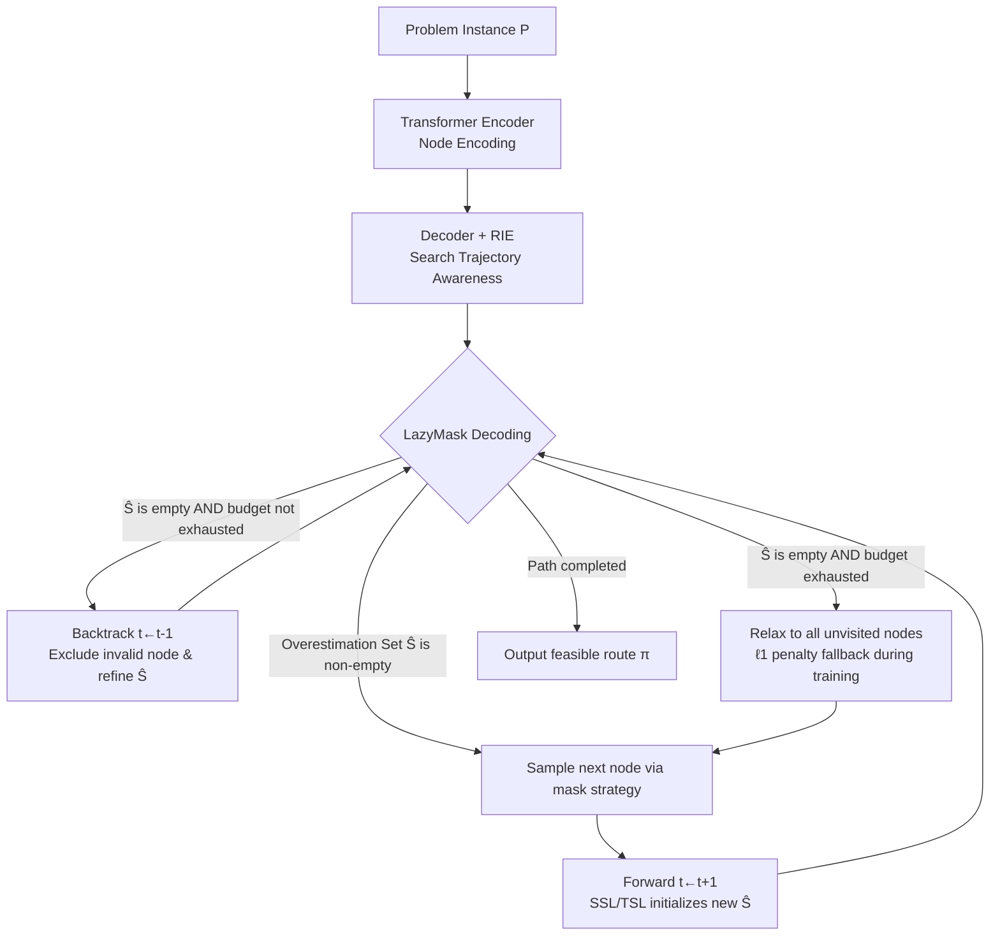

# LMask: Learn to Solve Constrained Routing Problems with Lazy Masking

**Conference**: ICLR 2026  
**OpenReview**: [https://openreview.net/forum?id=zsNUc2iMzp](https://openreview.net/forum?id=zsNUc2iMzp)  
**Code**: [https://github.com/optsuite/LMask](https://github.com/optsuite/LMask)  
**Area**: optimization  
**Keywords**: Neural Combinatorial Optimization, Constrained Routing, TSPTW, TSPDL, Feasibility Mask, Backtracking Decoding  

## TL;DR
LMask transforms the "one-pass forward, no-look-back" construction paradigm of neural routing solvers into a forward-and-backtracking lazy masking decoding. Combined with search trajectory embeddings and soft constraint penalties during training, it reduces the infeasibility rate to near 0% on constrained TSP (Time Windows/Draft Limits) while achieving superior solutions.

## Background & Motivation
**Background**: Routing problems (TSP/VRP and their variants) are core to combinatorial optimization. Neural constructive solvers (Pointer Network, AM, POMO, etc.) use Transformers to autoregressively assemble paths, utilizing "masking" to block actions that violate constraints. This paradigm works well for standard routing without complex constraints: at each step, the remaining tail subproblem is similar to the original, ensuring future feasibility is always reachable.

**Limitations of Prior Work**: Once complex hard constraints are introduced (TSPTW with time windows, TSPDL with draft limits), "masking immediate violations" is insufficient—a node may appear legal now but inevitably lead to a dead end later. Determining if an action is truly feasible theoretically requires looking ahead until the entire path is completed, which is computationally prohibitive. **Key Challenge**: Existing methods are one-pass and irreversible, with decisions based only on the current partial path. To compensate for this rigidity, methods like PIP rely on multi-step lookahead to predict future infeasibility, but deeper lookahead becomes increasingly expensive and cannot guarantee finding a feasible solution. More fundamentally, the masking mechanism itself lacks a systematic mathematical explanation and remains an engineering trick.

**Goal**: Establish a theoretically grounded, end-to-end learnable constructive framework effective for general complex constraints that ensures the generation of feasible solutions while approaching optimality.

**Core Idea**: ① **Reinterpreting routing from a probability approximation perspective**—framing the search for optimal solutions as approximating a family of constrained Gibbs distributions, from which the optimal mask set $S(\pi_{1:t})$ (potential set) is naturally derived. ② **LazyMask backtracking decoding**—instead of calculating precise masks in one step, a lightweight lookahead provides an overestimation set $\hat S$; when a dead end is reached, the model backtracks and incrementally refines the mask. ③ **Search trajectory embedding + training soft constraint penalty**—allowing the model to "know" whether it is moving forward or correcting errors, and using $\ell_1$ penalties to safeguard feasibility when the backtracking budget is exhausted.

## Method

### Overall Architecture
LMask introduces three modifications to the standard Transformer encoder-decoder framework: it replaces one-pass masking with the **LazyMask** algorithm to allow alternating forward and backtracking moves; it injects **Refinement Intensity Embedding (RIE)** into the decoder input to eliminate state ambiguity caused by backtracking; and it optimizes via policy gradient with a hybrid "hard constraint (backtracking) + soft constraint ($\ell_1$ penalty)" objective. Theoretically, LazyMask provides double guarantees of feasibility and probabilistic approximation of the optimum.

### Key Designs

**1. Probability Approximation and Potential-set Masking: Providing a mathematical identity for masks.** The paper formalizes the search for the optimal solution as approximating a target distribution $q^*$, using a constrained Gibbs distribution $q_\lambda(\pi;P)\propto\exp(-(f(\pi;P)-f^*)/\lambda)\mathbf 1_C(\pi)$. As the temperature $\lambda\to0$, $q_\lambda$ converges to a point mass on the optimal solution. Fitting a parameterized autoregressive policy $p_\theta(\pi)=\prod_t p_\theta(\pi_{t+1}\mid\pi_{1:t})$ to $q_\lambda$ by minimizing KL divergence yields the training loss $L(\theta;P)=\mathbb E_{p_\theta}[f(\pi;P)]+\lambda\,\mathbb E_{p_\theta}[\log p_\theta(\pi;P)]$. Under this framework, the mask is precisely defined by the potential set $S(\pi_{1:t}):=\{\pi_{t+1}:\exists\,\pi_{t+1:T},[\pi_{1:t},\pi_{t+1:T}]\in C\}$—only nodes for which a feasible completion exists are allowed.

**2. LazyMask Backtracking Decoding: Approximating precise masks via "overestimation + backtracking."** Since computing the exact $S(\pi_{1:t})$ is intractable, LazyMask maintains an **overestimation set** $\hat S(\pi_{1:t})\supseteq S(\pi_{1:t})$ of candidates not yet proven invalid. If $\hat S$ is non-empty, the model samples and moves forward. If $\hat S$ becomes empty (indicating a dead end) and the backtracking budget $r\le R$ is not exhausted, the model **backtracks one step** and prunes the offending node $\pi_t$ from the previous layer's $\hat S(\pi_{1:t-1})$. The paper proves (Prop. 4.1) that with $R=+\infty$, LazyMask always generates a feasible solution if one exists and assigns non-zero probability to all feasible solutions.

**3. Refinement Intensity Embedding (RIE): Eliminating state ambiguity from backtracking.** Traditional autoregressive features assume unidirectional progress. With backtracking, a partial path could result from either normal forward construction or a corrective retreat. RIE feeds search trajectory information to the decoder: **Local features** track how many times $c_t$ the current $\hat S(\pi_{1:t})$ has been refined, encoded as a one-hot vector. **Global features** use a 2D one-hot marker to indicate if the total backtracking count has reached the budget $R$. Ablations show RIE reduces the optimality gap from 2.31% to 1.68% and the infeasibility rate from 0.14% to 0.05% on medium TSPTW-50.

**4. Hybrid Hard-Soft Constraint Training.** During training, a smaller backtracking budget $R$ is used for efficiency. When the budget is exhausted, $\hat S$ is relaxed to all unvisited nodes, potentially leading to infeasible solutions. To guide $p_\theta$ back to the feasible region, the objective includes an $\ell_1$ penalty function $\Psi_\rho(\pi;P)=f(\pi;P)+\rho\sum_{j=1}^J\max(c_j(\pi;P),0)$, penalizing violations of complex constraints (time windows/draft limits). This design innovatively combines hard constraints (forced feasibility during backtracking) and soft constraints (elastic penalties after budget exhaustion) into a single pipeline.

## Key Experimental Results

### Main Results
Synthetic TSPTW (greedy + 8× symmetric augmentation, gap relative to PyVRP):

| Dataset | Method | Sol. Infeasible | Ins. Infeasible | Gap | Time |
|---|---|---|---|---|---|
| Easy n=100 | PIP | 0.16% | 0.00% | 3.78% | 29s |
| | PIP-D | 0.05% | 0.00% | 4.62% | 31s |
| | **Ours (LMask)** | **0.01%** | **0.00%** | **3.11%** | **17s** |
| Medium n=100 | PIP | 4.35% | 0.39% | 4.79% | 29s |
| | PIP-D | 3.46% | 0.03% | 5.76% | 31s |
| | **Ours (LMask)** | **0.05%** | **0.00%** | **4.23%** | 18s |
| Hard n=100 | PIP | 31.74% | 16.68% | 0.37% | 28s |
| | PIP-D | 13.59% | 6.60% | 0.32% | 31s |
| | **Ours (LMask)** | **0.00%** | **0.00%** | **0.21%** | 18s |

Synthetic TSPDL (gap relative to LKH3):

| Dataset | Method | Sol. Infeasible | Ins. Infeasible | Gap |
|---|---|---|---|---|
| Hard n=100 | PIP | 29.34% | 21.65% | 12.87% |
| | PIP-D | 13.51% | 8.43% | 12.53% |
| | **Ours (LMask)** | **0.80%** | **0.26%** | **4.34%** |

On Hard difficulty, the contrast is stark: while PIP/PIP-D still show 13%–32% infeasibility on TSPTW-100, LMask achieves 0.00%. On TSPDL-100, LMask reduces the gap from roughly 12% to 4.34%.

### Ablation Study

| Ablation Component | Setting | Gap | Sol. Infeasible |
|---|---|---|---|
| RIE (medium TSPTW-50) | With RIE | 1.68% | 0.05% |
| | Without RIE | 2.31% | 0.14% |
| Entropy Coeff λ (easy TSPTW-100) | λ=0 | 3.67% | — |
| | λ=0.01 (Best) | 3.11% | — |
| | λ=0.05 | 7.38% | — |

### Key Findings
- **Backtracking Budget R**: Inference time grows roughly linearly with $R$ (approx. +2s per 100 budget), but the infeasibility rate drops sharply even with a small $R$.
- **Backtracking vs. Lookahead**: LMask with TSL initialization reduces infeasibility to 0 within 30 seconds. In contrast, increasing lookahead depth in PIP/PIP-D leads to exponential time increases with only marginal gains.
- **Generalization & Scalability**: On real-world Dumas TSPTW benchmarks (n=20 to 80), LMask maintains 0.0% infeasibility and the lowest gap throughout, while competitors' infeasibility rates climb to 20%–66% as scale increases.

## Highlights & Insights
- **Theoretically Sound Masking**: Deriving masks from Gibbs distributions and potential sets elevates masking from an engineering trick to a defined mechanism with convergence guarantees.
- **Paradigm Breakthrough**: Shifting neural routing from "irreversible forward pass" to "learnable backtracking" effectively integrates classical search concepts into Transformer decoding in a differentiable manner.
- **Effective Engineering Trade-offs**: Using small budgets + $\ell_1$ penalties during training for speed, and large budgets during inference for feasibility, avoids the "infeasibility" of soft-only constraints and the "slowness" of pure hard constraints.
- The near 0% infeasibility rate combined with inference speeds orders of magnitude faster than LKH3/PyVRP makes it highly attractive for real-world scheduling.

## Limitations & Future Work
- **Problem Scope**: Currently validated only on TSPTW and TSPDL (single-vehicle hard-constrained TSP). Extension to multi-vehicle VRP or constraints like capacity and precedence is a noted limitation.
- **Initialization Dependence**: The construction of overestimation sets (SSL/TSL) requires problem-specific lookahead implementations, limiting generalizability.
- **Hyperparameter Budget**: The backtracking budget $R$ must be manually tuned; an adaptive budget mechanism is currently lacking.
- **Gap in Theory**: The completeness guarantee of Prop 4.1 requires $R=+\infty$, whereas practical applications use finite budgets.

## Related Work & Insights
- **Neural Constructive Solvers**: LMask fundamentally modifies the "mask + decoding" paradigm established by AM and POMO.
- **Constraint Feasibility**: Compared to PIP/PIP-D (Chen 2024; Bi 2024), LMask argues that "lightweight lookahead + backtracking" is significantly more efficient than "deep proactive lookahead."
- **Insight**: When "getting it right the first time" is impossible, a "coarse estimate + error correction" strategy (lazy refinement + backtracking) can be more cost-effective than attempting perfect foresight.

## Rating
- Novelty: ⭐⭐⭐⭐⭐ (Integrates backtracking into neural decoding with mathematical rigor)
- Experimental Thoroughness: ⭐⭐⭐⭐ (Extensive across difficulties/scales, though limited to TSP variants)
- Writing Quality: ⭐⭐⭐⭐ (Clear logic from theory to experiment)
- Value: ⭐⭐⭐⭐ (Addresses the feasibility bottleneck in neural CO solvers)

<!-- RELATED:START -->

## Related Papers

- [\[ICLR 2026\] Learning to Segment for Vehicle Routing Problems](learning_to_segment_for_vehicle_routing_problems.md)
- [\[ICLR 2026\] Combination-of-Experts with Knowledge Sharing for Cross-Task Vehicle Routing Problems](combination-of-experts_with_knowledge_sharing_for_cross-task_vehicle_routing_pro.md)
- [\[AAAI 2026\] Bridging Synthetic and Real Routing Problems via LLM-Guided Instance Generation and Progressive Adaptation](../../AAAI2026/optimization/bridging_synthetic_and_real_routing_problems_via_llm-guided_instance_generation_.md)
- [\[ICLR 2026\] Learning to Solve Orienteering Problem with Time Windows and Variable Profits](learning_to_solve_orienteering_problem_with_time_windows_and_variable_profits.md)
- [\[ICLR 2026\] Neural Multi-Objective Combinatorial Optimization for Flexible Job Shop Scheduling Problems](neural_multi-objective_combinatorial_optimization_for_flexible_job_shop_scheduli.md)

<!-- RELATED:END -->
