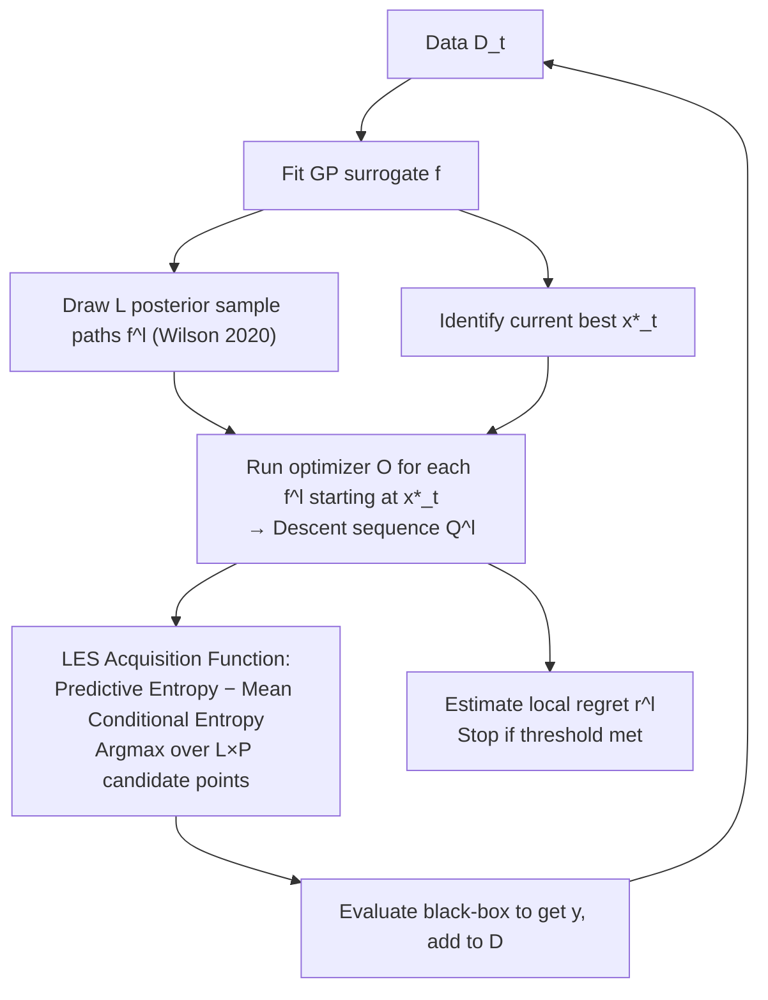

# Local Entropy Search over Descent Sequences for Bayesian Optimization

**Conference**: ICLR 2026  
**OpenReview**: [https://openreview.net/forum?id=cPxmLZmFa7](https://openreview.net/forum?id=cPxmLZmFa7)  
**Code**: [https://github.com/Data-Science-in-Mechanical-Engineering/local-entropy-search](https://github.com/Data-Science-in-Mechanical-Engineering/local-entropy-search)  
**Area**: Bayesian Optimization / Probabilistic Methods / Information-theoretic Acquisition Functions  
**Keywords**: Bayesian Optimization, Entropy Search, Local Optimization, Descent Sequence, Gaussian Process, Mutual Information  

## TL;DR
The "information gain" objective of entropy search is shifted from the **global optimum** to the **local optimum reachable by an iterative optimizer (e.g., gradient descent)** starting from an initial point. By propagating the GP posterior through the optimizer to obtain a distribution of "descent sequences," the next query point is selected to maximize information gain for this distribution, resulting in higher sample efficiency for high-dimensional and complex black-box optimization.

## Background & Motivation
**Background**: Bayesian Optimization (BO) is a leading method for expensive black-box functions. However, classical BO aims to minimize regret relative to the **global optimum**, requiring uncertainty reduction across the entire domain. Conversely, **local iterative optimizers** such as gradient descent, quasi-Newton, or evolutionary algorithms are state-of-the-art for high-dimensional complex problems (e.g., training networks with millions of parameters), yet they are not directly applicable to expensive black-boxes due to low sample efficiency.

**Limitations of Prior Work**: There is a clear tension between "global BO being infeasible in high dimensions" and "local optimization being effective in high dimensions but unsuitable for black-boxes." Existing local BO methods generally follow two paths—trust regions (TuRBO) or line search (GIBO uses GPs to learn gradients $\nabla f$ to determine direction and step size). However, they only locally exploit the "structure of the iterative descent trajectory." GIBO only considers the gradient at the current point, and trust regions merely restrict the search range; neither treats "the entire sequence an optimizer will follow from an initial point and where it terminates" as an explicit information-theoretic target.

**Key Challenge**: Entropy search frameworks (ES/PES/MES/JES) are naturally suited for "guiding sampling via information gain," but they all target the **location or function value of the global optimum**. The use of this information-theoretic machinery for a "local optimum reachable by a specific optimizer" has not been explored.

**Goal**: To propose the first **local version of entropy search** that explicitly targets the "descent sequence and its destination (local optimum) generated by an arbitrary iterative optimizer $\mathcal{O}$ starting from an initial design $x_0$," approximating this reachable solution with as few samples as possible in expensive black-box settings.

**Key Insight**: **[Optimizers as Random Variables]** By representing the belief about the target objective with a GP posterior $p(f|D_t)$ and pushing this distribution forward through the optimizer $\mathcal{O}$, a **probability distribution over descent sequences** $Q_{x_0}$ is obtained. The next query point $x$ is then chosen to maximize the mutual information between $(x,y(x))$ and $Q_{x_0}$—once the sequence is clarified, the local optimum $x^*$ is naturally identified.

## Method

### Overall Architecture
LES replaces the "global optimum" with a "descent sequence." The entire process is an active learning loop centered on a GP surrogate: fit the GP → draw $L$ sample paths from the GP posterior → run the optimizer $\mathcal{O}$ on each sample path starting from the current best $\hat{x}^*_t$ to obtain a descent sequence → use a "predictive entropy − conditional entropy" acquisition function to select points with maximal information gain from candidates in these sequences → update the GP, and use a probabilistic stopping rule to determine if convergence to a local optimum has been reached.

### Key Designs

**1. Descent Sequence Distribution $Q_{x_0}$: Propagating "Beliefs" into "Trajectory Distributions".** Given an optimizer $\mathcal{O}_{x_0}(f)=(z_0=x_0,z_1,\dots)$, the sequence is deterministic when $f$ is known. In a black-box setting, $f$ is a random function from the GP posterior; feeding each sample path into the optimizer yields a family of random trajectories $Q_{x_0}=((z_0,R_0),(z_1,R_1),\dots)$, where $R_n$ represents the observations required by the optimizer (e.g., $R_n=\nabla f(z_n)$ for gradient descent, or $R_n=f(z_n)$ for hill climbing). This serves as the pivot for the paradigm: it translates "functional uncertainty" into "uncertainty about which path the optimizer will take." Reducing the entropy of the latter is equivalent to reducing uncertainty about the local optimum $x^*=\lim_{n\to\infty}z_n$. The authors note that directly calculating mutual information for the endpoint $x^*$ via $I((x,y(x));O^*_{x_0})$ is **intractable**, making the **entire sequence** the only feasible information target.

**2. Mutual Information Acquisition Function: Difference between Predictive and Conditional Entropy.** The LES selection criterion maximizes $\alpha_{\text{LES}}(x)=I((x,y(x));Q_{x_0}\mid D_t)$, which, using the additivity of entropy, decomposes into:
$$\alpha_{\text{LES}}(x)=\underbrace{H[y(x)\mid D_t]}_{\text{Predictive Entropy}}-\underbrace{\mathbb{E}_f\big[H[y(x)\mid D_t,Q_{x_0}]\big]}_{\text{Conditional Entropy}}.$$
The first term is the overall uncertainty of the GP at $x$, which has a closed form $H[y(x)\mid D_t]=\tfrac12\log(2\pi e\,\sigma_y^2(x\mid D_t))$. The second term asks: "how much uncertainty remains if I already know how $x$ affects those descent sequences?" Intuitively, the acquisition function yields high values at points that are **far from existing observations and aligned with high-probability descent sequences**, utilizing information more effectively than GIBO (which only considers a single gradient step).

**3. Mixed Monte-Carlo + Analytic Entropy Approximation: Making the Intractable Expectation Computable.** Since the conditional entropy term has no closed form, a Monte Carlo approximation is used with $L$ samples. First, $L$ analytically differentiable posterior paths $f^l_t(\cdot)=\sum_i w^l_i\phi_i(\cdot)+\sum_j v_j k(\cdot,x_j)$ are efficiently drawn using Matheron’s rule (Wilson 2020). Running the optimizer on each path yields $Q^l_{x_0}$, and these "parameter-observation pairs" are added to the dataset as virtual observations to analytically compute posterior variances. The final acquisition function becomes:
$$\alpha_{\text{LES}}(x)\approx\tfrac12\log(2\pi e\,\sigma_y^2(x\mid D_t))-\frac1L\sum_{l=1}^{L}\tfrac12\log\!\big(2\pi e\,\sigma_y^2(x\mid D_t\cup Q^l_{x_0})\big).$$

**4. Practical Approximations: From Infinite Sequences to Finite Candidate Sets.** Implementation requires several engineering choices: (i) Start from the current best $\hat{x}^*_t$ rather than a fixed $x_0$; (ii) Use a finite number of optimizer steps; (iii) Condition on only $P$ equidistant support points across the interpolated sequence to avoid high costs; (iv) Use function values instead of gradient observations for faster execution with similar performance; (v) Since the acquisition function is non-convex and hard to optimize in high dimensions, **argmax is taken only over the finite set of $L\times P$ candidate points**—as the descent sequences themselves provide promising candidates. A stopping criterion adapted from Wilson 2024 estimates the probability that local simple regret is below a tolerance $\epsilon$, providing a **high-probability certificate of local optimality**.

## Key Experimental Results

### Main Results: GP Samples (Varying Complexity × Dimension)
Methods were compared on GP targets sampled with log-normal lengthscale priors (median final value, lower is better). High complexity results for Out-of-Model (MAP estimation of hyperparameters):

| Complexity | Method | d=5 | d=10 | d=20 | d=30 | d=50 |
|---|---|---|---|---|---|---|
| high | **LES** | −2.9 | **−5.0** | **−7.2** | **−8.5** | **−7.8** |
| high | TuRBO | **−3.7** | **−5.0** | −7.1 | −8.2 | −7.1 |
| high | logEI-DSP | −3.7 | −4.1 | −4.0 | −4.0 | −4.1 |
| high | Sobol | −2.4 | −2.7 | −2.8 | −3.2 | −3.0 |
| medium | **LES** | −3.0 | −4.6 | **−7.1** | **−8.6** | **−8.8** |
| medium | TuRBO | −3.1 | −4.9 | −7.0 | −7.9 | −8.0 |

Key Trend: **As dimensionality and problem complexity increase, the advantage of LES becomes more pronounced.** Global entropy search baselines like MES are not competitive, and global logEI only shows asymptotic advantages at d=10.

### Ablation Study

| Ablation Dimension | Setting | Conclusion |
|---|---|---|
| Inner Optimizer | GD / ADAM / CMA-ES | LES-ADAM and LES-GD alternate as best depending on complexity; CMA-ES is more global and benefits lower dimensions. |
| Approx Accuracy | Samples $L$, Support points $P$ | Performance improves with larger $L$ and $P$, but runtime increases (approx. 17.8s per iteration for 50D ADAM with medium accuracy). |
| LES Paradigm Variants | Local Thompson Sampling / Final Point Only | Both performed worse, confirming that conditioning on the full sequence via MC sampling is key. |
| Observation Type | Gradient vs. Function Value | Using function values is faster and yields similar performance. |

### Key Findings
- **Lower Cumulative Regret**: The conservative exploration of local search leads to significantly smaller cumulative regret for LES across almost all problems (except d=5 at the lowest complexity).
- **Effective Stopping Rules**: Reaching a local optimum is easier than a global one, allowing LES to stop earlier than the global version in Wilson 2024.
- **Identified Weaknesses**: On highly multimodal landscapes designed to trap local search, LES frequently gets stuck in local optima with high run-to-run variance, underperforming global methods.

## Highlights & Insights
- **Clean Paradigm Shift**: Moving entropy search from "global targeting" to "optimizer-reachable local targeting" is a conceptually simple but impactful shift—it acknowledges that global optimality may be unreachable or unnecessary, treating mature local optimizers as first-class components of BO.
- **Optimizer as Prior**: The descent sequence distribution $Q_{x_0}$ allows the choice of optimizer to act as an inductive bias for the acquisition function, making GD/ADAM/CMA-ES "pluggable" units that inject local search experience into the information-theoretic framework.
- **Candidate Set as Byproduct**: The $L\times P$ sequence points generated by the optimizer serve as both "conditioning information" and the "acquisition function candidate set," bypasses the difficult task of optimizing non-convex acquisition functions in high dimensions.
- **Theoretical Closure**: The provided probabilistic stopping rule offers a high-probability certificate of local optimality without additional computational overhead.

## Limitations & Future Work
- **Local Traps**: Once trapped in a basin, there is no inherent escape mechanism; full space coverage would require multi-start, stronger incumbent searches, or local/global switching heuristics (the authors suggest an automated restart triggered by the stopping rule).
- **Complexity Prior**: It is difficult to judge problem complexity a priori, yet the advantages of LES depend on "high complexity and high dimensionality."
- **Surrogate Dependency**: Since decisions are driven by posterior samples, model misspecification can amplify erroneous beliefs. The overhead of approximating mutual information increases with dimension and complexity.
- **Theoretical Gap**: There is currently no finite-time regret guarantee like GP-UCB; only a high-probability certificate of local optimality is provided. The paradigm is limited to unconstrained single-objective optimization.

## Related Work & Insights
- **Entropy Search Lineage**: ES (Hennig & Schuler 2012), PES, MES (Wang & Jegelka 2017), and JES all target global optimal locations, values, or joint distributions. LES is the first to apply this to local optima, building on ES principles but changing the target object.
- **Local BO Routes**: Trust regions (TuRBO, Eriksson 2019) restrict the search space; line search/gradient methods (GIBO, Müller 2021 and HCI-GIBO, He 2025) use GPs to learn gradients. LES also starts from an incumbent but learns the **entire descent sequence** rather than a single gradient step.
- **Efficient GP Sampling**: Dependence on Matheron’s rule for analytic path sampling (Wilson 2020) is the technical foundation that makes running optimizers on sample paths differentiable and computable.
- **Insight**: The idea of "treating the trajectory distribution of a downstream solver as an information-theoretic target" is potentially transferable to any "surrogate + iterative solver" active learning scenario, such as replacing the optimizer with RL policy rollouts or physical simulation stepping.

## Rating
- **Novelty**: ⭐⭐⭐⭐⭐ The first local version of entropy search. Propagating the GP posterior through an optimizer to maximize mutual information of the descent sequence distribution is a clean and original paradigm shift.
- **Experimental Thoroughness**: ⭐⭐⭐⭐ Includes 5–50 dimensional benchmarks across four complexity levels, synthetic/applied benchmarks, and multiple ablations; lacks finite-time theoretical guarantees.
- **Writing Quality**: ⭐⭐⭐⭐ Progresses logically from motivation to paradigm to solvability/algorithms. Visualizations of sequence distributions and acquisition heatmaps are intuitive.
- **Value**: ⭐⭐⭐⭐ Strong performance in terms of sample efficiency and cumulative regret for high-dimensional, expensive black-box problems; conservative exploration is attractive for real-world optimization.

<!-- RELATED:START -->

## Related Papers

- [\[ICML 2026\] $α$-PFN: Fast Entropy Search via In-Context Learning](../../ICML2026/optimization/α-pfn_fast_entropy_search_via_in-context_learning.md)
- [\[ICLR 2026\] Incorporating Expert Priors into Bayesian Optimization via Dynamic Mean Decay](incorporating_expert_priors_into_bayesian_optimization_via_dynamic_mean_decay.md)
- [\[ICLR 2026\] From Sorting Algorithms to Scalable Kernels: Bayesian Optimization in High-Dimensional Permutation Spaces](from_sorting_algorithms_to_scalable_kernels_bayesian_optimization_in_high-dimens.md)
- [\[ICLR 2026\] Generative Bayesian Optimization: Generative Models as Acquisition Functions](generative_bayesian_optimization_generative_models_as_acquisition_functions.md)
- [\[ICLR 2026\] Improving LLM-based Global Optimization with Search Space Partitioning](improving_llm-based_global_optimization_with_search_space_partitioning.md)

<!-- RELATED:END -->
