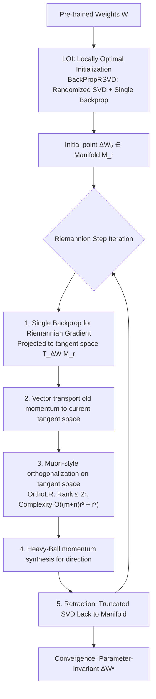

# LoRA meets Riemannion: Muon Optimizer for Parametrization-independent Low-Rank Adapters

**Conference**: ICLR 2026  
**OpenReview**: [https://openreview.net/forum?id=WtbXgc9GVA](https://openreview.net/forum?id=WtbXgc9GVA)  
**Code**: [https://github.com/Bogachevv/RiemanianFinetune](https://github.com/Bogachevv/RiemanianFinetune)  
**Area**: Parameter-Efficient Fine-Tuning / Optimization Methods  
**Keywords**: LoRA, Riemannian optimization, Muon, fixed-rank manifold, transformation invariance, LLM fine-tuning, diffusion model  

## TL;DR
This work treats LoRA low-rank updates as points on a "fixed-rank manifold" for direct optimization, lifting the Muon optimizer to the Riemannian manifold (termed Riemannion). This fundamentally eliminates the parameterization ambiguity caused by LoRA factorization. Combined with a gradient-aligned initialization and a single-backpropagation implementation, it improves both convergence speed and final accuracy for LLM and diffusion model fine-tuning.

## Background & Motivation

**Background**: LoRA uses low-rank modifications $\Delta W = AB^\top$ ($A \in \mathbb{R}^{m \times r}$, $B \in \mathbb{R}^{n \times r}$) to freeze the backbone and train only two small factors, making it the dominant Parameter-Efficient Fine-Tuning (PEFT) method. In practice, Euclidean optimizers such as SGD, Adam, or AdamW are typically used to perform gradient descent directly on the factors $(A, B)$.

**Limitations of Prior Work**: Any given $\Delta W$ has infinitely many equivalent decompositions—for any invertible matrix $S$, $\tilde A = AS$ and $\tilde B = BS^{-\top}$ yield the exact same $\Delta W$. Because Euclidean optimizers update $A$ and $B$ independently, results depend on the specific choice of decomposition. This lack of parameterization invariance leads to common issues: unbalanced learning speeds between factors, extreme sensitivity to learning rates/scaling, and optimization path dependence.

**Key Challenge**: Ideal training should be **reparameterization-invariant**—the actual update to $\Delta W$ should not depend on the decomposition method. Existing Riemannian LoRA approaches either rely on SGD-style updates (LORO) or embed Adam within a chosen parameterization (RPrecAdamW), both of which deviate from a pure Riemannian framework and reintroduce parameterization dependence. Furthermore, directly applying the Muon optimizer (which has shown great success in Euclidean space) to factors $A$ and $B$ independently is not invariant, as its orthogonalization depends on arbitrary scaling or rotation.

**Goal**: Construct a **fully Riemannian** LoRA training framework that optimizes $X = \Delta W$ directly on the fixed-rank manifold $\mathcal{M}_r = \{X \in \mathbb{R}^{m \times n} : \mathrm{rank}(X) = r\}$. This aims to eliminate decomposition ambiguity by design while inheriting the geometric alignment advantages of Muon.

**Core Idea** (**Geometric Home + Muon on Manifold**): Rather than struggling with decomposition ambiguity in factor space, the update is moved to the intrinsic space $\mathcal{M}_r$. Since all calculations concern the product $X$ rather than a specific decomposition, invariance is automatically achieved. The "singular value equalization orthogonalization" of Muon is then adapted to the manifold's tangent space, resulting in the Riemannion optimizer.

## Method

### Overall Architecture
The method consists of three components: **(1) Riemannion**—a new Riemannian optimizer that generalizes Muon to fixed-rank manifolds; **(2) LOI (Locally Optimal Initialization)**—ensuring the initial adapter starts at a manifold point most aligned with the full fine-tuning gradient; **(3) Single-backprop gradient trick + Randomized SVD**—enabling these geometric operations to be implemented with nearly zero additional overhead at low ranks. All three rely on the fixed-rank manifold "trio": Riemannian gradient (tangent space projection), retraction (truncated SVD), and vector transport (re-projection).

### Key Designs

**1. Riemannion: Lifting Muon to the tangent space for orthogonalization with $O((m+n)r^2 + r^3)$ complexity.** The essence of Muon in Euclidean space is using momentum followed by orthogonalization $\mathrm{Ortho}(M) = UV^\top$ (standardizing singular values to 1). This acts as a layer-wise preconditioner that prevents updates from collapsing into a few dominant directions. To move this to the manifold, where momentum $M_t$ is a tangent vector with rank at most $2r$ (based on the structure $\xi = \begin{psmallmatrix}\dot A & A_L\end{psmallmatrix}\begin{psmallmatrix}B_R \\ \dot B\end{psmallmatrix}^\top$), the authors replace standard orthogonalization with $\mathrm{Ortho}_r(\cdot)$, which sets only the first $2r$ singular values to 1, followed by a projection: $\tilde M_t = P_{T_{\Delta W_t}\mathcal{M}_r}(\mathrm{Ortho}_r(M_t))$. This preserves the column and row spaces of $M_t$. While singular values after projection aren't strictly 1, they consistently stay within $(0.9, 1.1)$, similar to the "approximate orthogonality" in Newton–Schulz iterations. Using the $2r$ low-rank representation, this process requires only two QRs and one $2r \times 2r$ SVD (OrthoLR / ProjectLR), maintaining the same complexity as Euclidean Muon.

**2. LOI (Locally Optimal Initialization): Aligning the initial manifold point's tangent space with the full gradient.** Initialization is formulated as an optimization problem: $\Delta W_*^{(0)} \in \arg\max_{\Delta W \in \mathcal{M}_r} \|P_{T_{\Delta W}\mathcal{M}_r} \nabla_W L(W)\|_F^2$. This finds a point on the fixed-rank manifold whose tangent space is most aligned with the Euclidean gradient of full fine-tuning. Theorem 5.1 provides a closed-form solution using the SVD of $\nabla_W L(W)$, where the optimal solution takes the form $\alpha U_{1,r}V_{r,2r}^\top$. This is conceptually similar to LoRA-GA but derived from a Riemannian framework and **avoids Gram matrix inversion**, ensuring numerical stability even as $\|\Delta W_*^{(0)}\| \to 0$.

**3. Single-backprop gradient trick + Randomized SVD: Avoiding the expensive full gradient calculation.** The framework frequently requires $\nabla_W L(W)$, but explicitly forming this $m \times n$ matrix is memory-prohibitive. The authors only need its products with small matrices, like $\nabla_W L(W)^\top M$. By introducing differentiable parameters $Z_1 = 0 \in \mathbb{R}^{m \times r}$ and $Z_2 = 0 \in \mathbb{R}^{n \times r}$ and performing a forward/backward pass on $L(W + Z_1N^\top + MZ_2^\top)$, automatic differentiation simultaneously provides $\nabla_{Z_1}L = \nabla_W L(W)N$ and $\nabla_{Z_2}L = \nabla_W L(W)^\top M$. This matches a standard LoRA forward pass. Combined with a randomized SVD with power iterations (BackPropRSVD), the initialization is reduced to $O((m+n)r^2)$ plus $2(q+1)$ backprops. Since LOI runs only once, it accounts for only **0.25%** of the total wall-clock time.

## Key Experimental Results

### Main Results: Llama 3-8B Commonsense Reasoning (LoRA rank=16, average accuracy % over 8 tasks)

| Method | BoolQ | PIQA | SIQA | HellaSwag | WinoGrande | ARC-E | ARC-C | OBQA | All |
| :--- | :---: | :---: | :---: | :---: | :---: | :---: | :---: | :---: | :---: |
| Adam (LoRA) | 74.8 | 89.8 | 82.6 | 96.2 | 87.9 | 92.4 | 84.9 | 88.5 | 87.1±0.6 |
| DoRA | 74.8 | 89.4 | 82.4 | 95.9 | 87.8 | 90.7 | 83.8 | 87.8 | 86.6±0.3 |
| Muon (Per-factor) | 72.9 | 86.4 | 80.8 | 94.1 | 84.4 | 84.2 | 77.3 | 83.9 | 83.0±0.6 |
| LoRA-RITE | 72.2 | 88.6 | 82.0 | 95.1 | 85.6 | 87.7 | 79.3 | 85.7 | 84.5±0.5 |
| RPrecAdamW | 75.8 | 89.5 | 82.4 | 96.1 | 87.7 | 90.6 | 84.1 | 87.7 | 86.8±0.4 |
| **Riemannion** | 75.7 | **91.2** | **83.5** | **96.7** | **88.6** | **93.6** | **86.4** | **89.3** | **88.1±0.2** |

### Sub-task Comparisons (Diffusion Subject-Driven Generation)

| Setting | Comparison | Key Finding |
| :--- | :--- | :--- |
| Stable Diffusion 2 (rank 4/8/16) | vs LoRA + Adam | Riemannion learns complex concepts like "robot toy" in only **600 steps** while maintaining text similarity. |
| CLIP (Text) vs DINO (Image) similarity | vs LoRA (various LRs) | Achieves superior concept retention/accuracy across all learning rates; **lower ranks converge faster**. |

### Key Findings
- **Win-Win in Accuracy and Stability**: Riemannion outperforms LoRA, DoRA, per-factor Muon, LoRA-RITE, and RPrecAdamW in commonsense reasoning, achieving the highest average (88.1%) with the **lowest variance** (±0.2 vs Adam's ±0.6), validating the stability provided by parameterization invariance.
- **Per-factor Muon performs worst (83.0%)**: Applying Muon directly to $A$ and $B$ results in a significant performance drop due to lack of invariance, highlighting that lifting Muon to the manifold is the correct approach.
- **Nearly Zero Extra Overhead**: Complexity $O((m+n)r^2 + r^3)$ is equivalent to Euclidean Muon; the number of backprops is identical to vanilla LoRA; LOI initialization is negligible (0.25% of total time).
- **Small Norm Initialization is Better**: Experiments show LOI performs better with a smaller initial norm and remains numerically stable by avoiding matrix inversion.
- **Faster Diffusion Convergence**: In SD2 subject-driven generation, Riemannion converges faster and preserves concepts better than LoRA+Adam across multiple ranks, following the trend that "lower rank leads to faster convergence."

## Highlights & Insights
- **Cutting through "Decomposition Ambiguity"**: Instead of patching factor space (e.g., LoRA+ step-size tuning), this work moves the battlefield to the fixed-rank manifold. Invariance is established "by construction," providing a cleaner solution.
- **First Formal Marriage of Muon and Riemannian Optimization**: The authors interpret Muon's orthogonalization as a Linear Minimization Oracle (LMO), naturally extending it to the unit ball of the operator norm on the tangent space.
- **Engineering Cleverness**: Using a single backprop pass to obtain both left and right gradient-matrix products alongside randomized SVD resolves the concern that Riemannian frameworks are "elegant but expensive," matching the cost of vanilla LoRA at low ranks.
- **Architecture Agnostic**: The framework is effective for both LLMs (Llama 3-8B) and diffusion models, indicating a fundamental optimization improvement rather than a task-specific trick.

## Limitations & Future Work
- **Missing Theoretical Properties**: The authors acknowledge that the next step is investigating theoretical convergence properties (rates/bounds), as the current work is primarily geometrically motivated with empirical validation.
- **Fixed Rank Assumption**: The method is tied to $\mathcal{M}_r$ with a pre-defined rank $r$. It does not yet address adaptive or dynamic ranks.
- **Experimental Scale**: LLM experiments were limited to Llama 3-8B on commonsense tasks; testing on larger models or harder tasks (math/code) is needed.
- **Approximate Orthogonalization Accuracy**: Singular values of $\tilde M_t$ are only approximately 1 (0.9–1.1). While empirical results suggest exact LMO solutions offer little gain, the impact of this approximation in other scenarios remains to be explored.

## Related Work & Insights
- **Initialization Lineage**: Works like PiSSA, MiLoRA, and LoRA-GA investigate better LoRA starting points. LOI is derived from a Riemannian perspective and provides a faster SVD solution via the single-backprop trick.
- **Riemannian Optimization in DL**: Manifold optimization is common in matrix completion; Stiefel manifolds are used for RNN stability. Riemannion avoids the stability issues of Graco-matrix inversion found in LORO or RPrecAdamW.
- **Muon Family**: Built on the foundations of the original Muon (Jordan et al., 2024) and its LMO interpretations. This represents the integration of "orthogonalization preconditioning" into geometrically constrained optimization.
- **Insight**: When a method possesses intrinsic symmetry or redundant parameterization (like low-rank decomposition), moving the problem to a quotient manifold or intrinsic space—gaining invariance by construction—is often more robust than applying point-wise patches in parameter space.

## Rating
- **Novelty**: ⭐⭐⭐⭐⭐ (First to generalize Muon to fixed-rank manifolds; the combination of geometric invariance and tangent-space orthogonalization is insightful.)
- **Experimental Thoroughness**: ⭐⭐⭐⭐ (Dual architecture validation; comprehensive baselines and low variance are convincing; tasks could be more diverse.)
- **Writing Quality**: ⭐⭐⭐⭐ (Clear derivation chain from Muon to LMO to tangent space; complete pseudocode; high density of geometric notation may challenge some readers.)
- **Value**: ⭐⭐⭐⭐ (Immediate practical relevance for LoRA training with zero overhead and consistent gains.)

<!-- RELATED:START -->

## Related Papers

- [\[ICLR 2026\] Towards Efficient Optimizer Design for LLM via Structured Fisher Approximation with a Low-Rank Extension](towards_efficient_optimizer_design_for_llm_via_structured_fisher_approximation_w.md)
- [\[NeurIPS 2025\] Training-Free Bayesianization for Low-Rank Adapters of Large Language Models](../../NeurIPS2025/optimization/training-free_bayesianization_for_low-rank_adapters_of_large_language_models.md)
- [\[ICLR 2026\] The Power of Small Initialization in Noisy Low-Tubal-Rank Tensor Recovery](the_power_of_small_initialization_in_noisy_low-tubal-rank_tensor_recovery.md)
- [\[ICLR 2026\] Trion: FFT-based Dynamic Subspace Selection for Low-Rank Adaptive Optimization of LLMs](trion_fft-based_dynamic_subspace_selection_for_low-rank_adaptive_optimization_of.md)
- [\[ICLR 2026\] Error Feedback for Muon and Friends](error_feedback_for_muon_and_friends.md)

<!-- RELATED:END -->
## Related Papers

- [\[ICLR 2026\] Towards Efficient Optimizer Design for LLM via Structured Fisher Approximation with a Low-Rank Extension](towards_efficient_optimizer_design_for_llm_via_structured_fisher_approximation_w.md)
- [\[NeurIPS 2025\] Training-Free Bayesianization for Low-Rank Adapters of Large Language Models](../../NeurIPS2025/optimization/training-free_bayesianization_for_low-rank_adapters_of_large_language_models.md)
- [\[ICLR 2026\] The Power of Small Initialization in Noisy Low-Tubal-Rank Tensor Recovery](the_power_of_small_initialization_in_noisy_low-tubal-rank_tensor_recovery.md)
- [\[ICLR 2026\] Trion: FFT-based Dynamic Subspace Selection for Low-Rank Adaptive Optimization of LLMs](trion_fft-based_dynamic_subspace_selection_for_low-rank_adaptive_optimization_of.md)
- [\[ICLR 2026\] Error Feedback for Muon and Friends](error_feedback_for_muon_and_friends.md)

<!-- RELATED:END -->
