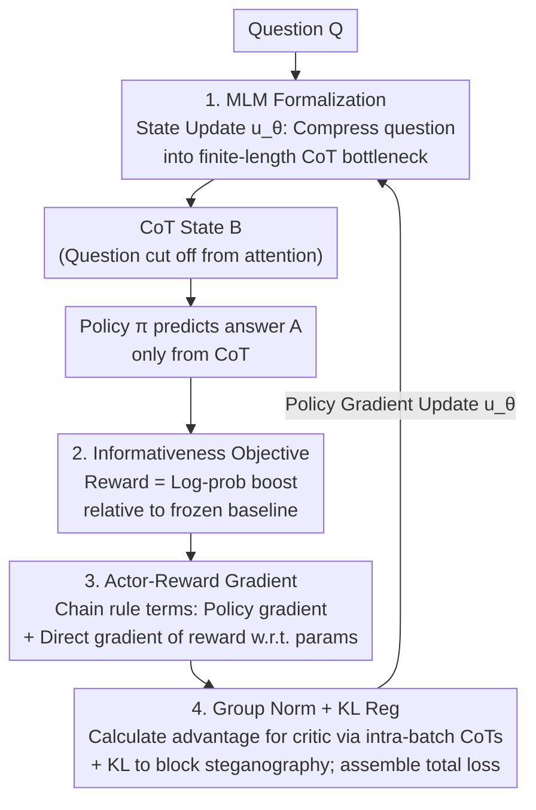

# Markovian Transformers for Informative Language Modeling

**Conference**: ICLR 2026  
**arXiv**: [2404.18988](https://arxiv.org/abs/2404.18988)  
**Authors**: Scott W. Viteri, Max Lamparth, Peter Chatain, Clark Barrett (Stanford University)
**Code**: [GitHub](https://github.com/scottviteri/MarkovianTraining/)  
**Area**: Optimization  
**Keywords**: Markovian Constraints, CoT Faithfulness, Reasoning Bottleneck, Autoencoder Analogy, GRPO Training, Information Theory

## TL;DR

Ours proposes the Markovian Language Model (MLM) framework, which enforces Chain-of-Thought (CoT) to become a causally necessary reasoning bottleneck through **structural constraints** (removing the original question during answer prediction and deriving only from CoT)—analogous to the narrow latent layer of an autoencoder. Combined with GRPO-style policy gradient training, performance on GSM8K improved from 19.6% to 57.1%. Moreover, the learned CoT is transferable across model architectures (Llama → Mistral/Phi/GPT-2), proving that CoT encodes natural language reasoning rather than steganography.

## Background & Motivation

**CoT faithfulness issues are pervasive**: Although Chain-of-Thought reasoning improves LLM performance, extensive research (Turpin et al., 2023; Lanham et al., 2023) indicates that CoT does not necessarily reflect the model's true reasoning process—perturbing CoT text may not change the final answer, suggesting that CoT is not "load-bearing."

**Existing optimization methods cannot fundamentally solve this**: Methods like STaR (Zelikman et al., 2022) and DeepSeek-R1 (Guo et al., 2025) enhance CoT quality through fine-tuning, but the model can still access the original question when predicting the answer, creating an architectural "escape hatch" to bypass CoT.

**Lack of information-theoretic perspective**: A framework is needed where CoT acts as the sole information channel from problem to answer, such that damaging CoT inevitably degrades answer quality, providing causal necessity rather than mere statistical correlation.

**Gap between structural and optimization constraints**: Pure optimization methods (adding regularization or supervision signals) only impose soft constraints on CoT quality. In contrast, this paper pursues hard architectural constraints—fundamentally cutting the direct "Question → Answer" path.

**Autoencoder analogy insight**: CoT is analogized to the narrow latent layer of an autoencoder—all information from input (Q) to output (A) must flow through a finite-bandwidth bottleneck (CoT), forcing the model to compress reasoning into interpretable natural language steps.

**Steganography risks need empirical exclusion**: Theoretically, a model could use human-unreadable encoding (steganography) to hide answer information within CoT. This must be excluded through KL penalties and cross-model transfer experiments.

## Method

### Overall Architecture

The reasoning process is modeled as a Markov chain $A \to B \to C$: the problem $A$ is first compressed into a CoT state $B$ by a state update function $u_\theta$. The model then predicts the answer $C$ using policy $\pi$ **while seeing only $B$ and not the original question**. This is equivalent to inserting an autoencoder-style narrow latent layer between the question and the answer—all information must pass through the CoT bottleneck. Since the discrete text bottleneck blocks backpropagation, training relies on reinforcement learning: multiple CoTs are sampled in parallel within a batch, using the "log-probability boost relative to a frozen baseline" as the reward. Intra-batch normalization yields advantages, which are combined with KL regularization. Finally, GRPO-style policy gradients (plus the direct gradient of the reward with respect to its own parameters) are used to train this CoT to be as informative as possible for predicting the answer.

### Key Designs

**1. Markovian Language Model Formalization: Architecturally severing the direct path from question to answer**

The entire framework is defined as $M = (\mathcal{O}, \mathcal{S}, \pi, u, s_1)$, where the observation space $\mathcal{O}$ contains questions and answers, the state space $\mathcal{S}$ contains CoT reasoning text, and the policy $\pi: \mathcal{S} \to \Delta(\mathcal{O})$ **predicts the next observation only from the state**. The state update function $u: \mathcal{O} \times \mathcal{S} \to \Delta(\mathcal{S})$ is responsible for incorporating new observations into the state, with $s_1$ as the initial state. The core constraint is that when $\pi$ predicts the answer $o_2$, it can only read the CoT state $s_2$; the original question $o_1$ is completely removed from the attention path. This differentiates it from methods like STaR or DeepSeek-R1, where the full question remains visible during answer prediction, allowing an "escape hatch" to bypass CoT. Here, the bottleneck is a structural hard constraint rather than a soft loss regularization; destroying the CoT inevitably degrades answer quality.

**2. Informativeness Objective: Making CoT "carry more information" relative to a frozen baseline**

Whether a CoT is load-bearing is measured by its marginal contribution to predicting the answer. The reward is defined as the training model's log-probability boost relative to a frozen baseline $R_\theta(\tau) = \sum_{t=1}^{T}\left[\ln\pi_\theta(x_t|s_t) - \ln\pi'(x_t|s'_t)\right]$, corresponding to the objective $J(\theta) = \mathbb{E}_{\tau \sim P, u_\theta, u'}[R_\theta(\tau)]$. Maximizing $J(\theta)$ forces the CoT generated by $u_\theta$ to be maximally informative for predicting future observations. From coding theory, this has two components: $-\log\pi_\theta(C|B)$ is the cost of encoding the answer given the CoT, and $-\log u'(B|A)$ is the prior encoding cost of the CoT itself. Training effectively searches for a short-text state $B$ that makes both components "cheap," aligning with Minimum Description Length (MDL) intuition. In terms of complexity, CoT provides $|B|$ additional forward passes for reasoning; since the model cannot solve difficult problems using only $|A|$ forward passes for the question, it is forced to utilize the CoT.

**3. Actor-Reward Gradient: Utilizing the reward's dependence on its own parameters**

This is a key modification from standard GRPO. Since the same Transformer defines both the sampling distribution $u_\theta$ and the reward $R_\theta$, applying the chain rule to the derivative of $J(\theta)$ yields two terms: the standard policy gradient (treating reward as a constant when differentiating the sampling probability) and the direct gradient of the reward itself w.r.t. parameters $\nabla_\theta R_\theta(\tau)$. Conventional RL uses only the former; Ours uses both. Ablations show that removing the direct reward gradient leads to performance drops across multiple tasks (e.g., MMLU dropping from 55.5% to 46.6%), confirming that this term indeed drives CoT informativeness.

**4. Group Standardization + KL Regularization: Removing the critic and blocking steganography**

The training loss is composed of three terms: $\mathcal{L} = \mathcal{L}_{PG} + \mathcal{L}_{AR} + \mathcal{L}_{KL}$. The policy gradient term is $\mathcal{L}_{PG} = -\ln u_\theta(\text{CoT}|q, \text{CoT}_{init}) \cdot A^{detach}$, the actor-reward term is $\mathcal{L}_{AR} = -A$, and the KL regularization is $\mathcal{L}_{KL} = \beta_{KL} D_{KL}(u_\theta \| u')$ (with $\beta_{KL}=0.1$). The advantage $A$ is calculated following the GRPO approach: each batch contains $B$ identical $(q,a)$ pairs, the model generates $B$ diverse CoTs, a local subtraction is performed using reference CoT' produced by the untrained model as a baseline, followed by intra-batch standardization. This eliminates the need for a separate critic network. The KL term prevents $u_\theta$ from deviating too far from the frozen model, acting to stop the model from hiding answers in human-unreadable encodings—which, combined with cross-model transfer experiments, empirically excludes steganography.

## Key Experimental Results

### Table 1: Main Results Accuracy Comparison (Llama 3.1 8B)

| Dataset | Baseline | Expert Iteration | No Reward Grad | **Markovian (Ours)** | Non-Markovian |
|--------|------|-----------------|-----------|-------------------|-----------|
| GSM8K | 19.6% | 61.6% | 62.2% | **57.1%** | 63.3% |
| ARC-Challenge | 36.1% | 65.6% | 79.3% | **79.9%** | 78.6% |
| MMLU | 21.4% | 53.2% | 46.6% | **55.5%** | 68.7% |
| SVAMP | 18.0% | 38.7% | 40.7% | **42.3%** | 43.3% |
| Arithmetic | 1.0% | 76.0% | 81.0% | **98.0%** | 97.0% |
| **Average** | 19.2% | 59.0% | 62.0% | **66.6%** | 70.2% |

### Table 2: Perturbation Vulnerability on Wikipedia Continuation ($\Delta\ln P$ = Markovian drop − Non-Markovian drop)

| Perturbation | Char Replacement | Deletion | Digit Replacement | Post-Truncation | Pre-Truncation | **Row Mean** |
|---------|---------|------|---------|-------|-------|-----------|
| 20% | +0.457 | +0.459 | +0.016 | +0.254 | -0.009 | **+0.235** |
| 40% | +0.849 | +0.836 | +0.025 | +0.368 | +0.121 | **+0.440** |
| 60% | +1.042 | +1.002 | +0.035 | +0.596 | +0.284 | **+0.592** |
| 80% | +1.079 | +1.069 | +0.038 | +1.020 | +0.622 | **+0.766** |
| 100% | +1.084 | +1.263 | +0.039 | +1.258 | +1.262 | **+0.981** |

### Table 3: Perturbation Vulnerability on QA Tasks (Accuracy Δ, positive = Markovian more vulnerable)

| Dataset | Char Replacement | Deletion | Digit Replacement | Post-Truncation | Pre-Truncation | **Mean** |
|--------|---------|------|---------|-------|-------|---------|
| ARC | +0.320 | +0.424 | -0.004 | +0.069 | +0.439 | **+0.250** |
| SVAMP | +0.154 | +0.204 | +0.081 | +0.076 | +0.046 | **+0.112** |
| GSM8K | +0.059 | +0.069 | -0.013 | +0.105 | +0.044 | **+0.053** |
| MMLU | +0.056 | +0.124 | +0.004 | +0.038 | -0.001 | **+0.044** |

## Key Findings

- **Minimal cost of Markovian constraints**: Across 5 datasets, the Markovian model lags behind the Non-Markovian model by only 3.6pp on average (66.6% vs 70.2%)—sacrificing minor accuracy for a structural guarantee of CoT causal necessity.
- **Markovian outperforms Non-Markovian on ARC-Challenge and Arithmetic**: 79.9% vs 78.6% for ARC, and 98.0% vs 97.0% for Arithmetic—suggesting that for certain reasoning tasks, forcing an information bottleneck effectively acts as regularization.
- **Monotonically increasing perturbation vulnerability**: As perturbation intensity increases from 20% to 100%, $\Delta\ln P$ grows from +0.235 to +0.981 → Markovian CoTs indeed carry more causal information.
- **Successful cross-model transfer**: CoTs generated by Llama are informative for Mistral, Phi-3.5, and even GPT-2 → proving that CoT encodes natural language reasoning steps rather than model-specific steganography.
- **Actor-Reward gradient is vital**: Ablation experiments show that removing the $\nabla_\theta R_\theta$ term leads to performance degradation in multiple tasks (e.g., MMLU dropping from 55.5% to 46.6%).

## Highlights & Insights

- **Elegance of the autoencoder analogy**: $Q$=original data, $CoT$=latent layer, $A$=reconstruction → narrow latent layer forces compression → reasoning must be expressed via verbalization, and the coding theory explanation (MDL) provides mathematical rigor.
- **Structure over Optimization methodology**: Ensures CoT necessity through architectural constraints (removing the attention path for $q$) rather than loss constraints—a stronger guarantee than methods like FRODO.
- **Cross-model transfer = Anti-steganography evidence**: If CoT were merely encrypted code, switching decoders would fail; however, GPT-2 (much smaller than the training model) can utilize it → CoT is necessarily natural language.
- **Qualitative shift in arithmetic tasks**: Before training, Llama's CoTs merely listed numbers and incorrect sums; after training, correct step-by-step calculations appeared → an observable emergence of reasoning behavior.

## Limitations & Future Work

- **Significant gap on MMLU** (55.5% vs 68.7%) → For tasks requiring knowledge retrieval, the CoT bottleneck limits information transfer from question to answer more severely.
- **No guarantee of complete faithfulness**: The model might compute the answer during the forward pass of reading the question and then generate a post-hoc rationalization that is not the true pathway—Markovian constraints guarantee CoT is sufficient but not that it reflects internal computation.
- **Validated only on 7-8B models**: Larger models have stronger steganographic encoding capabilities; is the KL penalty still sufficient?
- **Lack of human evaluation**: Currently, interpretability is indirectly verified through perturbation vulnerability and cross-model transfer; direct human readability/utility assessments are absent.
- **High training cost**: Totaling approximately $20K (H100/H200), with a single training run taking ~10 hours—not particularly accessible for academic groups.

## Related Work & Insights

### vs FRODO (Paul et al., 2024)
FRODO uses causal mediation analysis and a dual-module training framework to increase the causal effect of CoT on the answer, but still allows the model to see the original question when generating the answer—this is a soft constraint at the **optimization level**. Ours provides a stronger causal necessity guarantee by directly removing the question-to-answer attention path at the **architectural level**. Experiments show Ours performs better across several datasets and possesses the unique advantage of cross-model transferability.

### vs DeepSeek-R1 / STaR / QuietSTaR
These methods also utilize RL or self-training to improve CoT reasoning quality but allow the model to see the full context when generating reasoning tokens—failing to enforce a Markovian structure. The key difference in Ours is the **information bottleneck**: answers are derived solely from CoT, providing a structural guarantee of faithfulness rather than just a performance boost. DeepSeek-R1 pursues stronger reasoning power without focusing on CoT causal necessity; STaR/QuietSTaR iteratively improves CoT but lacks architectural mechanisms to prevent bypassing it.

### vs Lyu et al. (2023) Faithful CoT
Similarly considers limiting model access to original input, but rewrites the question into formal language/code before execution. Ours uses natural language as the reasoning state → maintaining interpretability and generalizability across tasks without relying on external executors.

## Rating

- **Novelty**: ⭐⭐⭐⭐⭐ Introduces autoencoder bottleneck concepts to CoT faithfulness; theoretical framework (MLM+MDL) is elegant and unified.
- **Experimental Thoroughness**: ⭐⭐⭐⭐ 5 QA datasets + Wikipedia + perturbation analysis + cross-model transfer + ablations; however, scaling experiments and human evaluations are missing.
- **Writing Quality**: ⭐⭐⭐⭐⭐ Precise autoencoder analogy; the logical chain from definition to algorithm to experiment is clear and complete.
- **Value**: ⭐⭐⭐⭐ Fundamental methodological significance for XAI and CoT faithfulness; efficiency and scaling issues remain for practical deployment.

<!-- RELATED:START -->

## Related Papers

- [\[ICLR 2026\] Distributionally Robust Optimization via Generative Ambiguity Modeling](distributionally_robust_optimization_via_generative_ambiguity_modeling.md)
- [\[NeurIPS 2025\] Optimality and NP-Hardness of Transformers in Learning Markovian Dynamical Functions](../../NeurIPS2025/optimization/optimality_and_np-hardness_of_transformers_in_learning_markovian_dynamical_funct.md)
- [\[ICLR 2026\] Learning to Recall with Transformers Beyond Orthogonal Embeddings](learning_to_recall_with_transformers_beyond_orthogonal_embeddings.md)
- [\[ICLR 2026\] Neural Sum-of-Squares: Certifying the Nonnegativity of Polynomials with Transformers](neural_sum-of-squares_certifying_the_nonnegativity_of_polynomials_with_transform.md)
- [\[ICLR 2026\] Cutting the Skip: Training Residual-Free Transformers](cutting_the_skip_training_residual-free_transformers.md)

<!-- RELATED:END -->
