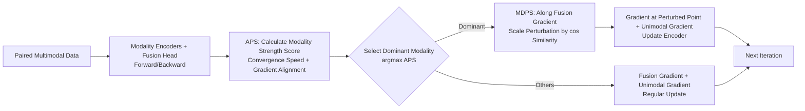

# MASAM: Multimodal Adaptive Sharpness-Aware Minimization for Heterogeneous Data Fusion

**Conference**: ICLR 2026  
**OpenReview**: [https://openreview.net/forum?id=AUKeDukcUi](https://openreview.net/forum?id=AUKeDukcUi)  
**Code**: [https://github.com/Orange2107/MASAM-Multimodal-Adaptive-SAM](https://github.com/Orange2107/MASAM-Multimodal-Adaptive-SAM)  
**Area**: Multimodal Optimization / Balanced Multimodal Learning  
**Keywords**: Modality Imbalance, Sharpness-Aware Minimization, Loss Surface Flatness, Heterogeneous Data Fusion, Adaptive Perturbation  

## TL;DR
The authors adapt SAM, originally used in unimodal learning to find flat minima, into a "modality-adaptive" version. By using an adaptive perturbation score, the method identifies the current dominant modality and applies a decoupled perturbation only to it along the fusion gradient direction. This simultaneously mitigates modality imbalance and pulls each modality's encoder into flat regions during heterogeneous fusion.

## Background & Motivation
- **Background**: Multimodal learning aims to fuse heterogeneous modalities such as structured records, images, and time-series signals. However, heterogeneity causes encoders to converge at different rates, leading to "modality imbalance" where strong modalities dominate training while weak modalities remain under-optimized, sometimes performing worse than unimodal models after fusion. Existing solutions (e.g., G-Blend, OGM, AGM, MLA) primarily rely on **gradient modulation** to rescale gradient magnitudes.
- **Limitations of Prior Work**: These methods only adjust gradient scales and **ignore the geometric structure of the loss surface**—specifically the "sharpness" of the solution. Empirical measurements using Hessian trace reveal that in naive late fusion, the CXR encoder initially trends toward a flat region but is subsequently dragged back into a sharp region by the unstable EHR encoder due to cross-modal interference, destroying generalization.
- **Key Challenge**: While SAM improves generalization in unimodal settings by finding flat minima, directly applying it to multimodal learning can be counterproductive: (1) **Amplified Imbalance**: SAM penalizes sharpness indiscriminately, further favoring faster-converging strong modalities; (2) **Modality-agnostic Perturbations**: Different modalities have distinct loss surface geometries; SAM forces all encoders onto the same trajectory using a unified perturbation, and the perturbation gradient itself is contaminated by coupled interference from other modalities, leading to skewed directions (formalized in Observation 1).
- **Goal**: To make SAM "modality-aware," retaining the generalization benefits of flattening without introducing imbalance or incompatible perturbations.
- **Core Idea**: **Differentiated optimization based on modality strength**—applying SAM regularization only to the dominant modality and projecting/scaling the perturbation direction to align with the fusion objective, thereby avoiding contamination of weak modalities.

## Method

### Overall Architecture
On top of standard late-fusion multimodal training (fusion loss $L_{\text{fuse}}$ + unimodal auxiliary losses $L_m$), MASAM inserts two modules at each step: First, **APS** calculates a "strength score" for each modality to select the current dominant modality; then, **MDPS** applies a decoupled perturbation to this dominant modality along the fusion gradient, scaled by gradient alignment. Non-dominant modalities are updated normally. The overall objective is:

$$L_{\text{total}} = L_{\text{fuse}} + \lambda_{m_1} L_{m_1} + \lambda_{m_2} L_{m_2}.$$

### Key Designs

**1. Adaptive Perturbation Score (APS): Identifying the dominant modality via "learning speed + gradient alignment."** The paper decomposes modality strength into two complementary signals. First is **learning speed**, derived from the moving average of unimodal loss to estimate short-term decrease $\text{Decay}^{(t)}_m = \max(0,\, L^{(t-1)}_m - \text{MA}^{(t)}_m)$, where $\text{MA}^{(t)}_m = \beta\,\text{MA}^{(t-1)}_m + (1-\beta)L^{(t)}_m$. Faster decay indicates more efficient information absorption. Second is **gradient alignment**; strong modalities carry more task-relevant shared information and dominate the fusion optimization trajectory, resulting in high cosine similarity between unimodal and fusion gradients:

$$\gamma^{(t)}_m = \frac{\langle \nabla_{\theta_m} L_{\text{fuse}},\, \nabla_{\theta_m} L_m\rangle}{\|\nabla_{\theta_m} L_{\text{fuse}}\|_2 \cdot \|\nabla_{\theta_m} L_m\|_2}.$$

These are weighted into $\text{APS}^{(t)}_m = \alpha\,\text{Decay}^{(t)}_m + (1-\alpha)\,\gamma^{(t)}_m$. The modality $m^\star = \arg\max_m \text{APS}_m$ is selected for SAM constraints. Penalizing only the strong modality ensures its convergence to flat regions without dragging weak modalities into biased perturbation directions.

**2. Modality Decoupled Perturbation Scaling (MDPS): Perturbations follow the "shared information direction" with adaptive intensity.** The fusion gradient $\nabla_{\theta_m} L_{\text{fuse}}$ guides the learning of shared representations, so MASAM applies perturbations in this direction. However, as Observation 1 notes this gradient is contaminated, MDPS uses the cosine similarity $\gamma_m$ as a scaling coefficient:

$$\epsilon_m = \rho \cdot \gamma_m \cdot \frac{\nabla_{\theta_m} L_{\text{fuse}}}{\|\nabla_{\theta_m} L_{\text{fuse}}\|_2}.$$

Intuitively, this projects the unimodal loss gradient onto the fusion gradient direction. When unimodal and fusion objectives align ($\gamma_m$ is large), the perturbation is stronger; when they conflict, the perturbation shrinks, achieving "modality-decoupled" perturbation that avoids pushing weak modalities away from their own flat regions.

**3. Three-partition Parameter Update + Convergence Guarantee.** Parameters are divided into the dominant modality $\{\theta_{m^\star}\}$, non-dominant modalities $\{\theta_m\}_{m\ne m^\star}$, and other parameters $\theta_{\text{other}}$. While $\theta_{\text{other}}$ uses base optimizers (SGD/Adam), the dominant modality accumulates the fusion gradient at the perturbed point and the unimodal gradient:

$$\theta^{t+1}_{m} = \theta^t_m - \eta_t\Big(\nabla_{\theta_m} L_{\text{fuse}}\big(\theta^t_m + \rho_t \gamma^t_m \tfrac{\nabla_{\theta_m} L^t_{\text{fuse}}}{\|\nabla_{\theta_m} L^t_{\text{fuse}}\|_2}\big) + \nabla_{\theta_m} L_m(\theta^t_m)\Big);$$

Non-dominant modalities are updated using gradients at the current parameters. Theorem 1, based on the inexact gradient descent framework, proves that under standard Lipschitz smoothness and specific learning rate/perturbation radius conditions (e.g., $\sum \eta_t \rho_t < \infty$), the sequence converges to a stable point of the joint objective.

## Key Experimental Results

### Main Results
Average across 5 multimodal datasets / 6 downstream tasks with 4 random seeds (Relative Gain vs. strongest baseline):

| Task/Dataset (Metric) | Late Fusion | Prev. SOTA | MASAM | Gain |
|---|---|---|---|---|
| MIMIC-Phenotype (AUPRC) | 0.475 | 0.481 (InfoREG) | **0.498** | +3.53% |
| MIMIC-Mortality (AUPRC) | 0.567 | 0.585 (MMPareto) | **0.603** | +3.08% |
| CREMA-D (Acc) | 0.660 | 0.770 (AUG) | **0.814** | +5.71% |
| Kinetics-Sounds (Acc) | 0.636 | 0.689 (AUG) | **0.740** | +7.40% |
| UPMC-Food101 (Acc) | 0.907 | 0.928 (MLA) | **0.935** | +0.75% |
| ADNI (mAP) | 0.826 | 0.847 (AUG) | **0.857** | +1.18% |
| UR-FUNNY Tri-modal (Acc) | 0.620 | 0.632 (OGM) | **0.644** | +1.90% |

MASAM ranks first across all 7 columns; on UPMC, despite a smaller gain, the paired significance test yielded $p=0.0046 < 0.005$.

### Ablation Study
Component-wise ablation (MIMIC-Phenotype AUPRC / KS Acc, mean of 4 seeds):

| # | Variant | APS | MDPS | SAM | Phenotype | KS |
|---|---|---|---|---|---|---|
| – | **MASAM** | ✓ | ✓ | ✓ | **0.498** | **0.740** |
| 1 | w/o APS | ✗ | ✓ | ✓ | 0.484 | 0.724 |
| 2 | w/o MDPS | ✓ | ✗ | ✓ | 0.491 | 0.723 |
| 3 | SAM Only | ✗ | ✗ | ✓ | 0.478 | 0.689 |
| 4 | Late Fusion | ✗ | ✗ | ✗ | 0.475 | 0.636 |

Comparing #3 (SAM Only) vs #4 (Late Fusion): Naive SAM only adds +0.63% on Phenotype, confirming that "direct application of SAM does not work." Adding APS (MASAM vs #1) brings +2.89% (Phenotype) / +2.21% (KS), and adding MDPS (MASAM vs #2) brings +1.43% / +2.35%, demonstrating complementarity.

### Key Findings
- **Flatness Visualization**: Using loss surface visualization (Li et al., 2018) and Hessian traces on MIMIC, MASAM allows both modality encoders to **simultaneously** converge to flatter regions than all baselines, whereas gradient modulation methods often stop in sharp regions due to ignoring geometry.
- **Unimodal Performance Evaluation**: When freezing encoders and training only classifier heads, MASAM’s unimodal performance exceeds multimodal baselines and even outperforms standalone unimodal baselines on noisy MIMIC data, proving it achieves balanced learning.
- **Label Noise Robustness**: Injecting 20%–60% label noise in CREMA-D / KS, MASAM leads across all noise levels, showing that generalization gains from flat minima are particularly effective under high noise.

## Highlights & Insights
- **Shifting the modality imbalance problem from "gradient magnitude" to "loss surface geometry"**: The paper provides empirical evidence via Hessian traces that strong modalities drag others into sharp regions, providing a novel perspective for introducing SAM.
- **Efficient Reuse of $\gamma_m$ (Gradient Alignment)**: The same metric serves as both the selection criterion for APS and the scaling coefficient for MDPS, resulting in a concise design with minimal computational overhead.
- **Counter-intuitive Choice of "Perturbing Only the Strong"**: Unlike typical approaches that aim to assist weak modalities, the paper argues that the strong modality is the source of sharp-region dragging; stabilizing it effectively liberates the weak modalities.
- The method is generalizable to any number of modalities (Algorithm 1 supports $M$ modalities) and was validated on the tri-modal UR-FUNNY dataset.

## Limitations & Future Work
- The framework is primarily derived and validated for late-fusion architectures with modality-specific encoders; its applicability to early fusion, shared backbones, or large-scale multimodal pre-trained models remains to be explored.
- Each step requires additional unimodal gradients, fusion gradient alignment, and a second forward-backward pass at the perturbed point, leading to higher overhead than pure gradient modulation. Systematic comparisons of training cost/throughput are missing.
- APS assumes "Fast learning + Gradient alignment = Dominance"; the robustness of this criterion under extreme noise asymmetry or missing modalities requires further investigation.
- Convergence analysis is provided for dominant modality updates; global dynamic analysis for the entire three-partition alternating update is limited.

## Related Work & Insights
- **Balanced Multimodal Learning**: Most existing work (G-Blend, OGM, AGM, MLA, MMPareto, PMR) focuses on gradient modulation. MASAM contributes the loss surface geometry perspective, potentially inspiring "geometry + modulation" hybrids.
- **SAM and its Variants**: Originating from Foret et al. (2021), variants have improved perturbation/sharpness estimation within unimodal contexts. This work is among the first to systematically migrate SAM to multimodal learning and identify its failure mechanisms (Observation 1).
- For high-noise/high-missingness clinical scenarios (MIMIC EHR+CXR, ADNI), the "pursuit of flat minima for robustness" is a promising direction to integrate into specialized models like DrFuse or MedFuse.

## Rating
- **Novelty**: ⭐⭐⭐⭐ — Reframes modality imbalance as a loss surface sharpness issue; APS/MDPS design is elegant and well-motivated.
- **Experimental Thoroughness**: ⭐⭐⭐⭐ — Comprehensive coverage across 5 datasets, 6 tasks, tri-modal extension, flatness visualization, and noise robustness; slightly lacks training overhead comparisons.
- **Writing Quality**: ⭐⭐⭐⭐ — Logic is driven by empirical Hessian trace measurements; Observation 1, theorems, and algorithms are clear and consistent.
- **Value**: ⭐⭐⭐⭐ — Provides a plug-and-play, modality-agnostic optimization framework that is effective in high-noise scenarios like clinical data, with strong potential for extension.

<!-- RELATED:START -->

## Related Papers

- [\[ICLR 2026\] Towards Understanding the Calibration Benefits of Sharpness-Aware Minimization](towards_understanding_the_calibration_benefits_of_sharpness-aware_minimization.md)
- [\[ICLR 2026\] Minor First, Major Last: A Depth-Induced Implicit Bias of Sharpness-Aware Minimization](minor_first_major_last_a_depth-induced_implicit_bias_of_sharpness-aware_minimiza.md)
- [\[ICLR 2026\] Bi-LoRA: Efficient Sharpness-Aware Minimization for Fine-Tuning Large-Scale Models](bi-lora_efficient_sharpness-aware_minimization_for_fine-tuning_large-scale_model.md)
- [\[ICML 2026\] Stability Analysis of Sharpness-Aware Minimization](../../ICML2026/optimization/stability_analysis_of_sharpness-aware_minimization.md)
- [\[ICML 2025\] Tilted Sharpness-Aware Minimization](../../ICML2025/optimization/tilted_sharpness-aware_minimization.md)

<!-- RELATED:END -->
