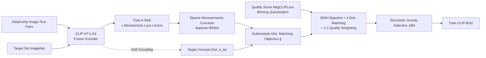

# Matched Data, Better Models: Target Aligned Data Filtering with Sparse Autoencoders

**Conference**: ICLR 2026  
**OpenReview**: [https://openreview.net/forum?id=cgmo3v18sx](https://openreview.net/forum?id=cgmo3v18sx)  
**Code**: To be confirmed  
**Area**: Data Filtering / Submodular Optimization / Vision-Language Pre-training  
**Keywords**: Data selection, Sparse Autoencoders, Submodular Optimization, Distribution Matching, CLIP, DataComp  

## TL;DR
Sparse Autoencoders (SAEs) are used to decompose CLIP features into "countable" monosemantic concepts. Data filtering is then modeled as a submodular maximization problem (SDM) where the concept distribution of a selected subset is aligned with a target distribution. On DataComp-medium, this approach approaches state-of-the-art performance with fewer samples and $5\times$ fewer GPU hours.

## Background & Motivation
**Background**: Web-crawled image-text data (e.g., DataComp 128M pairs) serves as the fuel for vision-language models like CLIP, yet it is fraught with noise and redundancy. Mainstream data filtering methods (CLIP-Score, NegCLIPLoss, NormSim, etc.) primarily rely on "per-sample scoring + thresholding": calculating a quality score for each sample and retaining those above a threshold.

**Limitations of Prior Work**: Per-sample independent evaluation **fails to capture properties that only emerge at the set level**. Two high-quality samples may be highly redundant when combined, whereas an isolated, seemingly low-quality sample (e.g., a "green background" image with a low score) might be a scarce source for the model to learn the concept of "green." Filtering by top individual scores leads to concept-level imbalances in the final dataset, limiting generalization.

**Key Challenge**: Balancing concept distributions at the set level requires (1) identifying and **measuring the prevalence of each concept** at the set level, and (2) selecting a subset such that the concept distribution satisfies desired properties. However, standard CLIP representations are **entangled**—a single dimension mixes multiple concepts, making it impossible to quantify "how much a concept occupies a set."

**Goal**: To create an extensible data filtering framework that considers distribution-level properties and integrates with existing quality scores without introducing any external models or data.

**Key Insight**: **① Disentangle into countable concepts**—train a Sparse Autoencoder (SAE) with "monotonicity" constraints, ensuring each feature corresponds to a monosemantic concept whose value increases monotonically with concept frequency. Summing over a set then approximates a "concept count." **② Perform distribution matching**—prove that matching the concept distribution of a selected subset to a target distribution (e.g., ImageNet) is a submodular maximization problem, solvable via greedy algorithms with constant-factor guarantees on millions of data points.

## Method

### Overall Architecture
SDM (Submodular Distribution Matching) follows a three-step process: First, a k-SAE with monotonicity loss is trained on frozen CLIP image embeddings to decompose dense features into ~100k-dimensional sparse monosemantic concepts. Next, the empirical distribution $p^{tar}$ of these concepts is calculated on a target dataset (e.g., ImageNet-1K training set). Finally, the task of "matching the subset distribution to $p^{tar}$" is formulated as maximizing a feature-based submodular function, fused with quantized quality scores, and solved using stochastic greedy selection.

### Key Designs
**1. Feature-Based (FB) Function as a "Concept Distribution" Carrier: Turning subset scoring into concave aggregation of concept counts.** Given a design matrix $Z\in\mathbb{R}^{n\times d}_+$ and a monotonically non-decreasing concave function $\phi_i$, an FB function is defined as $f(A)=\sum_{i=1}^d w_i\,\phi_i\!\big(m_i(A)\big)$, where $m_i(A)=\sum_{j\in A}z_{ji}$ is the total mass of concept $i$ in subset $A$. This form is critical because a larger $z_{ji}$ indicates a stronger presence of concept $i$ in sample $j$ (**monotonicity**), making $\sum m_i(A)$ naturally represent a "count in the set," similar to how term frequency grows in TF-IDF. The **concavity** of $\phi_i$ introduces diminishing returns—once a concept is sufficiently represented, adding similar samples yields little benefit, providing the mathematical basis for suppressing redundancy and encouraging diversity.

**2. Monotonicity Loss $L_{mono}$: Making SAE activations not just "monosemantic," but "usable as counts."** Reconstruction loss in k-SAE can learn monosemantic features, but monosemanticity does not imply monotonicity—a neuron firing for "birds" might have higher activation for an image with more non-bird objects, meaning its value does not reflect concept "intensity." The paper constructs a contrastive term inspired by peripteral loss: sampling a heterogeneous set $E$ (more concepts) and a homogeneous set $M$ (fewer concepts), defining a margin $\Delta(E|M)$ by the difference in pairwise similarities in dense space, and instantiating the unweighted FB function $f(A)=\sum_i\log(1+m_i(A))$:
$$L_{mono}(E,M)=|\Delta(E|M)|\cdot\log\!\Big(1+\exp\big(\tfrac{1-f(E)-f(M)}{\Delta(E|M)}\big)\Big)$$
This forces the sign and magnitude of $f(E)-f(M)$ to align with the margin. Since $f$ is concave, increasing already activated features yields little gain; the most efficient way to reduce loss is to allow new concepts in $E$ to **activate new features**, pushing representations toward monotonic growth with concept presence. $M$ is constructed from nearest neighbors of elements in $E$, requiring no ground-truth concept labels.

**3. Distribution Matching ≡ Submodular Difference (DS) Maximization: Transforming KL divergence minimization into an optimizable submodular problem.** Defining the empirical histogram distribution as $p(A)_i=m_i(A)/\sum_j m_j(A)$, the goal is to choose $A$ to minimize $D_{KL}(p^{tar}\,\|\,p^{source}(A))$. The paper proves (Thm 2.3) that this is equivalent to:
$$\arg\max_{A}\sum_i p^{tar}_i\log m_i(A)-\log\Big(\sum_j m_j(A)\Big)\triangleq g(A),$$
which is the maximization of a Submodular Difference (DS) function. As no polynomial approximation algorithm exists for DS maximization, Lemma 2.4 is used to upper-bound $\log\sum_j m_j(A)$ by $\log(k\beta b)$ (a constant under cardinality constraints), yielding a submodular lower bound $\hat g(A)=\sum_i p^{tar}_i\log m_i(A)-\log(k\beta b)$. This allows for efficient solving via stochastic greedy with constant-factor guarantees. An active regularization term lowers $\beta$ to tighten the bound.

**4. Binning Fusion with Quality Scores: Integrating noisy quality scores through coarse-grained preferences.** Adding a modular quality score $\sum_{a\in A}q(a)$ directly to $\hat g$ remains submodular, but $q$ does not decrease with $|A|$, potentially overwhelming the distribution matching term. Furthermore, point-wise $q$ is noisy. SDM quantizes $q$ into bins to construct another FB function $q'(A)=\sum_{i\in[\ell]}u_i\log(1+\sum_{j\in A}\mathbb{1}[q(j)\in[b_{i-1},b_i)])$, utilizing only coarse preferences like "high/medium/low" (weights 0/0.01/0.99 in experiments). The final objective is balanced by $\lambda$:
$$\max_{|A|=b}\;\lambda\sum_i p^{tar}_i\log(1+m_i^{src}(A))+(1-\lambda)\sum_i u_i\log\big(1+\textstyle\sum_{j\in A}\mathbb{1}[q(j)\in\text{bin }i]\big)$$
Both terms share the same structure (KL-based distribution matching), and the overall objective is a monotonic submodular function optimized via stochastic greedy.

## Key Experimental Results

### Main Results (DataComp-medium, single CLIP ViT-L/14 model, no external models)

| Filtering Strategy | Subset | IN1K | IN1K Shifts | VTAB | Retrieval | Avg |
|---|---|---|---|---|---|---|
| No Filter | 128M | 17.6 | 15.2 | 25.9 | 21.9 | 25.8 |
| CLIP-Score | 38M | 27.3 | 23.0 | 33.8 | 25.1 | 32.8 |
| negCLIPLoss (NCL) | 33M | 28.8 | 23.8 | 35.4 | 25.3 | 34.4 |
| NCL ∩ NormSim (IN1K) | 22M | 32.8 | 26.8 | 36.2 | 26.5 | 35.3 |
| NCL ∩ NormSim (Target) | 22M | 32.7 | 26.5 | 37.5 | 26.5 | 35.7 |
| **SDM (Ours)** | **18M** | **35.2** | **27.1** | **38.6** | **26.8** | **36.4** |

SDM outperforms the strongest baseline on ImageNet-1K by **2.5%** using fewer samples (18M vs 22M), with an average gain of 0.7%. The advantage is even more pronounced at smaller subset sizes (leading by nearly 2% on IN1K with 33% fewer samples), which the authors attribute to its redundancy reduction capabilities.

### Ablation Study
**Monotonicity Loss $L_{mono}$ (MS=Monosemanticity Score↑, MT=Monotonicity Score↑)**

| Training Loss | MS(IN1K) | MT(IN1K) | IN1K Acc | Avg |
|---|---|---|---|---|
| $L_{recons}$ | 0.60 | 0.60 | 34.80 | 35.00 |
| $L_{recons}+L_{mono}$ | 0.63 | 0.65 | 35.20 | 36.40 |

**Sparse Features + Submodularity (IN1K / 38-task Avg)**

| Feature Type | Submodular | Non-submodular |
|---|---|---|
| Sparse (SAE) IN1K | 35.2 | 34.6 |
| Dense (CLIP) IN1K | 24.1 | 23.7 |
| Sparse (SAE) Avg | 36.4 | 35.1 |
| Dense (CLIP) Avg | 29.1 | 28.9 |

Sparse features are critical: reverting to dense CLIP features causes an **~12%** drop on IN1K and a 9% drop on average. Removing the $\log$ concave term (removing submodularity) leads to a 1.3% average performance decrease.

### Key Findings
- **Robustness across Backbones/Quality Scores**: SDM consistently outperforms NormSim across ViT-L/14, ViT-B/32, and DFN-P backbones, as well as CLIPScore and NegCLIPLoss, validating that "distribution-awareness > per-sample evaluation."
- **Strong performance with external models**: Integrating SDM with NCL+DFN+HYPE ensembles (using dual SAE features from CLIP ViT-L/14 + DINOv2) achieves 39.2% IN1K / 39.2% Avg, ranking 2nd on the DataComp-medium leaderboard. The only method outperforming it (Metagradient Descent) is 12.2% lower on IN1K and requires **5×+** the computational cost.
- **Computational Cost**: SAE training takes 15 A100h (independent of candidate pool size), and stochastic greedy selection of 25M from 128M takes approximately 1 CPU hour.

## Highlights & Insights
- **"Countability" of concepts is the core insight**: Separating monosemanticity ("what is it") from monotonicity ("how much is there") allows set sums to equate to concept counts. This is the key to connecting interpretability tools (SAE) to optimization objectives.
- **Elegant Equivalence Proof**: Rigorously formulating "KL minimization of concept distributions" as submodular difference maximization and using cardinality constraints to simplify normalization terms allows the method to leverage constant-factor guarantees and linear scalability.
- **Pragmatic Binning of Quality Scores**: Acknowledging noise in point-wise quality scores by adopting coarse preferences and reusing the isomorphic FB form ensures robustness without breaking the submodular structure.
- **Feedback for Interpretability**: Since $L_{mono}$ raises both MS and MT scores, it offers valuable insights for the SAE interpretability community.

## Limitations & Future Work
- **Dependency on Target Distribution**: The method defaults to ImageNet-1K; whether the target set represents real downstream tasks directly affects selection quality. How to set target distributions for highly diverse or unknown tasks remains an open question.
- **SAE Dimensionality and Hyperparameter Costs**: Parameters like $d_{sparse}\approx 98k$, TopK, $\lambda$, and binning weights are numerous and may require retuning for new domains. Evaluations were primarily conducted at the DataComp-medium scale.
- **Soft Monotonicity**: $\Delta(E|M)$ approximates true concept differences using dense space similarity; "concepts" themselves remain vaguely defined, and monotonicity is a soft constraint rather than a strict guarantee.
- **Requirement for Pre-trained Embeddings**: The method assumes access to high-quality CLIP/DINOv2 embeddings, which may limit its use in fields lacking strong pre-trained encoders (e.g., specific biomedical domains)—though the authors market this as "not needing additional training of specialized models."

## Related Work & Insights
- **Per-sample Quality Filtering**: CLIP-Score, NegCLIPLoss, NormSim, DFN, and HYPE serve as both the baseline and the integration targets for this work.
- **Target-aware/Submodular Selection**: This work follows the lineage of D2 Pruning and submodular selection for diversity, contributing a bridge between "distribution matching" and submodularity from a KL perspective.
- **SAEs and Interpretability**: k-SAE and monosemanticity research provide the tools for feature disentanglement, while this work reciprocally gives back to the interpretability community by introducing monotonicity constraints.
- **Inspiration**: Formalizing "set-level distributional properties" as optimizable objectives is a data-centric path worth extending to LLM pre-training corpora and RAG document selection.

## Rating
- **Novelty**: ⭐⭐⭐⭐⭐ Integrates SAE monosemantic/monotonic disentanglement, submodular distribution matching, and quality binning into a rigorous framework.
- **Experimental Thoroughness**: ⭐⭐⭐⭐ Includes comprehensive main tables, cross-backbone tests, and ablations on monotonicity and sparsity, though scale and target sensitivity could be further explored.
- **Writing Quality**: ⭐⭐⭐⭐ Clear motivation, well-structured theorems and algorithms, with technical details appropriately moved to the appendix.
- **Value**: ⭐⭐⭐⭐⭐ Approaching SOTA with $5\times$ less compute and no external models makes it highly practical for resource-constrained large-scale data filtering.

<!-- RELATED:START -->

## Related Papers

- [\[NeurIPS 2025\] Projecting Assumptions: The Duality Between Sparse Autoencoders and Concept Geometry](../../NeurIPS2025/optimization/projecting_assumptions_the_duality_between_sparse_autoencoders_and_concept_geome.md)
- [\[ICLR 2026\] Evaluating Data Influence in Meta Learning](evaluating_data_influence_in_meta_learning.md)
- [\[ICLR 2026\] Jacobian Aligned Random Forests](jacobian_aligned_random_forests.md)
- [\[ICLR 2026\] Fast Data Mixture Optimization via Gradient Descent](fast_data_mixture_optimization_via_gradient_descent.md)
- [\[ICLR 2026\] Generalization Below the Edge of Stability: The Role of Data Geometry](generalization_below_the_edge_of_stability_the_role_of_data_geometry.md)

<!-- RELATED:END -->
