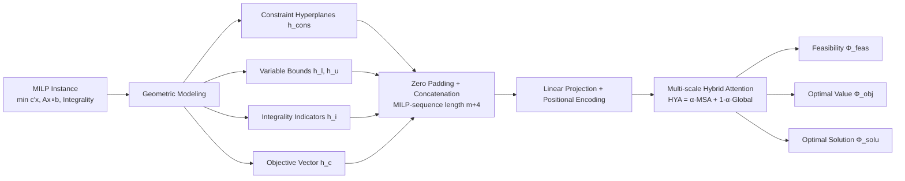

# MILPnet: A Multi-Scale Architecture with Geometric Feature Sequence Representations for Advancing MILP Problems

**Conference**: ICLR 2026  
**OpenReview**: [https://openreview.net/forum?id=pkwq3F7gUp](https://openreview.net/forum?id=pkwq3F7gUp)  
**Code**: [https://github.com/ijklkjhggfajhhjkj/Seq_MILP](https://github.com/ijklkjhggfajhhjkj/Seq_MILP)  
**Area**: Combinatorial Optimization / Learning to Optimize (MILP Representation Learning)  
**Keywords**: Mixed Integer Linear Programming, MILP, Geometric Sequence Representation, Multi-scale Attention, Foldable MILP, WL-test, Feasibility Prediction  

## TL;DR
The authors reformulate MILP instances from "bipartite graphs" into "geometric feature sequences." By employing multi-scale hybrid attention modeling, the approach fundamentally bypasses the expressiveness bottleneck of GNNs restricted by the Weisfeiler-Lehman (WL) test—which fails to distinguish **Foldable MILPs**—while providing theoretical guarantees for approximating feasibility, optimal solutions, and optimal value mappings.

## Background & Motivation
- **Background**: MILP is a core NP-hard combinatorial optimization problem. Traditional Branch-and-Bound / Cutting Plane methods suffer from exponential cost on large-scale instances. Recent mainstream approaches model MILP instances as "variable-constraint" bipartite graphs, using GNNs for message passing to predict feasibility, optimal solutions, or to accelerate solving.
- **Limitations of Prior Work**: Bipartite graphs only encode the connectivity between variables and constraints, **missing high-order interactions between constraints**. These interactions often encode crucial information such as the shape of the feasible region and the location of the optimal solution.
- **Key Challenge**: The expressiveness of GNNs is upper-bounded by the WL-test. There exist pairs of **Foldable MILPs**: two non-isomorphic instances where one is feasible and the other is not, yet they appear identical to GNNs (Theorem 1, from Chen et al. 2023b). Injecting random features (RF variants) merely "bypasses" the WL limit without capturing the geometric essence of the MILP, still failing on complex Foldable instances.
- **Goal**: To find a **beyond-graph representation** that enables robust feasibility prediction and high-fidelity representation for general MILPs (especially Foldable MILPs).
- **Core Idea**: **[Computational Geometry Perspective]** View MILP as a collection of hyperplanes/half-spaces (linear constraints + variable bounds), discrete integer point sets (integrality constraints), and direction vectors (objective function). **[Sequentialization]** Construct a sequence by treating these geometric feature vectors as individual tokens (representing MILP as a sequence for the first time). **[Multi-scale Hybrid Attention]** Simultaneously model local and global geometric structures with provable approximation theory.

## Method

### Overall Architecture
MILPnet consists of two stages (Figure 2 in the paper): first, an MILP instance is **geometrized and serialized** into an MILP-sequence (where constraint hyperplanes, variable bounds, integrality indicators, and the objective vector each form a token). Then, this sequence is fed into a **multi-scale hybrid attention network** to output three mappings: feasibility, optimal objective value, and optimal solution. The representation is established on a measurable topological space $\mathcal{H}_{\text{MILP}}$, allowing for a unified approximation theorem.

### Key Designs

**1. Geometric Sequence Representation (MILP-sequence): Treating constraints as "points" instead of "graph nodes."** Each linear constraint is encoded as a hyperplane token $h^i_{\text{cons}}=(n_i,d_i,b_i)$, where $n_i\in\mathbb{R}^n$ is the normal vector, $d_i\in\{-1,0,1\}$ indicates the inequality direction, and $b_i$ is the bias. Variable bounds are encoded as $h_\ell, h_u$, integrality constraints as a 0/1 indicator vector $h_i\in\{0,1\}^n$, and the objective function as a coefficient vector $h_c\in\mathbb{R}^n$. These tokens are zero-padded to $\mathbb{R}^{n+2}$ and concatenated into a sequence $x=[h^1_{\text{cons}},\dots,h^m_{\text{cons}},h_{i'},h_{\ell'},h_{u'},h_{c'}]$ with length $m+4$. Crucially, constraint, integer point, and variable bound tokens are **permutation invariant** (Theorem 6/7) and can be ordered arbitrarily, while the objective token is fixed at the end due to its unique role. Explicitly representing constraints as parallel sequence elements allows the model to learn "constraint-to-constraint" interactions directly—the missing dimension in GNNs and the reason MILPnet can distinguish Foldable MILPs.

**2. Multi-scale Attention with Shifted Windows (MSA): Reading the local topology of the feasible region with different granularities.** For position $i$, a neighborhood $[i_{\min},i_{\max}]$ is taken with window size $\eta_k$, and **the objective token (position $m+4$) is forced into every window** $\eta_k(i)=\{j\in[i_{\min},i_{\max}]\}\cup\{m+4\}$. This ensures that local constraints are always aware of the overall optimization objective. Standard scaled dot-product attention is computed within each window: $\alpha^{\eta_k}_{ij}=\mathrm{softmax}\!\big(Q^{\eta_k}_i\cdot (K^{\eta_k}_j)^\top/\sqrt{d_k}\big)$. The results from $N$ different window sizes are computed in parallel and averaged to obtain the multi-scale representation $\text{Att}_{\text{multi}}=\frac1N\sum_{k=1}^N\sum_i\sum_{j\in\eta_k(i)}\alpha^{\eta_k}_{ij}V^{\eta_k}_j$. Small windows capture local geometry of adjacent constraints, while large windows (up to $m+4$) approximate a global view. Multi-scale averaging makes the model robust to changes in the number or scale of constraints, which is key to its cross-scale generalization.

**3. Hybrid Attention (HYA): Learnable fusion of multi-scale local and global attention.** A learnable scalar $\alpha$ linearly fuses multi-scale local attention with global attention: $\text{Att}_{\text{hybrid}}=\alpha\cdot\text{Att}_{\text{multi}}+(1-\alpha)\cdot\text{Att}_{\text{global}}$. This is followed by a standard Transformer block with residuals and LayerNorm: $\hat z_l=\text{HYA}(z_{l-1})+z_{l-1},\ z_l=\text{MLP}(\text{LN}(\hat z_l))+\hat z_l$. Ablation shows that removing either HYA or MSA causes MSE to degrade from near zero to 0.25 (equivalent to random guessing), indicating both are essential. The overall time complexity is $O\big(h\,d\,(m+4)^2(N+1)\big)$, with a stride-sparse variant available to reduce complexity to $1/s$.

**4. Approximation Theory on Measurable Spaces: Elevating "approximability" from empirical observation to theorem.** The authors prove that padded and non-padded geometric spaces are homeomorphic (no information loss). Within the measurable topological space $\mathcal{H}_{\text{MILP}}$, they prove that for any finite dataset and any $\epsilon,\delta>0$, there exists an HYA network that can approximate the **feasibility mapping** $\Phi_{\text{feas}}$ (Theorem 2), the **optimal objective value mapping** $\Phi_{\text{obj}}$ (Theorem 3, including finite/unbounded classification and regression), and the **optimal solution mapping** $\Phi_{\text{solu}}$ (Theorem 4) with arbitrary precision. During training, the objective is to minimize $L(\phi)=\mathbb{E}[\|y-F_\phi(x)\|^2]$. These guarantees correspond directly to the three end-to-end tasks in the experiments, clarifying why sequence representation does not theoretically lose solvability information.

## Key Experimental Results

### Main Results Table (Foldable Feasibility Prediction, FOLD(n,m))

| Method | Type | FOLD(20,6) MSE | ErrorN | FOLD(50,30) MSE | ErrorN | Params |
|---|---|---|---|---|---|---|
| GCN | Graph | 0.3073 | 5000 | 0.3556 | 5000 | 1.21M |
| GraphGPS | Graph | 0.2500 | 5000 | 0.2500 | 5000 | 0.66M |
| GCNrf| RF Graph | 0.2498 | 5000 | 0.5223 | 5000 | 1.21M |
| **MILPnet** | **Seq(Ours)** | **0.0005** | **0** | **0.0023** | **12** | **0.60M** |

> All graph models exhibit an ErrorN of 5000 (meaning all 5000 test samples were misclassified, equivalent to random guessing). MILPnet reduces MSE by 1–3 orders of magnitude and reduces ErrorN to nearly 0, all while using fewer parameters (0.56–0.60M).

Large-scale Generalization (1-hour pre-training): On FOLD(200,20), MILPnet achieved MSE=0.0155 / ErrorN=191. On FOLD(500,60), MSE=0.1832 / ErrorN=2453. In contrast, all graph models remained stuck around 0.25 / 5000.

Real-world MILP Benchmarks (Predict+Search, optimality gap↓):

| Method | IP gap | SC gap | CA gap | FC gap |
|---|---|---|---|---|
| Random | 36.54 | 1.72 | 2.81 | 1.49 |
| GCN | 0.0389 | 1.1461 | 0.9890 | 0.4257 |
| **MILPnet** | **0.0234** | **0.3483** | **0.0139** | **0.3503** |

MILPnet yields the smallest gap and shortest total solving time (ST) across four real-world benchmarks, with significantly lower prediction time (PT) for candidate solutions.

### Ablation Study

| Setting | FOLD(20,6) MSE/ErrorN | FOLD(50,20) | FOLD(100,20) |
|---|---|---|---|
| MILPnet (full) | 0.0001 / 0 | 0.0001 / 0 | 0.0074 / 6 |
| w/o HYA | 0.2503 / 5036 | 0.2501 / 4999 | 0.2501 / 4987 |
| w/o MSA | 0.2500 / 5051 | 0.2500 / 5008 | 0.2500 / 4995 |

Efficiency of maximum window size $\eta_{\max}$: Performance was best at $\eta_{\max}=2$ or $3$. At $\eta_{\max}=4$, the ErrorN for FOLD(50,30) rose from ~235 to 764, suggesting that excessively large windows dilute local geometric signals.

### Key Findings
- **Geometric Sequence ≫ Graph**: On Foldable MILPs, graph models generally "fail to learn" (non-convergent curves), while MILPnet quickly converges to near-zero ErrorN, providing empirical support for Theorems 2–4.
- **Smaller and Faster**: MILPnet has fewer parameters, the fastest inference, and requires < 4GB GPU memory (FOLD300). The stride-sparse variant further reduces complexity.
- **Transferable to Real Solving**: When integrated into a predict+search pipeline, MILPnet achieves the smallest gaps and shortest solving times even on Unfoldable real-world benchmarks (e.g., ML4CO).

## Highlights & Insights
- **Paradigm Shift over Patching**: Instead of patching graphs (random features merely bypass WL), the authors switch to a "Computational Geometry + Sequence" representation to eliminate the WL expressiveness bottleneck fundamentally.
- **One-to-One Theory-Task Mapping**: Three approximation theorems for feasibility, optimal value, and optimal solution align perfectly with the three end-to-end experimental tasks, ensuring the theory is functional rather than decorative.
- **Serious Treatment of Permutation Invariance**: By making constraint tokens order-independent while fixing the objective token at the end, the model maintains the symmetry of the MILP while acknowledging the special status of the objective.

## Limitations & Future Work
- **Anonymized Codebase**: Reproducibility remains to be verified upon open-sourcing.
- **Quadratic Complexity**: Sequence length $m+4$ grows linearly with the number of constraints, leading to $O((m+4)^2)$ attention cost. While a stride-sparse variant is provided, its accuracy trade-offs are not fully explored.
- **Reliance on Heuristics**: MILPnet does not directly produce feasible integer solutions; its "end-to-end solver" capability is limited as it still depends on predict+search pipelines.
- **Gap between Existence and Practice**: The approximation theorems are existence proofs for finite datasets; the gap between these and actual trainability/generalization bounds persists.

## Related Work & Insights
- **GNN for MILP** (Gasse 2019, Nair 2021, Chen 2023b): These served as the direct competition, providing the theoretical targets of Foldable MILPs and WL upper bounds.
- **Random Feature Enhanced Graphs** (RF variants by Chen 2023b): Used as baselines for "bypassing WL," which MILPnet proved still fail on complex Foldable instances.
- **Transformer / Shifted Window Attention** (Swin-style windows, GraphGPS): MSA borrows the multi-scale idea of shifted windows but applies it to MILP geometric sequences.
- **Insight**: When a structured object (graph, set, point cloud) is limited by expressiveness theorems (like WL or 1-WL), **changing the underlying representation space** (e.g., to a geometric sequence + measurable topology) is often more effective than adding tricks within the original space.

## Rating
- **Novelty**: ⭐⭐⭐⭐⭐ First to represent MILP as geometric feature sequences to bypass GNN WL bottlenecks, supported by complete approximation theory.
- **Experimental Thoroughness**: ⭐⭐⭐⭐ Covers small/large Foldable instances, three end-to-end tasks, real-world benchmarks, and multiple ablations. Point deducted for reliance on external search for real benchmarks.
- **Writing Quality**: ⭐⭐⭐⭐ Logical chain from geometric modeling to sequence/attention to theorems is clear. High theoretical density may pose a barrier to readers without an optimization background.
- **Value**: ⭐⭐⭐⭐ Provides a viable graph-alternative representation for "learning to optimize MILP" that is smaller, faster, and theoretically grounded.

<!-- RELATED:START -->

## Related Papers

- [\[ICLR 2026\] A Memory-Efficient Hierarchical Algorithm for Large-scale Optimal Transport Problems](a_memory-efficient_hierarchical_algorithm_for_large-scale_optimal_transport_prob.md)
- [\[ICLR 2026\] Neural Multi-Objective Combinatorial Optimization for Flexible Job Shop Scheduling Problems](neural_multi-objective_combinatorial_optimization_for_flexible_job_shop_scheduli.md)
- [\[ICLR 2026\] Taming Curvature: Architecture Warm-up for Stable Transformer Training](taming_curvature_architecture_warm-up_for_stable_transformer_training.md)
- [\[ICLR 2026\] Learning to Segment for Vehicle Routing Problems](learning_to_segment_for_vehicle_routing_problems.md)
- [\[ICLR 2026\] LMask: Learn to Solve Constrained Routing Problems with Lazy Masking](lmask_learn_to_solve_constrained_routing_problems_with_lazy_masking.md)

<!-- RELATED:END -->
## Related Papers

- [\[ICLR 2026\] A Memory-Efficient Hierarchical Algorithm for Large-scale Optimal Transport Problems](a_memory-efficient_hierarchical_algorithm_for_large-scale_optimal_transport_prob.md)
- [\[ICLR 2026\] Neural Multi-Objective Combinatorial Optimization for Flexible Job Shop Scheduling Problems](neural_multi-objective_combinatorial_optimization_for_flexible_job_shop_scheduli.md)
- [\[ICLR 2026\] Taming Curvature: Architecture Warm-up for Stable Transformer Training](taming_curvature_architecture_warm-up_for_stable_transformer_training.md)
- [\[ICLR 2026\] NeuCLIP: Efficient Large-Scale CLIP Training with Neural Normalizer Optimization](neuclip_efficient_large-scale_clip_training_with_neural_normalizer_optimization.md)
- [\[ICLR 2026\] LMask: Learn to Solve Constrained Routing Problems with Lazy Masking](lmask_learn_to_solve_constrained_routing_problems_with_lazy_masking.md)

<!-- RELATED:END -->
