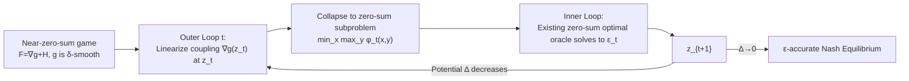

# Monotone Near-Zero-Sum Games: A Generalization of Convex-Concave Minimax

**Conference**: ICLR 2026  
**OpenReview**: [https://openreview.net/forum?id=rAeAKiy116](https://openreview.net/forum?id=rAeAKiy116)  
**Code**: [https://github.com/riekenluo/Monotone_Near_Zero_Sum_Games](https://github.com/riekenluo/Monotone_Near_Zero_Sum_Games)  
**Area**: optimization / convex optimization / game theory / minimax optimization  
**Keywords**: monotone games, near-zero-sum games, convex-concave minimax, Nash equilibrium, gradient complexity, black-box reduction  

## TL;DR
This paper defines a new game class between monotone zero-sum and general-sum games—**monotone $\delta$-near-zero-sum games**. It proposes the ICL algorithm to black-box reduce the problem into a sequence of zero-sum subproblems. When the game is "sufficiently close to zero-sum," the gradient complexity of non-zero-sum games is accelerated from $O(L/\min\{\mu,\nu\})$ to $O(L/\sqrt{\mu\nu})$, approaching the zero-sum optimal rate for the first time.

## Background & Motivation

**Background**: **Monotone games** on compact convex strategy spaces represent one of the few computationally tractable classes in game theory. Over the past decade, minimax optimization research (Lin et al. 2020, Kovalev & Gasnikov 2022, Lan & Li 2023, etc.) has achieved the minimax optimal gradient complexity for **monotone zero-sum games** (convex-concave minimax): $O\!\left(\frac{L}{\sqrt{\mu\nu}}\log\frac{D^2}{\varepsilon}\right)$, where $\mu,\nu$ are the strong convexity/concavity moduli, $L$ is smoothness, and $D$ is the diameter.

**Limitations of Prior Work**: The complexity of monotone **general-sum** games has remained stuck at the old bounds of Tseng (1995) and Nemirovski (2004): $O\!\left(\frac{L}{\min\{\mu,\nu\}}\log\frac{D^2}{\varepsilon}\right)$. When the condition numbers of the two players differ significantly ($\mu\ll\nu$), $\sqrt{\mu\nu}$ is much larger than $\min\{\mu,\nu\}$. Thus, a massive theoretical gap has existed between zero-sum and general-sum games for decades.

**Key Challenge**: Real-world games are often **not strictly zero-sum**—betting sites take commissions, third parties collect brokerage fees, or competition involves minor cooperative incentives (semi-cooperative games). All these require relaxing the zero-sum assumption. However, once moving away from zero-sum, acceleration techniques fail: zero-sum optimal algorithms rely on Catalyst regularization for smoothing, but in non-zero-sum settings, adding regularization terms degrades the problem into a Stackelberg game, causing the solution to deviate significantly from the Nash equilibrium. Smoothing techniques cannot be directly adapted.

**Goal**: To find an intermediate class between zero-sum and general-sum games that covers practical scenarios with "small perturbations" while allowing the reuse of fast zero-sum algorithms, thereby partially bridging the gap.

**Core Idea**: ① **Measure how close a game is to zero-sum using a smoothness parameter $\delta$**—decompose the utility into a "zero-sum part $h$ + coupling part $g$," and let $g$ be $\delta$-smooth. $\delta=0$ recovers zero-sum, while $\delta=L$ represents general-sum, with continuous interpolation in between. ② **Iteratively linearize the coupling term** to black-box reduce the near-zero-sum game into a series of zero-sum subproblems, each solved by an existing zero-sum optimal algorithm oracle.

## Method

### Overall Architecture

ICL (Iterative Coupling Linearization) is a black-box reduction framework consisting of an **outer loop and an inner loop**. The game operator is written as $F=\nabla g + H$ ($g$ is the joint convex coupling part, $H$ is the operator for the convex-concave zero-sum part). The outer loop linearizes the "difficult" coupling term $g$ at the current point $z_t$, collapsing the subproblem into a standard strongly monotone **zero-sum** saddle point problem $\min_x\max_y \varphi_t(x,y)$. The inner loop uses any existing zero-sum optimal algorithm to solve this subproblem to accuracy $\varepsilon_t$ to obtain $z_{t+1}$. The process is driven by a potential function $\Delta(z)$, where reaching $\Delta(z)=0$ is equivalent to finding a Nash equilibrium.

### Key Designs

**1. Near-zero-sum parameter $\delta$: Quantifying the "distance from zero-sum" with a scalar.** The paper rewrites the utilities $u_1, u_2$ using a symmetric decomposition: $g=-\tfrac12(u_1+u_2)$ and $h=\tfrac12(-u_1+u_2)$, such that $u_1=-g-h$ and $u_2=-g+h$. Here, $h$ is the naturally convex-concave zero-sum part (satisfying Assumption 1: $h-\tfrac\mu2\|x\|^2$ is convex in $x$, $h+\tfrac\nu2\|y\|^2$ is concave in $y$), and $g$ is the joint convex coupling part (Assumption 2). The new **Assumption 3** only requires $g$ to be $\delta$-smooth ($\delta\in[0,L]$). When $\delta=0$, $g$ is affine and the game is zero-sum; when $\delta=L$, it represents any general-sum game. This single-parameter characterization is powerful because it **constrains only the smoothness of the coupling term, not its magnitude**, allowing "near-zero-sumness" to be a structural quantity that algorithms can explicitly exploit.

**2. Potential function $\Delta(z)$: Translating "finding equilibrium" into "minimizing a decomposable scalar function."** The paper defines:
$$\Delta(z)=\max_{\tilde z}\Big[\underbrace{g(z)-g(\tilde z)}_{\text{joint convex coupling}}+\underbrace{h(x,\tilde y)-h(\tilde x,y)}_{\text{convex-concave zero-sum}}\Big]\ge 0,$$
and proves (Prop. 3–4) that in monotone games, $z^*$ is a Nash equilibrium if and only if $\Delta(z^*)=0$, and $2\Delta(z)$ upper bounds the sum of regrets. Crucially, $\Delta$ **splits cleanly into a joint convex block and a convex-concave block**. Since zero-sum blocks are handled efficiently by existing fast algorithms, only the joint convex coupling block needs to be "tamed" via linearization.

**3. Coupling Linearization: Collapsing non-zero-sum subproblems into zero-sum saddle points.** At step $t$, ICL only performs a first-order expansion on the coupling term $g$ within $\Delta$ at $z_t$: $\langle\nabla g(z_t),\,z-\tilde z\rangle$, coupled with a proximal regularization $\tfrac{1}{2\eta_t}(\|z-z_t\|^2-\|\tilde z-z_t\|^2)$. The zero-sum term $h$ is preserved. This min-max problem decouples into two independent subproblems, which, by Sion's minimax theorem, unify into a single saddle-point objective:
$$\varphi_t(x,y)=\langle\nabla_x g(z_t),x\rangle+\tfrac{1}{2\eta_t}\|x-x_t\|^2+h(x,y)-\langle\nabla_y g(z_t),y\rangle-\tfrac{1}{2\eta_t}\|y-y_t\|^2.$$
Since linear and quadratic proximal terms are additive, $\varphi_t$ remains a standard $\mu,\nu$-strongly convex-concave **zero-sum** saddle point problem. **Any** zero-sum optimal algorithm (Lifted Primal-Dual is used in experiments) can be applied as a black-box oracle.

**4. Descent Lemma + Step-size Selection: Translating $\delta$ into convergence rate.** The core is Lemma 5 (Descent Lemma): when the step size $\eta_t\le 1/\delta$, then $\left(\tfrac{1}{2\eta_t}+\tfrac{\min\{\mu,\nu\}}{2}\right)\|z_{t+1}-z^*\|^2\le \tfrac{1}{2\eta_t}\|z_t-z^*\|^2+\varepsilon_t$. The step size is limited by $\delta$—the closer the game is to zero-sum (smaller $\delta$), the larger the step size allowed and the faster the outer loop converges. By setting $\eta=\min\{1/\delta,\,1/\min\{\mu,\nu\}\}$, the outer loop requires only $\tilde O(1)$ iterations. Combining this with the inner loop complexity yields the **Main Theorem** for total gradient complexity:
$$\tilde O\!\left(\Big(\frac{L}{\sqrt{\mu\nu}}+\frac{L}{\min\{\mu,\nu\}}\cdot\min\Big\{1,\sqrt{\tfrac{\delta}{\mu+\nu}}\Big\}\Big)\log^2\frac{D^2}{\varepsilon}\right).$$
When $\delta=0$, the second term vanishes, recovering the zero-sum optimal rate $O(L/\sqrt{\mu\nu})$. When $\min\{\mu,\nu\}+\delta=o(\max\{\mu,\nu\})$, it is strictly superior to Tseng (1995)'s $O(L/\min\{\mu,\nu\})$. **This marks the first improvement in the complexity upper bound for non-zero-sum game classes in decades.**

## Key Experimental Results

Experiments aim to **verify theory rather than target SOTA**. A "matrix game with transaction fees" from Example 1 is used: $n=m=10000$, $\mu=10^{-4}$, $\nu=1$, $\varepsilon=10^{-7}$, sparse random matrix $\|M\|=1$, and transaction fee $\rho$ swept from 0% to 0.18%. ICL uses Lifted Primal-Dual as the inner loop, compared against standard VI methods OGDA and EG.

### Main Results: Gradient Queries Required for Convergence (in thousands, 2-sigma / 10 runs)

| Method | $\rho=$0.00% | 0.03% | 0.06% | 0.09% | 0.12% | 0.15% | 0.18% |
|------|------|------|------|------|------|------|------|
| **ICL (Ours)** | **9.1** | **22.6** | **42.2** | **65.0** | **75.7** | 113.7 | 123.8 |
| OGDA (Popov 1980) | 93.9 | 93.9 | 93.9 | 93.9 | 93.9 | 94.0 | 94.0 |
| EG (Korpelevich 1976) | 132.9 | 132.9 | 132.9 | 132.9 | 132.9 | 132.9 | 132.9 |

### Key Findings

- **Faster when closer to zero-sum**: ICL's query count increases monotonically with the transaction fee $\rho$ (9.1k→123.8k). At $\rho=0$ (pure zero-sum), it takes only 9.1k, which is over 10x faster than OGDA, validating the $\min\{1,\sqrt{\delta/(\mu+\nu)}\}$ term in the main theorem.
- **VI methods fail to exploit near-zero-sum dividends**: The query counts for OGDA/EG remain almost constant regardless of $\rho$ (~94k / ~133k) because they operate directly on the operator $F$ via Variational Inequality (VI) and are blind to the zero-sum structure.
- **Critical point aligns with theory**: ICL is strictly faster than OGDA when $\rho\le 0.12\%$. The theoretical acceleration condition predicted by Example 1 is $\rho\|\mathrm{abs}(M)\|\ll\sqrt{\mu\nu}=1\%$, and the experimental threshold falls within this magnitude.

## Highlights & Insights

- **A new problem class from a single scalar**: Using $\delta$ (coupling smoothness) as an interpolation axis transforms "near-zero-sumness" from a vague intuition into a provable, exploitable continuous structure, with clean degradation at $\delta=0/L$.
- **Engineering value of black-box reduction**: ICL does not invent a new kernel. Instead, it reuses any state-of-the-art zero-sum algorithm as an oracle. If zero-sum algorithms become faster in the future, near-zero-sum games automatically benefit. This also avoids the pitfall where Catalyst regularization in non-zero-sum settings leads to Stackelberg bias.
- **Convex restructuring expands scope**: For games where the coupling term is not jointly convex (e.g., regularized matrix games), "convex restructuring" techniques reallocate quadratic terms to make the problem applicable. This brings real-world scenarios like "brokerage/exchange fees" and "competition with minor cooperation" under the theoretical umbrella.

## Limitations & Future Work

- **The complexity contains a $\log^2(D^2/\varepsilon)$ factor**, which has one extra logarithmic factor compared to zero-sum games. Whether this can be eliminated remains an open question.
- **Lack of lower bounds**: There are no matching lower bounds for this new class. Proving them might require difficult tools like non-quadratic function constructions.
- **Limited to two players**: Multi-player near-zero-sum games are a highly non-trivial extension. Three-player zero-sum games are inherently as hard as two-player general-sum games, and zero-sum acceleration has not yet been extended to multi-player settings.
- The experimental scale is relatively small and covers a limited set of applications; further empirical validation in larger near-zero-sum matrix games or semi-cooperative scenarios is needed.

## Related Work & Insights

This work sits at the intersection of two lines of research: **minimax optimization** (Nesterov 2005, Nemirovski 2004, Chambolle & Pock 2011, Lin et al. 2020, Kovalev & Gasnikov 2022, Lan & Li 2023), which pushed zero-sum complexity to minimax optimality, and **monotone games/variational inequalities** (Rosen 1965, Tseng 1995), which provide the old bounds for general-sum games. The contribution of this paper is building a bridge between them. The idea of potential function decomposition and coupling linearization also echoes traditions in variational inequalities and semi-cooperative games (Halpern & Rong 2013, Chen et al. 2017). **Insight**: When a gap exists between a "hard class" and an "easy class," introducing a structural parameter that measures "distance to the easy class" and iteratively linearizing the hard parts into easy subproblems is a powerful, generalizable acceleration paradigm beyond game theory.

## Rating
- **Novelty**: ⭐⭐⭐⭐⭐ Defines an entirely new class and improves the complexity upper bound for non-zero-sum games for the first time in decades.
- **Experimental Thoroughness**: ⭐⭐⭐ As a theoretical paper, the experiments primarily serve to verify the theory with smaller scales, but the results align perfectly with theoretical predictions.
- **Writing Quality**: ⭐⭐⭐⭐ The decomposition notation, potential function, and reduction logic progress logically. Main theorems and special cases are clearly articulated.
- **Value**: ⭐⭐⭐⭐ A first step in bridging the zero-sum and general-sum gap. The black-box reduction ensures the method benefits from future zero-sum advancements, offering lasting value to optimization and game theory communities.

<!-- RELATED:START -->

## Related Papers

- [\[ICLR 2026\] Convergence of Regret Matching in Potential Games and Constrained Optimization](convergence_of_regret_matching_in_potential_games_and_constrained_optimization.md)
- [\[ICLR 2026\] Neural Networks Learn Generic Multi-Index Models Near Information-Theoretic Limit](neural_networks_learn_generic_multi-index_models_near_information-theoretic_limi.md)
- [\[ICLR 2026\] Generalization Below the Edge of Stability: The Role of Data Geometry](generalization_below_the_edge_of_stability_the_role_of_data_geometry.md)
- [\[ICLR 2026\] $\mu$LO: Compute-Efficient Meta-Generalization of Learned Optimizers](mulo_compute-efficient_meta-generalization_of_learned_optimizers.md)
- [\[ICLR 2026\] Scalable and Adaptive Trust-Region Learning via Projection Convex Hull](scalable_and_adaptive_trust-region_learning_via_projection_convex_hull.md)

<!-- RELATED:END -->
