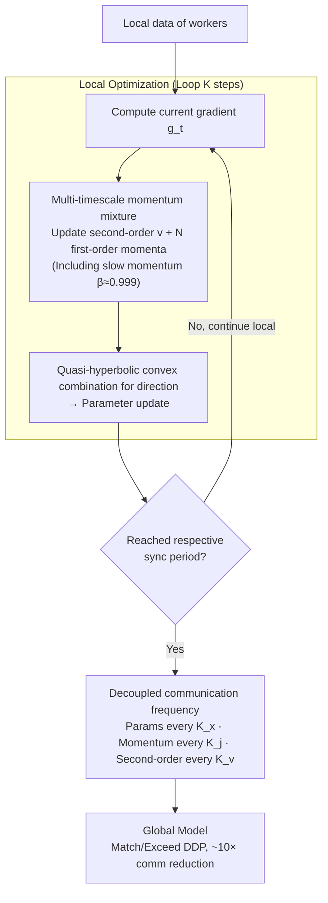

# MT-DAO: Multi-Timescale Distributed Adaptive Optimizers with Local Updates

**Conference**: ICLR 2026  
**arXiv**: [2510.05361](https://arxiv.org/abs/2510.05361)  
**Code**: None  
**Area**: Distributed Optimization / LLM Pre-training  
**Keywords**: Distributed Training, Adaptive Optimizer, Multi-timescale Momentum, Communication Efficiency, Local SGD

## TL;DR

MT-DAO is proposed as a multi-timescale distributed adaptive optimizer that introduces slow momentum (high $\beta$) to resolve the timescale mismatch problem caused by the rapid decay of standard momentum in low-frequency communication training. It provides the first convergence guarantee for such methods, eliminates the performance gap compared to fully synchronous DDP in language model pre-training, and reduces end-to-end training time by 6-27%.

## Background & Motivation

**Communication bottleneck in Distributed Data Parallel (DDP)**: DDP requires gradient synchronization at every step. In networks with limited bandwidth (e.g., cross-datacenter or Ethernet interconnects), communication overhead becomes the primary bottleneck for training efficiency.

**Performance gap in low-frequency communication strategies (e.g., Local SGD)**: Synchronizing parameters every $K$ steps significantly reduces communication, but applying this to adaptive optimizers like Adam results in noticeable performance degradation compared to DDP. Charles et al. (2024) observed that even with a Nesterov momentum outer optimizer, performance lags behind DDP for models below 2.4B parameters with more than two workers.

**Key Challenge: Timescale mismatch**: Standard Adam uses a fast momentum of $\beta_1 \approx 0.9$, with a half-life of $\tau_{0.5}(\beta) = \frac{\ln 0.5}{\ln \beta} \approx 6.6$ steps. When the communication interval $K \gg \tau_{0.5}$ (e.g., $K = 32$), the influence of global momentum decays to $\beta^K \approx 0.03$ after $K$ steps, forcing workers to rely on high-variance local gradients.

**Directly increasing $\beta$ is infeasible**: High-momentum optimizers are less sensitive to changes in the loss landscape and are prone to oscillations, often leading to worse practical performance.

**Key Insight: Multi-momentum approaches**: Methods such as QHM, AggMo, and AdEMAMix have demonstrated that mixing fast and slow momentum can provide long-term memory benefits without sacrificing responsiveness. However, these have not yet been introduced to distributed low-frequency communication scenarios.

## Method

### Overall Architecture

MT-DAO transfers the "multi-momentum mixture" technique from single-machine optimizers to distributed low-frequency communication settings. Each worker maintains a second-order momentum and $N$ first-order momenta with varying decay rates $\beta_{1,j}$. The update direction is a convex combination (quasi-hyperbolic) of the current gradient and these $N$ momenta. Parameters, individual momenta, and second-order states can be synchronized at different independent frequencies. Intuitively, fast gradients track instantaneous changes in the local loss landscape, while slow momentum acts as a "memory anchor," preserving global optimization direction until the next synchronization.

### Key Designs

**1. Multi-timescale momentum mixture: Dual memory within one optimizer**

Standard Adam uses a single fast momentum ($\beta_1 \approx 0.9$, half-life $\approx 6.6$ steps). With a communication interval $K=32$, the global signal decays completely between synchronizations. MT-DAO incorporates both fast and slow signals into the update direction: $\Delta_t^m = \frac{1}{\sqrt{v_t^m} + \epsilon}\left[(1-\sum_{j=1}^N \omega_j)\hat{g}_t^m + \sum_{j=1}^N \omega_j u_t^{j,m}\right]$, where $\hat{g}_t^m$ is the current (fast) gradient and $u_t^{j,m}$ is the $j$-th momentum. Using a slow momentum $\beta \approx 0.999$ (half-life over hundreds of steps) bridges the synchronization gap to maintain the global direction, while the fast gradient retains responsiveness. The simplest form $N=1$ (QH) introduces no extra memory and is sufficient in practice.

**2. Decoupled communication frequency: Bandwidth allocation by timescale**

Since different momenta carry information with different temporal relevance, they do not need to synchronize at the same frequency. MT-DAO allows parameters (every $K_x$), the $j$-th momentum (every $K_j$), and the second-order state (every $K_v$) to sync independently. Theoretical analysis suggests that momenta with larger $\beta$ are less sensitive to synchronization frequency. Thus, slow momentum intervals can be extended with minimal performance loss. This reduces total communication costs relative to full synchronization by a factor of $(1/K_x + \sum_{j=1}^N 1/K_j + 1/K_v)^{-1}$, prioritizing bandwidth for signals requiring frequent updates.

**3. Mutual information preservation analysis: Quantifying what slow momentum retains**

To quantify how "slow momentum preserves global direction," the paper uses information theory to characterize signal retention within communication intervals: $I(U_{t+K}; U_t) = \frac{1}{2}\log\det(I + \beta^{2K}\Sigma_{U_t}\Sigma_L^{-1})$. The critical term is $\beta^{2K}$. For standard fast momentum at $K=32$, $\beta^K \to 0$ and mutual information vanishes, meaning global signals are lost. For slow momentum, $\beta^K \to 1$, preserving mutual information and carrying the global direction across intervals. This explains the failure of fast momentum in low-frequency settings and justifies the use of slow momentum.

### Loss & Training

A convergence guarantee is provided (Theorem 1). Under standard non-convex smoothness assumptions, MT-DAO-SGDM achieves an optimal $\mathcal{O}(1/\sqrt{T})$ asymptotic convergence rate. Key constants are $\beta_\omega = \sum_{j=1}^N \frac{\omega_j \beta_j}{1 - \beta_j}$ and $\psi = \frac{4(1-p_x)}{p_x^2}\sum_{j=1}^N \omega_j \frac{(1-\beta_j)(1-p_j)}{1-(1-p_j)\beta_j}$. Here, $\beta_\omega$ constrains the step size (larger $\beta$ leads to smaller step size limits), while $\psi$ characterizes the communication penalty (larger $\beta$ leads to smaller $\psi$), reflecting the robustness of slow momentum. Distributed factors like client drift and data heterogeneity reside in higher-order $\mathcal{O}(1/T)$ terms. In practice, the ADOPT optimizer (Adam variant, $\beta_2 = 0.9999$) is used as the base with $K = K_x = K_1 = K_v = 32$. The CompleteP parameterization is used to transfer learning rates from 16M models to larger scales.

## Key Experimental Results

### Main Results

Language model with 720M parameters (SmolLM2 dataset), 4 H100 GPUs, Ethernet interconnect:

| Method | Performance (vs DDP) | Comm. Volume (vs DDP) |
|------|----------------|------------------|
| ADOPT-DDP | Baseline | 1× |
| QHADOPT-DDP | Slightly better than DDP | 1× |
| Local ADOPT | Behind DDP | 10× Reduction |
| Nesterov Outer Optimizer | Behind DDP | 10× Reduction |
| **MT-DAO** | **Matches/Exceeds DDP** | **10× Reduction** |

Key figures for MT-DAO (720M):
- Reaches target perplexity using **24% fewer steps** and **35% less time** than single-momentum DDP.
- Approximately **8% faster in time** and **5% faster in tokens** than QHADOPT-DDP.
- Reduces end-to-end time by **6-27%** depending on interconnect bandwidth.

### Ablation Study

Impact of communication frequency on performance (16M model, $K_1=K_v=16$):

| $K_x$ | $\beta_1=0.99$ Degradation | $\beta_1=0.995$ Degradation |
|--------|---------------------|----------------------|
| 32 | +1.7% | +1.0% |
| 128 | +3.9% | +3.2% |
| 512 | +5.6% | +3.4% |
| 1024 | +6.2% | +3.7% |

Higher $\beta_1$ results in less performance degradation as the communication interval increases.

Worker alignment (Cosine Similarity):

| Metric | MT-DAO | Local ADOPT | Nesterov |
|------|--------|-------------|----------|
| Local Pseudo-grad ↔ Global Momentum | >0.95 | ~0.7 | ~0.8 |
| Local ↔ Global Pseudo-grad | >0.95 | ~0.7 | ~0.85 |

### Key Findings

1. **MT-DAO eliminates the gap between low-frequency communication and DDP**: At the 720M scale, MT-DAO matches and even exceeds DDP performance.
2. **Slow momentum acts as a regularizer**: It ensures worker update directions are highly aligned (cosine similarity >0.95), reducing worker drift.
3. **Mutual information preservation is critical**: MT-DAO’s slow momentum maintains statistical dependence with the global optimization direction, whereas standard momentum decays rapidly.
4. **Higher $\beta$ equals higher robustness**: Matching theoretical predictions, $\beta=0.995$ shows approximately 40% less degradation than $\beta=0.99$ under extreme low-frequency communication ($K=1024$).
5. **QH form ($N=1$) is the optimal practical choice**: It adds no memory and only one hyperparameter while providing sufficient performance.

## Highlights & Insights

1. **Precise diagnosis of timescale mismatch**: Quantifying the problem via half-life and mutual information provides a strong foundation for the solution.
2. **First convergence guarantee for distributed multi-momentum optimizers**: The analysis reveals the unique advantage of slow momentum in distributed settings (insensitivity to sync frequency).
3. **Complementary to AdEMAMix**: AdEMAMix demonstrates memory benefits on single machines; MT-DAO leverages this to reduce worker drift in distributed scenarios.
4. **Practical significance for cross-datacenter training**: MT-DAO enables high-quality training over high-latency networks, making the use of geographically distributed GPU resources feasible.

## Limitations & Future Work

1. **Scale limited to 720M**: Validation is needed for 7B+ models and scenarios involving hundreds of GPUs.
2. **Tested only on IID data**: Effects may vary in Federated Learning scenarios with high data heterogeneity (non-IID).
3. **Hyperparameter sensitivity**: Although CompleteP assists learning rate transfer, the optimal combination of $\omega$ and $\beta$ still requires searching on smaller models.
4. **Integration with gradient compression**: The compatibility of MT-DAO with quantization or sparsification remains unexplored (though noted as a complementary direction).
5. **Evaluation limited to Language Models**: Applicability to Vision or Multimodal architectures has not been verified.

## Related Work & Insights

- **Local SGD/Adam (McMahan et al., 2017; Reddi et al., 2021)**: The performance gap in these classical frameworks is addressed by MT-DAO via multi-timescale momentum.
- **QHM (Ma & Yarats, 2018)**: MT-DAO extends the principles of Quasi-Hyperbolic Momentum to a distributed setting.
- **AdEMAMix (Pagliardini et al., 2025)**: A single-machine multi-momentum optimizer; MT-DAO utilizes the "anti-forgetting" property of slow momentum to reduce worker drift.
- **Charles et al. (2024)**: Diagnosed the Adam performance gap and utilized Nesterov outer optimizers; MT-DAO reaches the point of eliminating the gap entirely.
- **Insight**: Timescale design is an undervalued dimension in distributed optimization. Future work could explore adaptive or hierarchical multi-timescale approaches.

## Rating

- **Novelty**: ⭐⭐⭐⭐ — Introduces multi-momentum concepts to distributed low-frequency communication with a clear diagnosis of timescale mismatch, though builds on QHM/AdEMAMix.
- **Experimental Thoroughness**: ⭐⭐⭐⭐ — Comprehensive evaluation across 16M/125M/720M scales with visualization of cosine similarity and mutual information, though lacks very large-scale verification.
- **Writing Quality**: ⭐⭐⭐⭐⭐ — Smooth narrative logic from diagnosis and theory to algorithm design and verification; excellent chart design.
- **Value**: ⭐⭐⭐⭐ — High practical value for communication-constrained distributed training, particularly cross-datacenter and edge computing.

<!-- RELATED:START -->

## Related Papers

- [\[ICLR 2026\] DES-LOC: Desynced Low Communication Adaptive Optimizers for Foundation Models](des-loc_desynced_low_communication_adaptive_optimizers_for_foundation_models.md)
- [\[ICLR 2026\] A Tale of Two Geometries: Adaptive Optimizers and Non-Euclidean Descent](a_tale_of_two_geometries_adaptive_optimizers_and_non-euclidean_descent.md)
- [\[ICLR 2026\] A Convergence Analysis of Adaptive Optimizers under Floating-Point Quantization](a_convergence_analysis_of_adaptive_optimizers_under_floating-point_quantization.md)
- [\[ICLR 2026\] Towards Dynamic Interleaving Optimizers](towards_dynamic_interleaving_optimizers.md)
- [\[ICLR 2026\] LEGACY: A Lightweight Dynamic Gradient Compression Strategy for Distributed Deep Learning](legacy_a_lightweight_dynamic_gradient_compression_strategy_for_distributed_deep_.md)

<!-- RELATED:END -->
