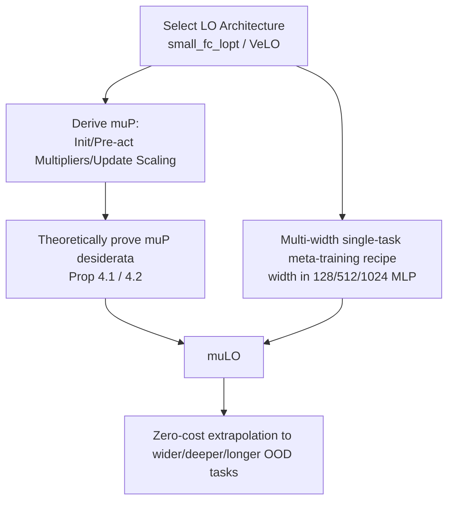

# $\mu$LO: Compute-Efficient Meta-Generalization of Learned Optimizers

**Conference**: ICLR 2026  
**OpenReview**: [https://openreview.net/forum?id=f8z2bzOLK2](https://openreview.net/forum?id=f8z2bzOLK2)  
**Code**: [https://github.com/bentherien/mu_learned_optimization](https://github.com/bentherien/mu_learned_optimization)  
**Area**: Optimization / Learned Optimizers / Meta-Learning  
**Keywords**: Learned Optimizer (LO), Maximal Update Parametrization ($\mu$P), Meta-generalization, Hyperparameter Transfer, Width Extrapolation  

## TL;DR
This paper derives the Maximal Update Parametrization ($\mu$P) for two state-of-the-art learned optimizers (small_fc_lopt and VeLO) and pairs it with a low-cost "multi-width single-task" meta-training recipe. This allows optimizers meta-trained only on small MLPs to generalize to much wider, deeper, and longer-trained unseen tasks with zero additional computational overhead.

## Background & Motivation
**Background**: Learned Optimizers (LOs) replace hand-designed algorithms like Adam/SGD with small neural networks, theoretically capable of significantly reducing the wall-clock training time of large models. The well-known VeLO required 4000 TPU-months of meta-training to outperform tuned manual optimizers without needing parameter tuning.

**Limitations of Prior Work**: Even heavyweight LOs like VeLO suffer from severe **meta-generalization** shortcomings. Their performance collapses or diverges when optimizing networks that are **wider, deeper**, or require **more training steps** than those seen during meta-training. Meta-training distributions are naturally limited by "affordable compute," while the combination of downstream tasks (architecture × dataset × objective × scale) is combinatorially explosive. Brute-force scaling of meta-training distributions has proven infeasible (4000 TPU-months still failed to resolve width generalization).

**Key Challenge**: Meta-training must be performed on small tasks (to be affordable), but deployment occurs on large tasks (for utility). Under Standard Parametrization (SP), the update rules learned by the optimizer on small tasks do not scale correctly with width, leading to exploding pre-activations and training divergence in large networks.

**Goal**: To apply the $\mu$P concepts from the "hyperparameter transfer" field to learned optimizers, answering two questions: Are existing LO architectures compatible with $\mu$P? Does meta-training LOs under $\mu$P improve meta-generalization?

**Core Idea**: **Use $\mu$P to fundamentally eliminate "width" as a distribution shift**. $\mu$P (Maximal Update Parametrization) is the only abc-parametrization, proposed by Yang et al., that allows each layer to learn features stably. Originally used for zero-shot hyperparameter transfer for Adam/SGD, this paper extends it to the update formulas of LOs. This ensures that behaviors learned by the optimizer at small widths can be extrapolated to larger widths for "free."

## Method

### Overall Architecture
The method consists of two parts: (1) **Derivation of $\mu$-parametrization**—redesigning the initialization variance of the optimizee network, forward pre-activation multipliers, and the scaling rules for optimizer updates for LO-specific formulas (magnitude/direction + tensor-level learning rate), with theoretical proof that they satisfy $\mu$P desiderata; (2) **Low-cost meta-training recipe**—performing FLOP-matched meta-training on a single task (MLP image classification) across multiple widths. Combined, these allow $\mu$LO to migrate to large tasks at zero cost after meta-training.

### Key Designs
**1. Customizing $\mu$-parametrization for LO update formulas: Embedding "width dependency" into three scaling points.** The essence of $\mu$P is to ensure every layer "learns features to the maximum extent" at any width $h$. This requires treating each weight matrix $W \in \mathbb{R}^{n\times m}$ differently based on whether it is a hidden, input, or output layer (depending on the asymptotic width dependency of $n$=FAN_OUT and $m$=FAN_IN). Specifically, hidden/input weights are initialized as $\mathcal{N}(0, \tfrac{1}{\text{FAN\_IN}})$, while output layers are initialized as $\mathcal{N}(0,1)$ with pre-activations multiplied by $\tfrac{1}{\text{FAN\_IN}}$ during the forward pass. The most critical step is rewriting the LO update formula itself—where the original LO outputs a magnitude $m$ and direction $d$ for each parameter, updated as $w_t = w_{t-1} - \lambda_W \alpha_1 d\exp(\alpha_2 m)$. This paper adds an extra $\tfrac{1}{\text{FAN\_IN}}$ multiplier for hidden layer updates:

$$w_t = \begin{cases} w_{t-1} - \dfrac{1}{\text{FAN\_IN}}\big(\lambda_{W_l}\alpha_1 d\exp(\alpha_2 m)\big) & W_l \text{ is a hidden layer} \\ w_{t-1} - \lambda_{W_l}\alpha_1 d\exp(\alpha_2 m) & \text{otherwise} \end{cases}$$

This encodes width dependency directly into the LO output, allowing the $m,d$ behaviors learned at small widths during meta-training to scale correctly, thus preventing pre-activation explosion in large networks.

**2. Theoretical Guarantees: Proving SOTA LO architectures satisfy $\mu$P desiderata.** Rather than just adding empirical scaling factors, the paper provides proofs for both small_fc_lopt (Prop 4.1) and VeLO (Prop 4.2). Under the assumption that optimizee parameters and input data "align" leading to Law of Large Numbers (LLN) scaling, the aforementioned initialization + pre-activation multipliers + update scaling constitute a valid $\mu$P. This elevates LOs from "empirically tuned black boxes" to "optimizers supported by transfer theory," serving as the foundation for $\mu$LO’s theoretical width extrapolation claims (while gains in depth/long training are noted as purely empirical).

**3. Multi-width single-task meta-training recipe: Strong generalization via minimal compute.** Unlike $\mu$-transfer, which tunes hyperparameters on small proxy tasks, LOs typically require meta-training on a task distribution. This paper compares two recipes: $\mu$LO$_S$ (meta-trained on a single MLP ImageNet task with width=128) and $\mu$LO$_M$ (meta-trained on MLP tasks with widths $\in\{128,512,1024\}$). Experiments show $\mu$LO$_M$ significantly outperforms $\mu$LO$_S$ on wider and longer (5000 steps) tasks, making "multi-width" a core component. The recipe is extremely cheap—$\mu$LO$_M$ uses only **100 GPU-hours**, yet stably trains MLPs as wide as 8192 (for context, 8B parameter models often use width=4096), contrasting sharply with VeLO's 4000 TPU-months.

## Key Experimental Results
The evaluation suite contains 35 tasks covering MLP and ViT image classification on CIFAR-10/ImageNet, and decoder-only Transformer language modeling on LM1B, systematically varying width, depth, image size, and training steps. All LOs were meta-trained only on MLP tasks. Manual optimizers AdamW / $\mu$Adam were grid-searched with >500 configurations **for each task**. The meta-training inner-problem length was 1000 steps; anything beyond this is considered out-of-distribution (OOD).

### Main Results (Average Rank, lower is better, ranked among 6 optimizers)

| Optimizer | 1k steps Large | 1k steps XL | 1k steps XXL | 3k steps XL | 5k steps XL | 5k steps XXL |
|---|---|---|---|---|---|---|
| AdamW (Tuned per task) | 3.00 | 3.60 | 4.40 | 2.60 | 2.40 | 3.80 |
| $\mu$Adam (Tuned per task) | 3.40 | 2.20 | 2.20 | 2.40 | 2.60 | 2.60 |
| VeLO$_M$ (SP Baseline) | 4.60 | 4.00 | 5.00 | 5.40 | 5.40 | 5.80 |
| LO$_M$ (SP Baseline) | 5.60 | 5.40 | 5.60 | 4.80 | 4.80 | 5.20 |
| **$\mu$VeLO$_M$ (Ours)** | 2.60 | **1.60** | 1.80 | 2.00 | **1.40** | 2.00 |
| **$\mu$LO$_M$ (Ours)** | **1.80** | 2.00 | **2.00** | **1.60** | 2.20 | **1.60** |

Both $\mu$LO variants consistently rank first or second in almost all columns. SP learned optimizer baselines (VeLO$_M$/LO$_M$) rank worst, often failing completely on large-width tasks. Tuned manual optimizers occupy third and fourth places.

### Ablation Study (Meta-training distribution recipe, final training loss trend)

| Recipe | 1000 steps as width increases | 5000 steps (OOD Long Training) |
|---|---|---|
| $\mu$LO$_S$ (Single width 128) | Acceptable with width but weaker than $\mu$LO$_M$ | Significantly lags behind |
| **$\mu$LO$_M$ (Multi-width 128/512/1024)** | Smoother loss decrease, superior | Superior, better long-term generalization |
| SP LO$_M$ (Control) | Diverges after width > 2048 | Diverges |

### Key Findings
- **Width Extrapolation (Core, Theoretically Supported)**: $\mu$LO maintains smooth loss reduction after 5000 steps (5× meta-training unroll) on MLPs up to 8192 wide and LM/ViT up to 4096 wide. SP LOs generally diverge or plateau within 1000 steps. $\mu$LO even outperforms AdamW/$\mu$Adam tuned with >500 configurations per task.
- **Depth Extrapolation (Unexpected, Empirical)**: Increasing layers from 3 to 16 (at width 1024), $\mu$LO$_M$/$\mu$VeLO$_M$ optimize stably, while LO$_M$ diverges immediately on deep MLPs and VeLO$_M$ diverges on ViT/Transformers—despite $\mu$P theory technically only covering width.
- **Long Training Extrapolation (Unexpected, Empirical)**: For 25,000 steps (25× the longest meta-training unroll), $\mu$LO continues to reduce loss, whereas SP LOs fail, become unstable, or diverge after 8000 steps.
- **Pre-activation Stability Verification**: The coordinate-wise pre-activation standard deviation for $\mu$LO and $\mu$Adam remains stable across widths, while SP models see pre-activation explosion, explaining the generalization gap mechanically.
- **Zero Extra Cost**: All the above gains are achieved without increasing meta-training or inference compute compared to SP LOs.

## Highlights & Insights
- **Linking Hyperparameter Transfer and Meta-Generalization**: $\mu$P was originally designed to solve "manual optimizer HP transfer across width." This paper realizes that "width meta-generalization" in LOs is essentially the same scaling problem, leveraging $\mu$P to solve LO meta-generalization with both theoretical and engineering consistency.
- **Theory + Empirical Dual Drive**: Legal $\mu$P proofs are provided for both small_fc_lopt and VeLO (Prop 4.1/4.2), while gain in depth and long training are honestly characterized as "empirical without theory."
- **High Compute Efficiency**: 100 GPU-hours vs. VeLO's 4000 TPU-months, yet outperforming tuned manual optimizers on large OOD tasks, demonstrating that "correct parametrization" is more critical than "brute-force compute."
- **Unexpected depth/long-term generalization** provides a testable hypothesis—the stabilizing effect of $\mu$P on optimizee activations may be a universal source of generalization beyond width, leaving room for future theoretical development.

## Limitations & Future Work
- **Narrow Meta-training Task Diversity**: Meta-training was only performed on MLP image classification, lacking CNN/Transformer architectures in the meta-training distribution; the boundaries of generalization remain to be expanded.
- **Scale Upper Bound**: Restricted by academic compute, models wider than 8192 (MLP) or 3072/12288 (Transformer hidden/FFN) were not evaluated.
- **Lack of Oracle Baseline**: A "per-width retuned SP AdamW" baseline was not included as a stronger control.
- **Parametrization Choice Remains Open**: $\mu$P might not be the optimal parametrization for meta-training LOs (Everett et al. found SP with layer-wise learning rates outperformed $\mu$P in some settings). Future comparisons with CompleteP, Unit Scaling, and other transferable parametrizations are warranted.

## Related Work & Insights
- **Learned Optimizer Lineage**: Andrychowicz 2016 → Metz 2019/2022a(small_fc_lopt) → Metz 2022b(VeLO). This paper applies $\mu$P modifications directly to the latter two.
- **$\mu$P and HP Transfer**: Yang & Hu 2021 proposed $\mu$P; Yang et al. 2022 achieved zero-shot HP transfer for Adam/SGD; Yang 2024's Depth-$\mu$P handles depth (but only for residual networks with block-depth=1, hence not used here); Dey 2025's CompleteP transfers both depth and width.
- **Insights**: This paper demonstrates that "transferring mature scaling theories to meta-learned objects" is a high-ROI path. Instead of scaling compute to cover all sizes during meta-training, one should eliminate distribution shifts at the parametrization level. This has implications for any "small-to-large" meta-learning/AutoML components, such as learned LR schedulers or data augmentation strategies.

## Rating
- **Novelty**: ⭐⭐⭐⭐ — Effectively derives and proves $\mu$P for SOTA LOs, elegantly connecting HP transfer with LO meta-generalization to solve the long-standing width scaling problem.
- **Experimental Thoroughness**: ⭐⭐⭐⭐ — Covers 35 tasks, 3 axes of generalization (width/depth/length), 1120 networks, and 5 seeds, with >500 fine-tuning trials for manual baselines. Strong results; slightly docked for limited meta-training task diversity.
- **Writing Quality**: ⭐⭐⭐⭐ — Clear distinction between motivation, theoretical propositions, and empirical findings. Honest about the "theory vs. empirical" boundary.
- **Value**: ⭐⭐⭐⭐ — Achieves large-scale generalization surpassing tuned Adam using only 100 GPU-hours with zero extra overhead, identifying a practical path for low-cost, generalizable learned optimizers.

<!-- RELATED:START -->

## Related Papers

- [\[ICLR 2026\] Celo2: Towards Learned Optimization Free Lunch](celo2_towards_learned_optimization_free_lunch.md)
- [\[ICLR 2026\] Binomial Gradient-Based Meta-Learning for Enhanced Meta-Gradient Estimation](binomial_gradient-based_meta-learning_for_enhanced_meta-gradient_estimation.md)
- [\[ICLR 2026\] Towards Dynamic Interleaving Optimizers](towards_dynamic_interleaving_optimizers.md)
- [\[ICLR 2026\] Evaluating Data Influence in Meta Learning](evaluating_data_influence_in_meta_learning.md)
- [\[ICLR 2026\] Generalizable Heuristic Generation Through LLMs with Meta-Optimization](generalizable_heuristic_generation_through_llms_with_meta-optimization.md)

<!-- RELATED:END -->
