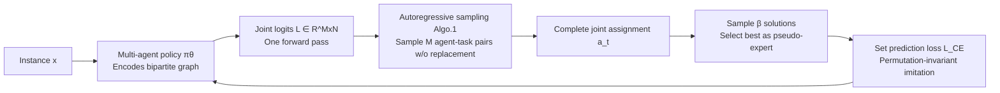

# Multi-Action Self-Improvement for Neural Combinatorial Optimization

**Conference**: ICLR 2026  
**OpenReview**: [https://openreview.net/forum?id=6KrETIaOYD](https://openreview.net/forum?id=6KrETIaOYD)  
**Code**: [https://github.com/LTluttmann/macsim](https://github.com/LTluttmann/macsim)  
**Area**: Combinatorial Optimization / Neural Combinatorial Optimization / Multi-Agent Self-Improvement  
**Keywords**: Neural Combinatorial Optimization, Self-Improvement, Multi-Agent, Set Prediction Loss, Agent Permutation Symmetry, Scheduling, Routing  

## TL;DR
MACSIM extends the self-improvement paradigm of neural combinatorial optimization (NCO) from "single-step actions" to "multi-agent joint actions." By predicting all agent-task assignments in parallel and using a permutation-invariant set prediction loss, it explicitly leverages agent permutation symmetry to improve sample efficiency and coordination while significantly compressing solution generation latency in the self-improvement loop.

## Background & Motivation

**Background**: End-to-end constructive NCO models CO problems as sequential MDPs, using neural policies to construct solutions step-by-step. The recent **self-improvement** paradigm has become the SOTA—during training, multiple candidate solutions are sampled for each instance, the best trajectory is selected as a "pseudo-expert," and imitation learning is used to approximate it. Compared to REINFORCE, this allows for action-level training, enabling decoder-only architectures that can dynamically re-encode states at each step.

**Limitations of Prior Work**: ① **Expensive training**—a large number of candidate solutions must be sampled for each instance to extract a single expert trajectory for policy updates; ② **Failure to exploit multi-agent structure**—in problems requiring coordination among multiple agents, such as min-max routing (multiple vehicles) or scheduling (multiple machines), **agent permutation symmetry** exists: different agent-task assignment sequences result in identical solutions (Figure 1).

**Key Challenge**: Self-improvement uses "per-token prediction" to supervise a single "optimal" trajectory, which effectively **imposes an arbitrary agent order** and punishes other equivalent symmetric choices as errors. This reduces sample efficiency and hinders the model's ability to learn collaborative behavior, damaging generalization.

**Goal**: To extend self-improvement to **joint multi-agent actions**, explicitly utilizing symmetry while accelerating solution generation through the parallel output of multi-agent actions.

**Core Idea**: **Multi-agent joint policy + set prediction loss**—predicting the joint assignment of all agents simultaneously at each decision step and supervising multiple equivalent expert assignments using a set loss invariant to agent order.

## Method

### Overall Architecture
MACSIM models the problem as a **cooperative multi-agent MDP** with shared rewards: the state is a bipartite graph $G=\{V,M,E,w\}$ (tasks $V$, agents $M$, feasible assignment edges $E$). At each step, the policy outputs an agent-task **bipartite matching** $a_t=\{a_t^k\}_{k=1}^M$ rather than a single action. Training follows a two-stage self-improvement: the current best policy samples $\beta\gg1$ solutions → the state-action pairs of the best solution are added to the dataset → the policy is updated via imitation learning with a set loss; if the validation performance improves, the best policy is replaced.

### Key Designs

**1. Multi-agent joint policy: One forward pass for all compatibilities.** Unlike standard self-improvement which assumes "one best action per step," MACSIM learns a policy that directly maps state $s_t$ to joint assignments. It first encodes the bipartite graph into agent embeddings $H_M\in\mathbb{R}^{M\times d}$ and task embeddings $H_V\in\mathbb{R}^{N\times d}$, then computes a compatibility logits matrix $L\in\mathbb{R}^{M\times N}$, where $L_{m,v}$ represents the score of assigning task $v$ to agent $m$. The key is: **the expensive neural policy runs only once to calculate $L$**, and the subsequent $M$ actions are generated via cheap sampling. This is the source of significant speedup compared to fully autoregressive models. Existing multi-agent policies either sample once from a joint distribution (losing efficiency and multi-step prediction gains) or assume agent independence and sample marginally, leading to conflicts (e.g., two agents grabbing the same task, where PARCO would force low-probability agents to wait post-hoc).

**2. Conflict-free autoregressive joint sampling: Implicit coordination via softmax denominator.** Given $L$, MACSIM decomposes the joint action into a sequential sampling process without replacement using the chain rule: $P(a_t\mid L)=\prod_{k=1}^M P(m_{t,k},v_{t,k}\mid a_t^{<k},L)$. Each step samples from the current **available** agent-task pair set $E_k$ based on $P(a_t^k\mid a_t^{<k},L)=\frac{\exp(L_{m_k,v_k})}{\sum_{(m',v')\in E_k}\exp(L_{m',v'})}$. Once sampled, the corresponding row and column are masked to $-\infty$ (Algorithm 1). The **denominator** of this joint softmax depends on all remaining pairs, so a high logit for a pair $(m^*,v^*)$ automatically lowers the probability of other agents taking the same task—coordination is naturally embedded in the normalization without requiring heuristics or post-hoc conflict resolution. The paper proves (Prop. 1) that this process constitutes a valid probability distribution. The final policy is written as $P(\tau\mid s_t;\theta)=\prod_{t=1}^T \pi_\theta(L\mid s_t)\prod_{k=1}^M P(a_t^k\mid a_t^{<k},L)$.

**3. Skip token: Allowing agents to "wait for a better job."** Forcing every agent to be assigned a task at every step can be sub-optimal in strongly coupled problems (e.g., job-shop, where the available operations for a machine change based on the scheduling of others). MACSIM introduces a learnable embedding $h_\text{skip}\in\mathbb{R}^d$ as a "skip" action added to the task embedding set $H_V$. Any agent can select it at any time to wait for the next step (the only constraint is that at least one agent must select a real task). Each skip adds a small penalty to the objective, which is **annealed to zero** during training, encouraging the policy to favor high-quality solutions directly as training progresses.

**4. Set prediction loss: From NLL to a permutation-invariant CE surrogate.** Naive multi-action NLL (Eq. 4) suffers from **gradient conflict**—each term assumes a specific assignment is correct and punishes the rest (including correct assignments that appear later in the expert sequence). The first mitigation: fix the expert agent sequence to make the agent selection step deterministic, reducing the generation to a **Plackett-Luce model**, where the loss becomes the sum of marginal NLLs (Eq. 5). This eliminates gradient conflict but remains sensitive to the permutation of the expert sequence. Ideally, one would average the PL loss over all $M!$ permutations, but this is intractable. Thus, MACSIM uses a **surrogate loss**: it relaxes sequential dependence and treats each agent-task pair as an independent supervised sample, resulting in a cross-entropy summed over all agents $L_\text{CE}=-\sum_{k=1}^M\log\frac{\exp(L_{m_k,v_k})}{\sum_{v'\in V}\exp(L_{m_k,v'})}$ (Eq. 6). The rationale is analogous to bipartite matching in DETR—compute the matching between predictions and ground truth, then calculate the loss for each pair independently. Since the expert data is already a valid matching, there is no need to enforce injective constraints within the loss itself. This surrogate is **permutation-invariant and computationally efficient**, providing a more robust training signal.

## Key Experimental Results

Evaluations were conducted on two scheduling problems (FJSP - Flexible Job Shop, FFSP - Flexible Flow Shop) and one routing problem (min-max heterogeneous capacity VRP - HCVRP), comparing against classic exact/heuristic solvers and the self-improvement method SLIM.

### Main Results (FJSP, greedy decoding, lower Obj. is better)

| Method | 10×5 Obj./Gap | 20×5 Obj./Gap | 15×10 Obj./Gap | Notes |
|------|------|------|------|------|
| OR-Tools (CP-SAT) | 96.32 / 0.00% | 188.15 / 0.03% | 143.53 / 0.00% | 1600–1800s per instance |
| DANIEL (g.) | 106.71 / 10.79% | 197.56 / 5.03% | 161.28 / 12.37% | Neural baseline |
| SLIM (g.) | 103.85 / 7.82% | 194.37 / 3.33% | 154.32 / 7.62% | Standard self-improvement |
| **MACSIM (g.)** | **102.21 / 6.12%** | **191.08 / 1.58%** | **149.84 / 4.40%** | Close to/Exceeds OR-Tools on 20×5 |

MACSIM consistently outperforms neural baselines across all problems and scales. It exceeds all methods on FFSP and significantly closes the gap to OR-Tools on FJSP, even outperforming OR-Tools on 20×5 instances.

### Ablation Study (Figure 3a / Table 3)

| Ablation Item | Conclusion |
|--------|------|
| Sampling Method (full vs random/fixed-order) | Full (Algo.1 joint sampling) is clearly superior on multi-agent instances, validating the effectiveness of autoregressive joint sampling. |
| Skip token | Significant gains on large-scale instances (where coordination is harder); while it increases generation latency, it significantly improves solution quality. |
| Loss function | Permutation-invariant $L_\text{CE}$ is more stable and faster than NLL/PL. |

### Key Findings
- **Advantage over SLIM grows with the number of agents** (Fig. 3b): The more agents there are, the greater the coordination gain from joint prediction.
- **Latency drops significantly**: On FFSP 50×4, SLIM solution generation is nearly 10 times slower than MACSIM; MACSIM requires only a fraction of the forward passes compared to SLIM, and the gap widens as the number of agents increases (Fig. 3c).
- **Better generalization** (Table 2): When trained on small FJSP and migrated to larger instances, MACSIM outperforms all neural baselines and exceeds OR-Tools in 2 out of 3 instance types—benefiting from per-step state re-encoding.

## Highlights & Insights
- **Promoting "Symmetry" from a baseline/variance tool to a generation mechanism**: While POMO/Sym-NCO/DPN use symmetry to construct low-variance baselines, MACSIM directly **generates conflict-free collaborative assignments** and learns them using a set loss, making it inherently symmetric at the source.
- **One encoding, multiple cheap samples**: The structure significantly reduces the single-solution latency in the most expensive part of self-improvement (sampling many candidate solutions), alleviating both training and inference bottlenecks.
- **Explainable loss via DETR analogy**: The bipartite matching perspective clarifies why injective constraints can be relaxed in the loss, serving as a good example of cross-domain intuition transfer.

## Limitations & Future Work
- MACSIM is not the fastest among all neural solvers—similar to SLIM, it performs step-by-step state re-encoding, making inference slower than "encode-once" methods, though this is traded for better OOD generalization.
- It has only been validated on bipartite matching-type problems that can be reformulated as "cooperative multi-agent + shared reward + order-independent transitions" (scheduling, min-max routing). Applicability to non-cooperative/heterogeneous rewards or non-bipartite CO problems remains to be explored.
- Hyperparameters such as skip token penalty annealing and $\beta$ sampling scale significantly impact performance, and adaptive schemes are currently missing.

## Related Work & Insights
- **Self-Improvement NCO**: SLIM (Pirnay & Grimm, 2024; Corsini et al., 2024) is the direct comparison; MACSIM is its multi-agent extension.
- **Symmetry Utilization**: POMO, Sym-NCO (using cyclic symmetry for low-variance baselines in TSP), and DPN (generalizing permutation-invariant baselines to min-max VRP).
- **Multi-Agent Policy/Conflict Resolution**: PARCO (post-hoc conflict resolution), 2D-Ptr (single-pass joint sampling)—MACSIM naturally avoids conflicts during sampling via joint softmax.
- **Set Prediction**: The bipartite matching loss in DETR provides theoretical and intuitive support for the permutation-invariant surrogate loss used here.

## Rating
- **Novelty**: ⭐⭐⭐⭐ Extending self-improvement from single action to multi-agent joint actions with a combination of set prediction loss and conflict-free joint sampling is a clear and self-consistent new paradigm in NCO.
- **Experimental Thoroughness**: ⭐⭐⭐⭐ Covers three types of scheduling and routing problems, including exact, heuristic, and neural baselines, with comprehensive generalization and ablation studies.
- **Writing Quality**: ⭐⭐⭐⭐ The motivation (the contradiction of symmetry) is explained thoroughly, and the derivation of the loss from NLL to PL to CE is progressive and clear.
- **Value**: ⭐⭐⭐⭐ Simultaneously improves solution quality and generation latency for multi-agent CO, which is of direct significance for practical scheduling and routing scenarios; code is open-sourced.

## Related Papers

- [\[ICLR 2026\] Provable and Practical In-Context Policy Optimization for Self-Improvement](provable_and_practical_in-context_policy_optimization_for_self-improvement.md)
- [\[ICLR 2026\] Neural Multi-Objective Combinatorial Optimization for Flexible Job Shop Scheduling Problems](neural_multi-objective_combinatorial_optimization_for_flexible_job_shop_scheduli.md)
- [\[ICLR 2026\] Toward Principled Flexible Scaling for Self-Gated Neural Activation](toward_principled_flexible_scaling_for_self-gated_neural_activation.md)
- [\[NeurIPS 2025\] Probing Neural Combinatorial Optimization Models](../../NeurIPS2025/optimization/probing_neural_combinatorial_optimization_models.md)
- [\[ICLR 2026\] NExCO: Native Solution Expansion for Diffusion-based Combinatorial Optimization](nexco_native_solution_expansion_for_diffusion-based_combinatorial_optimization.md)

<!-- RELATED:END -->

<!-- RELATED:START -->

## Related Papers

- [\[ICLR 2026\] Provable and Practical In-Context Policy Optimization for Self-Improvement](provable_and_practical_in-context_policy_optimization_for_self-improvement.md)
- [\[ICLR 2026\] Neural Multi-Objective Combinatorial Optimization for Flexible Job Shop Scheduling Problems](neural_multi-objective_combinatorial_optimization_for_flexible_job_shop_scheduli.md)
- [\[ICLR 2026\] Toward Principled Flexible Scaling for Self-Gated Neural Activation](toward_principled_flexible_scaling_for_self-gated_neural_activation.md)
- [\[ICLR 2026\] NExCO: Native Solution Expansion for Diffusion-based Combinatorial Optimization](nexco_native_solution_expansion_for_diffusion-based_combinatorial_optimization.md)
- [\[NeurIPS 2025\] Probing Neural Combinatorial Optimization Models](../../NeurIPS2025/optimization/probing_neural_combinatorial_optimization_models.md)

<!-- RELATED:END -->
