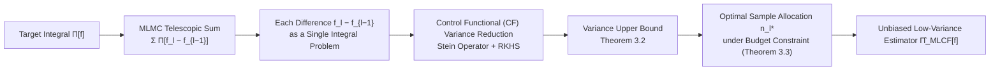

# Multilevel Control Functional

**Conference**: ICLR 2026  
**OpenReview**: [https://openreview.net/forum?id=Ahdsg2nkNH](https://openreview.net/forum?id=Ahdsg2nkNH)  
**Code**: TBD  
**Area**: Monte Carlo / Variance Reduction / Bayesian Inference  
**Keywords**: Control Variables, Control Functionals, Multilevel Monte Carlo, Multi-fidelity, Stein Method, Variational Inference  

## TL;DR
This paper proposes **Multilevel Control Functionals (MLCF)**, which graft non-parametric Stein control functionals onto the telescopic sum of Multilevel Monte Carlo (MLMC). By using control functionals to further suppress the variance of differences between adjacent fidelity models at each level, MLCF achieves faster convergence rates than MLMC when the integrand and density are smooth and the dimensionality is moderate. The authors also provide optimal sample allocation strategies and extensions to variational inference.

## Background & Motivation
- **Background**: Numerous tasks in scientific computing and machine learning involve estimating intractable integrals $\Pi[f]=\int_{\mathcal X} f(x)\pi(x)\,dx$ (e.g., normalization constants, Bayesian posterior expectations, ELBO gradients). Standard Monte Carlo (MC) converges at $O(n^{-1/2})$ and suffers from high variance; when the integrand originates from expensive simulators, the cost to reach a target accuracy is often prohibitive.
- **Limitations of Prior Work**: Two primary paths for cost reduction have distinct drawbacks. ① **Control Variables (CV)**—especially RKHS-based non-parametric Stein control functionals (CF)—can significantly reduce variance for a single integration problem but only act on the "highest fidelity" level, failing to exploit hierarchical model structures. ② **Multilevel Monte Carlo (MLMC)**—utilizes a sequence of approximations $f_0,\dots,f_L$ to construct a telescopic sum $\Pi[f]=\sum_l \Pi[f_l-f_{l-1}]$, treating $f_{l-1}$ as a control variable for $f_l$. However, it still uses naive MC for each difference $f_l-f_{l-1}$, **failing to minimize the variance of the differences themselves**.
- **Key Challenge**: CF offers powerful variance reduction but lacks a multi-fidelity structure; MLMC has a multi-fidelity structure but does not further compress variance at each level. Existing "multilevel control variable" works (e.g., nesting Bayesian quadrature into MLMC or using auxiliary diffusion/low-rank approximations) are mostly tied to specific kernel-distribution pairs or PDEs and cannot handle **unnormalized densities** common in Bayesian inference without expert knowledge.
- **Goal**: Develop a **universal** variance reducer that benefits from multi-fidelity hierarchies and applies Stein control functionals at each level, without requiring normalized densities or domain-specific expertise.
- **Core Idea**: **At each level of the MLMC telescopic sum, treat the difference $f_l-f_{l-1}$ as an independent integration problem and compress its variance using control functionals.** This is combined with an optimal sample allocation derived from variance upper bounds to distribute limited budgets across levels.

## Method

### Overall Architecture
MLCF combines the "telescopic sum" of MLMC with the "per-level variance reduction" of CF. For the integral $\Pi[f]=\sum_{l=0}^{L}\Pi[f_l-f_{l-1}]$ (with $f_{-1}:=0$), instead of using naive MC for each $\Pi[f_l-f_{l-1}]$ as in MLMC, it applies a control functional estimator $\hat\Pi_{\mathrm{CF}}^{n_l-m_l}[f_l-f_{l-1}]$ at every level. The full estimator is:

$$\hat\Pi_{\mathrm{MLCF}}[f]=\sum_{l=0}^{L}\hat\Pi_{\mathrm{CF}}^{n_l-m_l}[f_l-f_{l-1}].$$

At each level, $n_l$ samples are split into two sets: $m_l$ samples to learn the control functional $s_l-\Pi[s_l]$, and the remaining $n_l-m_l$ samples for unbiased estimation. The key lies in the closed loop of "hierarchical structure → per-level variance reduction → optimal budget allocation."

### Key Designs

**1. Layer-wise Control Functionals: Compressing the "Difference."** MLMC already uses $f_{l-1}$ as a control variable for $f_l$, yet the difference $f_l-f_{l-1}$ still contains residual variance. MLCF constructs a family of zero-mean candidate functions using the Langevin Stein operator $\mathcal S_\Pi[u](x):=\nabla_x\cdot u(x)+u(x)\cdot\nabla_x\log\pi(x)$ and solves a constrained least squares problem in an RKHS (Stein kernel $k_0^l$) to obtain the control functional $s_l-\Pi[s_l]$. The total estimator is:
$$\hat\Pi_{\mathrm{MLCF}}[f]=\sum_{l=0}^{L}\frac{1}{n_l-m_l}\sum_{i=m_l+1}^{n_l}\big(f_l(x_{(l,i)})-f_{l-1}(x_{(l,i)})-(s_l(x_{(l,i)})-\Pi[s_l])\big).$$
A key advantage is that it only requires $\pi$ to be smooth with $\pi(x)>0$ and $\nabla\log\pi$ to be evaluable—this perfectly covers **unnormalized density** scenarios in Bayesian inference because the Stein operator uses the score function rather than the normalization constant.

**2. Variance Upper Bound & Convergence Analysis.** Under assumptions regarding domain regularity, density/kernel smoothness ($\pi\in C^{a+1}$, $k_l\in C_2^{b_l+1}$), and sample fill-distance ($h_l\le q\,m_l^{-1/d}$), the variance upper bound is:
$$\mathbb V[\hat\Pi_{\mathrm{MLCF}}[f]]\le\sum_{l=0}^{L}\frac{\big(r_l\,m_l^{-\tau_l/d}\,\|f_l-f_{l-1}\|_{\mathcal H_+^l}\big)^2}{n_l-m_l},\quad \tau_l:=\min\{a,b_l\}.$$
Since MLCF is unbiased, MSE equals variance. If the ratio $m_l/n_l$ is fixed, the convergence rate at each level is $O(n^{-\tau_l/d-1/2})$, which is **strictly faster than MLMC's $O(n^{-1/2})$**. This depends on low-to-moderate dimensions $d$ and smoothness.

**3. Optimal Sample Allocation under Budget Constraints.** Given a total budget $\sum_l C_l n_l=T$ (where $C_l$ is the cost per evaluation at level $l$), minimizing the variance bound yields the optimal allocation:
$$n_l^{\mathrm{MLCF}}=R\,(r_l\|f_l-f_{l-1}\|_{\mathcal H_+^l})^{\frac{d}{\tau+d}}\,C_l^{-\frac{d}{2\tau+2d}},$$, where $R$ is a normalization constant. This intuitively implies: **levels with higher evaluation costs ($C_l$) receive fewer samples; levels with smaller difference norms receive fewer samples.**

**4. Variational Inference Extension (MLCFRG).** MLCF is applied to reparameterized gradient estimation (MLRG form). The paper replaces the MC estimator in MLRG with control functionals to create **MLCFRG**. Crucially, Proposition 3.4 provides a **simplified recursion** for SGD:
$$\lambda_{L+1}=\lambda_L+\tfrac{\alpha_L}{\alpha_{L-1}}(\lambda_L-\lambda_{L-1})-\alpha_L\,\hat\Pi_{\mathrm{CF}}[f_{\lambda_L}-f_{\lambda_{L-1}}],$$
reducing computation from $O(d\sum_l l\,n_l^3)$ to $O(d\,n_L^3)$ and memory from $O(d\sum_l l\,n_l^2)$ to $O(d\,n_L^2)$, making it feasible for Bayesian Neural Networks (BNNs).

## Key Experimental Results

### Main Results

| Experiment | Task | Baselines | Conclusion |
|------|------|----------|------|
| Synthetic | Integration on $[0,1]^2$ uniform distribution | MLCF($n^{\mathrm{MLCF}}$), MLCF($n^{\mathrm{MLMC}}$), MLMC, CF | MLCF with either allocation significantly outperforms MLMC and CF. |
| Boundary-value ODE | 1D Elliptic PDE / BVP with random coefficients | MLCF(QMC/LHS/IID), MLMC, MLBQ, CF | MLCF is optimal under the same computational cost. |
| Lotka-Volterra | Bayesian inference on predator-prey data (MCMC sampling) | MLCF, MLMCMC, CF, MCMC | MLCF leads across all budget levels. |
| BNN Variational Inference | Wine-quality-red regression, $d=392/522$ | MLCFRG, MLMCRG, MLMC, MC | MLCFRG converges faster to a better ELBO / test log-likelihood. |

### Key Findings
- **Optimal Allocation vs. MLMC Allocation**: At small sample sizes, MLCF using MLMC's allocation $n^{\mathrm{MLMC}}$ is slightly better (as $n^{\mathrm{MLCF}}$ minimizes the bound, not the variance itself); at large sample sizes, $n^{\mathrm{MLCF}}$ performs better. In practice, using MLMC allocation still yields most of the benefits.
- **Generality**: For ODE and Lotka-Volterra tasks where previous multilevel CV methods were difficult to implement, MLCF was applied directly.
- **Compatibility with Unnormalized Densities**: The Lotka-Volterra experiment used NUTS samples and unnormalized posteriors, verifying the Stein construction's immunity to normalization constants.

## Highlights & Insights
- **Clean "Grafting"**: By aligning mature CF with the MLMC telescopic sum, the paper fills a clear gap—MLMC's lack of variance compression for difference terms.
- **Theory-Practice Loop**: The variance upper bound not only proves faster convergence but also derives a closed-form allocation, translating theoretical acceleration into an executable sampling schedule.
- **Engineering Highlight in VI**: Proposition 3.4 collapses the multilevel estimation into a momentum-style update depending only on the highest level, making the approach practical for high-dimensional BNNs.

## Limitations & Future Work
- **Curse of Dimensionality**: The acceleration rate $\tau/d$ decays as $d$ increases, positioning the method for low-to-moderate dimensional problems.
- **Smoothness Dependence**: Convergence proof requires sufficient smoothness of the density and integrand, which may not hold in non-smooth or heavy-tailed scenarios.
- **$O(m^3)$ Per-level Cost**: Control functionals have cubic costs. While negligible for expensive integrands, this becomes relevant when evaluation costs are low.
- **Estimation of RKHS Norms**: Optimal allocation $n_l^{\mathrm{MLCF}}$ requires quantities like $\|f_l-f_{l-1}\|_{\mathcal H_+^l}$ which are hard to obtain and must be estimated from data.

## Related Work & Insights
- **Control Functionals / Stein CV**: MLCF's per-level variance reducer is derived from the non-parametric RKHS route, inheriting its compatibility with unnormalized densities.
- **Multilevel Monte Carlo**: Provides the framework; MLCF treats MLMC as a special case where the variance of the differences is not further compressed.
- **Multilevel Bayesian Quadrature**: Also combines MLMC with kernels but is tied to specific pairs and cannot handle unnormalized densities, a baseline that MLCF directly improves upon.
- **Insight**: When an estimation problem naturally possesses a hierarchical structure with adjustable precision, one does not need to stack samples only at the most expensive level—telescopic decomposition combined with per-increment variance reduction is a versatile recipe.

## Rating
- **Novelty**: ⭐⭐⭐⭐ — While components are mature, the combination fills a significant gap in MLMC with a complete theoretical and extension package.
- **Experimental Thoroughness**: ⭐⭐⭐⭐ — Covers synthetic, ODE/PDE, Bayesian inference, and VI, comparing against MLMC, MLBQ, and CF across multiple scenarios.
- **Writing Quality**: ⭐⭐⭐⭐ — Clear motivation figures and solid background; high formula density might be challenging for general readers.
- **Value**: ⭐⭐⭐⭐ — Provides a plug-and-play variance reducer for "expensive integrals + adjustable fidelity" scenarios with high practical utility.

<!-- RELATED:START -->

<!-- RELATED:END -->

## Related Papers

- [\[ICLR 2026\] Unbiased Gradient Estimation for Event Binning via Functional Backpropagation](unbiased_gradient_estimation_for_event_binning_via_functional_backpropagation.md)
- [\[ICLR 2026\] Conformal Robustness Control: A New Strategy for Robust Decision](conformal_robustness_control_a_new_strategy_for_robust_decision.md)
- [\[ICLR 2026\] Differentiable Model Predictive Control on the GPU](differentiable_model_predictive_control_on_the_gpu.md)
- [\[ICLR 2026\] Dual Optimistic Ascent (PI Control) is the Augmented Lagrangian Method in Disguise](dual_optimistic_ascent_pi_control_is_the_augmented_lagrangian_method_in_disguise.md)
- [\[ICLR 2026\] A Schrödinger Eigenfunction Method for Long-Horizon Stochastic Optimal Control](a_schrödinger_eigenfunction_method_for_long-horizon_stochastic_optimal_control.md)

<!-- RELATED:END -->
