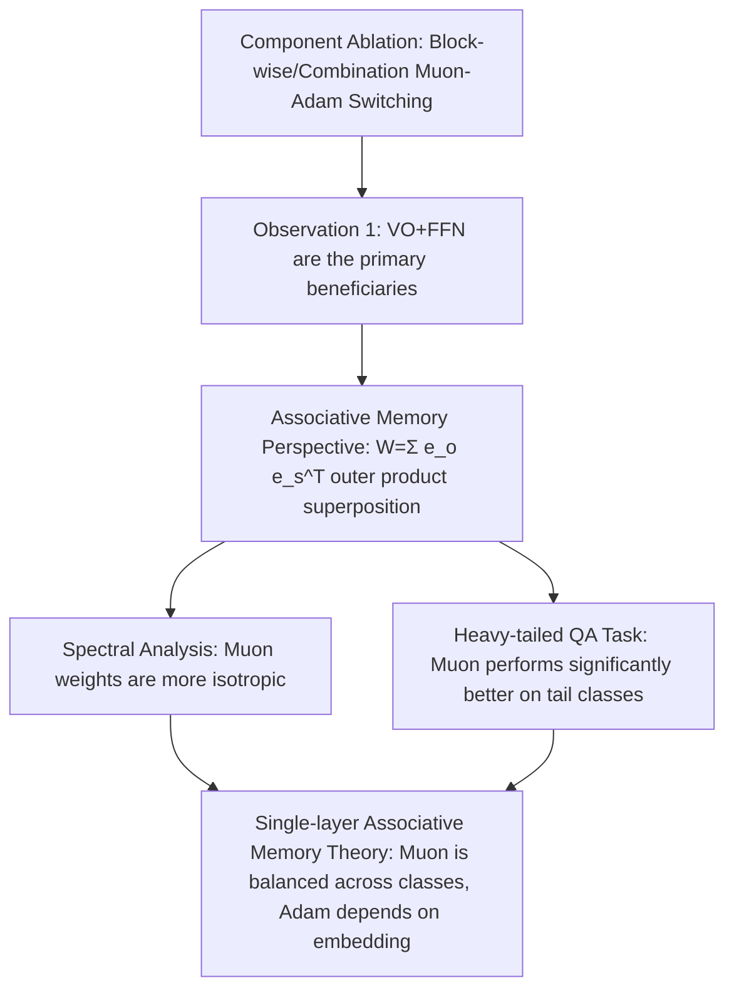

# Muon Outperforms Adam in Tail-End Associative Memory Learning

**Conference**: ICLR 2026  
**OpenReview**: [https://openreview.net/forum?id=twbMFL0DMp](https://openreview.net/forum?id=twbMFL0DMp)  
**Code**: To be confirmed  
**Area**: optimization  
**Keywords**: Muon Optimizer, Adam, Associative Memory, Heavy-tailed Distribution, Singular Spectrum Isotropy, Long-tail Learning  

## TL;DR
This paper reveals the mechanism behind Muon's speed advantage over Adam through the lens of "associative memory": Muon's update rule normalizes gradient singular values, which naturally matches the outer-product superposition structure of associative memory, thereby enabling more balanced learning of low-frequency "tail" knowledge in heavy-tailed data.

## Background & Motivation
- **Background**: Muon, as an optimizer for matrix parameters, is approximately 2x faster than Adam across various LLM scales and architectures. Its core mechanism involves replacing raw gradients with normalized orthogonal factors ($O_t=U_tV_t^\top$), which can be interpreted as steepest descent on the spectral norm.
- **Limitations of Prior Work**: Existing "spectral norm steepest descent" explanations fail to clarify why optimizing the spectral norm (Muon) should outperform optimizing the infinity norm (Adam); furthermore, convergence analyses derived from this do not explain Muon's observed empirical advantages.
- **Key Challenge**: It remains unknown **which Transformer components** benefit most from Muon and **what structural features** of these components allow Muon to optimize them more effectively.
- **Goal**: To answer two questions: (1) Which Transformer components benefit most from Muon's matrix norm optimization? (2) What structural features enable Muon to optimize these components more efficiently?
- **Core Idea**: **[Associative Memory Perspective]** VO attention weights and FFNs act as the "associative memory" storage of LLMs, which can be approximated as the sum of outer products of facts $W=\sum_i e_{o_i}e_{s_i}^\top$. Real-world corpora are naturally heavy-tailed (a few head classes are high-frequency, while many tail classes are rare). By "flattening" gradient singular values, Muon's updates assign equal magnitudes to each orthogonal fact outer product, thereby **weakening the dominance of high-frequency facts and amplifying the learning of low-frequency tail facts**.

## Method

### Overall Architecture
The paper does not propose a new optimizer but uses a three-step "mechanism dismantling + theoretical modeling" approach to argue for Muon's advantages: first, component ablation to locate beneficial units (VO+FFN); then, validation of "increased isotropy / better balance" through weight spectra and heavy-tailed knowledge tasks; finally, providing provable balance conclusions on a single-layer linear associative memory model.

### Key Designs

**1. Component Ablation to Locate Beneficiaries: Locking the advantage to VO+FFN.** The authors used a two-stage protocol on 160M NanoGPT: first, applying Muon to single matrices ($W_Q,W_K,W_V,W_O,W_{in},W_{out}$) independently while using Adam for others, then testing combinations to see which subset recovers full Muon performance. Results show that VO weights ($W_V, W_O$) and FFNs gain significantly more than QK weights. Muon(VO+FFN) nearly replicates the full Muon trajectory (val loss 3.586 vs. 3.565 for full Muon, compared to 3.924 for all-Adam). Further ablation indicates $W_O$ is more critical than $W_V$. This localization is not a trivial consequence of parameter count—QK and VO have equal parameters, but VO has a significantly larger impact (Observation 1).

**2. Natural Alignment between Outer Product Structure and Muon.** Viewing VO/FFN as linear associative memory $W=\sum_{i=1}^K e_{o_i}e_{s_i}^\top$. Under $\ell_2$ loss $c_1\|e_{o_1}-We_{s_1}\|^2+c_2\|e_{o_2}-We_{s_2}\|^2$, the gradient is $G=c_1 e_{o_1}e_{s_i}^\top+c_2 e_{o_2}e_{s_2}^\top=\mathrm{diag}(c_1,c_2)$, where $c_i$ reflects the frequency of the fact in the current batch. For $G=USV^\top=\sum_i s_i u_i v_i^\top$, Muon removes singular values to obtain $O=UV^\top=\sum_i u_i v_i^\top=e_{o_1}e_{s_1}^\top+e_{o_2}e_{s_2}^\top$—**the update magnitudes for both facts are equal regardless of the disparity between $c_1$ and $c_2$**. Since gradient singular values in cross-entropy encode knowledge frequency, Muon, by normalizing these values, learns high- and low-frequency facts more uniformly than Adam, which relies on gradient magnitude.

**3. Spectral Isotropy Verification (Observation 2).** Using normalized singular energy $q_i=\sigma_i^2/\sum_j\sigma_j^2$, several isotropy metrics are defined: normalized SVD entropy $H_{norm}=-\frac{1}{\log n}\sum_i q_i\log q_i$, effective rank $\mathrm{eRank}=\exp(-\sum_i q_i\log q_i)$, Top-$k$ energy share, and the singular value interquartile ratio $Q_{75/25}$. Results (mean of 10 seeds) show Muon makes the singular spectra of VO/$W_{out}$ more isotropic from the start of training with negligible sensitivity to initialization, whereas Adam’s isotropy fluctuates wildly and is sensitive to initialization. This suggests Muon ensures knowledge is represented at comparable magnitudes regardless of frequency.

**4. Provable Balance in Single-layer Associative Memory (Theorem 4.3).** Modeling a single-layer $f_W(E_k)=\mathrm{sm}(\tilde E^\top W E_k)$ to minimize total cross-entropy $L(W)=-\sum_k p_k\log[f_W(E_k)]_k$, and simplifying Adam (with $\beta_1=\beta_2=0$) to SignGD. Under orthogonal embeddings (Assumption 4.1) and two-class imbalance (Assumption 4.2, imbalance ratio $r=\min_k p_k/\max_k p_k$), the balance metric $\varrho^\epsilon_{opt}$ represents the probability of the worst class being correct when some class reaches $1-\epsilon$. Conclusion: Muon yields $\varrho^\epsilon_{Muon}\ge 1-\epsilon(1+O(\frac{\log K}{K}))$, **maintaining near-perfect balance independent of embeddings**; GD yields $O(\epsilon^{-r}K^{r-1})$ and is strongly dominated by $r$; Adam (SignGD) **depends on embedding structure**—matching Muon when supports are non-overlapping but degrading to $O(\epsilon^{-0.7}K^{-0.3})$ when they overlap, showing significant spectral decay ($\sigma_{min}/\sigma_{max}\le 25\%$).

## Key Experimental Results

### Main Results: Component Ablation (160M NanoGPT, FineWeb, 10k Steps Validation Loss)

| Configuration | Validation Loss (Lower is Better) |
|---------------|-----------------------------------|
| All Muon (All Attn, FFN) | 3.565 |
| All Adam | 3.924 |
| Muon(VO+FFN) / Adam(QK) | 3.586 |
| Muon(VO+$W_{in}$) / Adam(QK+$W_{out}$) | 3.678 |
| Muon(VO+$W_{out}$) / Adam(QK+$W_{in}$) | 3.605 |
| Muon(QK) only | 3.893 |
| Muon($W_{out}$) only | 3.702 |

### Heavy-tailed Knowledge QA Task (Synthetic biographies, 200k+ individuals, power-law frequency, First-Token-Accuracy)

| Category | Muon | Adam | SGD+Mom |
|----------|------|------|---------|
| Head (High-frequency) | Near perfect | Near perfect | Near perfect |
| Tail (Low-frequency) | **Significantly higher, faster/stable convergence** | Significantly lagging | Worst |
| Muon(VO+FFN)/Adam(QK) | Large tail boost, reduced head-tail gap | — | — |
| Muon(QK)/Adam(VO+FFN) | Limited boost | — | — |

### Key Findings
- **VO+FFN $\approx$ Full Muon**: QK contributes very little to Muon's overall gain (Observation 1), and this is not caused by logit explosion.
- **More Isotropic and Stable Spectra**: Muon maintains higher SVD entropy/eRank and lower Top10E/$Q_{75/25}$ throughout, with negligible error bars (Observation 2).
- **Advantage Disappears as Distribution Becomes Uniform**: As data becomes more balanced, the gap in average FTA between Muon and Adam narrows, confirming the advantage stems from heavy-tailed imbalance (Observation 3).
- **Task Dependency**: On in-context linear regression tasks primarily dependent on QK, Muon's tail performance is comparable to Adam, consistent with QK not being the source of Muon's advantage.

## Highlights & Insights
- **Mechanistic Explanation over Convergence Bounds**: Instead of a general "spectral norm steepest descent" explanation, this work pins the advantage to a concrete, verifiable mechanism: "VO+FFN = Associative Memory, Muon updates align with outer product structure," answering "why" and "where."
- **Closed-loop Evidence**: Component ablation (Where) $\rightarrow$ Spectral analysis + Heavy-tail tasks (How) $\rightarrow$ Single-layer model theorems (Why).
- **Transferable Intuition**: "Flattening singular values = equal magnitude updates for every orthogonal fact = protecting the tail." This provides a heuristic for why matrix optimizers favor knowledge-intensive/long-tail scenarios.

## Limitations & Future Work
- **Idealized Theoretical Model**: Single-layer linear memory, strictly orthogonal embeddings, simplified two-class imbalance, disabled momentum, and Adam simplified to SignGD ($\beta_1=\beta_2=0$) create a gap with real multi-layer non-linear Transformers and full Adam.
- **Limited Scale**: Core experiments are on 160M (extended to 0.7B in appendix) NanoGPT and synthetic QA; gains on ultra-large-scale real-world pre-training require further validation.
- **Downstream Significance of "Better Tail"**: Whether balanced tail knowledge learning translates directly to significant gains in downstream tasks or factual recall still relies on FTA as a proxy; broader evaluation is needed.

## Related Work & Insights
- **Muon and Spectral Norm Steepest Descent**: Jordan et al. (2024) and Bernstein & Newhouse (2024) provide geometric explanations; this work adds the "mechanism + component" level answer.
- **Associative Memory and Knowledge Storage**: Geva et al. (2020), Bietti et al. (2023), and Meng et al. (2022, ROME) treat FFN/$W_O$ as linearly approximable associative memories, forming the basis for the outer product perspective.
- **Heavy-tails and Optimizers**: Kunstner et al. (2024) noted Adam outperforms SGD on heavy tails; this work further shows Muon outperforms Adam on the tail end.
- **Insight**: If an optimizer's update direction naturally aligns with the "semantic structure" of parameters (here, outer product superposition), it may achieve "free" balancing on imbalanced data—offering a design path for optimizers targeting long-tail/knowledge-intensive tasks.

## Rating
- **Novelty**: ⭐⭐⭐⭐⭐ First to explain Muon through associative memory outer product structure and precisely locate it in VO+FFN.
- **Experimental Thoroughness**: ⭐⭐⭐⭐ Comprehensive ablation, spectral analysis, and heavy-tail QA; 10 seeds and 0.7B extension, though scale remains limited compared to real production pre-training.
- **Writing Quality**: ⭐⭐⭐⭐⭐ Driven by two questions, three Observations link empirical results and theory; toy examples clarify the core intuition effectively.
- **Value**: ⭐⭐⭐⭐ Provides a provable mechanism for why matrix optimizers benefit long-tail knowledge learning, relevant for both optimizer design and LLM training practice.

<!-- RELATED:START -->

## Related Papers

- [\[ICML 2026\] Muon in Associative Memory Learning: Training Dynamics and Scaling Laws](../../ICML2026/optimization/muon_in_associative_memory_learning_training_dynamics_and_scaling_laws.md)
- [\[ICLR 2026\] Implicit Bias of Per-sample Adam on Separable Data: Departure from the Full-batch Regime](implicit_bias_of_per-sample_adam_on_separable_data_departure_from_the_full-batch.md)
- [\[ICML 2026\] The Implicit Bias of Adam and Muon on Smooth Homogeneous Neural Networks](../../ICML2026/optimization/the_implicit_bias_of_adam_and_muon_on_smooth_homogeneous_neural_networks.md)
- [\[ICLR 2026\] Error Feedback for Muon and Friends](error_feedback_for_muon_and_friends.md)
- [\[ICLR 2026\] MuonBP: Faster Muon via Block-Periodic Orthogonalization](muonbp_faster_muon_via_block-periodic_orthogonalization.md)

<!-- RELATED:END -->
