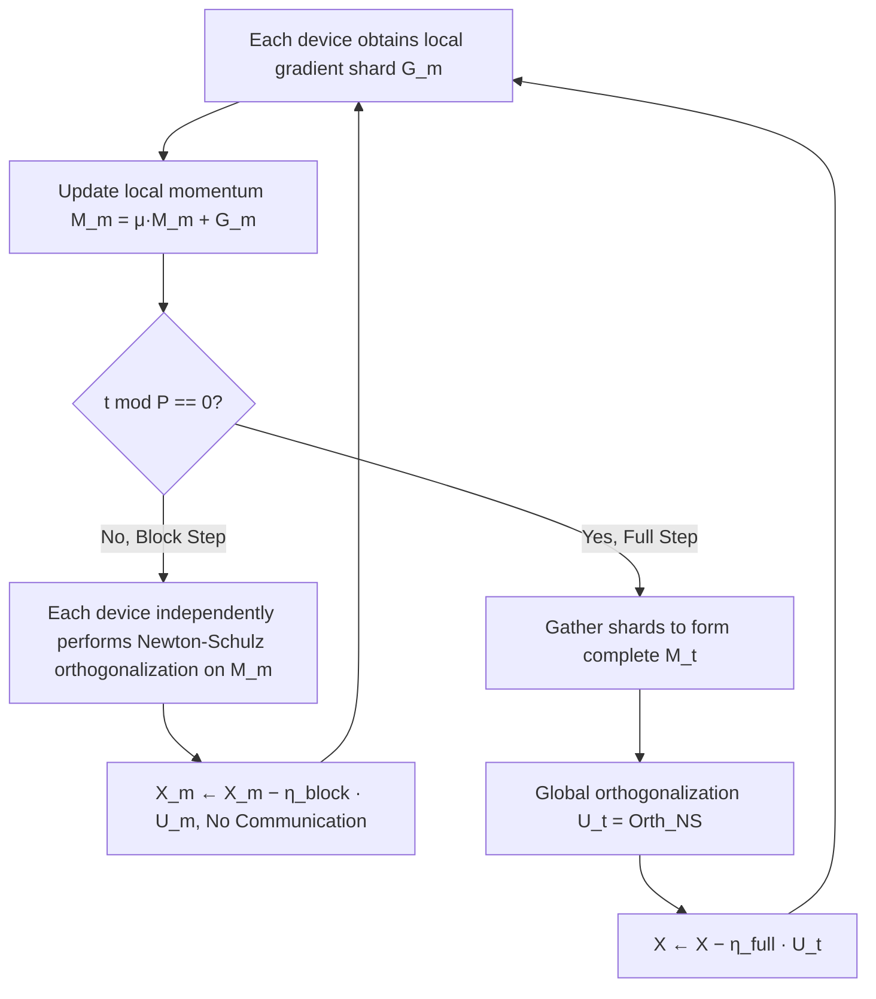

# MuonBP: Faster Muon via Block-Periodic Orthogonalization

**Conference**: ICLR 2026  
**OpenReview**: [https://openreview.net/forum?id=mHouLSUQP5](https://openreview.net/forum?id=mHouLSUQP5)  
**Code**: To be confirmed  
**Area**: optimization  
**Keywords**: Muon, Gradient Orthogonalization, Model Parallelism, Communication Efficiency, LLM Pre-training, Distributed Optimization  

## TL;DR
MuonBP enables each device to perform orthogonalization only on local shards under tensor parallelism, executing global orthogonalization every $P$ steps. By using two distinct learning rates—"block step" and "full step"—it eliminates the throughput loss caused by inter-device communication in Muon. On an 8B model, it achieves approximately 8% speedup over Muon with even better convergence results.

## Background & Motivation
- **Background**: Muon orthogonalizes momentum gradients before updating, proving more token-efficient and supporting larger critical batch sizes than Adam/AdamW. It has been validated at the 1T parameter scale, making it one of the few optimizers recently capable of challenging Adam's dominance.
- **Limitations of Prior Work**: Orthogonalization is not a coordinate-wise operation; it acts on the entire gradient matrix. When using Tensor Parallelism or FSDP2 to shard matrices across devices, Muon requires additional all-gather/scatter operations per step to reconstruct the matrix for orthogonalization. For 8B Llama-style models, this communication overhead results in an **8%–10% throughput drop**. While Muon is more token-efficient, its per-step speed is slower than Adam.
- **Key Challenge**: There is a fundamental conflict between **data efficiency** (requiring global orthogonalization for stability) and **step throughput** (global orthogonalization requiring cross-device communication). While performing only local block orthogonalization (BlockMuon, $P=\infty$) eliminates communication, both theory and experiments show it has poorer convergence guarantees and becomes unstable (exploding parameter norms) as models scale.
- **Goal**: To reduce the communication overhead of orthogonalization to a level comparable to coordinate-wise methods (Adam) while maintaining Muon's data efficiency.
- **Core Idea**: **[Block-Periodic Interpolation]** Most steps perform only local block orthogonalization (zero extra communication), while a global gather and orthogonalization are performed every $P$ steps to ensure stability. $P$ serves as a tunable knob sliding between Muon ($P=1$) and BlockMuon ($P=\infty$). **[Dual Learning Rates]** Theory indicates that block steps and full steps must use different step sizes to achieve the optimal convergence rate.

## Method

### Overall Architecture
Each parameter/gradient/optimizer state tensor is partitioned into "blocks" that precisely align with the model parallelism layout (TP sharding by row/column, FSDP2 sharding by dimension 0). Consequently, "block orthogonalization" always occurs locally on a single device without triggering cross-device communication. In $P-1$ steps, MuonBP allows each device to independently perform Newton-Schulz orthogonalization on local momentum shards using $\eta_{block}$. Every $P^{th}$ step, it gathers the complete momentum matrix for global orthogonalization using $\eta_{full}$. A larger $P$ saves more communication but approaches the instability of BlockMuon; $P=5$ was found to be the optimal balance in experiments.

### Key Designs

**1. Aligning Blocks with Model Parallel Shards: Enabling Zero-Communication "Block Steps".** The design stems from observing that column/row-wise normalization is essentially orthogonalization on $m \times 1$ or $1 \times n$ sub-matrices. Thus, orthogonalizing $p \times q$ sub-blocks is an intermediate solution. The paper defines each block as **exactly matching the shard held by the device under the chosen parallel layout**. In Megatron column-parallel layers, weight $W \in \mathbb{R}^{m \times n}$ is split across $c$ TP ranks, where each rank holds $W^{(j)} \in \mathbb{R}^{m \times (n/c)}$; the block is then the local gradient shard $G^{(j)}$. For FSDP2, blocks are local contiguous slices. In hybrid TP+FSDP, blocks are intersections $(m/r) \times (n/c)$. This ensures block orthogonalization is naturally local, requiring no gather/scatter, while also reducing computation—Newton-Schulz FLOPs per step decrease from $2(2nm^2 + m^3)$ to $2(2mnq + mnq^2/p)$ (approx. 2.36×–9.06× speedup for Llama 3 405B MLP layers under 8-way TP).

**2. Periodic Global Orthogonalization: Using a Knob to Ensure Stability.** Pure block orthogonalization (BlockMuon) is fast but theoretically proven via the Non-Euclidean Trust Region (NTR) framework to have a convergence guarantee that degrades by a factor of $\sqrt{rc}$. The block spectral norm $B(X) = \max_{i,j} \|X_{i,j}\|_{op}$ has a smoothness constant $L_B \le rc \, L_{op}$, causing parameter norms to explode and training to diverge at scale. MuonBP introduces period $P$ instead of modifying block sizes: $P-1$ block steps followed by 1 global step. $P=1$ recovers Muon, while $P \to \infty$ degrades to BlockMuon. Theoretically, MuonBP's convergence rate is proportional to the harmonic mean smoothness constant $\bar{L}_{BP}$, satisfying $L_{op} \le \bar{L}_{BP} \le L_B$.

**3. Dual Learning Rates: Different Step Sizes for Block and Full Steps.** A key conclusion of Theorem 2 is that achieving the optimal rate $\sqrt{2\Delta_0 \bar{L}_{BP}/T}$ requires two step sizes: $\eta_{full}^* = \frac{1}{L_{op}} \sqrt{2\Delta_0 / (T\bar{L}_{BP})}$ and $\eta_{block}^* = \frac{1}{L_B} \sqrt{2\Delta_0 / (T\bar{L}_{BP})}$, with the optimal ratio falling between $1$ and $1/\sqrt{rc}$. Using a single learning rate degrades the optimal rate to be proportional to the **arithmetic mean** $\bar{L}_{BP2} = \frac{L_{op}}{P} + \frac{P-1}{P} L_B$. Since the harmonic mean is always $\le$ the arithmetic mean ($\bar{L}_{BP} \le \bar{L}_{BP2}$), tying the learning rates is strictly worse. Implementation-wise, this follows the AdamW RMS-norm-matching rule: block steps scale by small block dimensions, while full steps scale by the complete matrix dimensions.

## Key Experimental Results

### Main Results (Megatron-LM + ZeRO layer sharding + TP, Val/Train Perplexity, lower is better)

| Method | 960M Val | 1.2B Val | 1.2B(3x + large lr) Val | 8B Val | 8B(large lr) Val |
|---|---|---|---|---|---|
| Muon | 15.33 | 14.13 | 12.62 | 12.90 | 13.40 |
| BlockMuon | 20.29 | 16.28 | 13.29 | 13.68 | 24.68 |
| **MuonBP** | **15.12** | **13.78** | **12.45** | **12.77** | **12.97** |
| Adam | 22.51 | – | 15.03 | 14.47 | – |

Throughput (TFLOP/s/GPU): On 8B, Muon achieved 105.09, MuonBP 113.37, BlockMuon 114.75, and Adam 117.30. MuonBP nearly matches BlockMuon/Adam, providing an ~8% speedup over Muon. In wall-clock time, MuonBP reaches target perplexity 10–13% faster than Muon.

### Ablation Study (280M, Val Loss vs. TP degree and Block Period, selected)

| Block Period \ TP degree | 2 | 4 | 8 | 16 |
|---|---|---|---|---|
| P=2 | 3.358 | 3.364 | 3.368 | 3.366 |
| P=4 | 3.365 | 3.374 | 3.377 | 3.383 |
| P=8 | 3.373 | 3.401 | 3.405 | 3.413 |
| P=16 | 3.395 | 3.456 | 3.447 | 3.479 |

Reducing $P$ directly lowers loss across all TP degrees, particularly at higher TP degrees, confirming $P$'s role as a knob for the "iteration quality vs. communication cost" trade-off.

### Key Findings
- **BlockMuon Destabilizes**: At 8B with high learning rates, BlockMuon's perplexity spiked to 24.68 (vs. MuonBP's 12.97) as parameter norms expanded significantly.
- **MuonBP Outperforms Muon**: Across most scales, MuonBP yields better val/train perplexity than Muon despite fewer global orthogonalizations, possibly due to an intermittent regularization effect.
- **Adam's Disadvantage Narrows at Scale**: The perplexity advantage of Muon over Adam shrinks from 31.9% at 960M to 10.9% at 8B, highlighting that saving throughput becomes increasingly critical at larger scales.
- At small scales (160M, TP=2/FSDP=4), throughput differences are negligible as layer sharding already entails minimal all-gathers. The benefits are fully realized at the 8B scale.

## Highlights & Insights
- **Translating System Bottlenecks to Optimizer Hyperparameters**: The engineering issue of communication overhead is transformed into a theoretically grounded, smoothly adjustable scalar $P$, avoiding complex changes to network topology.
- **Tight Alignment of Theory and Systems**: The definition of blocks is tied directly to TP/FSDP shards, ensuring "zero-communication block steps" by definition rather than approximation. Dual learning rate conclusions are derived directly from convergence analysis.
- **Low Integration Effort**: Requires only adding "gather every $P$ steps + two step sizes" to existing Distributed Muon implementations, making it engineering-friendly.

## Limitations & Future Work
- **Block Size Fixed by Topology**: While an optimal block size theoretically exists to balance the $\sqrt{rc}$ trade-off, actual block size is locked by TP/FSDP degrees. Changing it would introduce tensor re-sharding overhead.
- **Small-Scale Comparison with Dion**: Comparison with Dion was only performed at 160M; larger-scale validation within frameworks like Megatron-LM is needed.
- **Unexplained "Intermittent Regularization"**: The mechanism by which MuonBP outperforms Muon is speculative and lacks formal theoretical analysis.
- **Empirical Selection of $P=5$**: The optimal $P$ depends on network interconnect and tensor sizes, requiring short pilot runs rather than a closed-form selection rule.

## Related Work & Insights
- **Muon / Orthogonal Optimizers** (Jordan et al. 2024; steepest descent / NTR perspectives Bernstein, Kovalev 2025): MuonBP's analysis and RMS-norm-matching learning rate transfer follow this line.
- **BlockMuon** (Boreiko et al. 2025): A concurrent work (equivalent to $P=\infty$) served as a baseline demonstrating the insufficiency of local-only orthogonalization.
- **Communication-Efficient Optimization**: Dion (low-rank momentum), Distributed Shampoo (blocking + intermittent preconditioning), and MuLoCo (quantization). MuonBP brings "intermittent communication" to model-parallel scenarios and is orthogonal to these data-parallel techniques.
- Insight: When an algorithmic operation introduces cross-device bottlenecks, "periodizing expensive global operations + utilizing local approximations + theory-guided differentiated step sizes" is a reusable paradigm for acceleration.

## Rating
- **Novelty**: ⭐⭐⭐⭐ The combination of "shard-aligned blocks + periodic global orthogonalization + dual learning rates" is simple but addresses the core deployment pain point of Muon, supported by clean NTR-based convergence interpolation.
- **Experimental Thoroughness**: ⭐⭐⭐⭐ Covers 280M grid searches to 8B real pre-training across multiple parallel strategies. Comparison with Dion is limited to small scales.
- **Writing Quality**: ⭐⭐⭐⭐ Logical flow from motivation to theory and experiment. Theoretical conclusions correspond clearly to engineering practices.
- **Value**: ⭐⭐⭐⭐ Directly eliminates 8–10% throughput loss for Muon in large-scale TP training without performance degradation, offering plug-and-play value for industrial LLM pre-training.

<!-- RELATED:START -->

## Related Papers

- [\[ICLR 2026\] Error Feedback for Muon and Friends](error_feedback_for_muon_and_friends.md)
- [\[ICLR 2026\] Distributionally Robust Linear Regression with Block Lewis Weights](distributionally_robust_linear_regression_with_block_lewis_weights.md)
- [\[ICLR 2026\] How Muon's Spectral Design Benefits Generalization: A Study on Imbalanced Data](how_muons_spectral_design_benefits_generalization_a_study_on_imbalanced_data.md)
- [\[ICLR 2026\] Faster Gradient Methods for Highly-Smooth Stochastic Bilevel Optimization](faster_gradient_methods_for_highly-smooth_stochastic_bilevel_optimization.md)
- [\[ICLR 2026\] Convergence of Muon with Newton-Schulz](convergence_of_muon_with_newton-schulz.md)

<!-- RELATED:END -->
