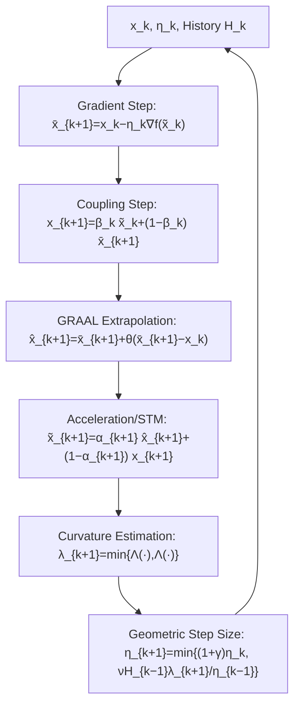

# Nesterov Finds GRAAL: Optimal and Adaptive Gradient Method for Convex Optimization

**Conference**: ICLR 2026  
**OpenReview**: [https://openreview.net/forum?id=vPSiCA3CkD](https://openreview.net/forum?id=vPSiCA3CkD)  
**Code**: Not available  
**Area**: optimization  
**Keywords**: convex optimization, adaptive step size, Nesterov acceleration, GRAAL, local curvature estimation, $(L_0,L_1)$-smoothness  

## TL;DR
This paper "correctly" integrates GRAAL, a parameter-free and line-search-free adaptive gradient method, with Nesterov acceleration for the first time. The resulting Accelerated GRAAL allows the step size to adapt to local curvature at a **geometric (linear) rate**, similar to non-accelerated GRAAL, achieving near-optimal iteration complexity of $O(\sqrt{L\|x_0-x^*\|^2/\epsilon})$ under both $L$-smoothness and more general $(L_0,L_1)$-smoothness.

## Background & Motivation
**Background**: The core pain point of first-order gradient methods is the selection of step size $\eta$. Theoretically, for $L$-smooth functions, GD with a constant step size $\eta=1/L$ yields a complexity of $O(L\|x_0-x^*\|^2/\epsilon)$, while Nesterov’s accelerated gradient method (AGD) improves this to the optimal $O(\sqrt{L\|x_0-x^*\|^2/\epsilon})$. However, both require prior knowledge of the Lipschitz constant $L$.

**Limitations of Prior Work**: Adaptive methods generally follow three routes, each with drawbacks: (1) Line search requires multiple gradient/function evaluations per step without "advancing," which is rarely used in practice; (2) AdaGrad-like step sizes $\eta_k=\eta(\sum_i\|\nabla f(x_i)\|^2)^{-1/2}$ are **monotonically non-increasing**, failing to truly fit local curvature; (3) Local curvature estimation routes (Malitsky's GRAAL, AdGD) perform well with step sizes that can both increase and decrease, but **only non-accelerated versions** exist, with complexity stuck at $O(L\|x_0-x^*\|^2/\epsilon)$.

**Key Challenge**: Is it possible for GRAAL to retain the ability to "adapt to local curvature at a geometric rate" while gaining the optimal $\sqrt{\cdot}$ complexity brought by Nesterov acceleration? Previous attempts at accelerated adaptive methods, such as AC-FGM (Li & Lan 2025) and AdaNAG (Suh & Ma 2025), restricted the step size to **sublinear growth** ($\eta_{k+1}\le(1+1/k)\eta_k$), severely limiting adaptive capacity and failing to handle very small initial step sizes or $(L_0,L_1)$-smoothness.

**Goal**: Develop an algorithm that is **simultaneously accelerated, optimal, and fully adaptive** (no hyperparameter tuning, no line search).

**Core Idea**: **Replace the gradient step in the acceleration method with the extrapolation step of GRAAL, and bypass the "chicken-and-egg" problem—where calculating the step size requires knowing the momentum coefficient $\alpha_k$, but calculating $\alpha_k$ requires the step size—by using an additional coupling step.** This allows the geometric growth rule of GRAAL's step size to be directly imported into the Nesterov acceleration framework.

## Method

### Overall Architecture
The algorithm is constructed in four parts: first, replace the original Option I curvature estimator of GRAAL with the **Option II (Bregman divergence type) estimator**, which is better suited for convex functions; second, utilize the new interpretation of Nesterov acceleration by Kovalev & Borodich (2024), replacing the objective function at step $k$ with a scaled $f_k$; third, embed the GRAAL extrapolation step; and finally, use an additional coupling step with corresponding $\alpha_k, \beta_k$ recursions to resolve the cyclic dependency between the step size and the momentum coefficient.

### Key Designs

**1. Option II Curvature Estimator: Using Bregman divergence to more accurately "measure" the local Lipschitz constant.** The GRAAL step size rule $\eta_{k+1}=\min\{(1+\gamma)\eta_k,\ \nu\lambda_{k+1}^2/\eta_{k-1}\}$ relies on a finite-difference estimation of the inverse local Lipschitz constant $\lambda$. Given two points $x, z$, one can choose Option I $\lambda=\|x-z\|/\|\nabla f(x)-\nabla f(z)\|$, or Option II $\lambda=2D_f(x,z)/\|\nabla f(x)-\nabla f(z)\|^2$, where $D_f$ is the Bregman divergence. The original GRAAL used Option I for compatibility with more general variational inequalities (VI). However, for convex differentiable functions, Option II utilizes the structure of $f$ more effectively. This paper adopts Option II and defines $\Lambda(x;z)=2D_f(x;z)/\|\nabla f(x)-\nabla f(z)\|^2$ (setting to $+\infty$ if gradients are equal), taking the minimum of two estimates at each step $\lambda_{k+1}=\min\{\Lambda(x_{k+1};\tilde x_k),\Lambda(x_{k+1};\tilde x_{k+1})\}$ to keep the curvature estimate stable and tight.

**2. Rewriting Nesterov Acceleration as "Scaling the Objective Function".** Borrowing the interpretation from Kovalev & Borodich (2024): instead of directly accelerating $f$, the target at step $k$ is replaced by $f_k(x)=\alpha_k^{-1}f(\alpha_k x+(1-\alpha_k)x_k)$ for $\alpha_k\in(0,1]$. Performing GD on $f_k$, i.e., $x_{k+1}=x_k-\eta_k\nabla f_k(x_k)$ and setting $\overline{x}_{k+1}=\alpha_k x_{k+1}+(1-\alpha_k)x_k$, precisely recovers STM (a variant of AGD). This formulation hides "momentum" inside the scaling of the objective function, significantly simplifying the algebraic combination of acceleration and GRAAL extrapolation.

**3. GRAAL Extrapolation + Extra Coupling Step to break the cycle between step size and $\alpha_k$.** When combining GRAAL extrapolation $\hat x_{k+1}=\overline{x}_{k+1}+\theta(\overline{x}_{k+1}-x_k)$ with the above acceleration interpretation, one theoretically needs to select $\alpha_k$ such that $\eta_k/\alpha_k\le\eta_{k-1}/\alpha_{k-1}+\eta_k$. However, this is unattainable: calculating $\eta_k$ requires estimating local curvature, which requires $\nabla f_k(\hat x_k)$, which in turn requires knowing $\alpha_k$ beforehand—a classic chicken-and-egg problem. AC-FGM/AdaNAG compromised by pre-setting $\alpha_k\propto 2/(k+2)$, which essentially abandons the adaptive growth of the step size. The solution presented here introduces an **extra coupling step** $x_{k+1}=\beta_k \tilde x_k + (1-\beta_k) \overline{x}_{k+1}$, paired with the recursions $\alpha_{k+1}=\frac{(1+\gamma)\eta_k}{H_k+(1+\gamma)\eta_k}$, $\beta_{k+1}=\frac{\eta_{k+1}}{\alpha_{k+1}H_{k+1}}$, and $H_{k+1}=H_k+\eta_{k+1}$. This makes $\alpha_k$ dependent on **already computed historical step sizes**, removing the need to predict future step sizes.

**4. Geometric (Linear) Growth Rule for Step Size.** The step size update $\eta_{k+1}=\min\{(1+\gamma)\eta_k,\ \nu H_{k-1}\lambda_{k+1}/η_{k-1}\}$ includes an upper bound $(1+\gamma)\eta_k$, allowing the step size to expand at a **geometric rate**. This is the critical difference from AC-FGM ($\le(1+1/k)\eta_k$) and AdaNAG. Geometric growth implies that even if the initial step size $\eta_0$ is extremely small (e.g., $10^{-10}$), it only adds a logarithmic term $\ln[1/(\eta_0 L)]$ to the complexity. More importantly, under $(L_0,L_1)$-smoothness, the local Lipschitz constant can change at an exponential rate; only geometric growth or faster can prevent exponential factors from appearing in the complexity.

## Key Experimental Results
This work is purely theoretical; "experiments" are presented as convergence complexity theorems/corollaries and complexity comparisons with similar methods. No numerical experiments are provided.

### Main Results ($L$-smooth, Convex)

| Setting | Algorithm | Iteration Complexity |
|------|------|-----------|
| $L$-smooth | GD (Constant Step) | $O(L\|x_0-x^*\|^2/\epsilon)$ |
| $L$-smooth | AGD (Nesterov, Optimal) | $O(\sqrt{L\|x_0-x^*\|^2/\epsilon})$ |
| $L$-smooth | **Accelerated GRAAL (Ours, Cor. 2)** | $O\big(1+\sqrt{L\|x_0-x^*\|^2/\epsilon}+\ln[1/(\eta_0 L)]\big)$ |

The proposed method reaches the optimal rate with only an additional logarithmic term **independent of the precision $\epsilon$**, and requires no parameter tuning other than $\eta_0\le 1/L$.

### Comparison under $(L_0,L_1)$-smoothness (Table 1, $D=\|x_0-x^*\|$)

| Reference | Complexity | Optimal | Adaptive |
|------|--------|------|--------|
| Li et al. (2023) | $\sqrt{L_0D^2/\epsilon}\times(1+L_1^2D^2)\exp(O(1)L_1D)$ | ✘ | ✘ |
| Gorbunov et al. (2024) | $\sqrt{L_0D^2/\epsilon}\times\sqrt{1+L_1D}\exp(L_1D)$ | ✘ | ✘ |
| Vankov et al. (2024) | $\sqrt{L_0D^2/\epsilon}+(L_1D)^{5/3}$ | ✔ | ✘ |
| Tyurin (2025) | $\sqrt{L_0D^2/\epsilon}+(L_1D)^2$ | ✔ | ✘ |
| **Ours Cor. 3** | $\sqrt{L_0D^2/\epsilon}+(L_1D)^3$ | ✔ | ✔ |

### Key Findings
- **The only algorithm checking both "Optimal + Adaptive"**: While Vankov and Tyurin are near-optimal, the former requires solving a one-dimensional subproblem per step and the latter requires tuning multiple parameters; neither is fully adaptive. Ours requires zero tuning and zero line search.
- **Geometric step size growth is the linchpin for $(L_0,L_1)$ results**: The local curvature $\lambda_k$ can change exponentially in the worst case. Geometric growth allows the step size to catch up to $O(1/L_0)$ as the solution is approached without introducing exponential factors. AC-FGM/AdaNAG's sublinear growth cannot achieve $(L_0,L_1)$ guarantees.
- Compared to non-accelerated AdGD's $O(L_0D^2/\epsilon+(L_1D)^6)$ under $(L_0,L_1)$, the acceleration here provides a significant improvement.
- **Initial step size can be "chosen arbitrarily"**: For both $L$-smooth and $(L_0,L_1)$-smooth cases, simply choosing a sufficiently small $\eta_0$ (e.g., $10^{-10}$) satisfies the preconditions. The cost is only an additive term with logarithmic dependence on $\eta_0$ and no dependence on $\epsilon$. This is a practical advantage over AC-FGM (requires line search in the first step to find a "good" $\eta_0$) and AdaNAG (performance degrades significantly if $\eta_0$ is overestimated).
- Compared to Vankov (2024)’s $(L_1D)^{5/3}$, the $(L_1D)^3$ constant term in this paper is slightly larger, but this is the **only algorithm reaching this scale without needing any auxiliary subproblems or tuning**.

## Highlights & Insights
- **Elegant solution to the "chicken-and-egg" problem**: Using the extra coupling step to derive $\alpha_k$ from historical step sizes unlocks the circular dependency, which is the core key to embedding GRAAL into the Nesterov framework.
- **Geometric vs. sublinear growth**: The comparison clearly explains why previous accelerated adaptive methods were "partially crippled": if the step size grows too slowly, it cannot keep up with sharp changes in local curvature.
- A single algorithm covers both $L$-smoothness and the more realistic $(L_0,L_1)$-smoothness (the latter motivated by experimental phenomena in deep networks involving Hessian and gradient norms), remaining near-optimal in both.

## Limitations & Future Work
- **Purely theoretical, no numerical experiments**: While complexity comparisons are compelling, there is a lack of empirical comparisons against GRAAL/AC-FGM/AdaNAG on real optimization problems to verify constant factors and practical performance.
- The $(L_1D)^3$ additive term in $(L_0,L_1)$ is slightly worse than Vankov’s $(L_1D)^{5/3}$, leaving room for tightening.
- Restricted to convex, differentiable objectives; strong convexity, non-smoothness, and stochastic/mini-batch gradient scenarios are not covered.
- Complexity is near-optimal only in the sense of an "additive constant (independent of $\epsilon$)"; there remain extra terms related to the problem scale compared to strictly optimal rates.
- The author notes that whether the specific "GRAAL extrapolation" can be replaced by other base algorithms to achieve similar results remains an **open problem**.

## Related Work & Insights
- **GRAAL / AdGD** (Malitsky 2020; Malitsky & Mishchenko 2020; Alacaoglu et al. 2023): The non-accelerated base for this work, providing geometric growth step sizes and local curvature estimation.
- **Nesterov Acceleration / STM** (Nesterov 1983; Gasnikov & Nesterov 2016; Kovalev & Borodich 2024): Optimal lower bounds for acceleration and the "scaled objective function" interpretation.
- **Accelerated Adaptive Methods AC-FGM / AdaNAG** (Li & Lan 2025; Suh & Ma 2025): Direct competitors, limited by sublinear step size growth.
- **$(L_0,L_1)$-smoothness** (Zhang et al. 2019; Vankov et al. 2024; Tyurin 2025; Gorbunov et al. 2024): More realistic smoothness assumptions and their acceleration analysis.
- **Insight**: When calculating A requires B and B requires A, introducing an auxiliary recursion (coupling step) driven by historical quantities can break the cycle. The "growth rate" of an adaptive step size method should be treated as a first-class citizen—it determines whether the method can catch up with rapid local curvature changes.

## Rating
- **Novelty**: ⭐⭐⭐⭐ — First to achieve accelerated, optimal, and fully adaptive status (including $(L_0,L_1)$); the coupling step to break circular dependency is clever.
- **Experimental Thoroughness**: ⭐⭐⭐ — Theoretical complexity comparisons are solid and comprehensive, but numerical experiments are entirely absent.
- **Writing Quality**: ⭐⭐⭐⭐ — Motivation is logically progressive, clearly explaining why previous methods were insufficient; notation is somewhat dense.
- **Value**: ⭐⭐⭐⭐ — Resolves the natural and important theoretical question of whether GRAAL can be accelerated, offering guidance for adaptive optimization research.

<!-- RELATED:START -->

## Related Papers

- [\[ICLR 2026\] A Schrödinger Eigenfunction Method for Long-Horizon Stochastic Optimal Control](a_schrödinger_eigenfunction_method_for_long-horizon_stochastic_optimal_control.md)
- [\[ICLR 2026\] Clipped Gradient Methods for Nonsmooth Convex Optimization under Heavy-Tailed Noise: A Refined Analysis](clipped_gradient_methods_for_nonsmooth_convex_optimization_under_heavy-tailed_no.md)
- [\[ICLR 2026\] Fast Frank–Wolfe Algorithms with Adaptive Bregman Step-Size for Weakly Convex Functions](fast_frankwolfe_algorithms_with_adaptive_bregman_step-size_for_weakly_convex_fun.md)
- [\[ICLR 2026\] Gradient-Normalized Smoothness for Optimization with Approximate Hessians](gradient-normalized_smoothness_for_optimization_with_approximate_hessians.md)
- [\[ICLR 2026\] High Probability Bounds for Non-Convex Stochastic Optimization with Momentum](high_probability_bounds_for_non-convex_stochastic_optimization_with_momentum.md)

<!-- RELATED:END -->
