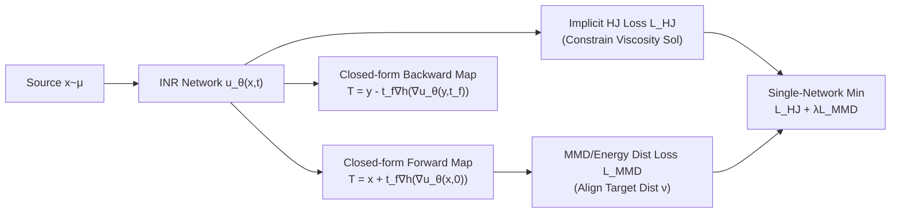

# Neural Hamilton–Jacobi Characteristic Flows for Optimal Transport

**Conference**: ICLR 2026  
**OpenReview**: [https://openreview.net/forum?id=YbQxus1KEa](https://openreview.net/forum?id=YbQxus1KEa)  
**Code**: To be confirmed  
**Area**: optimization  
**Keywords**: Optimal Transport, Hamilton–Jacobi Equations, Method of Characteristics, Viscosity Solution, Neural PDE Solver, Bidirectional Transport Map  

## TL;DR
This paper reformulates Optimal Transport (OT) maps as gradients of viscosity solutions to Hamilton–Jacobi (HJ) equations. By leveraging the "Method of Characteristics," it collapses dynamic integration into straight lines, enabling a **single-network, pure minimization loss** framework to obtain **closed-form, bidirectional, and provably optimal** transport maps, completely eliminating adversarial training and numerical ODE integration.

## Background & Motivation
**Background**: Solving OT with deep learning has branched into several main directions: Kantorovich dual/primal-dual approaches (using ICNNs to parameterize potential functions), Benamou–Brenier dynamics/Continuous Normalizing Flows (CNF), and entropy-regularized stochastic models. These formulations split OT into optimization problems involving "potential functions + transport maps."

**Limitations of Prior Work**: Dual-based methods almost exclusively rely on **min-max adversarial training** between two networks, which is unstable, difficult to tune, and memory-intensive. Dynamic methods, while using a single network, require **solving ODEs/SDEs during both training and inference**, incurring massive computational overhead and typically being unidirectional (requiring re-integration for the inverse). Furthermore, many methods yield **biased maps** due to regularization terms that do not strictly converge to true OT solutions.

**Key Challenge**: The viscosity solution of the HJ equation uniquely characterizes the OT map and is theoretically the cleanest representation. However, applying it directly faces two major hurdles: the **non-uniqueness of solutions** (HJ equations are ill-posed, and PINN residual penalties do not guarantee convergence to the viscosity solution) and the **continued requirement for ODE solvers** in the dynamic formulation.

**Goal**: To develop a framework that is single-network, pure minimization (no GAN-style training), provides closed-form bidirectional maps (no numerical integration), and **provably recovers the true OT map** given sufficient network capacity.

**Core Idea**: <u>Along the characteristics of the HJ equation, $p=\nabla u$ remains constant and the characteristics are straight lines</u>—this implies the transport destination is simply the endpoint of a straight line, naturally yielding a closed-form transport map. By employing a recently proposed **implicit solution formula**, the viscosity solution is constrained via a Monte Carlo-estimable loss, bypassing ODE integration while suppressing non-uniqueness.

## Method

### Overall Architecture
The method is termed **Neural Characteristic Flow (NCF)**: an implicit neural representation (INR) $u_\theta(x,t)$ approximates the viscosity solution of the HJ equation, and the transport map is directly provided by a closed-form formula of $\nabla u_\theta$. During training, two types of losses are applied: the "Implicit HJ loss" to force $u_\theta$ toward the true viscosity solution, and the "MMD loss" to align the transformed sample distribution with the target. The entire pipeline involves a single network and a minimization objective; the same $u_\theta$ is shared for forward and backward mappings.

### Key Designs

**1. Closed-form bidirectional mapping via Method of Characteristics: Collapsing dynamic integration into lines.** The dynamic form of OT (Benamou–Brenier) corresponds to a system of HJ characteristic ordinary differential equations (CODEs): $\dot x=\nabla h(p)$, $\dot p=0$. The critical observation is that $\dot p=0$ implies $p=\nabla u$ is **constant** along each characteristic trajectory, causing the characteristics to degenerate into straight lines $x(t)=t\nabla h(p)+x(0)$. The endpoint $t=t_f$ is precisely the OT map destination. Thus, the forward map is $T^{\nu*}_\mu(x)=x+t_f\nabla h(\nabla u^*(x,0))$, and the backward map is obtained using the same solution at the terminal time: $T^{\mu*}_\nu(y)=y-t_f\nabla h(\nabla u^*(y,t_f))$. This step eliminates the bottleneck of "numerical ODE integration over time" common in dynamic methods—both directions are **analytic and closed-form**, sharing a single network and avoiding the need for re-integration or dual networks.

**2. Implicit solution formula as training loss: Suppressing HJ ill-posedness with Monte Carlo residuals.** Directly solving HJ equations encounters issues with non-uniqueness, non-smoothness, and discontinuous gradients; PINN-style penalties on the HJ residual do not guarantee convergence to the correct viscosity solution. Ours adopts the implicit solution formula proposed by Park & Osher: $u(x,t)=-th(\nabla u)+t\nabla u^\top\nabla h(\nabla u)+g(x-t\nabla h(\nabla u))$. By replacing the unknown initial function $g$ with $u_\theta$ at $t=0$, a weighted residual loss is formulated: $L_{HJ}(u_\theta)=\iint \big(u_\theta+th(\nabla u_\theta)-t\nabla u_\theta^\top\nabla h(\nabla u_\theta)-u_\theta(x-t\nabla h(\nabla u_\theta),0)\big)^2 d\varrho(x)dt$. The measure $\varrho$ (uniform on a bounded domain or concentrated on sample regions) allows efficient estimation via Monte Carlo sampling, pinning $u_\theta$ to the viscosity solution across the space—a feature that makes it significantly stronger than HJ-PINN.

**3. Distribution alignment via MMD Energy Distance: Injecting distribution information into the HJ solution.** The HJ equation itself does not encode source/target distributions. To recover the desired OT map, the initial function $g$ must reflect the relationship between the two distributions, which lacks an analytic form under finite samples. Ours uses Maximum Mean Discrepancy (MMD) to constrain the transformed samples: $L_{MMD}(u_\theta)=\mathrm{MMD}(T^\nu_\mu[u_\theta]_\sharp\mu,\nu)^2$. Using the negative distance kernel $k(x,y)=-\|x-y\|_2$, MMD reduces to the **Squared Energy Distance**, which is effective in high dimensions. In the total loss $L_{HJ}+\lambda L_{MMD}$, the MMD term aligns the distributions while the HJ term ensures that the true OT map is uniquely selected among all possible matching maps. The authors prove that when the total loss is zero and the map Jacobian is positive definite, $T[u_\theta]$ is exactly the true OT map (Consistency Theorem), with stability bounds in Gaussian settings: $\|u_\theta-u^*\|+\|T-T^*\|\le C(L_{HJ}^{1/3}+L_{MMD}^{1/4})$.

**4. Class-conditional transport expansion: Satisfying HJ equations within individual supports.** The framework is extended to class-conditional OT—performing source-to-target transport for $K$ labeled classes while maintaining label consistency. The approach keeps the implicit HJ loss unchanged (as the global map must satisfy the HJ equation within each class support) and modifies the MMD loss to a class-wise average: $\frac1K\sum_k E(T^\nu_\mu[u_\theta]_\sharp\mu_k,\nu_k)$. Although non-differentiable regions may occur at class boundaries due to potential characteristic intersections, gradients are only computed within class supports where the map remains representable, naturally suiting domain adaptation and conditional generation.

## Key Experimental Results

### Main Results: UVP on Gaussian Distributions (↓, lower is better)
The evaluation metric is the percentage of Unexplained Variance (UVP), measuring the $L^2$ error of the estimated map (normalized by $\mathrm{Var}(\nu)$), with dimensions $d$ ranging from 2 to 64.

| Method | d=2 | d=4 | d=8 | d=16 | d=32 | d=64 |
|---|---|---|---|---|---|---|
| NOT | 77.25 | 125.42 | 114.06 | 176.09 | 182.29 | 196.83 |
| WGAN-QC | 1.60 | 5.90 | 31.04 | 59.31 | 113.24 | 141.41 |
| LS | 5.81 | 9.78 | 15.96 | 25.23 | 41.45 | 55.36 |
| MM-v1 | 0.16 | 0.17 | 0.17 | 0.21 | 0.37 | 0.42 |
| MM:R | 0.012 | 0.048 | 0.012 | 0.20 | 0.35 | 0.60 |
| HJ-PINN | 0.080 | 0.069 | 0.16 | 0.46 | 0.58 | 1.68 |
| **NCF** | **0.010** | 0.021 | 0.086 | 0.15 | 0.44 | 0.86 |
| **NCF-Adaptive** | **0.010** | 0.022 | 0.090 | 0.16 | **0.31** | **0.41** |

In low dimensions, NCF achieves the lowest error. In high dimensions (d=32/64), performance drops slightly as the single network handles bidirectional mapping (halving effective capacity); however, NCF-Adaptive (with slightly larger networks) recovers optimal performance while still using fewer parameters than MM-v1/MM:R.

### Application: Color Transfer (EMD ↓ / HI ↑)

| Method | Winter-Summer EMD/HI | Monet-Photo EMD/HI | Gogh-Photo EMD/HI |
|---|---|---|---|
| NOT | 0.0008 / 0.8002 | 0.0008 / 0.8210 | 0.0008 / 0.8247 |
| MM-v1 | 0.0014 / 0.7295 | 0.0011 / 0.7722 | 0.0007 / 0.8265 |
| **NCF** | **0.0005 / 0.8914** | **0.0004 / 0.9174** | **0.0003 / 0.9117** |

On complex, multi-modal real color distributions, NCF leads across all domains and metrics, with its advantage over baseline methods widening compared to Gaussian settings.

### Class-conditional: Fashion MNIST → MNIST (Accuracy ↑ / FID ↓)

| Metric | NOT | GNOT | Discrete OT | AugCycleGAN | MUNIT | **NCF** |
|---|---|---|---|---|---|---|
| Accuracy(%) ↑ | 10.96 | 83.22 | 10.67 | 12.03 | 8.93 | **83.42** |
| FID ↓ | 7.51 | 5.26 | >100 | 26.35 | 7.91 | 18.27 |

NCF achieves the highest class label accuracy (83.42%). The relatively higher FID is primarily due to discrepancies introduced by the VAE decoder; calculating FID between NCF outputs and VAE reconstructions yields 2.73, indicating the transport map itself is of high quality.

### Key Findings
- **Implicit HJ Loss > PINN Residual**: Comparisons with HJ-PINN show that the implicit solution formula is more accurate across all dimensions and successfully recovers the viscosity solution, whereas HJ-PINN produces intersecting and chaotic paths in 2D.
- **Single-Network Bidirectionality is a Double-edged Sword**: It significantly saves parameters in low dimensions but requires capacity compensation (NCF-Adaptive) in high dimensions.
- **Stability & Resource Efficiency**: Compared to the min-max instability of MM:R and the high memory/long training time of MM-v1, NCF is faster, more stable, and memory-efficient.

## Highlights & Insights
- **Turning "Solving ODEs" into "Finding Line Endpoints"**: The characteristic $\dot p=0$ collapses dynamics into an analytic closed-form, which is the source of its efficiency.
- **Correct Viscosity Solution Characterization**: Replacing PINN residuals with the implicit solution formula solves the failure of HJ solvers to recover correct solutions due to ill-posedness, backed by consistency and stability theorems.
- **Versatile Single Network**: A single $u_\theta$ provides forward and backward maps and extends to general cost functions and class-conditional transport, achieving engineering simplicity.
- **Provable Optimality**: As shown in Table 1, it is the only method that simultaneously satisfies being single-network, minimization-based, bidirectional, direct-sampling, and provably optimal.

## Limitations & Future Work
- **High-dimensional Capacity**: Handling bidirectional maps in $d=32/64$ with a single network requires manual capacity scaling (NCF-Adaptive), suggesting a need for better capacity allocation strategies.
- **Gradient Evaluation at Inference**: Mappings require $\nabla u_\theta$, leading to higher inference latency than direct-map methods like NOT (though the gap narrows in higher dimensions).
- **Theoretical Scope**: Stability and consistency proofs are primarily established for quadratic costs, $\Omega=\mathbb R^d$, and Gaussian settings; theoretical guarantees for general costs and distributions remain open.
- **VAE Latent Space Dependency**: Experiments on MNIST are performed in the $\beta$-VAE latent space; end-to-end pixel-level OT and the bias introduced by the decoder are not fully decoupled.

## Related Work & Insights
- **Dual/Primal-Dual OT** (MM-v1, MM:R, ICNN, WGAN-QC): Ours serves as a counter-example, proving that avoiding min-max can lead to higher accuracy and stability.
- **Dynamic OT / CNF** (Benamou–Brenier, OT-Flow, Onken et al.): Ours inherits the single-network advantage but uses characteristics to bypass ODE integration.
- **HJ-PINN / Physics-Informed Networks** (Raissi et al.): Ours demonstrates that residual penalties are insufficient for viscosity solutions, while implicit formulas are the correct approach.
- **Class-conditional/Weak OT** (GNOT, Asadulaev et al. 2024): Ours utilizes the class-conditional MMD forms but demonstrates superior, non-intersecting transport.
- **Insight**: Reformulating "viscosity solutions of ill-posed PDEs" into "closed-form characteristics + Monte Carlo implicit residuals" is a general paradigm applicable to other HJ/HJB control problems (e.g., Mean Field Control, Stochastic Optimal Control).

## Rating
- **Novelty**: ⭐⭐⭐⭐⭐ — The use of characteristic flows with implicit formulas to rewrite OT as a single-network minimization with provable optimality is highly original.
- **Experimental Thoroughness**: ⭐⭐⭐⭐ — Covers 2D toys, high-dimensional Gaussians with ground truth, color transfer, and class-conditional MNIST, including HJ-PINN ablations. Empirical verification for general costs is slightly lacking.
- **Writing Quality**: ⭐⭐⭐⭐ — Theoretical derivations are clear, Table 1 comparison is intuitive, and theorems connect well with the method.
- **Value**: ⭐⭐⭐⭐ — Provides a stable, efficient, and provable tool for OT, with direct value for generative modeling, domain adaptation, and style transfer.

<!-- RELATED:START -->

## Related Papers

- [\[ICLR 2026\] Neural Optimal Transport Meets Multivariate Conformal Prediction](neural_optimal_transport_meets_multivariate_conformal_prediction.md)
- [\[ICLR 2026\] HOTA: Hamiltonian Framework for Optimal Transport Advection](hota_hamiltonian_framework_for_optimal_transport_advection.md)
- [\[ICLR 2026\] A Memory-Efficient Hierarchical Algorithm for Large-scale Optimal Transport Problems](a_memory-efficient_hierarchical_algorithm_for_large-scale_optimal_transport_prob.md)
- [\[ICLR 2026\] Elastic Optimal Transport: Theory, Application, and Empirical Evaluation](elastic_optimal_transport_theory_application_and_empirical_evaluation.md)
- [\[ICLR 2026\] A Scalable Constant-Factor Approximation Algorithm for $W_p$ Optimal Transport](a_scalable_constant-factor_approximation_algorithm_for_w_p_optimal_transport.md)

<!-- RELATED:END -->
