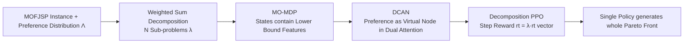

# Neural Multi-Objective Combinatorial Optimization for Flexible Job Shop Scheduling Problems

**Conference**: ICLR 2026  
**OpenReview**: [https://openreview.net/forum?id=YAgOaYedLQ](https://openreview.net/forum?id=YAgOaYedLQ)  
**Code**: [https://github.com/ai-for-decision-making-tue/Neural_Multi-Objective_CO_for_FJSP](https://github.com/ai-for-decision-making-tue/Neural_Multi-Objective_CO_for_FJSP)  
**Area**: optimization  
**Keywords**: Neural Combinatorial Optimization, Flexible Job Shop Scheduling, Multi-Objective Optimization, Decomposition Strategy, Preference-Conditioned Attention, PPO  

## TL;DR
Using a **single** preference-conditioned attention network combined with decomposition-based PPO, this work generates an entire Pareto front covering various trade-offs for Multi-Objective Flexible Job Shop Scheduling (MOFJSP) in a single training session, significantly outperforming evolutionary algorithms in both effectiveness and speed.

## Background & Motivation
**Background**: Neural Combinatorial Optimization (NCO) has demonstrated strong performance in single-objective Flexible Job Shop Scheduling (FJSP, primarily optimizing makespan), leveraging deep reinforcement learning to learn high-quality scheduling policies with extremely fast inference. However, real-world factories often need to balance multiple conflicting metrics—tardiness, flowtime, cost, etc.—yet **MOFJSP has barely been explored using NCO**.

**Limitations of Prior Work**: Traditional approaches have significant drawbacks. Applying a weighted sum of multiple objectives as a single objective fails to provide alternative solutions under different trade-offs, and optimal weights are difficult to determine a priori as they vary with instances and scales. Solving for each preference individually is prohibitive since single-objective FJSP itself is NP-hard. Mainstream Multi-Objective Evolutionary Algorithms (NSGA-II, MOEA/D) rely heavily on manual parameter tuning and operator design and become computationally infeasible as scale increases.

**Key Challenge**: Most existing multi-objective NCO methods are designed for routing problems (TSP/VRP) and **cannot be directly transferred to scheduling**. Routing uses episode-level sparse rewards, instance-level gradients, and static coordinate states. Conversely, scheduling involves long decision horizons (large number of operations) leading to delayed rewards, entirely different graph structures, and the need for step-wise rewards and richer dynamic state features. Early work targeting MOFJSP either used simplistic vector states and limited actions to a few dispatching rules or required **training a separate actor network for each preference**, which is extremely costly and restricted to fixed objective combinations.

**Goal**: Solve general MOFJSP using **one** neural network—supporting arbitrary objectives and their combinations, adaptable by simply feeding a preference vector during inference without retraining.

**Core Idea**: **[Decomposition + Preference-Conditioned Single Network]** MOFJSP is decomposed into a set of sub-problems with different preferences using weighted sums. A Decomposition-based Conditioned Attention Network (DCAN) is designed to inject the preference vector as a "virtual node" into the attention mechanism. It is then trained with a multi-objective customized decomposition PPO, allowing a single policy to output the entire Pareto front as preferences change.

## Method

### Overall Architecture
The method consists of three components: (1) Decomposing $M$ objectives into $N$ scalarized sub-problems $g(x|\lambda)=\sum_i \lambda_i f_i(x)$ using weighted sums, where each preference vector $\lambda$ corresponds to a trade-off point on the front; (2) Modeling scheduling as a multi-objective MDP, selecting an "operation-machine" pair $(O_{ij},M_k)$ at each step, and designing step-wise rewards and state features based on "lower/upper bounds" for each objective; (3) Learning a conditional policy $\pi_\theta(s, \lambda)$ using DCAN, trained with decomposition PPO to enable the single network to generate corresponding solutions for different $\lambda$.

### Key Designs

**1. Step-wise rewards based on lower bounds, decomposing "delayed reward" challenges into smooth signals**: Scheduling has a long decision horizon; providing objective values only at the end of an episode causes severe reward delay. This work extends the approach of DAN by maintaining a "quality metric" $H(\cdot)$ for each objective that changes monotonically with scheduling. The reward is defined as the difference between adjacent metrics $r_t = H(s_t)-H(s_{t+1})$, providing a smoother signal. The key insight is: as long as an objective is **non-decreasing** during scheduling, a metric can be constructed using lower bounds of completion times $C(O_{ij},s_t)=C(O_{i(j-1)},s_t)+\min_{k\in M_{ij}}p^k_{ij}$—makespan uses $\max C$, tardiness uses $\sum\max(C(O_{in_i},s_t)-D_i,0)$, flowtime maintains lower bound $F$, and cost uses minimum machine cost as a lower bound. For **non-increasing** earliness, an upper bound is maintained, and $r_t$ rewards the reduction of this bound. This "lower/upper bound" recipe generalizes to nearly all monotonic objectives and incorporates corresponding bounds into state features, allowing the policy to monitor variables directly impacting rewards.

**2. Weighted-sum decomposition PPO, theoretically aligning step-wise rewards with episodic objectives**: The training goal is to find a conditional policy that performs well across the instance distribution $\mathcal{S}$ and preference distribution $\Lambda$, i.e., $\pi^*_\theta=\arg\max_\pi \mathbb{E}_{\lambda\sim\Lambda,s_0\sim\mathcal{S}}[\sum_t \gamma^t \sum_i \lambda_i r_{t,i}]$. At each step, a vector reward $r_t$ is obtained and scalarized by the current preference as $r_t=\lambda^\top r_t$ for PPO (clipped + GAE). Weighted sum is chosen over Tchebycheff decomposition for two reasons: under weighted sum, the sum of step-wise rewards converges exactly to the episodic weighted sum reward (linearly additive, theoretically aligned), whereas Tchebycheff is non-linear and non-additive; empirically, weighted sum performs equally or better in NCO. During training, instances are swapped every $N_B$ episodes, and **a new preference $\lambda$ is re-sampled for each instance every episode**, preventing overfitting to specific sub-problems.

**3. DCAN: Preference as "artificial node" in dual conditioned attention**: The authors first propose a baseline, WI-DAN, which concatenates the preference vector directly to operation/machine features ($h_{O_{ij}}=[h_{O_{ij}}\|\lambda]$) before entering DAN. The core contribution is DCAN, which introduces a **virtual embedding** $h_\lambda$ initialized by the preference into each of DAN's dual attention blocks (Operation Message Block + Machine Message Block). The operation block update is $h^{l+1}_{O_{ij}}=\sigma\big(\sum_{p=j-1}^{j+1}\alpha_{(O_{ij},O_{ip})}Wh^l_{O_{ip}}+\alpha_{(O_{ij},\lambda_{ij})}Wh^l_{\lambda_{ij}}\big)$, with attention scores $e_{(a,b)}=\text{LeakyReLU}(a^\top[Wh_a\|Wh_b])$. The machine block is similar, but the score incorporates a machine "intensity" metric $c$; since there is no natural intensity between preference and machine, the mean of all $c$ is used. These preference virtual nodes **themselves are updated at each layer**, dynamically modulating operation-machine attention based on the current trade-off—this is precisely why DCAN outperforms the simple concatenation of WI-DAN. The Critic outputs value estimates for each objective individually (loss summed across components), allowing for finer credit assignment, though experiments show little difference from a single-value critic, suggesting the critic task is much simpler than the actor task.

## Key Experimental Results

### Main Results
Using CP-SAT hypervolume as a baseline on synthetic instances, the table below reports the gap (lower is better) for the makespan-costs combination (greedy inference):

| Scale | NSGA-II | MOEA/D | Hyper | WI-DAN | **DCAN** | DCAN(sample) |
|------|---------|--------|-------|--------|----------|--------------|
| 10×5 | 13.30% | 20.42% | 27.98% | 15.81% | 14.55% | 8.01% |
| 20×5 | 12.53% | 21.14% | 16.61% | 9.17% | **8.14%** | 6.09% |
| 15×10 | 26.33% | 39.73% | 23.85% | 17.23% | **16.44%** | 13.42% |
| 20×10 | 26.43% | 42.93% | 9.32% | 6.82% | **5.44%** | 4.07% |

For tardiness-costs on 20×10, DCAN greedy gap is only 4.53% and sample is 2.25%, while NSGA-II/MOEA/D are as high as 30.83%/50.24%. Regarding runtime, DCAN greedy takes seconds (approx. 6.6s for 20×10), while evolutionary algorithms require 1700–2900s, making it two to three orders of magnitude faster.

### Ablation Study
Comparing DCAN vs. WI-DAN vs. Hypernetwork (Hyper, style of Lin et al. 2022 / Su et al. 2024 "one network per preference"):

| Comparison | Hyper | WI-DAN | **DCAN** |
|------------|-------|--------|----------|
| Gap (lower is better) | Highest | Middle | **Lowest** |
| Pareto Set Size | Small | Middle | **Largest** |
| Number of Networks | 1 per preference | Single | **Single** |

### Key Findings
- **Advantage grows with scale**: On 20×10, the DRL policy gap is ~50% better than MOEA/D, and the gap to CP-SAT narrows as the instance size increases.
- **DCAN consistently outperforms WI-DAN**, particularly on 3-objective problems where it reduces the gap by several more percentage points and stably generates a **larger Pareto set**, confirming that conditioned attention better utilizes decomposition sub-problems.
- **Sampling inference (10 solutions per sub-problem)** further improves hypervolume and front size at the cost of longer, yet still very short, runtimes.
- **Strong Generalization**: The method solves JSSP and Flexible Flow Shop (FFSP) without modification and naturally extends to 4-objective problems (makespan-flowtime-earliness-costs), validated on standard benchmarks like mk/rdata/edata/vdata.

## Highlights & Insights
- **"Preference as a virtual node" is an elegant conditioning mechanism**: It avoids modifying the backbone or opening extra networks, adding only a preference node updated layer-by-layer to permeate trade-off information into every decision. This is more efficient and powerful than simple feature concatenation (WI-DAN) or hypernetworks.
- **The "Monotonic Objective → Bound → Step reward" is a reusable recipe**: Converting delayed reward problems into differential quality metrics covers five common objectives (makespan/tardiness/earliness/flowtime/cost) and generalizes to any non-increasing/non-decreasing objective, providing a general engineering paradigm for NCO scheduling.
- **Theoretical alignment of weighted sum decomposition is empirically supported**: The sum of step-wise rewards converges to the episodic weighted sum reward. This explains the choice of weighted sum and addresses the observation that Tchebycheff, while theoretically capable of capturing non-convex fronts, does not consistently outperform in practice.

## Limitations & Future Work
- **Weighted sum decomposition theoretically cannot capture non-convex Pareto fronts**: Although weighted sum performs competitively with Tchebycheff in tests, a structural blind spot remains for strongly non-convex fronts.
- **Cost objective definition is somewhat constructive**: Cost is defined as inversely correlated with processing time and degenerates to a constant on rdata/edata/vdata due to identical processing times across machines, limiting the multi-objective nature of these benchmarks.
- **Still uses CP-SAT hypervolume as an "upper bound baseline"**, with DCAN still a few percentage points behind, and it has not been validated on massive real-world industrial scheduling (e.g., semiconductor/aluminum industries).
- **The impact of preference distribution and sampling strategies on front coverage** has not been analyzed in depth, and the number of sub-problems (101/105) remains manually set.

## Related Work & Insights
- **NCO for single-objective FJSP**: Song et al. (2022) introduced the first end-to-end DRL + heterogeneous graph; Wang et al. (2023) proposed DAN (Self-Attention + Cross-Attention), the current SOTA architecture. DCAN/WI-DAN are built upon DAN.
- **MO-NCO for Routing**: Li et al. (2021) used decomposition + one network per sub-problem; Lin et al. (2022) used hypernetworks to map weights to actor parameters; Wang/Chen/Fan (2024–2025) followed a single-model preference-conditioned route. These ideas inspired this work but could not be directly migrated due to routing's use of episodic rewards and static states.
- **Multi-Objective Evolutionary Algorithms**: The decomposition thought from MOEA/D (Zhang & Li 2007) is the theoretical parent of the weighted sum decomposition used here; NSGA-II serves as the primary baseline.
- **Insights**: Combining "Preference-Conditioned Attention + Step-wise Bound Reward + Decomposition PPO" could be extended to more complex scheduling with time windows/resource constraints, dynamic/stochastic MOFJSP, or learning-to-search hybrids with CP/heuristics.

## Rating
- **Novelty**: ⭐⭐⭐⭐ First NCO method to solve general MOFJSP with a single network. The "preference as virtual node" conditioned attention and step-wise bound reward recipe are original, filling a gap in multi-objective scheduling NCO.
- **Experimental Thoroughness**: ⭐⭐⭐⭐ Covers various scales, 2/3/4 objective combinations, and multiple standard benchmarks. Validates JSSP/FFSP generalization and compares against evolutionary algorithms, hypernetworks, and CP-SAT with clear ablations. Slightly lacks massive real-world industrial instances.
- **Writing Quality**: ⭐⭐⭐⭐ Motivations are progressively built, and the reasoning for the method and theory (why weighted sum) is well-explained. Formulas and pseudo-code are complete and easy to follow.
- **Value**: ⭐⭐⭐⭐ Highly practical—generates the entire Pareto front based on preferences at inference time after a single training session, being two to three orders of magnitude faster. Directly applicable to multi-criteria scheduling in manufacturing.

<!-- RELATED:START -->

## Related Papers

- [\[ICLR 2026\] Multi-Action Self-Improvement for Neural Combinatorial Optimization](multi-action_self-improvement_for_neural_combinatorial_optimization.md)
- [\[ICLR 2026\] In-Context Multi-Objective Optimization](in-context_multi-objective_optimization.md)
- [\[ICLR 2026\] Gradient-Based Diversity Optimization with Differentiable Top-$k$ Objective](gradient-based_diversity_optimization_with_differentiable_top-k_objective.md)
- [\[ICLR 2026\] Toward Principled Flexible Scaling for Self-Gated Neural Activation](toward_principled_flexible_scaling_for_self-gated_neural_activation.md)
- [\[ICML 2025\] BOPO: Neural Combinatorial Optimization via Best-anchored and Objective-guided Preference Optimization](../../ICML2025/optimization/bopo_neural_combinatorial_optimization_via_best-anchored_and_objective-guided_pr.md)

<!-- RELATED:END -->
