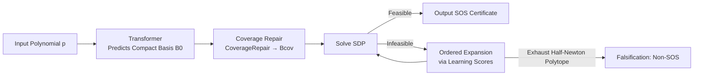

# Neural Sum-of-Squares: Certifying the Nonnegativity of Polynomials with Transformers

**Conference**: ICLR 2026  
**OpenReview**: [https://openreview.net/forum?id=PAV5zYn0Hn](https://openreview.net/forum?id=PAV5zYn0Hn)  
**Code**: [https://github.com/ZIB-IOL/Neural-Sum-of-Squares](https://github.com/ZIB-IOL/Neural-Sum-of-Squares)  
**Area**: Learning-augmented Optimization / Sum-of-Squares Programming / Computational Algebra  
**Keywords**: SOS Certificate, Semidefinite Programming (SDP), Monomial Basis, Transformer, Algorithms with Predictions  

## TL;DR
This work utilizes a Transformer to predict a "compact monomial basis" for polynomials to significantly reduce the scale of Semidefinite Programs (SDP) corresponding to Sum-of-Squares (SOS) certificates. Combined with a repair and expansion fallback mechanism that guarantees correctness, it accelerates non-negativity proofs by 100× to 2000× compared to SOTA solvers.

## Background & Motivation
- **Background**: Determining whether a polynomial is globally non-negative is an NP-hard problem with broad applications in non-convex optimization, control, and robotics. A sufficient condition is Sum-of-Squares (SOS): if $p(x)=\sum_i h_i(x)^2$, it must be non-negative. Parrilo proved that SOS can be reduced to SDP—$p$ is SOS if and only if there exists a PSD matrix $Q$ such that $p(x)=z(x)^\top Q\, z(x)$, where $z(x)$ is a vector of monomials.
- **Limitations of Prior Work**: The dimension of the SDP grows **quadratically** with the size of the monomial basis. The standard approach uses "all monomials up to half the degree" as the basis $z(x)$, which is extremely large. Existing basis reduction methods (Newton polytope pruning, diagonal consistency checks, TSSOS term sparsity) can remove some redundant monomials, but the **resulting basis is still far from minimal**, and constructing the Newton polytope itself is expensive in high dimensions.
- **Key Challenge**: A smaller basis makes the SDP faster, but finding a near-minimal basis is inherently difficult (the complexity of finding the absolute minimal basis remains an open problem). While machine learning (ML) can find smaller bases, its predictions are **imprecise**—missing a critical monomial can make a feasible SDP infeasible, destroying correctness.
- **Goal**: To treat "basis selection" as a prediction task, using learning methods to find more compact bases than rule-based methods while **not sacrificing the correctness guarantee** of the proof (if an SOS exists, it must be found; otherwise, it is falsified using the full basis).
- **Core Idea**: **[Learning Upstream + Verification for Correctness]** A Transformer is trained to predict a compact basis to shrink the SDP. The unreliable ML prediction is wrapped in a "coverage repair + ordered expansion + SDP verification" fallback pipeline. This fits the Algorithms-with-Predictions framework—accurate predictions lead to speed, while incorrect predictions result in at most a constant factor overhead.

## Method

### Overall Architecture
Given a polynomial $p$, a Transformer first predicts a compact monomial basis $B_0$. This basis is checked against a necessary structural condition (coverage); if it fails, it is greedily fixed to produce $B_{cov}$. The SDP is then solved using $B_{cov}$. If feasible, a certificate is produced. If infeasible, the basis is expanded iteratively based on learning scores and re-solved until a solution is found or the candidate set is exhausted (falsifying the SOS property). The pipeline's correctness is backed by a worst-case degradation to the standard Newton polytope method.

### Key Designs

**1. Data Construction via Inverse Sampling + Sequential Prediction: Turning basis selection into a supervised generation task.** Training requires "polynomial $p \leftrightarrow$ near-minimal basis $B$" pairs. Since finding the minimal basis is hard, the authors reverse the process: they sample a monomial set $B\subseteq M_d$, sample a $Q\succeq 0$, and set $p(x)=z_B(x)^\top Q\,z_B(x)$. This ensures $B$ is a valid SOS basis for $p$. By varying $Q$ across dense full-rank, sparse, block-diagonal, and low-rank structures, and altering variables/degrees, they generate over 100 million samples that approximate theoretical lower bounds. The Transformer tokenizes the polynomial into sequences of "coefficients (C-prefix) + exponents (E-prefix)" and autoregressively generates the basis until an EOS token. Monomial embedding maps each token to a vector, shortening sequences and enabling generalization across variable counts.

**2. Coverage Necessary Condition + Greedy Repair: Ensuring the basis can "contain" the polynomial before solving the SDP.** Lemma 2 provides a structural constraint: the monomial support of $p$ must be covered by the pairwise products of the basis, i.e., $S(p)\subseteq B\cdot B$, where $B\cdot B=\{m_i m_j: m_i,m_j\in B\}$. For example, if $p$ contains $x_2^4$, and the predicted $B$ does not contain monomials that can multiply to $x_2^4$, the SDP is guaranteed to be infeasible. This step allows for cheap detection of "missing terms" without solving an SDP. The `COVERAGEREPAIR` step greedily adds monomials that cover the most missing terms until $S(p)\subseteq B\cdot B$ holds, resulting in $B_{cov}$.

**3. Permutation-Scoring Driven Ordered Expansion + Complexity Guarantee: Turning uncertain predictions into bounded-cost search.** If $B_{cov}$ is still infeasible, more monomials must be added from the candidate pool $\tfrac12 N(p)$. The authors exploit the fact that Transformers are not invariant to variable permutations. They run the model on $L$ random permutations $\{\pi_1,\dots,\pi_L\}$ and score monomials based on their frequency: $\mathrm{SCORE}(u,p)=\frac1L\sum_{i=1}^L \mathbf{1}[u\in\pi_i^{-1}(B_{\pi_i})]$. Candidates are sorted by score and added to $B_{cov}$ according to a schedule $m_1 < \dots < m_k = |\tfrac12 N(p)|$. Theory: If one SDP costs $\Theta(m^\omega)$, and $\eta$ is the minimum index to form a valid basis, a geometric expansion schedule (multiplying by $\rho$ each time) ensures at most $1+\lceil\log_\rho(\eta/m_1)\rceil$ SDP iterations. Thus, even a completely wrong prediction results in only a constant factor overhead compared to the full basis method.

## Key Experimental Results

### Main Results: Comparison with Baselines (Avg Basis Size / Solve Time s, selection of dense & sparse)

| Structure | $n$ | $d$ | $m$ | $\lvert B^*\rvert$ | Ours Basis | Newton Basis | Ours Time | Newton Time | Gain |
|-----------|-----|-----|-----|-------------------|------------|--------------|-----------|-------------|------|
| dense     | 8   | 20  | 30  | 28                | 38         | 32           | 3.4       | 309.4       | 91×  |
| dense     | 6   | 20  | 60  | 58                | 89         | 236          | 18.3      | 1629.6      | 89×  |
| sparse    | 8   | 20  | 30  | 26                | 27         | 28           | 0.62      | 15.3        | 25×  |
| sparse    | 6   | 20  | 60  | 56                | 73         | 233          | 7.39      | 1606.4      | **217×** |

Speedups range from 0.7× to 300×+; full basis methods consistently time out on large instances. Only on the smallest instances ($n=4, d=6$) is the performance slightly behind the Newton method.

### Comparison with Large-scale / SOTA Solvers (Avg Time s, "–" = OOM/Timeout)

| Config | Ours | SumOfSquares.jl | TSSOS | Chordal |
|--------|------|-----------------|-------|---------|
| 6 vars, deg 20 | 5.64 | 119.98 | 86.53 | 105.54 |
| 8 vars, deg 20 | **1.46** | 3037.85 | 2674.50 | 3452.98 |
| 6 vars, deg 40 | 42.8 | – | – | – |
| 100 vars, deg 10 | 18.3 | – | – | – |

On 8-variable/degree-20 problems, the speedup over SoS.jl/TSSOS exceeds 2000×. On the largest instances, all baselines OOM or timeout, while this method finishes within 60 seconds.

### Key Findings
- **Speedup comes from basis reduction, not solvers**: Both this method and the baselines use the same SDP solvers (MOSEK/SCS). The speedup is entirely due to the compact basis compressing the SDP dimension.
- **Scalability to previously unsolvable sizes**: Instances like 100 variables/degree 10 or 6 variables/degree 40 are solved in minutes, pushing the practical boundaries of SOS programming.
- **Zero compromise on correctness**: Thanks to coverage repair and ordered expansion, missing terms do not lead to false negatives. The worst-case scenario is a return to the standard basis, ensuring speed does not come at the cost of precision.

### Ablation Study

| Dimension | Key Finding |
|-----------|-------------|
| Pure Transformer (No Repair) | 85–95% success on sparse/block-diagonal; high failure on dense/low-rank (near 100% on complex cases)—highlights repair necessity. |
| Repair Strategy | Greedy repair achieves high exact-match at low cost. Permutation repair reduces "insufficient" cases but increases "superset" cases. **Combined repair** yields the lowest insufficiency rate. |
| Time Distribution | Except for small problems, SDP solving accounts for 75–80% of total time. Transformer inference and repair overhead are manageable. |
| Distribution Shift | Training on degree 12 allows prediction for degree 20 (monomial embeddings enable compositional generalization). |
| Architecture Agnostic | Given a 5-hour training budget, LSTM/Mamba also work, with Mamba showing performance competitive with Transformers. |

## Highlights & Insights
- **Upstream ML Application**: This represents the first application of Algorithms-with-Predictions in computational algebra, utilizing ML for "upstream basis selection" rather than "direct classification," ensuring incorrect predictions do not affect correctness.
- **Necessary Coverage Condition** ($S(p)\subseteq B\cdot B$): This serves as a cheap "pre-check" to repair the basis before ever solving an expensive SDP.
- **Turning model flaws into features**: The Transformer's lack of permutation invariance is leveraged as a voting mechanism to generate robust monomial scores.
- **Monomial Embeddings**: These allow the model to generalize across different numbers of variables and unseen degrees, which is critical for cross-scale transfer.

## Limitations & Future Work
- Pure prediction failure rates are high for **dense/low-rank** polynomials, leading to heavy reliance on the fallback repair, which reduces the compactness benefit in these structures.
- Permutation scoring requires running the Transformer $L$ times and relies on non-invariance, which is not a strictly controlled property.
- Finding the true minimal basis remains an open complexity problem; the method approximates theoretical bounds but cannot guarantee minimality.
- Significant training costs (100M samples) must be amortized by high-frequency usage; it may not be cost-effective for one-off small tasks.
- Future work could explore more equivariant or suitable sequence models (like Mamba) and apply the method to constrained SOS problems in control/robotics.

## Related Work & Insights
- **SOS Foundations**: Based on Parrilo (2003) and Lasserre (2001) who reduced polynomial optimization to SDP.
- **Rule-based Reduction**: Newton polytope pruning (Reznick 1978), diagonal consistency (Lofberg 2009), and TSSOS/Chordal (Wang et al.) are replaced or augmented by this learned approach.
- **Algorithms with Predictions** (Roughgarden 2021): Provides the theoretical framework for integrating imprecise predictions with worst-case guarantees.
- **Computational Algebra × ML**: Reuses polynomial tokenization from Kera et al. (2025b), demonstrating how to wrap symbolic/algebraic decision problems into "predict + verify" pipelines.

## Rating
- **Novelty**: ⭐⭐⭐⭐⭐ First to apply learning-augmented algorithms to SOS programming with a clean "upstream prediction + guaranteed verification" paradigm.
- **Experimental Thoroughness**: ⭐⭐⭐⭐ Solid evidence across 200+ benchmarks, four structural classes, and comparisons with SOTA solvers; acknowledges limitations in dense/low-rank cases.
- **Writing Quality**: ⭐⭐⭐⭐⭐ Clear and intuitive, with a running example used throughout the text to explain lemmas and repair processes.
- **Value**: ⭐⭐⭐⭐⭐ Accelerates SOS proofs by 2–3 orders of magnitude while maintaining correctness, enabling the solution of previously unsolvable instances in control and optimization.

<!-- RELATED:START -->

## Related Papers

- [\[ICLR 2026\] Learning to Recall with Transformers Beyond Orthogonal Embeddings](learning_to_recall_with_transformers_beyond_orthogonal_embeddings.md)
- [\[ICLR 2026\] Markovian Transformers for Informative Language Modeling](markovian_transformers_for_informative_language_modeling.md)
- [\[ICLR 2026\] Cutting the Skip: Training Residual-Free Transformers](cutting_the_skip_training_residual-free_transformers.md)
- [\[ICML 2026\] Towards Understanding Adam Convergence on Highly Degenerate Polynomials](../../ICML2026/optimization/towards_understanding_adam_convergence_on_highly_degenerate_polynomials.md)
- [\[NeurIPS 2025\] Least Squares Variational Inference](../../NeurIPS2025/optimization/least_squares_variational_inference.md)

<!-- RELATED:END -->
