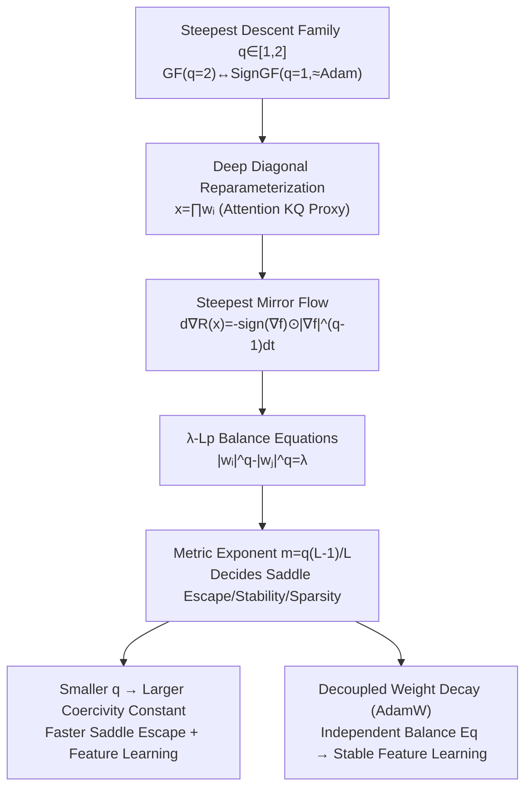

# Never Saddle for Reparameterized Steepest Descent as Mirror Flow

**Conference**: ICLR 2026  
**OpenReview**: [https://openreview.net/forum?id=YgudIlQ9nC](https://openreview.net/forum?id=YgudIlQ9nC)  
**Code**: To be confirmed  
**Area**: optimization  
**Keywords**: steepest descent, mirror flow, implicit bias, saddle point escape, feature learning, AdamW, weight decay, diagonal linear networks  

## TL;DR
This paper proposes a "steepest mirror flow" framework that unifies the entire family of steepest descent algorithms under reparameterization—from SignGF (≈Adam) to GF (≈SGD)—into a mirror flow perspective. It geometrically explains why steeper descent escapes saddle points faster and learns sparse features better, thereby elucidating two mechanisms why Adam/AdamW often outperforms SGD in fine-tuning tasks.

## Background & Motivation
**Background**: In over-parameterized, highly non-convex deep learning objectives, the choice of optimizer is not just a matter of convergence speed; different algorithms converge to solutions with drastically different generalization, sparsity, and robustness. A widely used geometric perspective is that over-parameterization under Gradient Flow (GF) induces a "mirror flow," which changes the effective geometry where optimization occurs and explains how implicit regularization, symmetry, and balance constraints shape the final solution.

**Limitations of Prior Work**: However, almost all such theories revolve around gradient descent/gradient flow, while modern fine-tuning practice presents a different picture—(S)GD with small learning rates often performs poorly, whereas Adam/AdamW is more stable and powerful. Why adaptive methods work so well in fine-tuning and what kind of solutions they prefer remains theoretically unclear.

**Key Challenge**: To avoid catastrophic forgetting, fine-tuning must use small learning rates. However, existing theories suggest that GF requires "time rescaling" (i.e., large learning rates) to escape saddle points—these two requirements directly conflict. In other words, in small learning rate fine-tuning scenarios, the GF perspective cannot explain how the optimizer escapes saddle points and learns features.

**Goal**: Extend mirror flow analysis from Gradient Flow to the entire family of steepest descent algorithms, characterize how optimization geometry determines learning dynamics, implicit bias, and sparsity, and use this to explain the root cause of Adam/AdamW's superiority over SGD.

**Key Insight**: **Use a parameter $q \in [1,2]$ to connect GF ($q=2$) and SignGF ($q=1$, a proxy for Adam) into a steepest descent family. Prove that reparameterization induces them all into "steepest mirror flows," where the geometric "metric exponent" determines the difficulty of escaping saddle points—steeper descent (smaller $q$) escapes faster and enters the feature learning regime earlier.**

## Method

### Overall Architecture
This paper studies the dynamics induced by the combination of **reparameterization + steepest descent**. The starting point is the steepest flow under the $L_p$ norm: $dx_t = -\mathrm{sign}(\nabla_x f) \odot |\nabla_x f|^{q-1} dt$ (where $\frac{1}{p} + \frac{1}{q} = 1$; $q=2$ is GF, $q=1$ is SignGF). When the variable $x$ in the objective is written as a deep diagonal reparameterization $x = g(w) = \prod_{i=1}^L w_i$ (a diagonal proxy for the $KQ$ product in attention), the steepest flow is rewritten as a "steepest mirror flow" $d\nabla_x R(x_t) = -\mathrm{sign}(\nabla_x f) \odot |\nabla_x f|^{q-1} dt$, where the Legendre function $R$ is entirely determined by the balance equations preserved by the reparameterization. The difficulty of the analysis lies in the fact that GF lives in a Hilbert space with an inner product, while general steepest descent only has a norm and lives in a Banach space, losing the inner product structure and requiring a re-establishment of convergence and geometric characterizations.

### Key Designs

**1. Steepest Mirror Flow and Convergence Guarantees in Banach Space: Fitting Adam into the Mirror Flow Framework**. The paper unifies the steepest descent family as the steepest flow regarding the $L_p$ norm: $dx_t = -\mathrm{sign}(\nabla_x f) \odot |\nabla_x f|^{q-1} dt$, with $q$ smoothly interpolating between SignGF and GF from 1 to 2. Since the inner product is lost, the implicit bias characterization of traditional mirror flow (Theorem 3.4) no longer holds when $p \neq 2$. Instead, the paper uses the "inverse $\mu$-coercivity" of the Hessian ($x^\top \nabla^2 R^{-1}(x)x \ge \mu\|x\|^2$) to establish convergence: as long as $R$ is separable and inverse $\mu$-coercive with bounded gradients, the loss decays at $\int_0^\infty \|\nabla f\|^2 dt \le (f(x_0) - f(x_\infty))/(\mu B^{2-q})$. For strongly convex cases, a linear convergence rate is provided. The key insight is that this coercivity constant $\mu$ precisely corresponds to "how hard it is to escape the saddle point set," linking abstract convergence theory to concrete saddle escape phenomena.

**2. $\lambda$-$L_p$ Balance Equations and Metric Exponents: How Geometry Determines Saddle Escape Speed**. Deep diagonal reparameterization naturally possesses an additional set of saddle points $S$ (where multiple $w_i$ are zero simultaneously), and small initialization naturally starts near $S$. The paper proves that steepest descent maintains a generalized balance invariant $|w_i|^q - |w_j|^q = (|w_{i,0}|^q - |w_{j,0}|^q) \exp(-q \int_0^t \alpha_s ds)$, termed $\lambda$-$L_p$-balanced. Substituting this back allows for the analytical derivation of the mirror flow metric. When $L=2$, $\nabla^2 R_{L_p,2}(x) = 1/\sqrt{4|x|^q + \lambda^2}$, and the "metric exponent" is defined as $m = q \frac{L-1}{L}$. The core conclusion is that the same initialization corresponds to vastly different effective $\lambda$ for different $p$. According to Corollary 4.10, with initialization $w_1 = 0, w_i = \lambda$, the coercivity constant $\mu = \lambda^{q(L-1)}$. **The smaller $q$ is and the larger $\lambda$ is, the larger the coercivity constant and the faster the saddle escape.** Intuitively (Figure 3), a smaller $q$ allows parameters to "swerve out" from the origin faster, which is the geometric root of SignGF being faster than GF; a large metric exponent ($m > 1$) implies an initial exponential deceleration or even global instability via finite-time explosion.

**3. Metric Exponent Defines the Stability Gap Between GF and SignGF**. Lemma 4.13 provides an explicit form for $R_{L_p,L}$ when $\lambda=0$: when $m=1$, it is entropic ($\sum x_j \log x_j$); when $m \neq 1$, it is power-type. $R$ is a valid Bregman function only if $m = q \frac{L-1}{L} \le 1$. This yields a key watershed in Corollary 4.14: for GF ($p=2$), only $L=2$ is valid, whereas for SignGF ($p=\infty$), all depths $L \ge 2$ are valid. This means that for GF on deeper networks with balanced initialization, the smoothness condition is not met, causing dynamics to dash out of bounds and become unstable. SignGF, however, is "boxed in" by the boundaries of the Bregman function and remains globally stable. In other words, **steeper descent (SignGF) can both escape saddles and remain stable in deep networks, which GF cannot achieve.**

**4. Decoupled Weight Decay (AdamW) Induces Different Manifold Regularization, Stabilizing Feature Learning**. The paper further characterizes the geometric effect of weight decay using manifold regularization: decoupled weight decay under balanced initialization induces a manifold regularization of $\frac{L}{L(2-q)+q} \sum |x_i|^{2 - q\frac{L-1}{L}}$. Example 4.17 gives a counter-intuitive conclusion: for SignGF ($q=1$), inducing $L_1$ sparsity requires $L \to \infty$, meaning **decoupled weight decay relies on deeper reparameterization to become sparse**. This is exactly the opposite of coupled weight decay, where high depth leads to extreme sparsity or performance collapse (Kolb et al.). Table 1 systematically compares regularization forms ($L_1$/log/power) under $L=2$ vs $L=\infty$ and coupled vs decoupled settings. The key meaning: AdamW uses an independent set of balance equations from GF to drive $\lambda$ to 0 "fast enough" to trigger feature learning, without pushing dynamics into the unstable regime of high exponents ($m>1$), thereby learning features stably—this is the second mechanism of AdamW's advantage over SGD.

## Key Experimental Results

### Main Results: Fine-tuning Validation Accuracy
Comparison of small LR SGD, tuned large LR SGD, and small LR Adam (95% confidence intervals) on standard vision/language fine-tuning tasks:

| Model | Fine-tuning Task | SGD (lr ≪ 1) | SGD (lr > 0) | Adam (lr ≪ 1) |
|-------|------------------|--------------|--------------|---------------|
| ResNet-18 | CIFAR-10 | 19.15 ± 2.82 | 93.60 ± 0.38 | **95.19 ± 0.21** |
| ResNet-18 | Flowers | 1.22 ± 0.53 | 62.13 ± 1.10 | **80.50 ± 1.38** |
| ViT-large | CIFAR-10 | 73.27 ± 3.68 | 99.07 ± 0.35 | **99.28 ± 0.07** |
| ViT-large | Flowers | 1.03 ± 0.82 | 98.94 ± 0.05 | **99.37 ± 0.08** |
| Bert-base | MRPC | 43.87 ± 24.02 | 84.80 ± 1.00 | **85.95 ± 0.64** |

Small LR SGD barely learns (stuck at saddles), while small LR Adam outperforms even the tuned large LR SGD across the board.

### Ablation Study: Geometric Predictions and Sparse Behavior

| Experimental Setup | Observation | Corresponding Theory |
|--------------------|-------------|----------------------|
| Diagonal Linear Net Regression ($k=300, n=100, L=3$) | GF small LR escapes saddles significantly slower than SignGF, more pronounced with depth | Thm 4.2 / Cor 4.10 |
| Binary Classification ($k=80$, sparse ground truth) | Higher depth allows $L_\infty$-margin to recover sparse ground truth | Cor 4.13 |
| ResNet-18 post-fine-tuning Hessian top-50 eigenvalues | Adam has fewer/weaker negative eigenvalues (escapes saddles more thoroughly), small LR SGD stays in saddle | Saddle escape mechanism |
| ResNet-50 / ImageNet Reparameterized Training | AdamW is sparse only under very deep reparameterization + large weight decay | Table 1 / Example 4.17 |

### Key Findings
- "Saddle point escape" is a core challenge in fine-tuning, and Adam-style steep descent can escape saddles and learn features stably even at small learning rates.
- Decoupled (AdamW) vs. coupled weight decay exhibits the predicted sparsity-stability trade-off: decoupled requires more depth to be sparse, while coupled becomes extremely sparse/unstable with increased depth.
- Geometry-induced margin depends on depth, going beyond previous depth-independent $L_\infty$-margin characterizations.

## Highlights & Insights
- **Attributing "why Adam wins in fine-tuning" to pure geometric mechanisms**: Not relying on large learning rates or noise perturbations, but solely on the geometry of the steepest descent family (metric exponent / coercivity constant) to escape saddles—a new explanation distinct from existing escape mechanisms.
- **The tension of the unified perspective is elegant**: A single $q \in [1,2]$ links convergence speed, implicit sparse bias, stability, and weight decay effects, while revealing the often-overlooked point that "the same initialization corresponds to vastly different effective $\lambda$ for different $p$."
- **Coupled vs. decoupled weight decay move in opposite sparsity directions**: Under SignGF, decoupling actually requires more depth for sparsity, correcting the naive intuition that "weight decay always promotes sparsity."

## Limitations & Future Work
- The theoretical core is built on **deep diagonal linear reparameterization** (a simplified diagonal proxy for attention $KQ$); whether the dynamics of real non-diagonal, non-linear networks follow the same metric exponent laws requires further validation.
- The analysis targets continuous-time flows (learning rate $\to 0$); full characterizations of discrete step sizes, randomness, and momentum are only touched upon in the appendix.
- Solutions for $L_p$ steepest flow are not unique in the Filippov sense; implicit bias for $p \neq 2$ cannot be characterized as precisely as GF, allowing only qualitative conclusions (escape/stability/sparsity). Quantitative implicit bias remains an open problem.

## Related Work & Insights
- **Mirror Flow and Reparameterization** (Li et al. 2022; Woodworth et al. 2020): This paper extends mirror flow theory, previously applicable only to gradient flows in Hilbert space, to steepest flows in Banach space—a substantial expansion of this line of work.
- **Steepest Descent and Max-margin** (Tsilivis et al. 2025; Zhang et al. 2024 for Adam): Existing $L_\infty$-margin characterizations are depth-independent; this paper points out that real margins depend on depth through the metric exponent, completing the geometric view.
- **Reparameterization-Induced Sparsity** (Ziyin & Wang 2022; Kolb et al. 2025): This paper distinguishes the opposite behaviors of coupled/decoupled weight decay regarding sparsity, providing a crucial clarification.
- **Insight**: Optimizer design can be viewed as the problem of "picking a geometry/metric exponent." To achieve stable feature learning, instead of tuning the learning rate, it might be more effective to tune the effective geometry through reparameterization depth and the form of weight decay.

## Rating
- **Novelty**: ⭐⭐⭐⭐⭐ First to bring the entire steepest descent family (including Adam proxies) into the mirror flow framework in Banach space, unifying saddle escape/sparsity/stability via the metric exponent. Highly original.
- **Experimental Thoroughness**: ⭐⭐⭐⭐ Validated from diagonal linear nets to ResNet/ViT/Bert fine-tuning and ImageNet sparse training; good coverage. However, primarily theory-driven, with less validation on real large-scale models.
- **Writing Quality**: ⭐⭐⭐⭐ Theoretical logic is clear, and illustrations are intuitive (metric exponents/balance curves), but the density of concepts like Banach space, Legendre/Bregman functions, and coercivity makes it high-threshold.
- **Value**: ⭐⭐⭐⭐⭐ Provides a provable geometric mechanism for "why Adam outperforms SGD in fine-tuning," offering substantial guidance for understanding adaptive optimizers and reparameterization design.

<!-- RELATED:START -->

## Related Papers

- [\[ICML 2026\] Mirror Descent Under Generalized Smoothness](../../ICML2026/optimization/mirror_descent_under_generalized_smoothness.md)
- [\[ICLR 2026\] Saddle-to-Saddle Dynamics Explains A Simplicity Bias Across Neural Network Architectures](saddle-to-saddle_dynamics_explains_a_simplicity_bias_across_neural_network_archi.md)
- [\[ICLR 2026\] High-dimensional Mean-Field Games by Particle-based Flow Matching](high-dimensional_mean-field_games_by_particle-based_flow_matching.md)
- [\[ICML 2025\] Learning Mixtures of Experts with EM: A Mirror Descent Perspective](../../ICML2025/optimization/learning_mixtures_of_experts_with_em_a_mirror_descent_perspective.md)
- [\[ICML 2026\] Bregman meets Lévy: Stochastic Mirror Descent with Heavy-Tailed Noise in Continuous and Discrete Time](../../ICML2026/optimization/bregman_meets_lévy_stochastic_mirror_descent_with_heavy-tailed_noise_in_continuo.md)

<!-- RELATED:END -->
