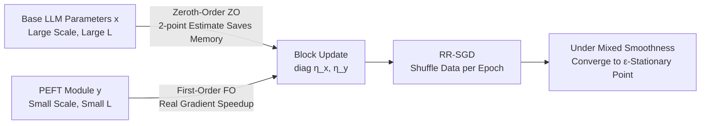

# New Hybrid Fine-Tuning Paradigm for LLMs: Algorithm Design and Convergence Analysis Framework

**Conference**: ICLR 2026  
**OpenReview**: [https://openreview.net/forum?id=avgMb57IP5](https://openreview.net/forum?id=avgMb57IP5)  
**Code**: TBD  
**Area**: Optimization Theory / LLM Fine-Tuning  
**Keywords**: Hybrid Fine-Tuning, Zeroth-Order Optimization, First-Order Optimization, PEFT, Generalized Smoothness, Random Reshuffling SGD, Convergence Analysis  

## TL;DR
Ours proposes a "Hybrid Fine-Tuning" paradigm that updates the massive base LLM using zeroth-order optimization and lightweight PEFT modules using first-order gradients. A "Mixed Smoothness Condition" is introduced to address the vast disparity in parameter smoothness, providing the first optimal convergence guarantee for Random Reshuffling SGD under generalized smoothness with multiple learning rates.

## Background & Motivation
**Background**: Current LLM fine-tuning primarily follows two paths: full-parameter fine-tuning (including zeroth-order ZO-FT, which estimates gradients via finite differences to save memory) and Parameter-Efficient Fine-Tuning (PEFT, such as Prompt/Prefix/LoRA, which frozen the base and only tunes a few parameters).

**Limitations of Prior Work**: Both approaches have significant drawbacks. Full-parameter fine-tuning (even the ZO version) is either computationally/memory expensive or converges extremely slowly due to the lack of true gradient information. PEFT, while efficient, has been noted by several studies (Gudibande et al. 2023; Ghosh et al. 2024) to struggle with "learning new knowledge," resulting in a lower performance ceiling.

**Key Challenge**: To simultaneously achieve the "new knowledge learning capability" of full-parameter tuning and the "efficiency" of PEFT, both the base LLM and PEFT modules must be updated—yet the optimization landscapes of these two parameter types are drastically different. Through visualization (Fig. 1), the authors identify two key facts: (a) the Gradient Lipschitz constant $L$ **varies dynamically** during training, growing almost linearly with the gradient norm; (b) the $L$ of the base LLM is significantly larger than that of the randomly initialized LoRA modules, making them **heterogeneous**. The traditional $L$-smoothness ($\nabla^2 f \preceq L I_d$) assumption, which uses a single static constant, fails to characterize this landscape, causing classical SGD convergence analysis to fail.

**Goal**: (1) Design a fine-tuning algorithm that combines the advantages of both worlds; (2) Establish a theoretical framework that accurately characterizes this heterogeneous landscape and provide rigorous convergence guarantees.

**Core Idea**: **[ZO for Base + FO for PEFT]** Update the base using zeroth-order optimization (avoiding full gradients to save memory) and update the small PEFT modules with first-order gradients (to accelerate convergence), assigning **different learning rates** to each. Theoretically, the "Mixed Smoothness Condition" is used to unify the characterization of dynamics and heterogeneity.

## Method

### Overall Architecture
The parameter space is explicitly partitioned into two parts: base LLM parameters $x\in\mathbb{R}^{d_x}$ and PEFT module parameters $y\in\mathbb{R}^{d_y}$. The goal is to minimize the empirical loss $f(x,y)=\frac1n\sum_{i=1}^n f(x,y;i)$. In each step, $x$ is updated using a zeroth-order gradient estimate, $y$ is updated using the true first-order gradient, and both are updated simultaneously using a block-diagonal learning rate matrix $\mathrm{diag}(\eta_x,\eta_y)$ within a standard Random Reshuffling SGD framework. While the implementation of the algorithm is intuitive, the primary contribution lies in proving its optimality under a new smoothness characterization.

### Key Designs

**1. Hybrid Update Rule: Collaboration between ZO and FO.** The core of the algorithm is a block update formula $\begin{bmatrix} x_{t,i}\\ y_{t,i}\end{bmatrix} \leftarrow \begin{bmatrix} x_{t,i-1}\\ y_{t,i-1}\end{bmatrix} - \begin{bmatrix}\eta_x & 0\\ 0 & \eta_y\end{bmatrix}\begin{bmatrix}\hat\nabla_x f\\ \nabla_y f\end{bmatrix}$. The base direction uses a two-point zeroth-order estimate $\hat\nabla_x f(x,y;\xi)=\frac{f(x+\mu v,y;\xi)-f(x,y;\xi)}{\mu}\,v$ ($v\sim\mathcal N(0,I_{d_x})$, with $\mu$ as the perturbation step size). This requires only two forward passes and no backpropagation through the massive base, keeping the **memory overhead equivalent to pure FO-PEFT**. Meanwhile, the PEFT direction $\nabla_y f$ uses true backpropagated gradients, confining the high variance and slow convergence inherent in zeroth-order estimates to small parameter blocks. This division of labor allows ZO to handle the task of "learning new knowledge" by moving the entire base, while FO handles "speed" with sufficient information.

**2. Mixed Smoothness Condition: Characterizing Dynamic and Heterogeneous Landscapes.** To facilitate convergence analysis, the authors extend generalized smoothness (Zhang et al. 2019; Li et al. 2024) to a block form. **Definition**: There exist two non-negative, non-decreasing sub-quadratic functions $\ell_x, \ell_y$ such that for all $(x,y)$, $\begin{bmatrix}\ell_x(\|\nabla f\|)I_{d_x} & 0\\ 0 & \ell_y(\|\nabla f\|)I_{d_y}\end{bmatrix}\succeq \nabla^2 f(x,y)$ holds. This condition captures two things simultaneously: the smoothness bound **changes with the current gradient norm** (corresponding to dynamic $L$) and the $x$ and $y$ blocks **each have their own smoothness functions** (corresponding to heterogeneous $L$). Standard $L$-smoothness is a degenerate case where $\ell_x=\ell_y=L$. This explains a key experimental observation (Fig. 2): assigning a high learning rate to the base leads to divergence, while a low learning rate for PEFT leads to extremely slow convergence—only "small steps for the base, large steps for PEFT" (asymmetric learning rates) ensures both stability and speed.

**3. Optimal Convergence Guarantee for RR-SGD with Multiple Learning Rates.** Under assumptions of coercivity, lower boundedness, second-order differentiability (Assumption 1), and bounded variance (Assumption 2), the authors prove the main theorem: when the learning rates are set as $\eta_x\le\min\{O(\frac{1}{L_x n d_x}),\,O(\frac{1}{\sqrt{T}nL_{x,\max}})\}$ and $\eta_y\le\min\{O(\frac{1}{L_y n}),\,O(\frac{1}{\sqrt{T}nL_{y,\max}})\}$, and the number of epochs $T\ge O(\epsilon^{-2}/\delta+\epsilon^{-4}/n)$, then with probability at least $1-\delta$, $\frac1T\sum_{t<T}\mathbb E\|\nabla f(x_t,y_t)\|^2\le\epsilon^2$. The total gradient complexity $nT\ge O(\epsilon^{-2}n/\delta+\epsilon^{-4})$ **reaches the known lower bound** (Arjevani et al. 2023) when $\epsilon$ is sufficiently small, matching the optimal upper bounds for the non-convex case of generalized and $L$-smoothness. The asymmetric forms of $\eta_x$ and $\eta_y$ in the upper bound theoretically validate the empirical observation that "different learning rates must be used." The authors emphasize that this is the **first** work to introduce Random Reshuffling into the optimization analysis of generalized smoothness.

## Key Experimental Results
The setup follows ZO-Bench (Zhang et al. 2024): 3 LLMs (OPT-1.3b, Vicuna-7b, Llama-2-7b) × 6 NLP tasks (SST-2, RTE, WSC, WiC, COPA, WinoGrande), sampling 1000 train / 1000 test / 100 dev samples per task, maximum 20,000 steps with uniform SGD. Comparisons are made between the FO and Hybrid versions of Prompt/Prefix/LoRA PEFT.

### Main Results (Pairwise comparison of Hybrid vs FO, selected OPT-1.3b and Llama-2-7b)

| Model | Method | SST-2 | RTE | WSC | WiC | COPA | WinoG. |
|------|------|-------|-----|-----|-----|------|--------|
| Llama-2-7b | FO-Prompt | 95.6 | 59.9 | 36.5 | 58.5 | 88.0 | 67.2 |
| Llama-2-7b | **Hybrid-Prompt** | **95.9** | 59.9 | **61.5** | **64.4** | 88.0 | **68.9** |
| Llama-2-7b | FO-LoRA | 94.6 | 62.1 | 60.6 | 61.6 | 84.0 | 68.5 |
| Llama-2-7b | **Hybrid-LoRA** | — | **62.5** | 60.6 | **61.7** | **88.0** | — |
| OPT-1.3b | FO-Prompt | 91.3 | 52.3 | 44.2 | 57.5 | 74.0 | 57.8 |
| OPT-1.3b | **Hybrid-Prompt** | **91.7** | **62.5** | **57.7** | **63.3** | **77.0** | **59.9** |

- In pairwise comparisons, Hybrid wins **41 out of 54 groups (≈76%)**.
- Comparing "FO-PEFT overall vs. Hybrid overall," Hybrid wins **17 out of 18 groups (≈94.5%)**.
- Compared to full-parameter fine-tuning (FO-FT and ZO-FT), Hybrid outperforms both in **13 out of 18 groups (≈72.2%)** (Fig. 3).

### Ablation Study

| Dimension | Conclusion |
|------|------|
| LR Configuration (Fig. 2) | Large base lr → Divergence; Small base lr → Slow PEFT convergence; Asymmetric (Base $10^{-6}$ / PEFT $10^{-3}$) → Stable and faster |
| Convergence Speed (Fig. 4) | Hybrid converges faster than ZO-FT, validating the acceleration of FO gradients on PEFT |
| Memory Overhead (Table 2) | Hybrid has **no additional memory overhead** compared to its FO-PEFT counterpart (base uses ZO, avoiding backprop) |

### Key Findings
Hybrid fine-tuning incurs almost no additional memory budget yet simultaneously outperforms both PEFT and full-parameter fine-tuning. Asymmetric learning rates are not just a tuning trick but a necessary requirement of the mixed smoothness landscape.

## Highlights & Insights
- **Theory-Phenomenon Closed Loop**: The authors first observe "dynamic + heterogeneous smoothness" and the "necessity of asymmetric learning rates" (Fig. 1/Fig. 2), then rigorously prove them with the Mixed Smoothness Condition and the Main Theorem, using theory to explain practice and practice to motivate theory.
- **Optimal Complexity**: The optimal sample complexity of Random Reshuffling SGD is extended from standard smoothness classes to the more general mixed generalized smoothness class, matching known lower bounds with solid theoretical weight.
- **Zero-Cost Upgrade**: Tuning the base with ZO means no increased memory compared to pure FO-PEFT, while gaining the ability for the base to learn new knowledge—a performance boost that is nearly free in engineering terms.

## Limitations & Future Work
- The experiments are limited to 7B scale models and few-shot scenarios (1000 samples per task). Whether the gains of the hybrid paradigm and the control of ZO variance hold for larger models or full-scale data remains to be verified.
- Zeroth-order two-point estimates naturally have high variance in high-dimensional base models. The paper relies on a "small learning rate" to suppress this, but the dependence of the convergence constant on dimension $d_x$ (the learning rate includes $1/d_x$) suggests that ultra-large models might require more sophisticated estimators or variance reduction.
- The framework assumes coercivity and bounded variance, which are standard but ideal conditions, and the analysis is specific to SGD. Extension to adaptive optimizers like Adam (more common in practice) is not covered.

## Related Work & Insights
- **Zeroth-Order LLM Fine-Tuning**: MeZO (Malladi et al. 2023), ZO-Bench (Zhang et al. 2024), etc., use finite differences to save memory. This paper restricts ZO to the base and reserves FO for PEFT, specifically addressing the "slowness" of pure ZO approaches.
- **Generalized Smoothness Optimization**: $(L_0, L_1)$-smoothness (Zhang et al. 2019), Li et al. 2024, etc., reveal that neural network losses are not $L$-smooth. This paper extends this to block-heterogeneous forms.
- **Random Reshuffling SGD**: Mishchenko et al. 2020, Khaled & Richtárik 2020, etc., provide optimal rates for RR. Ours is the first to combine RR with generalized smoothness analysis.
- **Key Insight**: When a system contains sub-modules with vast differences in scale or smoothness, instead of seeking uniform hyperparameters, it is better to explicitly acknowledge the heterogeneity and customize update rules and learning rates for each block—this idea can be transferred to scenarios like MoE, multimodal alignment, or model merging.

## Rating
- **Novelty**: ⭐⭐⭐⭐ The "ZO base + FO PEFT" hybrid paradigm + block mixed smoothness condition + first analysis of RR-SGD under generalized smoothness is a novel combination with clear motivation.
- **Experimental Thoroughness**: ⭐⭐⭐ Coverage of 3 models × 6 tasks × 3 PEFT types is systematic, with memory/convergence ablations; however, model scale and data volume are relatively small, lacking larger-scale validation.
- **Writing Quality**: ⭐⭐⭐⭐ Abstract smoothness issues are made intuitive using Fig. 1/Fig. 2, and the transition between theory and experiments is smooth.
- **Value**: ⭐⭐⭐⭐ Provides a fine-tuning upgrade path with nearly zero memory cost and theoretical guarantees, significant for both optimization theory and practical fine-tuning.

<!-- RELATED:START -->

## Related Papers

- [\[ICML 2026\] Learning a Zeroth-Order Optimizer for Fine-Tuning LLMs](../../ICML2026/optimization/learning_a_zeroth-order_optimizer_for_fine-tuning_llms.md)
- [\[ICCV 2025\] Zeroth-Order Fine-Tuning of LLMs in Random Subspaces](../../ICCV2025/optimization/zeroth-order_fine-tuning_of_llms_in_random_subspaces.md)
- [\[ICLR 2026\] A Convergence Analysis of Adaptive Optimizers under Floating-Point Quantization](a_convergence_analysis_of_adaptive_optimizers_under_floating-point_quantization.md)
- [\[ICLR 2026\] FZOO: Fast Zeroth-Order Optimizer for Fine-Tuning Large Language Models towards Adam-Scale Speed](fzoo_fast_zeroth-order_optimizer_for_finetuning_large_language_models_towards_ad.md)
- [\[ICLR 2026\] Arbitrary-Order Block SignSGD for Memory-Efficient LLM Fine-Tuning](arbitrary-order_block_signsgd_for_memory-efficient_llm_fine-tuning.md)

<!-- RELATED:END -->
