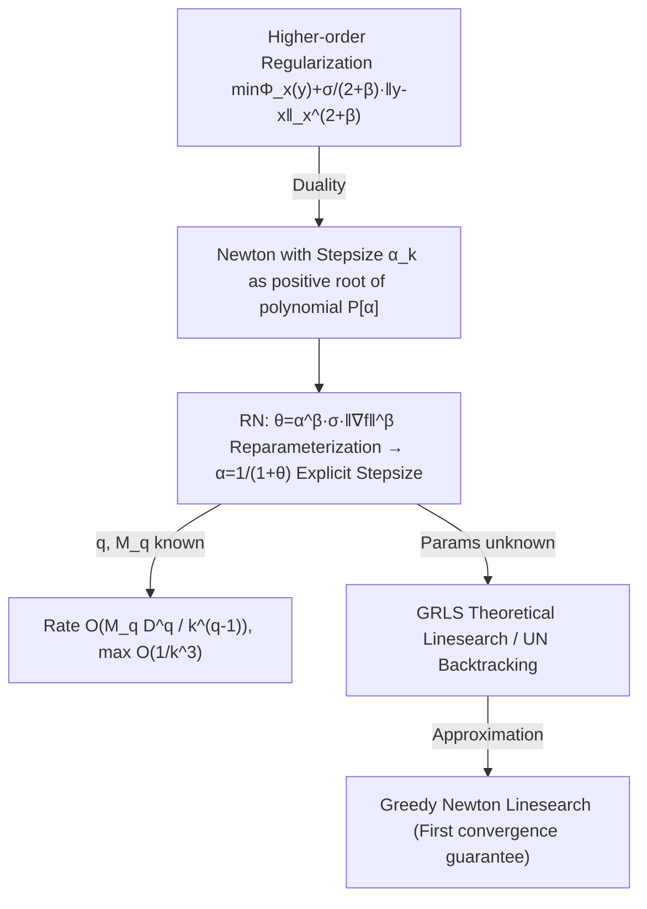

# Newton Method Revisited: Global Convergence Rates up to $O(1/k^3)$ for Stepsize Schedules and Linesearch Procedures

**Conference**: ICLR 2026  
**OpenReview**: [https://openreview.net/forum?id=0eM74HjPQA](https://openreview.net/forum?id=0eM74HjPQA)  
**Code**: To be confirmed  
**Area**: optimization  
**Keywords**: Newton Method, Second-order Optimization, Global Convergence Rate, Stepsize Schedule, Linesearch, Hölder Continuity, Local Hessian Norm  

## TL;DR
This paper re-analyzes Newton's method with stepsize from the unconventional perspective of "Hölder continuity of the third derivative." It proposes a family of explicitly computable stepsize schedules (RN), pushing the global convergence rate of the classical Newton method from $O(1/k^2)$ to $O(1/k^3)$. It also provides linesearch/backtracking versions (GRLS, UN) that do not require prior knowledge of smoothness constants and, for the first time, proves convergence guarantees for the practically common Greedy Newton linesearch.

## Background & Motivation
**Background**: Second-order methods (Newton's method) have long been the cornerstone of scientific computing due to their independence from problem condition numbers, affine invariance, and local quadratic convergence (precision doubles every step). However, the classical Newton method $x_{k+1}=x_k-[\nabla^2 f(x_k)]^{-1}\nabla f(x_k)$ can diverge when far from the optimum, requiring "globalization" via stepsize strategies, linesearch, trust regions, or Levenberg-Marquardt regularization.

**Limitations of Prior Work**: The simplest globalization is the damped Newton method $x_{k+1}=x_k-\alpha_k[\nabla^2 f(x_k)]^{-1}\nabla f(x_k)$. Nesterov-Nemirovski (1994) provided $O(k^{-1/2})$ with a damped step; Hanzely et al. (2022) discovered a duality between "stepsize $\leftrightarrow$ cubic regularization under local norms," improving the rate to $O(k^{-2})$. However, for functions with Hölder continuous Hessians, the optimal rate lower bound is $\Omega(k^{-7/2})$, leaving a significant gap for existing stepsize strategies.

**Key Challenge**: While first-order methods have non-trivial stepsizes (e.g., Chebyshev, Polyak, Silver) that approach optimal rates, second-order stepsize strategies have been stuck at $O(k^{-2})$. Conventional wisdom treats Newton's method as a "purely second-order" method, and it was previously unconsidered to analyze it using third-derivative information.

**Goal**: To find more efficient Newton stepsize strategies that push the global rate beyond $O(k^{-2})$ while maintaining the robustness and low-hyperparameter advantages of "simple methods," even in real-world scenarios where smoothness constants are unknown.

**Core Idea**: **[New Analytical Perspective]** Instead of analyzing Newton's method as a second-order method, the paper assumes the **third derivative is Hölder continuous**. This allows borrowing from the convergence mechanisms of third-order tensor methods to achieve rates approaching $O(k^{-3})$. **[New Regularization Order]** The cubic regularization of Hanzely (2022) is generalized to higher-order regularization under the local Hessian norm, where the corresponding stepsize is the root of a higher-order polynomial—proved to be unique, within $(0,1]$, and explicitly computable.

## Method

### Overall Architecture
The method is built upon the "Stepsize $\leftrightarrow$ Regularization Duality": under the local Hessian norm $\| \cdot \|_x = \| \cdot \|_{\nabla^2 f(x)}$, adding a $2+\beta$ order regularization term to the Newton step is equivalent to assigning a specific stepsize $\alpha_k$ to the Newton direction. The paper first solves for this stepsize (RN algorithm) and then provides a theoretical linesearch (GRLS) and a practical backtracking version (UN) for cases where smoothness parameters are unknown, unifying their rates to $O(M_q D^q / k^{q-1})$, where $q=p+\nu \in [2,4]$.

### Key Designs

**1. Stepsize-Regularization Duality + Higher-order Regularization: Translating "Regularization" into "Stepsize."** Hanzely et al. (2022) proved that adding cubic regularization to a second-order Taylor approximation $\Phi_x(y)=f(x)+\langle\nabla f(x),y-x\rangle+\frac12\|y-x\|_x^2$ under the local Hessian norm is equivalent to the Newton method with a specific stepsize. This paper generalizes the regularization order from 3 to any $2+\beta$: solving $T_{\sigma,\beta}(x)=\arg\min_y\{\Phi_x(y)+\frac{\sigma}{2+\beta}\|y-x\|_x^{2+\beta}\}$ is equivalent to a step $x_{k+1}=x_k-\alpha_k[\nabla^2 f(x_k)]^{-1}\nabla f(x_k)$, where $\alpha_k\in(0,1]$ is the unique positive root of the polynomial $P[\alpha]=1-\alpha-\alpha^{1+\beta}\sigma\|\nabla f(x_k)\|_x^{*\beta}$. Geometrically, the minima of different regularization models fall on the same line under the local norm, which simplifies the subsequent analysis.

**2. $\theta$ Reparameterization: Making higher-order polynomial roots explicitly computable.** The stepsize for higher-order regularization is typically the root of a high-order polynomial without an analytical solution, presenting the greatest technical obstacle to pushing rates beyond $O(k^{-2})$. This paper introduces an implicit regularization constant $\theta\overset{def}{=}\alpha^\beta\sigma\|\nabla f(x)\|_x^{*\beta}\ge 0$, causing the polynomial to collapse into $P_\theta[\alpha]=1-\alpha-\alpha\theta$, resulting in a simple closed-form stepsize $\alpha=\frac{1}{1+\theta}$. Since $\theta$ and $\alpha$ have a one-to-one mapping, the entire theory can be expressed using $\theta$. This substitution encapsulates the troublesome $\alpha^{1+\beta}$ term into a single $\theta$, allowing the repurposing of the proof framework for third-order tensor methods under the $l_2$ norm. This leads to the **RN (Root Newton)** algorithm: compute the Newton direction $n_k$, local gradient norm $g_k=\|\nabla f(x_k)\|_x^*$, set a sufficiently large regularization $\theta_k=(9M_q)^{1/(q-1)}g_k^{(q-2)/(q-1)}$, and take a step with $\alpha_k=1/(1+\theta_k)$.

**3. Third-derivative Hölder Continuity Assumption + Unified Rate $O(M_q D^q/k^{q-1})$: Rates that improve with smoothness.** The key is using generalized Hölder continuity from Definition 1 $\|\nabla^p f(x)-\nabla^p f(y)\|_{op}\le L_{p,\nu}\|x-y\|_x^\nu$ to characterize smoothness ($p\in\{2,3\}$, $\nu\in[0,1]$), letting $q=p+\nu\in[2,4]$ and $M_q=L_{p,\nu}$. Theorem 2 quantifies the regularization $\theta_k$ needed for a single-step descent, and Lemma 2 converts single-step progress $f(x_k)-f(x_{k+1})\ge c_5\frac{\|\nabla f(x_{k+1})\|_x^{*2}}{\|\nabla f(x_k)\|_x^{*(q-2)/(q-1)}}$ into a global rate. Theorem 4 provides the global rate for RN: $f(x_k)-f^*\le 9M_q D\big(\tfrac{4D(q-1)}{\gamma k}\big)^{q-1}+\|\nabla f(x_0)\|_{x_0}^* D\,e^{-k/4}$, i.e., $O(M_q D^q/k^{q-1})$. When the third derivative is Hölder continuous ($q$ close to 4), the rate approaches **$O(1/k^3)$**, surpassing Hanzely (2022)'s $O(k^{-2})$ for the first time. For $q=2$ (standard Lipschitz), it degrades to the constant stepsize case.

**4. Handling Unknown Smoothness Parameters: GRLS, UN, and the link to Greedy Newton.** In reality, $(q, M_q)$ are often unknown, and a function might satisfy multiple $L_{p,\nu}$ constraints. GRLS (Gradient-Regulated Line Search) does not rely on Theorem 2 but instead maximizes a descent bound along the Newton direction: $x_{k+1}=\arg\min_{y=x_k-\alpha n_{x_k},\,\alpha\in[0,1]}\frac{f(y)-f(x_k)}{\|\nabla f(y)\|_x^{*2}}$. Its rate automatically matches the best possible for all $q$: $\min_{q\in[2,4]}O(M_q D^q/k^{q-1})$ (Corollary 1). For small stepsizes where $\nabla f(y)\approx\nabla f(x_k)$, the GRLS objective reduces to $\min_y f(y)$—exactly the **Greedy Newton (GN)** linesearch. Corollary 2 thus provides the first convergence guarantee for GN. For realization, **UN (Universal Newton)** uses backtracking: starting from a small $\theta_k$ estimate and increasing regularization by $\rho>1$ until the theoretical descent condition $\langle\nabla f(x_k^{j_k}),n_k\rangle\ge\frac{1}{2\alpha_{k,j_k}\theta_{k,j_k}}\|\nabla f(x_k^{j_k})\|_x^{*2}$ is met. Lemma 3 proves the total backtracking count $N_k \le 2k + \log_\rho(\cdot)$ is bounded.

## Key Experimental Results

### Main Results

| Comparison Group | Methods Included | Key Observations |
|---|---|---|
| High-order (No linesearch) | RN, AICN (Hanzely 2022), GRN (Doikov 2024), Tuned Damped Newton, First-order GM | RN and AICN perform similarly; RN outperforms GRN; Higher-order methods converge faster per step. |
| Unknown Smoothness | UN, Super-universal Newton (Doikov 2024), Tuned Damped Newton | **UN converges faster than Super-universal Newton**; the regularization index $\beta$ has little impact on performance. |
| Implicit Linesearch | GRLS, Armijo, Greedy Newton (GN) | On logistic regression and polytope feasibility, GRLS and GN stepsizes are nearly indistinguishable and faster than Armijo/fixed steps. |

Test functions/tasks: Non-convex Rosenbrock ($d=40$, mean/std dev from 5 random initializations), logistic regression, and polytope feasibility.

### Key Findings
- **Rosenbrock (Strongly non-convex)**: GRLS performed best among linesearch processes, yielding the leading convergence curve and demonstrating that the theoretical advantages of these linesearch methods extend to non-convex settings.
- **GRLS ≈ GN**: The stepsizes of both are nearly identical (Figures 2c/3c), experimentally verifying the approximation in Eq. (17). This validates using the convergence guarantee for GN.
- **UN's Insensitivity to $\beta$**: The regularization index $\beta$ shared by UN and super-universal Newton has a minimal effect on performance, suggesting UN is nearly parameter-free.

## Highlights & Insights
- **Using third derivatives to analyze a second-order method is a counter-intuitive yet effective shift**: By treating Newton's method as an avatar of third-tensor methods via Hölder continuity, the rate is pushed to $O(1/k^3)$, overcoming the $O(k^{-2})$ barrier.
- **$\theta$ reparameterization as a model of simplicity**: A single implicit scalar absorbs both $\beta$ and $\sigma$, converting high-order polynomial roots into a closed-form $1/(1+\theta)$. This avoids the analytical nightmare of $\alpha^{1+\beta}$ while allowing precise stepsize calculation without explicit linesearch.
- **Explaining "Why Greedy Newton works"**: The paper provides a first-of-its-kind convergence guarantee for this folklore method, offering theoretical value beyond the new algorithms themselves.
- **Commitment to the "Simple Method" philosophy**: By keeping the method robust, affine-invariant, and low-hyperparameter, it remains easy to combine with techniques like sampling, momentum, or gradient clipping.

## Limitations & Future Work
- **Reliance on Convexity and Finite Diameter**: The theory is established for convex functions with finite diameter level sets $D<\infty$ and Assumption 1 (Hessian change in gradient direction bounded by $\gamma$). While empirical tests included Rosenbrock, the theory does not general non-convex cases.
- **Sub-optimal Rate**: The lower bound for third-derivative Hölder continuity is $\Omega(k^{-5})$. The $O(k^{-3})$ provided here still leaves a gap, which the authors leave as an open question.
- **Impracticality of Theoretical GRLS**: GRLS is implicit and requires solving an optimization along a direction. Practice relies on GN approximations or UN backtracking.
- **Second-order Costs**: Each step requires Hessian inversion or solving linear systems. In high-dimensional settings, this presents a trade-off against the cheaper per-step cost of first-order methods.

## Related Work & Insights
- **Direct Predecessors**: Hanzely et al. (2022) (AICN, Cubic duality, $O(k^{-2})$) and Doikov et al. (2024) (High-order regularization under $l_2$ norm, super-universal Newton). This work generalizes the former's order and adapts the latter's techniques to the local Hessian norm.
- **Regularized Newton Lineage**: Nesterov-Polyak (2006) Cubic Regularization, and Nesterov (2021) Third-order Tensor methods—this paper bridges the "Second-order Newton" and "Third-order Tensor" trajectories.
- **Inspiration from First-order Stepsizes**: Chebyshev (1953), Polyak (1987), Silver stepsizes (2023). These developments in first-order theory motivated the authors to seek better stepsize schedules for Newton's method.
- **Insight**: Reparameterization to "smooth out" higher-order terms under dual perspectives is a powerful way to turn complex regularization into explicit algorithms. Furthermore, providing theoretical grounding for folklore heuristics (like Greedy Newton) is often as valuable as proposing new methods.

## Rating
- **Novelty**: ⭐⭐⭐⭐⭐ — The perspective of using third-order Hölder continuity to analyze second-order Newton is unique. The $\theta$ reparameterization is elegant, and providing a proof for Greedy Newton is a significant contribution.
- **Experimental Thoroughness**: ⭐⭐⭐ — The paper covers non-convex Rosenbrock, logistic regression, and feasibility tasks. While appropriate for a theory paper, the scale is relatively small and lacks large-scale deep learning tasks.
- **Writing Quality**: ⭐⭐⭐⭐ — The contribution list is clear, and Table 1 effectively compares rates and assumptions. The math density is high, making it a challenging read for those without a background in second-order optimization.
- **Value**: ⭐⭐⭐⭐ — It provides both new algorithms (RN/UN/GRLS) and theoretical explanations for existing ones. The methods are simple and affine-invariant, making them highly research-relevant and implementation-friendly.

<!-- RELATED:START -->

## Related Papers

- [\[ICLR 2026\] Convergence of Muon with Newton-Schulz](convergence_of_muon_with_newton-schulz.md)
- [\[ICLR 2026\] Hinge Regression Tree: A Newton Method for Oblique Regression Tree Splitting](hinge_regression_tree_a_newton_method_for_oblique_regression_tree_splitting.md)
- [\[ICLR 2026\] The Potential of Second-Order Optimization for LLMs: A Study with Full Gauss-Newton](the_potential_of_second-order_optimization_for_llms_a_study_with_full_gauss-newt.md)
- [\[ICLR 2026\] Taming Curvature: Architecture Warm-up for Stable Transformer Training](taming_curvature_architecture_warm-up_for_stable_transformer_training.md)
- [\[ICLR 2026\] On the Surprising Effectiveness of a Single Global Merging in Decentralized Learning](on_the_surprising_effectiveness_of_a_single_global_merging_in_decentralized_lear.md)

<!-- RELATED:END -->
