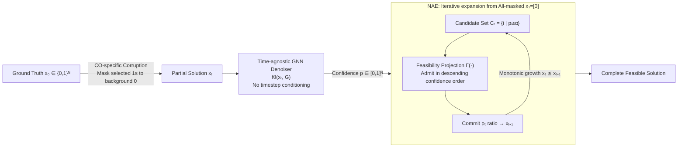

# NExCO: Native Solution Expansion for Diffusion-based Combinatorial Optimization

**Conference**: ICLR 2026  
**OpenReview**: [https://openreview.net/forum?id=084SvT55yk](https://openreview.net/forum?id=084SvT55yk)  
**Code**: [https://github.com/yuuuuwang/NExCO](https://github.com/yuuuuwang/NExCO)  
**Area**: Neural Combinatorial Optimization / Diffusion Models / Graph Neural Networks  
**Keywords**: Neural Combinatorial Optimization, Masked Diffusion, Adaptive Expansion, TSP/MIS/CVRP, Time-agnostic Denoiser  

## TL;DR
NExCO transforms "adaptive expansion" from an external wrapper around global predictors into an intrinsic decoding mechanism for CO-specific masked diffusion models. Every intermediate state of diffusion is a valid partial solution; the model constructs full solutions by progressively "unmasking" high-confidence variables with feasibility projections, achieving approximately 50% quality improvement and up to 4× inference acceleration across TSP, MIS, and CVRP.

## Background & Motivation
**Background**: Neural Combinatorial Optimization (NCO) replaces manual heuristics with learned solvers. Mainstream paradigms fall into two extremes: Local Construction (LC) builds solutions variable-by-variable like auto-regression, ensuring feasibility but suffering from narrow horizons and poor scalability ($O(n)$ calls); Global Prediction (GP) outputs a complete heat map in one pass, offering high efficiency and global vision, but the resulting smooth distributions are noisy and often violate constraints during decoding. To bridge this, the Adaptive Expansion (AE) paradigm proposed by COExpander adaptively decides how many variables to commit at each step, balancing local feasibility with global awareness.

**Limitations of Prior Work**: Current AE implementations are merely "external wrappers"—wrapping an external GP predictor (like Fast T2T) in an iterative shell. This leads to two fundamental flaws: (i) Solution quality is capped by the backbone predictor; (ii) Inference cost is $O(D_s \cdot C_{GP})$, as the global predictor must be re-invoked every round, making it much more expensive than native GP solvers ($O(D_s \cdot T_s)$ when wrapping Fast T2T).

**Key Challenge**: While existing diffusion solvers (DIFUSCO, T2T, Fast T2T) resemble "constructive expansion" in their iterative refinement, they remain stuck in the GP paradigm. Using uniform bit-flip corruption causes intermediate states to rapidly drift away from the feasible manifold (e.g., edges in TSP violating degree constraints or forming sub-tours). Consequently, these intermediate states cannot serve as partial solutions and are discarded, relying on heuristic decoding in the final step. **The contradiction**: Diffusion produces a sequence of intermediate states, yet only the final one is utilized.

**Goal**: To "nativize" adaptive expansion—encoding it as an intrinsic decoding principle of the generative model rather than an external wrapper. Native AE must satisfy two conditions: expansion progress and step size are driven by model confidence and constraints without relying on fixed schedules or external GP; intermediate states themselves are constraint-aware valid partial solutions, enforced by feasibility projections during variable commitment.

**Core Idea**: The authors observe that **Masked Diffusion Models (MDM)** in language modeling provide three properties—meaningful intermediate states, schedule-free training, and efficient parallel decoding—that align perfectly with NCO requirements. **This paper recasts CO decoding as a progressive unmasking process of masked diffusion**: using a CO-specific, unidirectional (1→0) corruption process to ensure intermediate states are always feasible partial solutions, paired with a **time-agnostic denoiser**, and a **Native Adaptive Expansion (NAE)** decoding strategy that turns the diffusion trajectory itself into a constructive solver.

## Method

### Overall Architecture
Given a graph instance $G$, the ground truth solution $x_0 \in \{0,1\}^N$ is corrupted into a partial solution $x_t$ by "masking only the selected 1s back to the background state 0". A time-agnostic GNN denoiser $f_\theta(x_t, G)$ predicts confidence for each variable directly without timestep conditioning. During inference, starting from an all-masked state $x_1=[0]$, the model iteratively "selects high-confidence candidates → applies feasibility projection → commits a portion" to monotonically grow the partial solution until it converges to a complete feasible solution. The pipeline consists of four components: CO-specific corruption (forward), time-agnostic denoiser (model), time-agnostic optimization consistency (training), and NAE (inference).

### Key Designs
**1. CO-specific Unidirectional Corruption: Merging [MASK] and 0 into a single background state.** Directly applying the tri-state MDM from language models to CO is problematic—CO solutions are extremely imbalanced (most variables are 0). Tri-state masking causes the denoiser to be dominated by massive negative samples, biasing it toward predicting 0. The authors observed in MIS that validation costs for tri-state MDM actually decreased during training (contradicting the goal of expanding independent sets). The solution is to unify [MASK] and 0 as a background state (represented numerically as 0). The forward process retains only the "active state 1 → background state 0" unidirectional (absorptive) channel:

$$q(x_t \mid x_0) = (1-t) \cdot x_0 + t \cdot \mathbf{0}$$

This ensures only "selected 1s" are dropped back to the background as $t$ increases. Corruption never introduces false positives; every intermediate state is a valid subset of the true solution staying on the feasible manifold, allowing direct constructive decoding.

**2. Time-agnostic Denoiser: Switching from "Timestep Conditioning" to "Mask Pattern Conditioning".** Since the proportion of "surviving 1s" under unidirectional corruption directly reflects the signal-to-noise ratio, the timestep $t$ becomes redundant. The authors remove timestep embeddings entirely, designing $f_\theta(x_t, G)$ to depend solely on the current corrupted state and the graph instance. An anisotropic GNN (node/edge task features, $x_t$ as a binary attribute, message passing + attention pooling) outputs the probability $p \in [0,1]^N$ of each variable belonging to the optimal solution. This mirrors the success of "random masking without explicit timestep conditioning" in Large Language Diffusion Models.

**3. Time-agnostic Optimization Consistency (TOC) Training: Mapping all corrupted states to the same optimal solution.** Because unidirectional corruption is monotonic, for any $0 < t < t' < 1$, $\mathrm{supp}(x_{t'}) \subseteq \mathrm{supp}(x_t)$ holds. Since every $x_t$ is a valid subset of $x^*$, consistency can be enforced across corruption levels without timesteps:

$$\mathcal{L}_{\mathrm{TOC}}(\theta) = \mathbb{E}_{t'>t}\Big[d\big(f_\theta(x_{t'}, G), x^*\big) + d\big(f_\theta(x_t, G), x^*\big)\Big]$$

Training equates to "reconstructing the same $x^*$ from multiple partial solutions of varying sparsity." Because corruption introduces no false positives, every $x_t$ stays on the feasible manifold, aligning supervision signals naturally with constraints. Reference solutions $x^*$ can come from exact solvers or high-quality heuristics; experiments show competitiveness even with sub-optimal labels.

**4. Native Adaptive Expansion (NAE) Inference: Diffusion trajectories as monotonic constructive decoders.** Inference starts from $x_1 = \mathbf{0}$. At each step, the denoiser provides a confidence vector $p_t = f_\theta(G, x_{t-1})$. Variables exceeding threshold $\alpha$ form candidate set $C_t$, which is projected by $\Gamma(\cdot)$ into a feasible subset $S_t$. A proportion $\rho_t$ is then committed to update $x_t$. The feasibility projection uses a "three-stage template" for all tasks: Sort by confidence → sequential check → admit variable only if a lightweight boolean feasibility predicate is met:

$$S_t = \arg\max_{x^{(i)} \subseteq C_t, \, x \in \Omega} \ \sum_i p_t^{(i)} x^{(i)}$$

Migrating to a new task only requires redefining the boolean predicate (TSP: maintain degree 2 and no sub-tours; MIS: neighbors unactivated; CVRP: edge insertion does not exceed capacity). The author provides a convergence proof (Proposition 1): under monotonic projection, strict expandability, and bounded solution size, NAE produces a monotonic sequence that converges in at most $N_{\max}$ steps. NAE's complexity is $O(T_s)$, asymptotically superior to COExpander's $O(D_s \cdot T_s)$.

## Key Experimental Results
Evaluated on three NP-hard problems: TSP, MIS, and CVRP. Metrics include solution quality (Length/Size, Drop relative to reference) and per-instance time.

### Main Results
TSP (Greedy decoding, excerpt):

| Method | Type | TSP-500 Drop↓ | TSP-500 Time | TSP-1000 Drop↓ | TSP-1000 Time |
|---|---|---|---|---|---|
| Fast T2T (Ts=5,Tg=5) | GP | 0.39% | 1.41s | 0.58% | 5.81s |
| COExpander (Ds=3,Ts=5) | AE | 0.52% | 0.61s | 0.95% | 2.26s |
| **NExCO (Ds=5)** | NAE | **0.28%** | **0.33s** | **0.63%** | **1.31s** |
| **NExCO (Ds=7)** | NAE | **0.25%** | 0.43s | **0.52%** | 1.68s |

On TSP-500, NExCO reduces Drop from 0.39% to 0.25% (1.5× improvement) while accelerating from 1.41s to 0.43s (~3× speedup).

MIS (Excerpt):

| Method | Type | RB-[200-300] Drop↓ | RB-[800-1200] Drop↓ / Time | ER-[700-800] Drop↓ / Time |
|---|---|---|---|---|
| Fast T2T | GP | 2.54% | 8.51% / 2.76s | 9.31% / 1.22s |
| COExpander | AE | 2.39% | 4.36% / 2.05s | 5.62% / 1.53s |
| **NExCO (Ds=7)** | NAE | **1.66%** | **4.07% / 1.00s** | **4.20% / 0.56s** |

On ER graphs, Drop is reduced from 9.31% (Fast T2T) to 4.20% with >2× speedup.

CVRP:

| Method | Type | CVRP-50 Drop↓ | CVRP-100 Drop↓ | CVRP-200 Drop↓ |
|---|---|---|---|---|
| Sym-NCO | LC | 1.95% | 2.37% | 2.86% |
| COExpander | AE | 3.85% | 4.19% | 4.58% |
| **NExCO (Ds=5)** | NAE | **0.85%** | **1.40%** | **2.45%** |

On CVRP-50, Drop is reduced from COExpander's 3.85% to 0.85%.

### Ablation Study
Robustness to reference solution quality (using 2-Opt perturbations, TSP-500):

| Label/Model | Label Drop | Trained Drop↓ |
|---|---|---|
| 2-Opt Perturbed | 1.65% / 3.35% | — |
| NExCO (Ds=5) | — | 0.31% |
| NExCO (Ds=7) | — | 0.25%~0.26% |

Even with label gaps of 1.65%–3.35%, NExCO converges to 0.25%–0.31%, indicating it does not strictly depend on exact optimal labels.

### Key Findings
- **Expansion steps as a clear quality-efficiency knob**: Increasing $D_s$ (expansion rounds) monotonically reduces Drop, while inference time grows approximately linearly. The Pareto frontier of NExCO consistently dominates Fast T2T/COExpander/Sym-NCO.
- **Inverted U-shape for threshold $\alpha$**: Moderate thresholds are optimal; values too high (too conservative) or too low (too noisy) degrade performance.
- **Strong zero-shot cross-scale generalization**: A model trained on TSP-500 generalizes to TSP-1000 with only a 0.58% gap.

## Highlights & Insights
- **Paradigm repositioning over modular stacking**: Elevating AE from an "external GP wrapper" to a "diffusion decoding principle" reduces complexity from $O(D_s \cdot T_s)$ to $O(T_s)$ without quality caps—a rare design that simultaneously improves efficiency and quality.
- **Merging background states as a critical insight**: The realization that tri-state MDM fails in MIS due to class imbalance led to unifying [MASK] and 0. This ensures intermediate states always stay on the feasible manifold, injecting CO structure priors into the corruption process.
- **Task-agnostic feasibility projection template**: The three-stage template (sort → check → admit) makes migrating to new CO problems as simple as writing a single predicate.
- **Theoretical Grounding**: Unidirectional absorptive corruption + monotonic projection provides a proof of convergence in finite steps ($\leq N_{\max}$).

## Limitations & Future Work
- **Reliance on high-quality supervision**: TOC training requires a consistent $x^*$ per instance, relying on heuristic labels for large scales (though robust, the upper limit is still influenced by label quality).
- **Manual feasibility predicates**: Although the template is general, constraints for new CO problems must still be manually defined; applicability to more complex or non-binary problems (e.g., time windows, multi-objective) is unverified.
- **Hyperparameter sensitivity**: Threshold $\alpha$ and expansion schedules $\{\rho_t\}$ must be tuned. While "adaptive," the degree of true instance-level dynamic step-sizing versus a fixed schedule warrants further study.
- **Academic benchmarks focus**: While TSP/MIS/CVRP are well-validated, performance on industrial-scale scheduling or routing with heterogeneous constraints remains to be tested.

## Related Work & Insights
- **GP Diffusion Solvers**: DIFUSCO, T2T, and Fast T2T are the direct baselines. NExCO argues they "waste the diffusion trajectory."
- **AE Paradigm & COExpander**: This work acknowledges the value of AE (adaptive decision granularity, global awareness) but critiques its "wrapper-based" implementation.
- **Masked Diffusion (MDM) in NLP**: Austin et al., LLaDA, and others serve as the inspiration for "time-agnostic denoising + meaningful intermediate states," successfully transferring NLP generation paradigms to graph-structured CO.
- **Inspiration**: The strategy of "internalizing an external wrapper as an intrinsic decoding mechanism" holds potential for other structured prediction tasks like layout styling, scheduling, or graph matching.

## Rating
- **Novelty**: ⭐⭐⭐⭐⭐ Recasts AE as an internal principle. The "unified background + time-agnostic consistency + NAE" trio constitutes a self-consistent new framework.
- **Experimental Thoroughness**: ⭐⭐⭐⭐ Solid coverage across tasks and scales with robustness and hyperparameter analysis; lacking only in industrial-scale/complex constraint verification.
- **Writing Quality**: ⭐⭐⭐⭐⭐ Clear motivational chain: from GP's wasted trajectories to tri-state MDM failures, leading to unified background and NAE.
- **Value**: ⭐⭐⭐⭐⭐ Achieves ~50% quality gain with up to 4× speedup, reducing complexity from $O(D_s T_s)$ to $O(T_s)$, and successfully extending diffusion solvers to CVRP.

<!-- RELATED:START -->

## Related Papers

- [\[ICLR 2026\] Diffusion-DFL: Decision-focused Diffusion Models for Stochastic Optimization](diffusion-dfl_decision-focused_diffusion_models_for_stochastic_optimization.md)
- [\[ICLR 2026\] Multi-Action Self-Improvement for Neural Combinatorial Optimization](multi-action_self-improvement_for_neural_combinatorial_optimization.md)
- [\[ICLR 2026\] Neural Multi-Objective Combinatorial Optimization for Flexible Job Shop Scheduling Problems](neural_multi-objective_combinatorial_optimization_for_flexible_job_shop_scheduli.md)
- [\[ICLR 2026\] HeuriGym: An Agentic Benchmark for LLM-Crafted Heuristics in Combinatorial Optimization](heurigym_an_agentic_benchmark_for_llm-crafted_heuristics_in_combinatorial_optimi.md)
- [\[ICLR 2026\] ConRep4CO: Contrastive Representation Learning of Combinatorial Optimization Instances across Types](conrep4co_contrastive_representation_learning_of_combinatorial_optimization_inst.md)

<!-- RELATED:END -->
