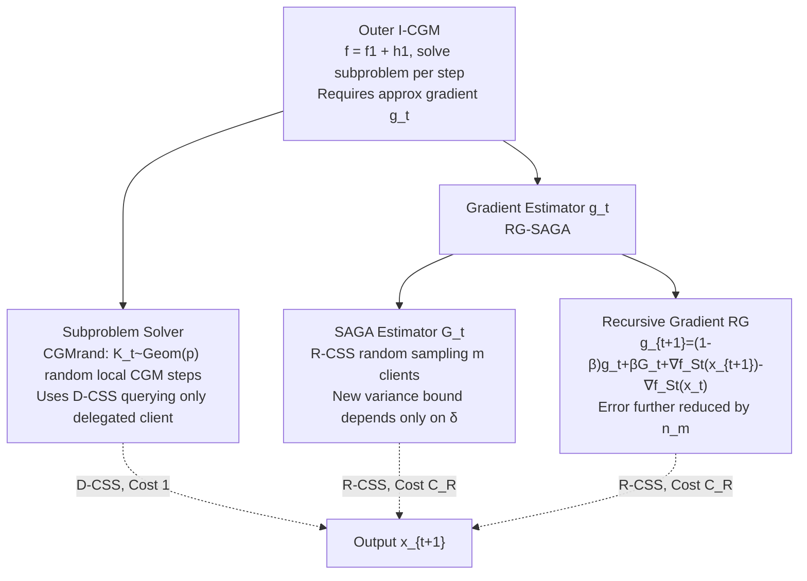

# Non-Convex Federated Optimization under Cost-Aware Client Selection

**Conference**: ICLR 2026  
**OpenReview**: [https://openreview.net/forum?id=FnaDv6SMd9](https://openreview.net/forum?id=FnaDv6SMd9)  
**Code**: To be confirmed  
**Area**: optimization / federated-learning  
**Keywords**: Federated Optimization, Client Selection, Communication Complexity, Variance Reduction, SAGA, Non-convex Optimization  

## TL;DR
This paper proposes a cost-aware framework for federated optimization that explicitly models different communication costs associated with various client selection strategies. By combining the Inexact Composite Gradient Method (I-CGM) with a new RG-SAGA gradient estimator, the authors achieve optimal communication and local computation complexities for non-convex optimization within this model.

## Background & Motivation
**Background**: Communication remains a primary bottleneck in federated learning. Different algorithms employ vastly different client selection strategies: some sample a small subset per round (e.g., SAG/SAGA), others require periodic full synchronization with all clients for full gradients (e.g., SARAH variants), and some hybridize both. SARAH-based methods leverage the "dissimilarity" $\delta$ between local and global objectives (often small in statistical/semi-supervised scenarios) to achieve significant theoretical gains in communication rounds.

**Limitations of Prior Work**: Existing metrics for comparing optimization methods, such as the number of communication rounds, **do not distinguish between these selection strategies**. In practice, costs differ significantly: random sampling is inexpensive, whereas mandatory full synchronization is costly or even infeasible in cross-device scenarios with unreliable or intermittent client connectivity. Consequently, whether SARAH-based methods are truly more communication-efficient than SAGA-based ones remains an open question: SARAH's complexity depends on a small $\delta$ but requires full synchronization, while SAGA-based methods avoid full synchronization but depend on potentially much larger individual smoothness constants $L_{\max}$.

**Key Challenge**: The goal is to simultaneously achieve a communication complexity depending only on the small $\delta$ and avoid periodic full synchronization—the former being an advantage of SARAH and the latter an advantage of SAGA, which were previously mutually exclusive.

**Goal**: Establish a unified model that assigns different costs to different client selection strategies and design a first-order method that is **optimal in both communication and local computation** within this model.

**Core Idea**: **[Cost-Aware Modeling]** Client selection is decomposed into three strategies with different costs: Arbitrary (A-CSS), Random (R-CSS), and Delegated (D-CSS), charged as $C_A \ge C_R \ge 1$ respectively. **[Algorithmic Construction]** Building on the Inexact Composite Gradient Method framework, the authors utilize a SAGA variance bound depending only on $\delta$ combined with Recursive Gradient (RG) techniques to further reduce the estimation error by a factor of $n_m$. This avoids full synchronization while benefiting from objective similarity.

## Method

### Overall Architecture
The method consists of three layers. The outer layer is the **Inexact Composite Gradient Method (I-CGM)**, which decomposes the objective $f$ into a delegated function $f_1$ and a residual $h_1 = f - f_1$, solving a quadratically regularized subproblem at each step using an approximate gradient $g_t \approx \nabla f(x_t)$. The middle layer is a **Subproblem Solver** that uses local composite gradient iterations with a geometric random number of steps to satisfy accuracy requirements while saving local computation. The bottom layer is the **Gradient Estimator**, which adapts SAGA into a version dependent only on similarity $\delta$ and integrates it with Recursive Gradient (RG) techniques to obtain the more accurate RG-SAGA. Each layer corresponds to different client selection strategies and costs.

### Key Designs

**1. Cost-Aware Federated Optimization Model: Explicit pricing for three selection strategies.** The paper abstracts how the server selects the active client set $S_r$ into three strategies: A-CSS (Arbitrary, strongest, can form full synchronization, cost $C_A$), R-CSS (Uniform random sampling from $\binom{[n]}{m}$, corresponding to partial participation in cross-device FL, cost $C_R$), and D-CSS (Querying a fixed delegated client set $S_D$, here $S_D=\{1\}$, cost 1). They satisfy $1 \le C_R \le C_A$. In this model, computing a full gradient requires $n_m = \lceil n/m \rceil$ sequential A-CSS communications, naturally reflecting the high cost of full synchronization. This pricing reveals strategy differences masked by communication round counts and provides a unified coordinate system for fair algorithm comparison (reorganizing GD, FedAvg, Scaffold, SABER, etc., in Table 1).

**2. I-CGM + Geometric Random Local Steps: Solving subproblems via inexpensive delegated clients.** I-CGM formulates $f = f_1 + h_1$ and constructs a subproblem $F_t$ at $x_t$ using approximate gradient $g_t$ (smooth term $f_1$ plus quadratic regularization $\psi_t(x) = \langle g_t - \nabla f_1(x_t), x - x_t \rangle + \frac{\lambda}{2}\|x - x_t\|^2$), solved via composite gradient iterations: $y^t_{k+1} = \frac{1}{\lambda+L_1}\big(L_1 y^t_k + \lambda x_t + \nabla f_1(x_t) - g_t - \nabla f_1(y^t_k)\big)$. Crucially, using a fixed $K \simeq L_1 T/\lambda$ steps is necessary for accuracy condition (6) because $y^t_K$ and $x_t$ do not overlap to allow telescoping. By setting the steps $\hat K_t \sim \mathrm{Geom}(p)$, the expected local queries drop to $\mathbb{E}[K_t] = 1/p \simeq L_1/\lambda$, saving $T$ times the local computation. Since the subproblem only involves the delegated function $f_1$, it uses exclusively the inexpensive D-CSS (Cost 1).

**3. SAGA Variance Bound Depending Only on $\delta$: Enabling similarity gains for partial participation.** SAGA stores the most recent gradient $b^t_i$ for each client, updating only those in the sampled set $S_t$. $G_t = b^t_{S_t} - b^{t-1}_{S_t} + b^{t-1}$ is a conditionally unbiased estimator of $\nabla f(x_t)$, requiring minimal memory and naturally fitting partial participation. The paper provides a **new variance bound** (Lemma 4.1): $\sum_t \sigma_t^2$ is controlled by $\delta_m^2 := \frac{q_m}{m}\delta^2$ ($q_m = \frac{n-m}{n-1}$), depending only on dissimilarity $\delta$ rather than $L_{\max}$, showing SAGA can exploit similarity like SARAH. However, since the coefficient of $G_1^2$ may exceed 1, failing the strict $<1$ requirement in I-CGM condition (7), RG is introduced.

**4. Recursive Gradient (RG) Technique: Further reducing error by $n_m$ for any unbiased estimator.** RG applies recursive weighting to any conditionally unbiased $G_t$: $g_{t+1} = (1-\beta)g_t + \beta G_t + \nabla f_{S_t}(x_{t+1}) - \nabla f_{S_t}(x_t)$, combining recursive updates with momentum. This is a unified framework: $\beta=0$ recovers SARAH, and using SAGA for $G_t$ recovers the ZeroSARAH structure. The key gain (Corollary 5.3) is that for RG-SAGA with $\beta \simeq 1/n_m$, the error bound **improves by a factor of $n_m$** compared to original SAGA, eliminating linear dependence on $n_m$. Final results (Theorem 6.1) show I-CGM-RG-SAGA achieves communication complexity $O\big(C_A n_m + C_R\frac{(\Delta_1 + \sqrt{n_m}\delta_m)F^0}{\varepsilon^2}\big)$ and local complexity $O\big(n_m + \frac{(\Delta_1 + \sqrt{n_m}\delta_m + L_1)F^0}{\varepsilon^2}\big)$. The expensive $C_A n_m$ term only arises from a one-time initialization.

The outer convergence of I-CGM requires the error to satisfy $\sum_t \Sigma_t^2 \le \frac{1}{32}\sum_t G_t^2 + (\lambda+\Delta_1)^2\sum_t \chi_t^2$ (Condition 7). Setting $\lambda \simeq \Delta_1$ yields convergence in $T = O(\Delta_1 F^0/\varepsilon^2)$ steps. This justifies why RG is necessary to push the $G_t^2$ coefficient below 1. RG-SVRG is a parallel instantiation, but its communication complexity $O\big(C_A n_m + \frac{(C_R\Delta_1 + \sqrt{C_A C_R n_m}\delta_m)F^0}{\varepsilon^2}\big)$ contains $C_A$ in the $\varepsilon$-dependent term, making RG-SAGA superior.

## Key Experimental Results

### Main Setup & Baselines
All experiments assume $C_A = C_R = 1$ (even when costs are equal, the method remains superior, highlighting algorithmic advantages). Baselines: SCAFFOLD, sampled FedAvg, SABER-full (with PAGE), SABER-partial, GD, Scaffnew, and the proposed I-CGM-RG-SAGA and I-CGM-RG-SVRG.

### Task 1: Quadratic Minimization with Log-Sum penalty

| Setting | Value |
|------|------|
| Dimension/Clients | $d=1000$, $n=100$, $m=\sqrt n$ |
| Constants | $\Delta_1 \approx \delta \approx 5$, $L_{\max} \approx 100$ |
| Observations | I-CGM-RG-SAGA is most efficient in both communication and local computation; SCAFFOLD **fails to exploit $\delta$-similarity** as its local complexity matches GD. |

### Task 2: Non-convex Regularized Logistic Regression (LIBSVM)

| Dataset | $\delta$ vs $L_1$ | Conclusion |
|--------|------------------|------|
| mushrooms | $\delta \ll L_1$ | I-CGM-RG-SAGA achieves lowest communication cost. |
| duke | $\delta \approx L_1$ | I-CGM-RG-SAGA still achieves lowest communication cost. |

Setting $m=1, n=10$, measurements of local $L_1$ and $\delta$ along iterations confirm that complexity is driven by the small $\delta$ rather than $L_{\max}$.

### Key Findings
- SVRG-based methods require approximately double the expected communication rounds compared to others ($\frac{m}{n}n + m$), confirming SAGA variants are more efficient.
- Even in the $C_A = C_R$ setting (least favorable for avoiding full sync), RG-SAGA leads significantly; advantages increase when $C_A > C_R$ (Appendix J.1.1).
- Using R-CSS to approximate the initial gradient $G_0 \approx \nabla f(x_0)$ works well in practice (Figure J.1), suggesting the $C_A n_m$ term can be further amortized.
- Neural network training tasks are provided in Appendix J.

## Highlights & Insights
- **Contribution to Evaluation Metrics**: The core contribution is not just the algorithm, but the "pricing" of client selection strategies, allowing a fair comparison of previously incomparable methods in the unified Table 1.
- **RG as a Generalized Error Reducer**: It is not tied to a specific estimator and can be applied to any conditionally unbiased estimator, unifying SAGA/SVRG/SARAH/ZeroSARAH/STORM.
- **Strategy Separation**: Splitting subproblem solving (D-CSS), gradient estimation (R-CSS), and initialization (A-CSS) isolates expensive operations into one-time steps, a philosophy applicable to various cost-sensitive distributed systems.
- **Unifying SARAH and SAGA**: RG-SAGA combines SAGA's lack of mandatory full sync with the similarity-based dissimilarity dependence of SARAH.

## Limitations & Future Work
- **Theory-Heavy, Small-Scale**: Experiments are limited to $n=100$ synthetic or small LIBSVM tasks. Real-world large-scale cross-device FL validation is lacking.
- **Delegated Client Assumption**: D-CSS relies on a "continuously reliable and efficient delegated client," which may not hold in highly heterogeneous or untrusted environments.
- **Large Constants**: Theoretical coefficients in Theorem 6.1 (e.g., $113\sqrt{n_m}\delta_m$, $112n_m$) are large, suggesting the practical "sweet spot" requires tuning.
- **Simplified Cost Model**: $C_A, C_R$ are treated as fixed scalars; real-world costs are dynamic.
- **Convex Scenarios**: The analysis focuses on non-convex stationary points; whether optimal rates can be achieved under convexity or PL conditions remains open.

## Related Work & Insights
- **Variance Reduction**: Covers SAGA, SVRG, SARAH, PAGE, and STORM; RG unifies these under a recursive-plus-momentum framework.
- **Similarity Modeling**: Building on dissimilarity constants $\delta$ from prior work (Karimireddy, Jiang, etc.), this paper focuses on the smaller $\Delta_1$ and average $\delta$.
- **Complexity Models**: Extends models like SABER and FedRed by providing a unified scale for cost-aware comparisons.
- **Insight**: Integrating system-side heterogeneous costs into optimization complexity is a powerful idea for designing and evaluating algorithms under bandwidth, privacy, or energy constraints.

## Rating
- **Novelty**: ⭐⭐⭐⭐ Excellent contribution with the cost-aware model and universal RG error reduction.
- **Experimental Thoroughness**: ⭐⭐⭐ Scales are relatively small (synthetic + LIBSVM); neural network comparisons are mainly in the appendix.
- **Writing Quality**: ⭐⭐⭐⭐ Clear motivation and well-structured, though constants are dense.
- **Value**: ⭐⭐⭐⭐ Strong theoretical value for the federated optimization community by providing a fairer evaluation framework.

<!-- RELATED:START -->

## Related Papers

- [\[ICLR 2026\] High Probability Bounds for Non-Convex Stochastic Optimization with Momentum](high_probability_bounds_for_non-convex_stochastic_optimization_with_momentum.md)
- [\[ICLR 2026\] Unified Analyses for Hierarchical Federated Learning: Topology Selection under Data Heterogeneity](unified_analyses_for_hierarchical_federated_learning_topology_selection_under_da.md)
- [\[ICML 2026\] Cost-Aware Stopping for Bayesian Optimization](../../ICML2026/optimization/cost-aware_stopping_for_bayesian_optimization.md)
- [\[ICLR 2026\] Globally Aware Optimization with Resurgence](globally_aware_optimization_with_resurgence.md)
- [\[ICLR 2026\] Clipped Gradient Methods for Nonsmooth Convex Optimization under Heavy-Tailed Noise: A Refined Analysis](clipped_gradient_methods_for_nonsmooth_convex_optimization_under_heavy-tailed_no.md)

<!-- RELATED:END -->
