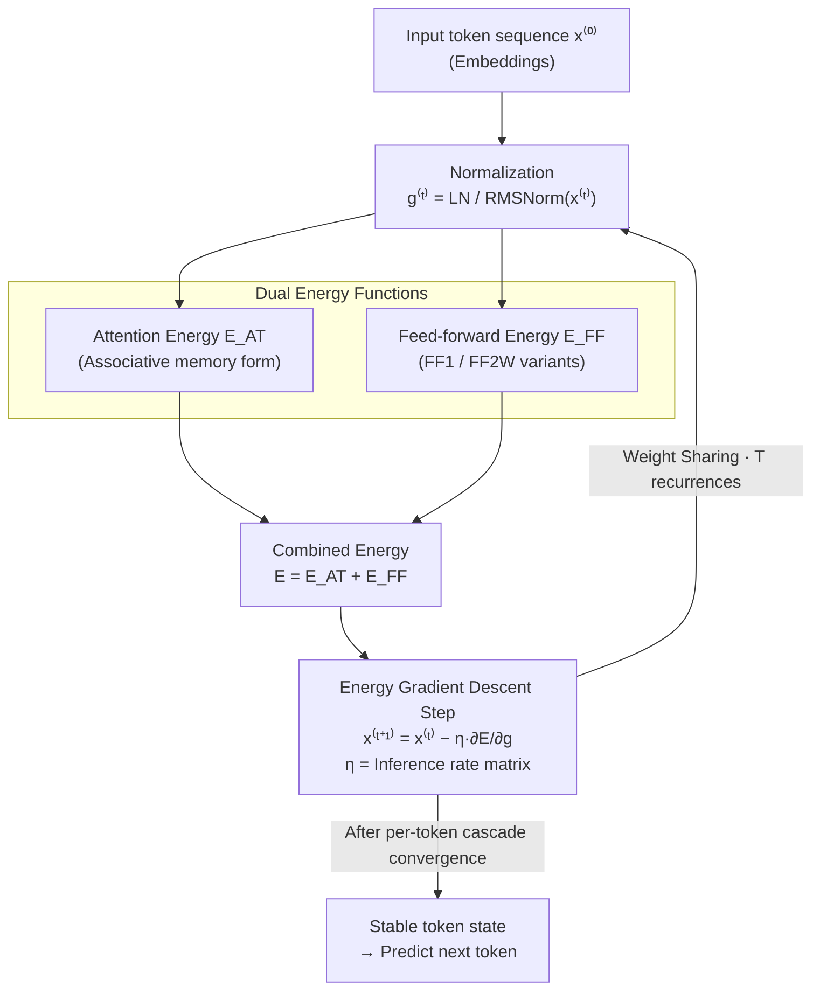

# NRGPT: An Energy-based Alternative for GPT

**Conference**: ICLR 2026  
**arXiv**: [2512.16762](https://arxiv.org/abs/2512.16762)  
**Code**: None  
**Area**: Optimization  
**Keywords**: Energy-based models, GPT, Autoregressive, Gradient descent inference, Asymptotic stability

## TL;DR

Ours proposes NRGPT (eNeRgy-GPT), which applies minimal modifications to the standard GPT to transform it into an energy-based model. By designing attention energy and feed-forward energy functions, each forward pass layer becomes equivalent to a gradient descent step of tokens on an energy landscape. The work proves properties of asymptotic energy descent and stable convergence, validating performance comparable to standard GPT on ListOps, Shakespeare, and OpenWebText.

## Background & Motivation

**Background**: The GPT architecture is the dominant paradigm for autoregressive language modeling, achieving text generation through next-token prediction. Energy-based models (EBMs) represent another significant paradigm where inference is viewed as a dynamical process on an energy landscape—low energy corresponds to plausible samples, while high energy corresponds to anomalies. Although these seem distinct, increasing research suggests deep connections between them.

**Limitations of Prior Work**:
1. **Unclear connection between GPT and EBM**: Prior work by Von Oswald et al. demonstrated that ICL might be gradient descent, but only considered linear Transformers (no softmax), which is an oversimplification.
2. **Energy Transformer (ET) is unsuitable for GPT settings**: ET is designed for BERT-like masked completion—where masked tokens evolve rapidly to match missing parts—whereas GPT lacks masks and requires each token to evolve into the next token in the sequence.
3. **Existing EBM works for LLM**: Works like EBT place energy computation at the output of a standard Transformer forward pass, rather than treating the forward pass itself as an energy optimization process.
4. **Lack of theoretical framework**: There is no framework to directly interpret GPT forward propagation as exploration of an energy landscape.

**Key Challenge**: How to endow GPT inference with the theoretical advantages of EBMs (interpretability, systematic solution space exploration, natural alignment mechanisms) without altering the self-supervised next-token prediction training paradigm?

**Proposed Scheme**: NRGPT modifies the parallel Transformer (GPT-J style) such that the attention and feed-forward networks become gradients of two energy functions, respectively, making each layer's forward pass a single step of energy gradient descent.

## Method

### Overall Architecture

NRGPT reformulates the GPT-J style parallel Transformer into a weight-sharing recurrent architecture where a single module is applied $T$ times, replacing the traditional stack of $T$ layers with independent weights. The critical conceptual shift is defining the attention and feed-forward networks as gradients of two energy functions. Consequently, each module application is equivalent to a gradient descent step for token representations on an energy landscape: $x^{(t+1)} = x^{(t)} - \eta^{(t)} \frac{\partial E}{\partial g^{(t)}}$, where $g^{(t)} = \text{LN}(x^{(t)})$ represents the normalized representation via LayerNorm or RMSNorm, and $\eta$ is the inference rate matrix. Each token is treated as a particle rolling on its own energy landscape, iterating until convergence. The final stable state is used to predict the next token. The training paradigm remains unchanged (self-supervised next-token prediction), but the forward pass is re-interpreted as an energy optimization process.

### Key Designs

**1. Dual Energy Functions: Making Attention and Feed-forward Gradients of Energy**

NRGPT does not define new operators but derives two energy functions whose gradients match the structure of standard Transformer attention and MLP. Attention energy adopts a Dense Associative Memory form: $E_A^{\text{AT}} = -\frac{1}{\beta} \sum_h \alpha_h \log [ \sum_{B<A} \exp(\beta \cdot g_B^\top J_h g_A) ]$, where $J_h = [W^K_h]^\top W^Q_h$ merges Key and Query projections into a single interaction matrix, $\alpha_h$ are learnable head weights, and $\beta$ is the temperature. The update structure derived from the gradient with respect to $g_A$ corresponds closely to multi-head attention—the original output projection $[W^P_h]^\top W^V_h$ becomes $\alpha_h \eta J_h^\top$ in the energy perspective. The feed-forward part offers two variants: FF1 uses $E^{\text{FF}} = -\|\sigma(Wg_A)\|^2$, with a gradient corresponding to a single-weight matrix update; FF2W uses $E^{\text{FF}} = -g_A^\top W^2 \sigma(W^1 g_A)$, involving two weight matrices post-gradient expansion, closer to a standard two-layer MLP. Both ensure the "forward-is-descent" property.

**2. Energy Descent and Asymptotic Stability: Recursive Convergence via Causal Mask**

Proving energy descent is mandatory. Proposition 2.1 provides a sufficient condition: for an inference rate $\eta = c \cdot \text{diag}(\gamma)$ ($c > 0$, where $\gamma$ comes from LayerNorm scaling parameters), the update rule ensures asymptotic energy descent $\dot{E}_A < 0$. Without LayerNorm ($g = x$), Proposition 2.2 relaxes the condition, requiring only that the symmetric part of $\eta$, $\eta_+ = (\eta + \eta^\top)/2$, is positive semi-definite. Convergence is established using the causal mask: since the energy $E_A$ of token $A$ only depends on tokens $B \leq A$, the energy of the first token decreases monotonically and is bounded, ensuring convergence. Once stable, the energy of the second token similarly decreases monotonically. This "token-by-token cascade convergence" is a unique asymptotic stability phenomenon of NRGPT.

**3. Structural Correspondence with Standard Transformer: Minimal Edits for Energy Interpretation**

The design emphasizes "minimal modification." NRGPT is structurally nearly identical to a weight-sharing GPT, but each component is assigned the meaning of an energy gradient. The attention output matrix shifts from $[W^P]^\top W^V$ to $\alpha \eta J^\top$, the second FFN layer weight is tied to $W^1 \eta^\top$, and the architecture moves from independent weights per layer to weight sharing with recurrent application. The propagation mechanism shifts from layer-wise feeding to gradient descent on an energy landscape. These minimal changes allow NRGPT to reuse standard GPT training pipelines while gaining EBM advantages like interpretability and systematic exploration.

## Key Experimental Results

### Main Results: ListOps Nested Mathematical Operations

Testing three types of nested operations: Max, Median, and Sum-mod-20.

| Model | Transition point (Params) | Final Accuracy |
|:---|:---:|:---:|
| GPT_Rec_parallel | 2.3×10⁴ | ~100% |
| NRGPT_H_FF1 | 2.4×10⁴ | ~100% |
| NRGPT_H_FF2W | 2.98×10⁴ | ~100% |

NRGPT variants match baseline performance on ListOps with very similar learning transition points.

### OpenWebText Language Modeling

| Model | Params | Val Loss (mean±std) | Val Loss (min) |
|:---|:---:|:---:|:---:|
| GPT (12 layers) | 124M | 2.921±0.005 | 2.915 |
| GPT_Rec_parallel | 85M | 3.454±0.037 | 3.411 |
| NRGPT_H_FF2W | 90M | 3.467±0.073 | 3.404 |

**Key Findings**: NRGPT achieves a validation loss comparable to the recurrent GPT baseline (3.404 vs 3.411) with approximately 34M fewer parameters than the standard GPT.

### Ablation Study: Anti-overfitting Characteristics

| Model | Shakespeare Train Loss | Val Loss | Overfitting Degree |
|:---|:---:|:---:|:---:|
| GPT | Extremely Low | High | Severe (Large model) |
| GPT_Rec_parallel | Low | High | Moderate |
| **NRGPT** | Moderate | **Comparable to Val** | **Slight** |

On the Shakespeare dataset, NRGPT exhibits significant anti-overfitting properties at larger parameter scales—attaining optimal validation loss comparable to the GPT baseline while significantly reducing training set overfitting. This likely stems from the inherent regularization effect of gradient descent on the energy landscape.

## Highlights & Insights

### Highlights

1. **Theoretical Elegance**: Establishes a rigorous link between GPT and EBM via minimal modifications; the proof of energy descent and asymptotic stability effectively leverages causal masking.
2. **New Direction**: Viewing inference as energy optimization provides a fresh perspective for LLMs, potentially enabling applications in alignment (via energy regularization) and interpretability (via energy landscape analysis).
3. **Anti-overfitting Phenomenon**: The observed regularization effect is both interesting and practically valuable.

### Limitations & Future Work

1. Current validation is limited to the 124M parameter scale, leaving scalability to modern LLM sizes unclear.
2. Weight-sharing constraints make NRGPT less parameter-efficient than standard GPT, requiring more recurrence steps to compensate.
3. The strong constraints on the inference rate $\eta$ ($\eta = c \cdot \text{diag}(\gamma)$) may limit model expressivity.
4. A validation loss gap remains between NRGPT and the standard 12-layer GPT (3.404 vs 2.915), though parameter counts differ.

### Rating

⭐⭐⭐⭐

**Reason**: This work establishes the tightest theoretical connection to date between GPT and EBMs, with particularly elegant proofs of asymptotic stability. While current experiments are limited in scale, the theoretical contributions open new research avenues for using explicit energy landscape optimization to improve LLM alignment, robustness, and interpretability.

<!-- RELATED:START -->

## Related Papers

- [\[ICLR 2026\] Cautious Optimizers: Improving Training with One Line of Code](cautious_optimizers_improving_training_with_one_line_of_code.md)
- [\[ICLR 2026\] ConRep4CO: Contrastive Representation Learning of Combinatorial Optimization Instances across Types](conrep4co_contrastive_representation_learning_of_combinatorial_optimization_inst.md)
- [\[ICLR 2026\] The Polar Express: Optimal Matrix Sign Methods and their Application to the Muon Algorithm](the_polar_express_optimal_matrix_sign_methods_and_their_application_to_the_muon_.md)
- [\[ICLR 2026\] A Tale of Two Geometries: Adaptive Optimizers and Non-Euclidean Descent](a_tale_of_two_geometries_adaptive_optimizers_and_non-euclidean_descent.md)
- [\[ICLR 2026\] Hierarchical Multi-Stage Recovery Framework for Kronecker Compressed Sensing](hierarchical_multi-stage_recovery_framework_for_kronecker_compressed_sensing.md)

<!-- RELATED:END -->
