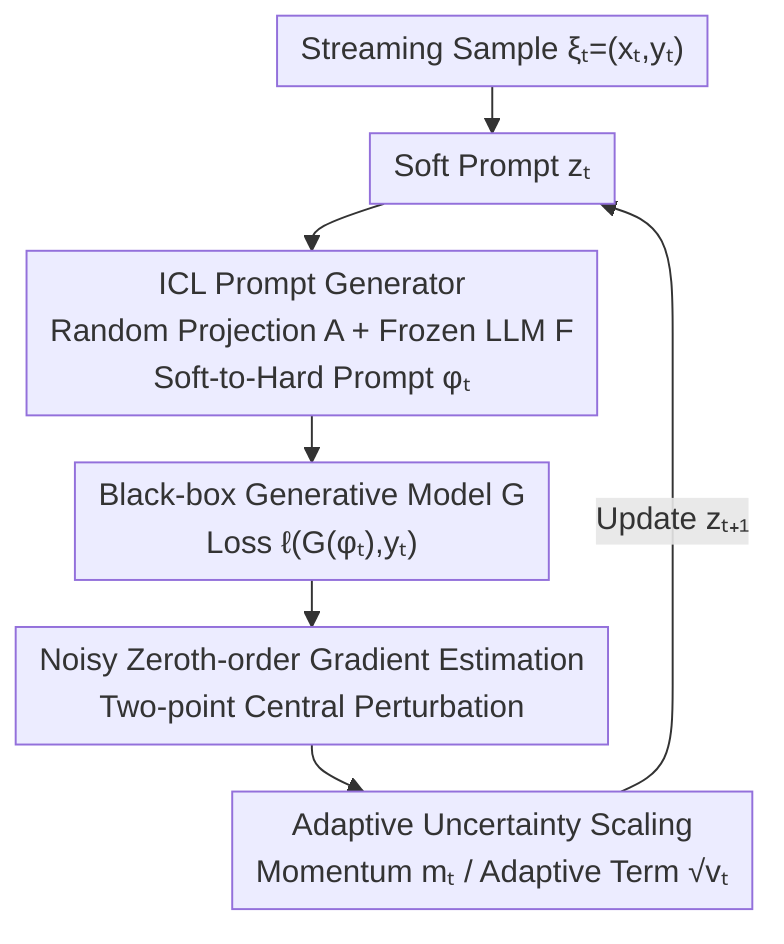

# Online Black-Box Prompt Optimization with Regret Guarantees under Noisy Feedback

**Conference**: ICLR 2026  
**OpenReview**: [https://openreview.net/forum?id=7MzaG8dHRv](https://openreview.net/forum?id=7MzaG8dHRv)  
**Code**: https://github.com/fangjj2000/ICLR_AOZPT_2026  
**Area**: Zeroth-order Optimization / Online Learning / Black-box Prompt Optimization  
**Keywords**: Black-box prompt tuning, zeroth-order optimization, online learning, local regret, uncertainty scale

## TL;DR
This paper proposes AOZPT, the first zeroth-order method for black-box prompt optimization in **online learning + noisy feedback** scenarios. It employs an adaptive uncertainty scaling mechanism to suppress two types of uncertainties: "generative model output noise" and "high variance of zeroth-order gradients." Under non-convex settings, it is proven to achieve **sublinear regret**, demonstrating superior stability and performance over offline and online baselines in text and image generation tasks.

## Background & Motivation

**Background**: When commercial generative models are accessible only via API—where internal representations and gradients are unavailable—tuning must be performed on the input side as "black-box prompt optimization." Prevailing approaches (e.g., BBT, RLPrompt, BDPL, ZOPO) are predominantly **offline**: they iteratively evaluate on a fixed dataset and use Bayesian optimization, evolutionary algorithms, or reinforcement learning to optimize prompts until convergence.

**Limitations of Prior Work**: The offline paradigm faces two critical issues. First, it assumes a static data distribution, failing to adapt to real-time data streams—systems like customer service, e-commerce recommendation, or emotional companionship require retraining on full datasets for every new batch of interactions, which is costly and slow. Second, it generally **ignores the randomness of generative model outputs**: even with fixed parameters and inputs, factors like sampling temperature and random seeds result in different outputs for the same prompt. From an optimization perspective, this randomness constitutes noise that contaminates prompt evaluation.

**Key Challenge**: To achieve online optimization, a lightweight gradient-based method that "updates per sample" is required. However, prompts are discrete natural language without differentiable gradients, necessitating zeroth-order optimization (ZOO) to approximate gradients through finite function evaluations. Since zeroth-order estimates themselves exhibit **extremely high variance**, the problem becomes a compounding of "generative noise + zeroth-order variance." Applying existing Bayesian or evolutionary methods—which require frequent surrogate model updates or massive sample evaluations—is infeasible in online streaming scenarios.

**Goal**: To perform black-box prompt optimization on streaming data, requiring: (1) incremental updates per round without retraining; (2) suppression of dual uncertainties for stable updates; and (3) provable regret guarantees.

**Key Insight**: This work merges zeroth-order optimization with online non-convex learning. It uses local regret over a sliding window as the evaluation metric for online non-convex settings. Drawing inspiration from the "momentum + adaptive denominator" logic of Adam-like adaptive optimizers, it redesigns the adaptive term specifically as an uncertainty scaling component.

**Core Idea**: An **adaptive uncertainty scaling** mechanism is introduced, where the exponentially weighted moving average (momentum) of noisy zeroth-order gradients is divided by the square root of their exponentially weighted moving average (adaptive term). this automatically scales the gradient magnitude for each dimension, effectively neutralizing both generative noise and zeroth-order variance, which is proven to yield sublinear regret.

## Method

### Overall Architecture

In each round $t$, AOZPT processes a streaming sample $\xi_t=(x_t,y_t)$. The objective is to optimize the prompt $\phi$ to minimize the loss $f^t(\phi^t)=\ell(G(\phi^t;x_t),y_t)$, where $G$ is the black-box generative model. Since $\phi$ is discrete text, the pipeline utilizes "soft prompts": a low-dimensional continuous vector $z_t\in\mathbb{R}^d$ (soft prompt) is maintained. This vector is projected into a higher dimension via a random projection matrix $A$ and fed into a **frozen open-source LLM** $F$, which generates a semanticized discrete hard prompt $\phi_t=F(Az_t+\phi_0;\xi_t)$. The hard prompt is then passed to the black-box model $G$ to obtain the loss. Optimization occurs only on the low-dimensional soft prompt $z_t$ using a noisy two-point zeroth-order estimator, followed by adaptive uncertainty scaling to update $z_t$.

### Key Designs

**1. ICL Prompt Generator: Transforming Discrete Optimization into Continuous Optimization**

To address the discrete nature of natural language prompts $\phi$, the authors adopt the InstructZero approach. Instead of directly optimizing discrete prompts, they optimize a low-dimensional continuous soft prompt $z_t\in\mathbb{R}^d$. A frozen open-source LLM "translates" this into a high-quality hard prompt. Specifically, $z_t$ is projected into the LLM's high-dimensional embedding space using $A\in\mathbb{R}^{D\times d}$ ($D\gg d$), concatenated with a base prompt, and input to $F$ to generate $\phi_t=F(Az_t+\phi_0;\xi_t)$. This converts non-differentiable discrete optimization into low-dimensional continuous optimization (crucial as ZOO variance scales with dimension) while ensuring the generated prompts are semantically coherent.

**2. Noisy Zeroth-order Gradient Estimation: Approximating Directions on a Black-box**

Since $G$ remains a black-box with stochastic output, the randomness is modeled as $\delta(z_t)$. The noisy objective is $f^t_\delta(z_t)=f^t(z_t)+\delta(z_t)$. A **two-point central random gradient estimator** is used for $z$:

$$\hat\nabla_z f^t_\delta(z_t)=\frac{f^t_\delta(z_t+\mu u_t)-f^t_\delta(z_t-\mu u_t)}{2\mu}\,u_t,$$

where $\mu$ is the smoothing parameter and $u_t$ is sampled from the unit sphere $S^d=\{u\in\mathbb{R}^d:\|u\|_2=1\}$. This requires only two evaluations per round, fitting the online budget. However, due to the limited evaluations and the noise $\delta$, this estimate is **noisy and high-variance**.

**3. Adaptive Uncertainty Scaling: Suppressing Noise and Variance via Sliding Windows**

This is the core mechanism. It adapts the Adam framework to handle uncertainties over a sliding window. The update rule is:

$$z_{t+1}\leftarrow z_t-\eta\cdot\frac{m_t}{\sqrt{v_t}+\epsilon},$$

where the momentum $m_t=\frac{1}{W}\sum_{i=0}^{w-1}\alpha^i\,\hat\nabla_z f^{t-i}_\delta(z_{t-i})$ is the exponentially weighted average of recent gradients to stabilize the direction. The adaptive term $v_t=\frac{1}{M}\sum_{i=0}^{w-1}\beta^i\,[\hat\nabla_z f^{t-i}_\delta(z_{t-i})]^2$ scales the step size based on the historical energy of each dimension. Dimensions with high noise or variance (high cumulative squared gradients) see their step sizes reduced. Unlike standard Adam, it uses a **finite sliding window $w$**, which accommodates online non-stationarity and serves as a controllable parameter in the regret proof.

### Loss & Training

Theoretical guarantees use sliding window **local regret** for online non-convex optimization. The averaged function is $F^t_{w,\alpha}(z_t)=\frac{1}{W}\sum_{i=0}^{w-1}\alpha^i f^{t-i}(z_{t-i})$, and local regret is the sum of its gradient norms:

$$R(T)\triangleq\sum_{t=1}^{T}\big\|\nabla_z F^t_{w,\alpha}(z_t)\big\|_2^2.$$

Under assumptions of Lipschitz gradients and bounded functions/noise/gradients, the paper bounds the regret as $R(T)\le E_1+E_2+E_3$. $E_1$ is the standard first-order error, $E_2$ is the accumulation of zeroth-order variance and generative noise (controlled by window size $w$), and $E_3$ is the adaptive algorithmic term. Simplified, it yields:

$$R(T)=O\!\left(\frac{T}{W}+\frac{T M^{1/2}}{W}\right).$$

As $\alpha,\beta\to1^-$, $\beta\le\alpha\le\beta^{1/2}$, and $w=T^{1/2}$, the bound becomes **sublinear in $T$**, providing the first convergence proof for noisy online black-box prompt optimization.

## Key Experimental Results

Tasks include text generation (CNN/DailyMail summarization using F1 scores; GSM8K mathematical reasoning using Accuracy) and image generation (Anime/Painting using Aesthetic Score Predictor based on CLIP). Soft prompts are generated by Vicuna-7B/13B. Black-box models include Llama-3.1-8B, GPT-3.5-turbo, Qwen2.5-14B (text) and Dreamlike-2.0, Stable Diffusion v1.5 (image). The primary baseline is ZO-OGD (online zeroth-order without adaptive scaling), alongside offline baselines like RLPrompt and BDPL.

### Main Results

| Task / Dataset | Model | Metric | AOZPT | ZO-OGD | Strongest Baseline |
|------|------|------|------|------|------|
| Summary CNN/DM | Qwen2.5-14B | F1 | **24.767** | 22.034 | 23.064 (ICL) |
| Math GSM8K | Llama-3.1-8B | Acc | **69.733** | 65.067 | 66.867 (RLPrompt) |
| Math GSM8K | Qwen2.5-14B | Acc | **92.933** | 92.533 | 89.000 (BDPL) |
| Image Anime | SD v1.5 | Aesthetic | **5.930** | 5.892 | 5.710 (ICL) |
| Image Painting | SD v1.5 | Aesthetic | **6.313** | 6.287 | 6.103 (SFT) |

AOZPT achieves the best results across most combinations, consistently outperforming ZO-OGD, which validates the gains from the adaptive uncertainty scaling.

### Ablation Study

| Configuration | Function | Note |
|------|------|------|
| Full (AOZPT) | Complete | Soft Prompts + Noisy ZOO + Adaptive Scaling |
| w/o Adaptive Scaling | Becomes ZO-OGD | Performance and stability decrease significantly |
| w/o LLM Generator | No ICL Generator | Open-source LLM is essential for high-quality prompts |
| Data Drift Intensity | Robustness | Online algorithms maintain higher scores under distribution shifts |

### Key Findings
- **Impact of Adaptive Scaling**: Removing this mechanism (ZO-OGD) leads to performance drops and higher variance, confirming it as a source of stability.
- **Necessity of LLM Generator**: Directly optimizing discrete tokens or removing semantic generation leads to degradation, highlighting the importance of the soft-to-hard linearization.
- **Online Advantage**: The benefit of incremental updates is most pronounced during data drifts/non-stationary distributions.

## Highlights & Insights
- **Reinterpreting Adam as an "Uncertainty Suppressor"**: Instead of serving as a general accelerator, the $\sqrt{v_t}$ denominator is shown to absorb zeroth-order variance and generative noise per dimension. 
- **Provable Regret with Noise**: The work successfully provides a sublinear regret bound for black-box prompt optimization under non-convex and noisy conditions.
- **Low-dimensional Soft Prompts**: Reducing the optimization to a low dimension $d$ via random projection makes two-point ZOO estimation feasible within an online budget.

## Limitations & Future Work
- **Dependency on Local LLM**: Generating hard prompts requires running Vicuna, which adds computational overhead compared to pure API calls.
- **Noise Modeling**: The assumption of bounded noise $\delta(z)$ is an abstraction; real-world sampling noise may have more complex structures.
- **Simulated Streaming**: Experiments use fixed datasets treated as streams; more diverse real-world distribution shifts remain to be tested.

## Related Work & Insights
- **vs InstructZero**: AOZPT adopts its generation framework but replaces the offline Bayesian optimization with an online zeroth-order adaptive method and provides theoretical guarantees.
- **vs ZO-OGD**: AOZPT introduces the adaptive scaling layer, which provides the majority of the observed stability gains.
- **vs Online Non-convex Learning**: AOZPT extends the local regret framework to handle the specific dual uncertainties of noisy zeroth-order gradients.

## Rating
- Novelty: ⭐⭐⭐⭐⭐ 
- Experimental Thoroughness: ⭐⭐⭐⭐ 
- Writing Quality: ⭐⭐⭐⭐ 
- Value: ⭐⭐⭐⭐ 

<!-- RELATED:START -->

## Related Papers

- [\[AAAI 2026\] Instance Generation for Meta-Black-Box Optimization through Latent Space Reverse Engineering](../../AAAI2026/optimization/instance_generation_for_meta-black-box_optimization_through_latent_space_reverse.md)
- [\[ICLR 2026\] Convergence of Regret Matching in Potential Games and Constrained Optimization](convergence_of_regret_matching_in_potential_games_and_constrained_optimization.md)
- [\[ICLR 2026\] Error Feedback for Muon and Friends](error_feedback_for_muon_and_friends.md)
- [\[ICLR 2026\] Improving Online-to-Nonconvex Conversion for Smooth Optimization via Double Optimism](improving_online-to-nonconvex_conversion_for_smooth_optimization_via_double_opti.md)
- [\[ICLR 2026\] Non-Convex Federated Optimization under Cost-Aware Client Selection](non-convex_federated_optimization_under_cost-aware_client_selection.md)

<!-- RELATED:END -->
