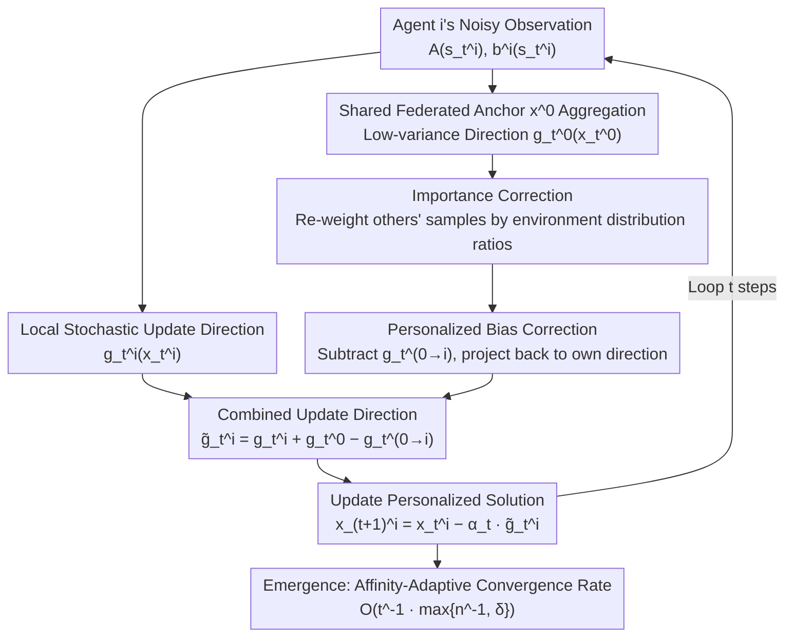

# Personalized Collaborative Learning with Affinity-Based Variance Reduction

**Conference**: ICLR 2026  
**arXiv**: [2510.16232](https://arxiv.org/abs/2510.16232)  
**Code**: None  
**Area**: Optimization  
**Keywords**: Personalized Federated Learning, Collaborative Learning, Variance Reduction, Heterogeneity, Affinity-Based Acceleration

## TL;DR

Proposes the personalized collaborative learning framework AffPCL. Through bias correction and importance correction mechanisms, heterogeneous agents collaboratively learn personalized solutions without prior knowledge, achieving an adaptive convergence rate of $O(t^{-1} \cdot \max\{n^{-1}, \delta\})$. This results in linear acceleration when agents are similar and performance no worse than independent learning when differences are large.

## Background & Motivation

**Background**: Multi-agent learning faces a fundamental tension—**collaborative efficiency vs. personalization needs**. Collaborative systems typically adopt the federated learning (FL) paradigm, where agents jointly learn a unified solution via a central server. However, in the presence of heterogeneity, this unified solution is often suboptimal or even irrelevant for individual agents, making personalization a necessity for heterogeneous agent collaboration.

**Limitations of Prior Work**: Personalized recommendation for different users, autonomous driving for local road conditions, robotics for varying environments, medical diagnosis for diverse patient groups, and LLM agents for specific user styles—all these scenarios demand simultaneous "collaboration and personalization."

**Goal**: (1) Find a **fully personalized** solution $x^i_*$ for each agent; (2) achieve **performance gain** through collaboration; (3) **adapt** to unknown heterogeneity—accelerating when agents are similar and not degrading when they differ, all without prior knowledge or parameter tuning.

**Key Insight**: Existing methods fall short: classic FL only learns a unified solution with no personalization guarantees; regularization/mixture methods (e.g., Ditto) provide only partial personalization and rely on heuristic trade-offs; clustering methods lack personalization within clusters and are sensitive to hyperparameters; FL + fine-tuning yields suboptimal rates (small initialization errors from FL vanish quickly, with independent learning variance dominating finite-time complexity); global + local decomposition requires specific structural assumptions and is limited by the complexity of the independent learning part. Selective collaboration (Chayti et al., Even et al.), the closest to this work, only collaborates with similar agents and requires either heterogeneity priors or bias estimation oracles. This work aims to allow any heterogeneous agents to collaborate and learn their respective personalized solutions without relying on any priors.

## Method

### Overall Architecture

AffPCL models personalized collaborative learning as $n$ agents each solving a stochastic linear system $\bar{A}^i x^i_* = \bar{b}^i$ (satisfying $\text{sym}( \bar{A}^i ) \succ 0$). At each step, each agent obtains noisy observations $A(s^i_t)$ and $b^i(s^i_t)$, where objectives $\bar{b}^i$ and environment distributions $\mu_i$ may differ. The core idea is to let each agent learn its own personalized solution $x^i_*$ while borrowing a shared federated anchor to reduce variance. Two correction mechanisms remove the bias introduced by "borrowing strength," allowing the convergence rate to automatically interpolate between "federated linear acceleration" and "independent learning" based on agent similarity.

In a specific update step: each agent first computes its local stochastic update direction $g^i_t(x^i_t)$. Simultaneously, a shared anchor $x^0$ is maintained, and the central server aggregates information to obtain a low-variance federated direction $g^0_t(x^0_t)$. During aggregation, importance re-weighting is applied for samples from different environment distributions, and a personalized bias correction term $g^{0\to i}_t(x^0_t)$ is subtracted to project the unified direction back onto agent $i$'s own direction. The three components combine into the corrected update direction to obtain $x^i_{t+1}$. Repeating this step allows the affinity-adaptive convergence rate to emerge naturally.

### Key Designs

**1. Personalized Bias Correction: Enabling Fully Personalized Updates to Benefit from Federated Variance Reduction**

Federated learning reduces stochastic gradient variance to $1/n$ because all agents move toward a unified solution, canceling out noise during aggregation. Once each agent moves toward its unique $x^i_*$, simple aggregation introduces others' "target bias," causing variance reduction to fail. AffPCL solves this by maintaining a shared anchor variable $x^0$ and writing the update as $x^i_{t+1} = x^i_t - \alpha_t \tilde{g}^i_t$, where the corrected direction

$$\tilde{g}^i_t = g^i_t(x^i_t) + g^0_t(x^0_t) - g^{0\to i}_t(x^0_t)$$

consists of three parts: the local stochastic update $g^i_t(x^i_t)$ ensures movement toward the personalized solution, the federated aggregation term $g^0_t(x^0_t)$ provides a low-variance shared signal, and the personalized bias correction term $g^{0\to i}_t(x^0_t)$ projects the "unified direction" back to agent $i$'s own direction, canceling the systematic bias introduced by aggregation. Thus, the variance reduction from aggregation is preserved while the fixed point remains $x^i_*$ rather than a unified solution.

**2. Importance Correction: Correcting Bias from Different Environment Distributions**

In addition to target heterogeneity, agents may sample from different environment distributions $\mu_i$. Averaging others' observations corresponds to "others' environments," introducing a second type of bias. AffPCL applies importance weights during aggregation, re-weighting samples by the ratio of environment distributions. This ensures the borrowed observations are unbiased for agent $i$'s environment $\mu_i$. An asynchronous variant is provided where importance weights are estimated using lagged statistics, relaxing the requirement for strict synchronous communication.

**3. Affinity-Based Adaptivity: Acceleration for Similar Agents, No Degradation for Dissimilar Ones, Without Priors**

The algorithm uses a heterogeneity measure $\delta \in [0,1]$ to describe group similarity, where $\delta = 0$ is homogeneous and larger $\delta$ indicates higher heterogeneity. AffPCL's convergence rate is $O\!\left(t^{-1}\cdot\max\{n^{-1},\,\delta\}\right)$. This $\max$ form is key to adaptivity: when $\delta \ll n^{-1}$ (high similarity), the rate becomes $O(t^{-1}n^{-1})$, achieving $n$-fold linear acceleration. When $\delta \gg n^{-1}$ (high heterogeneity), the rate becomes $O(t^{-1})$, matching independent learning. The process requires no prior knowledge of $\delta$ or bias estimation oracles—similarity is automatically handled by the bias-corrected aggregation.

### Loss & Training

Training utilizes a near-constant step size decay strategy $\alpha_t \equiv \frac{\ln t}{\lambda t}$ (where $\lambda$ is the strong monotonicity constant) to match the $O(t^{-1})$ convergence analysis. The complexity is introduced layer by layer: starting from simplified homogeneous FL, then personalized bias correction, affinity adaptivity, importance correction for environmental heterogeneity, and finally a full setting with asynchronous communication.

## Key Experimental Results

### Main Results

Core theoretical results based on progressive analysis:

| Setting | Convergence Rate | Description |
|------|--------|------|
| FL (Homogeneous) | $\tilde{O}(\kappa^2 t^{-1} n^{-1})$ | Baseline: Linear acceleration |
| Independent Learning | $O(t^{-1})$ | Baseline: No collaboration |
| AffPCL | $O(t^{-1} \cdot \max\{n^{-1}, \delta\})$ | Adaptive interpolation |
| Async AffPCL | Same + Async Importance Estimation | Relaxes synchronization |

### Ablation Study

| Configuration | Key Metric | Description |
|------|---------|------|
| Pure FL vs. AffPCL | FL bias does not decrease with $t$ | FL converges to wrong solution under heterogeneity |
| Independent vs. AffPCL | AffPCL variance reduction factor $\max\{n^{-1}, \delta\}$ | No worse than independent learning |
| Selective vs. AffPCL | AffPCL benefits even with dissimilar agents | Former requires priors or oracles |

### Key Findings

1. **Affinity Variance Reduction**: AffPCL achieves variance reduction from federated aggregation even when agents learn different targets via personalized bias correction.
2. **Linear Acceleration for Single Agents**: An agent dissimilar to all others can still achieve linear acceleration if other agents are similar to each other, improving the aggregate estimate.
3. **No Prior Knowledge Required**: Does not require the heterogeneity level $\delta$, bias estimation oracles, or specialized hyperparameter tuning.
4. **Tight Theoretical Rates**: Matches known lower bounds in terms of $\kappa$, $t$, and $n$.

## Highlights & Insights

- **Elegant Theoretical Framework**: Formalizes the tension between personalization and collaboration as a unified learning rate problem.
- **Adaptive Interpolation**: Smooth transition from $n$-fold acceleration in FL to the independent learning baseline without manual tuning.
- **Counter-intuitive Discovery**: Collaborating with dissimilar agents can be beneficial, challenging the intuition of "only collaborate with those like you."
- **High Generality**: The framework covers supervised learning, reinforcement learning (TD learning), and statistical decision-making.

## Limitations & Future Work

1. **Linear System Assumption**: Theory is based on $\bar{A}^i x^i_* = \bar{b}^i$; extension to deep learning requires further work.
2. **Communication Efficiency**: Assumes communication at every step; future work should consider intermittent communication and compression.
3. **Single Sample per Agent**: The one-sample-per-step setting is idealized.
4. **Privacy Considerations**: Performance under differential privacy constraints is not discussed.
5. **Experimental Scale**: Primarily a theoretical work; large-scale deep learning experiments are limited.

## Related Work & Insights

- **SCAFFOLD** (Karimireddy et al., 2021): Variance reduction in FL, but lacks personalization.
- **Ditto** (Li et al., 2021): Partial personalization via regularization.
- **MAML/Per-FedAvg** (Fallah et al., 2020): FL + fine-tuning strategies.
- **Chayti et al., Even et al.**: Fully personalized collaborative learning requiring selective collaboration or priors.
- **Insight**: The key to variance reduction in personalized learning lies in identifying and utilizing affinity between agents rather than forcing consistency.

## Rating
- Novelty: ⭐⭐⭐⭐⭐
- Experimental Thoroughness: ⭐⭐⭐
- Writing Quality: ⭐⭐⭐⭐⭐
- Value: ⭐⭐⭐⭐

<!-- RELATED:START -->

## Related Papers

- [\[CVPR 2026\] Few-for-Many Personalized Federated Learning](../../CVPR2026/optimization/few-for-many_personalized_federated_learning.md)
- [\[ICML 2026\] CLoVE: Personalized Federated Learning through Clustering of Loss Vector Embeddings](../../ICML2026/optimization/clove_personalized_federated_learning_through_clustering_of_loss_vector_embeddin.md)
- [\[ICML 2026\] TPV: Parameter Perturbations Through the Lens of Test Prediction Variance](../../ICML2026/optimization/tpv_parameter_perturbations_through_the_lens_of_test_prediction_variance.md)
- [\[NeurIPS 2025\] Personalized Subgraph Federated Learning with Differentiable Auxiliary Projections](../../NeurIPS2025/optimization/personalized_subgraph_federated_learning_with_differentiable_auxiliary_projectio.md)
- [\[AAAI 2026\] pFed1BS: Personalized Federated Learning with Bidirectional Communication Compression via One-Bit Random Sketching](../../AAAI2026/optimization/personalized_federated_learning_with_bidirectional_communication_compression_via.md)

<!-- RELATED:END -->
