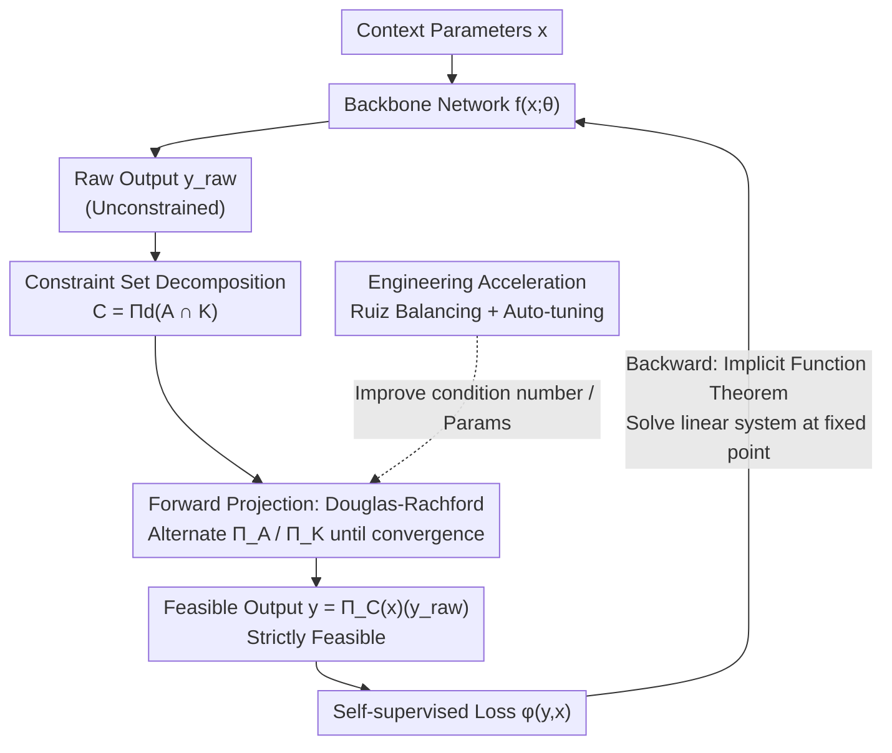

# Πnet: Optimizing Hard-Constrained Neural Networks with Orthogonal Projection Layers

**Conference**: ICLR 2026 (Oral)  
**arXiv**: [2508.10480](https://arxiv.org/abs/2508.10480)  
**Code**: [github.com/antonioterpin/pinet](https://github.com/antonioterpin/pinet)  
**Area**: Optimization / Constrained Neural Networks  
**Keywords**: Hard-constrained neural networks, orthogonal projection, operator splitting, implicit function theorem, Douglas-Rachford

## TL;DR

The Πnet architecture is proposed to guarantee strict satisfaction of convex constraints by attaching an orthogonal projection layer based on Douglas-Rachford operator splitting to the output layer of neural networks. Efficient backpropagation is achieved through the Implicit Function Theorem, significantly outperforming existing methods in training time, solution quality, and hyperparameter robustness.

## Background & Motivation

Many practical applications require solving parametric constrained optimization problems: given context (parameters) $x$, solve $\min_y \varphi(y,x)$ s.t. $y \in \mathcal{C}(x)$. Such problems frequently occur in fields like power systems, logistics scheduling, model predictive control, and motion planning.

### Limitations of Prior Work

**Soft constraint methods**: Adding penalty terms for constraint violations to the loss function. Disadvantages include the inability to guarantee constraint satisfaction during inference and the extreme difficulty of tuning penalty coefficients.

**DC3**: Enforces feasibility through equality completion and inequality correction, but remains sensitive to hyperparameters and resembles soft constraints in some respects.

**Loop Unrolling**: Methods like Dykstra projections require gradients to propagate through all iteration steps, resulting in extremely high memory and computational costs.

**cvxpylayers/JAXopt**: While general-purpose, they lack structural optimization for projection-specific problems, leading to long training times.

### Key Insight

Is it possible to design a **"feasible-by-design"** neural network architecture where the output automatically satisfies given convex constraints under any network weights? The key lies in how to efficiently implement forward propagation of the projection operation and how to perform efficient backpropagation through it.

## Method

### Overall Architecture

Πnet completely decouples "constraint satisfaction" from the loss function, delegating it to an orthogonal projection layer attached to the network output. A standard backbone network $f(x;\theta)$ first produces an unconstrained raw output $y_{raw}$ based on the context parameters $x$. The projection layer then performs an orthogonal projection of this output onto the feasible set $\mathcal{C}(x)$ corresponding to the current $x$, yielding a strictly feasible $y = \Pi_{\mathcal{C}(x)}(y_{raw})$. Since this projection lacks a closed-form solution, the projection layer operates in two steps: it first **decomposes** general convex constraints into two subsets that allow closed-form projections, and then uses **Douglas-Rachford operator splitting** to iteratively project between them until convergence. During training, instead of backpropagating through iteration steps, the **Implicit Function Theorem** is used to differentiate directly at the fixed point after convergence, allowing gradients to return to the backbone network normally. Simultaneously, **engineering accelerations** (matrix balancing + auto-tuning) ensure that forward iterations are fast and stable. Consequently, the output is "feasible-by-design" under any network weights, at the cost of only one structured projection layer.

### Key Designs

**1. Constraint Set Decomposition: Splitting general convex constraints into two subsets with closed-form projections**

Direct projection onto a general convex set lacks a closed-form solution, which is the primary obstacle for projection layers. Πnet expresses the constraint set in the form $\mathcal{C} = \Pi_d(\mathcal{A} \cap \mathcal{K})$: $\mathcal{A}$ is an affine subspace (hyperplane) defined by matrix $A$ and offset $b$, while $\mathcal{K} = \mathcal{K}_1 \times \mathcal{K}_2$ is a simple set in Cartesian product form (e.g., box constraints, second-order cones). Since projections $\Pi_\mathcal{A}$ and $\Pi_\mathcal{K}$ onto these subsets have closed-form solutions, the complex projection is transformed into an iterative process of repeated projections onto two simple sets. It is important to emphasize that this decomposition is not an additional assumption—any convex set can be represented this way (with $\mathcal{A}=\mathcal{C}$ as a trivial case). Efficient closed-form projection is a benefit of this decomposition, which already covers polyhedra, second-order cones, sparsity constraints, simplices, and their intersections.

**2. Forward Projection: Alternate projection using Douglas-Rachford splitting**

With the decomposition above, the projection problem is rewritten as a composite optimization $\min_z g(z) + h(z)$, where $g = \mathcal{I}_\mathcal{A}$ is the indicator function of the affine constraint and $h = \|y - y_{raw}\|^2 + \mathcal{I}_\mathcal{K}$ combines the objective with the $\mathcal{K}$ constraint. Douglas-Rachford splitting utilizes closed-form projections for these components alternately: $z_{k+1} = \Pi_\mathcal{A}(s_k)$ performs the affine projection, $t_{k+1} = \Pi_\mathcal{K}(\cdot)$ performs the box/cone projection, and $s_{k+1} = s_k + \omega(t_{k+1} - z_{k+1})$ updates the auxiliary variable with a relaxation coefficient $\omega$ controlling the step size. Under strict feasibility conditions, these iterations converge to the true projection. Each step involves only closed-form projections and vector operations, making it naturally suitable for batch execution on GPUs.

**3. Backward: Replacing Loop Unrolling with the Implicit Function Theorem**

For the projection layer to be trainable, gradients must pass through the iteration sequence back to the backbone network. Backpropagating through all iteration steps (loop unrolling), as in Dykstra, causes memory and computation to explode linearly with the number of iterations. Πnet observes that forward iterations converge to a fixed point $s_\infty(y_{raw}) = \Phi(s_\infty(y_{raw}), y_{raw})$, satisfying the conditions of the Implicit Function Theorem. Consequently, backpropagation does not need to track forward steps but only requires solving a linear system $(I - \partial\Phi/\partial s)^\top \xi = v$. This system is solved using the bicgstab iterative method, where the cost per step is comparable to a single forward iteration, completely decoupling backward overhead from the number of forward iterations. This is the fundamental reason why Πnet training is one to two orders of magnitude faster than loop unrolling methods.

**4. Engineering Acceleration: Matrix balancing and auto-tuning for fast and stable iterations**

The convergence speed of the iterations depends heavily on the condition number of the affine matrix $A$ and the selection of hyperparameters, which determines the practical utility of the method. Πnet applies Ruiz equilibration to $A$ before projection, using diagonal scaling $D_r A D_c$ to equalize row and column norms and lower the condition number. This significantly reduces the iterations required for a given accuracy. Additionally, it automates the tuning of key parameters (scaling factor $\sigma$, relaxation coefficient $\omega$, number of iterations) by evaluating projection quality across configurations on a validation subset. The combined effect is clear in ablation studies: adding equilibration reduced inference time per batch from 1.89s to 0.28s while improving solution quality. This auto-tuning allows Πnet to work stably with almost no manual intervention in scenarios where DC3 diverges due to default parameters on large problems.

### Loss & Training

Training utilizes a self-supervised loss, directly optimizing the original objective $\mathcal{L}(y,x) = \varphi(y,x)$. The entire process can be viewed as performing projected gradient descent in the raw output space. A key decision is enabling the constraint layer during training rather than just at inference: first, some problems diverge without constraints; second, the projection of an unconstrained optimal solution is typically not the constrained optimal solution. Introducing constraints early injects a beneficial inductive bias, helping the network directly learn the distribution of feasible solutions.

## Key Experimental Results

### Main Results

Comparison on convex and non-convex benchmarks (DC3 benchmark):

| Method | Relative Suboptimality (RS) | Constraint Violation (CV) | Per-instance Inference Time | Batch Inference Time |
|------|----------------|--------------|--------------|-------------|
| Πnet | ≤5% (Most cases) | <10⁻⁵ | 0.0056s | 0.013s |
| DC3 | Poor (esp. large problems) | Large on large problems | 0.0019s | 0.002s |
| JAXopt | Comparable to Πnet | Comparable to Πnet | 0.0134s | 0.137s |
| Solver (IPOPT) | Optimal | 0 | 0.034s | 41.7s |

### Training Efficiency

| Method | Training Epochs | Training Time |
|------|---------|---------|
| Πnet | 50 epochs | Seconds |
| DC3 | 1000 epochs | Longer |
| JAXopt | 12 epochs | ~14 hours for large problems |

### Ablation Study

| Configuration | RS | CV | Inference Time |
|------|----|----|---------|
| Default (No balancing, default params) | Moderate | Poor | 0.55s/batch |
| Auto (Auto-tuning, no balancing) | Improved | Improved | 1.89s/batch |
| Πnet (Auto-tuning + Balancing) | Best | Best | 0.28s/batch |

### Key Findings

1.  **Reliable Constraint Satisfaction**: Πnet consistently maintains extremely low constraint violations (<10⁻⁵) across all experiments, whereas DC3 shows significant violations on large problems.
2.  **Extremely Fast Training**: Satisfactory performance is reached in only 50 epochs, one to two orders of magnitude faster than DC3 (1000) and JAXopt.
3.  **Hyperparameter Robustness**: DC3 is extremely sensitive to hyperparameters (default parameters diverge on large problems), while Πnet requires almost no manual tuning when paired with auto-tuning.
4.  **Multi-robot Motion Planning Application**: Successfully handled motion planning problems with up to 15 vehicles and 750 steps (approx. 9000 variables and constraints), demonstrating real-world scalability.
5.  **Second-Order Cone Constraints**: Successfully extended to SOCP constraints, with both RS and CV below 10⁻⁶.

## Highlights & Insights

1.  **Clear Methodology**: The core idea is simple—projection plus the Implicit Function Theorem—but through meticulous engineering (equilibration, auto-tuning, etc.), it achieves superior practical performance.
2.  **Constraints as Inductive Bias**: Enabling constraints during training is an advantage rather than a hindrance, as it helps the network better learn the distribution of feasible solutions.
3.  **Modular Design**: The projection layer can be directly attached to any backbone network without modifying the architecture.
4.  **JAX + GPU**: Provides an efficient, GPU-ready open-source implementation.
5.  **High Generality**: Supports combinations of various constraint types (polyhedra + cones + sparsity) through a unified decomposition framework.

## Limitations & Future Work

1.  **Convex Constraints Only**: The current framework requires $\mathcal{C}(x)$ to be a convex set; non-convex constraints require additional processing (e.g., sequential convexification).
2.  **Choice of Decomposition**: Efficiency is affected by the choice of $\mathcal{A}, \mathcal{K}$ decomposition; there is currently no fully automated strategy for optimal decomposition.
3.  **Collision Avoidance**: In motion planning, constraints are decoupled (independent vehicles); coupled non-convex constraints like collision avoidance were not addressed.
4.  **Large-scale Problems**: While a 9000-variable case was shown, scalability for even larger problems is not fully verified.
5.  **Integration with Reinforcement Learning**: Only a preliminary proof-of-concept for human preference optimization was shown; deeper RL integration is worth exploring.

## Related Work & Insights

-   **DC3 (Donti et al., 2021)**: Primary baseline using equality completion and inequality correction, which is essentially a soft constraint approach.
-   **RAYEN (Tordesillas, 2023)**: Restores feasibility via segment scaling but requires expensive offline preprocessing.
-   **cvxpylayers/JAXopt**: General-purpose differentiable convex optimization layers, lacking structural optimization for projection.
-   **LinSATNet/GLinSAT**: Limited to specific constraint types (non-negative linear/bounded constraints).

### Related Work & Insights

1.  Exploiting problem structure (projection vs. general optimization) can achieve orders of magnitude improvements in efficiency.
2.  Hard constraints can serve as beneficial inductive biases for neural networks rather than just requirements to be met.
3.  Engineering details (matrix balancing, auto-tuning) are crucial for practical performance.

## Rating

-   Novelty: ⭐⭐⭐⭐ — While the combination of Douglas-Rachford and IFT is not entirely new, its systematic application and engineering optimization in HCNNs represent a significant contribution.
-   Experimental Thoroughness: ⭐⭐⭐⭐⭐ — Comprehensive coverage from benchmarks to practical applications (motion planning), and from ablations to hyperparameter analysis.
-   Writing Quality: ⭐⭐⭐⭐⭐ — Clear structure, detailed appendices, oral-presentation quality paper.
-   Value: ⭐⭐⭐⭐⭐ — Provides a GPU-ready open-source toolkit with broad impact on PDE solving, robotics, and scheduling.

## Related Papers

- [\[ICML 2026\] Balancing Learning Rates Across Layers: Exact Two-Step Dynamics and Optimal Scaling in Linear Neural Networks](../../ICML2026/optimization/balancing_learning_rates_across_layers_exact_two-step_dynamics_and_optimal_scali.md)
- [\[CVPR 2025\] SCOPE: Semantic Coreset with Orthogonal Projection Embeddings for Federated Learning](../../CVPR2025/optimization/scope_semantic_coreset_with_orthogonal_projection_embeddings_for_federated_learn.md)
- [\[AAAI 2026\] Beyond the Mean: Fisher-Orthogonal Projection for Natural Gradient Descent in Large Batch Training](../../AAAI2026/optimization/beyond_the_mean_fisher-orthogonal_projection_for_natural_gradient_descent_in_lar.md)
- [\[ICLR 2026\] Difference Predictive Coding for Training Spiking Neural Networks](difference_predictive_coding_for_training_spiking_neural_networks.md)
- [\[ICLR 2026\] Entropic Confinement and Mode Connectivity in Overparameterized Neural Networks](entropic_confinement_and_mode_connectivity_in_overparameterized_neural_networks.md)

<!-- RELATED:END -->

<!-- RELATED:START -->

## Related Papers

- [\[ICML 2026\] Balancing Learning Rates Across Layers: Exact Two-Step Dynamics and Optimal Scaling in Linear Neural Networks](../../ICML2026/optimization/balancing_learning_rates_across_layers_exact_two-step_dynamics_and_optimal_scali.md)
- [\[CVPR 2025\] SCOPE: Semantic Coreset with Orthogonal Projection Embeddings for Federated Learning](../../CVPR2025/optimization/scope_semantic_coreset_with_orthogonal_projection_embeddings_for_federated_learn.md)
- [\[AAAI 2026\] Beyond the Mean: Fisher-Orthogonal Projection for Natural Gradient Descent in Large Batch Training](../../AAAI2026/optimization/beyond_the_mean_fisher-orthogonal_projection_for_natural_gradient_descent_in_lar.md)
- [\[ICLR 2026\] Difference Predictive Coding for Training Spiking Neural Networks](difference_predictive_coding_for_training_spiking_neural_networks.md)
- [\[ICLR 2026\] Entropic Confinement and Mode Connectivity in Overparameterized Neural Networks](entropic_confinement_and_mode_connectivity_in_overparameterized_neural_networks.md)

<!-- RELATED:END -->
