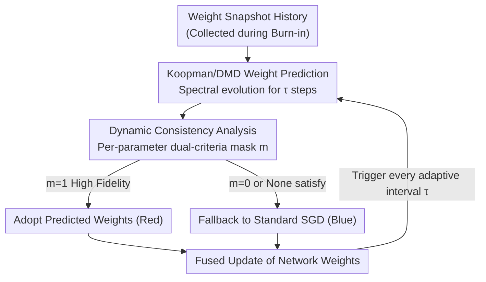

# Predictive Differential Training Guided by Training Dynamics

**Conference**: ICLR 2026  
**OpenReview**: [https://openreview.net/forum?id=zSTgrLkpRi](https://openreview.net/forum?id=zSTgrLkpRi)  
**Code**: https://github.com/aicip/PDT  
**Area**: Training Optimization / Convergence Acceleration  
**Keywords**: Koopman Operator, Dynamic Mode Decomposition, Weight Prediction, Differential Training, Training Acceleration

## TL;DR
Training a DNN is treated as a nonlinear dynamical system in a high-dimensional weight space. Using Koopman/DMD, weights several epochs ahead are predicted to skip SGD iterations. A "dynamic consistency analysis" mask is employed to accept only high-fidelity predicted weights whose local dynamics align with global dynamics. This works as a plug-and-play plugin to accelerate various optimizers (SGD/Adam/LAMB, etc.) by 10–40% without loss of accuracy.

## Background & Motivation

**Background**: Modern DNN training primarily relies on SGD and its variants (Momentum, RMSprop, Adam, LAMB). These first/second-order optimizers are inherently **iterative**—calculating gradients and updating weights step-by-step until convergence. This "iterative burden" is the root cause of expensive training. "Differential learning" (e.g., adaptive learning rates in Adam) improves "how" parameters are updated but does not address the limitation of the "iterative process" itself.

**Limitations of Prior Work**: Recent perspectives from the control theory community suggest that if a trained network is a static nonlinear system acting on inputs, then the "training process" is a discrete nonlinear dynamical system acting on the high-dimensional weight space. Based on Koopman Operator Theory (KOT), this dynamics can be characterized in a data-driven manner to **directly predict weights multiple epochs ahead**, skipping time-consuming SGD iterations. This category of methods is known as "predictive training." However, practical applications face issues: without actual gradient descent, convergence is not guaranteed, and the system is extremely sensitive to perturbations in weight space, leading to accumulated errors.

**Key Challenge**: Existing predictive training methods **fully accept** predicted weights without verifying their "high fidelity." As the number of parameters increases from millions to billions, the quality of Koopman predictions becomes **highly non-uniform** across the weight space—some parameters are in stable, predictable evolution phases, while others undergo violent jumps or oscillations. Applying low-quality predictions, especially on larger/complex models, easily triggers gradient explosion, causing predictive training to fail as network scale increases (as shown in Fig. 2).

**Goal**: To enable predictive acceleration to **scale stably to large models** while remaining a lightweight plugin compatible with existing optimizers, without requiring external checkpoint datasets or per-weight inference overhead.

**Key Insight**: Predictive learning must be "selective"—accelerating only parameters whose **local dynamics align with global dynamics**. This is based on the observation that DMD extracts dominant modes of the system; parameters in stable phases align with these global modes, while unstable parameters deviate from the "global linear dynamics" assumption inherent in DMD.

**Core Idea**: Injecting "differential learning" into predictive training, the authors propose **Predictive Differential Training (PDT)**. A mask based on dynamic consistency analysis selects only the "high-fidelity" subset of weights predicted by Koopman/DMD for acceleration, while other parameters fall back to standard SGD. Like a "rising tide lifting all boats," a small subset of high-fidelity predicted weights can drive the entire network to faster convergence.

## Method

### Overall Architecture

PDT aims to answer three questions: **when** to enable prediction, **how** to integrate predictions with existing optimizers, and **which** parameters should be accelerated. The pipeline inserts prediction blocks (Pred) into the standard optimization (OPT) loop as a plug-and-play enhancement.

The process begins with a **Burn-in phase**, training normally for several epochs to accumulate history. Every adaptive interval $\tau$, a prediction is triggered: DMD is applied to recent snapshots $W_i, W_{i+1}$ to obtain spectral components (eigenvalues $\Lambda$, modes $\Phi$) of the finite-dimensional Koopman approximation $A$. Weights $\tau$ steps ahead, $w^{pred}_{i+\tau}$, are calculated via spectral evolution. Finally, **dynamic consistency analysis** generates a mask $m$ for each parameter: positions where $m=1$ adopt the high-fidelity predicted weights (red), while positions where $m=0$ use standard SGD weights (blue). If no elements satisfy the criteria, the step reverts entirely to standard SGD. The computational cost of DMD is roughly equivalent to one GD operation, but since it occurs only at the epoch level, the overhead is offset by the acceleration.

### Key Designs

**1. Koopman/DMD Weight Prediction: Training as a Dynamical System**

This step addresses how to obtain weights several epochs ahead without running gradient descent. Viewing weight evolution $w_{i+1}=T(w_i)$ as a discrete dynamical system, the Koopman operator $K$ is **linear** (though infinite-dimensional) on the space of observable functions. For a point spectrum, it decomposes as $g(x_{i+\tau})=\sum_k \lambda_k^{\tau}\phi_k(x_i)c_k$. Since network weights are fully observable, the identity mapping $w_i=g(w_i)$ is used. **Dynamic Mode Decomposition (DMD)** finds a finite-dimensional approximation $A$, where $W_{i+1}\approx A W_i$. The predicted weights are calculated as:

$$w^{pred}_{i+\tau}=\Phi\Lambda^{\tau}\Phi^{\dagger}w_i$$

Unlike learning-based predictors (Introspection/WNN/NiNo) that require **external pre-trained models**, DMD relies solely on the weight snapshots themselves, making it a lightweight plugin.

**2. PDT Training Framework: Burn-in + Adaptive Intervals**

The framework starts with a Burn-in phase (e.g., predicting from the 5th epoch using the previous 5 snapshots) to ensure DMD has reliable data. Predictions are then inserted periodically at adaptive intervals $\tau$. Predicted weights are not unconditionally substituted; they are concatenated with standard SGD weights based on the mask. This "overlay" design allows PDT to be compatible with SGD, Adam, RMSprop, Shampoo, LAMB, etc.

**3. Dynamic Consistency Analysis: Dual-Criteria Masking**

This is the core contribution. It evaluates two criteria for **each parameter independently**:

**Acceleration Effectiveness**: The displacement from prediction must be larger than a single optimization step but within a reasonable bound to ensure stability:

$$\lVert w^{opt}_{i+1}-w^{opt}_i\rVert < \lVert w^{pred}_{i+\tau}-w^{opt}_i\rVert \le \tau\lVert w^{opt}_{i+1}-w^{opt}_i\rVert$$

**Dynamic Consistency**: The direction of weight change from prediction must align with the local gradient-based direction. Specifically, the sign of the prediction evolution at **every intermediate step** $k$ must match the local optimization direction:

$$\mathrm{sign}(w^{pred}_{i+k,j}-w^{opt}_{i,j})=\mathrm{sign}(w^{opt}_{i+1,j}-w^{opt}_{i,j}),\quad k=1,\dots,\tau$$

Parameters satisfying both are considered to be in a "predictable stable evolution phase" and are accelerated. Others fall back to gradient updates.

## Key Experimental Results

### Main Results

Evaluated across architectures (FCN 3.9M to ViT-Huge 632M) and datasets (CIFAR-10, ImageNet-1K) in both supervised and self-supervised settings. Metrics used are TTB-Loss and TTB-Acc (Wall-clock time to reach baseline loss/accuracy), including all PDT overhead.

| Model | Optimizer | TTB-Loss Reduction | TTB-Acc Reduction |
|------|--------|--------------|--------------|
| FCN | SGD | 39.59% | 31.81% |
| AlexNet | SGD | 37.00% | 34.67% |
| ResNet-50 | SGD-M | 19.36% | 24.14% |
| ViT-Base | AdamW | 10.20% | 17.88% |
| ViT-Huge | AdamW | 9.88% | 10.86% |

### Key Findings

- **Mask Ratio Curves**: In early stages, the loss landscape is flat and gradients are stable, resulting in a high mask ratio (more weights accelerated). In later stages, near minima, gradients oscillate, and the mask ratio drops.
- **Dual Criteria Necessity**: Both acceleration effectiveness and dynamic consistency are required to prevent divergence.
- **Generalization**: PDT works across different paradigms. In SimSiam (Self-supervised), PDT reduced TTB-Loss by 48.78% and improved final accuracy from 0.7285 to 0.7685.

## Highlights & Insights

- **Dynamical System Perspective**: Skipping SGD to predict future weights is conceptually powerful. PDT solves the scaling issue by using an explainable "dual-inequality + sign consistency" rule to filter unreliable predictions.
- **Differential Acceleration**: The insight that accelerating only a high-fidelity subset can drive the entire network's convergence is highly effective.
- **Zero External Dependency**: Unlike methods requiring meta-training on checkpoint datasets, DMD only uses its own weight snapshots, allowing it to function as a truly lightweight plugin.
- **Rigid Consistency**: Requiring sign consistency at **every intermediate step** acts as a cheap yet effective guardrail against divergence.

## Limitations & Future Work

- **Overhead on Massive Models**: While epoch-level triggers reduce costs, SVD for DMD becomes expensive at the billion-parameter scale. Streaming DMD is a suggested mitigation.
- **Late-stage Diminishing Returns**: As the mask ratio drops near convergence, PDT's behavior approaches standard SGD.
- **Linearity Assumption**: DMD assumes low-rank linear operators. In highly chaotic training phases, few parameters pass the mask, limiting acceleration.

## Related Work & Insights

- **vs. Learning-based Prediction (NiNo, etc.)**: These require external predictors and meta-training distributions. PDT is self-contained and avoids per-weight inference overhead.
- **vs. Non-selective Koopman Prediction**: Previous methods (e.g., Tano et al. 2020) fail on large models due to gradient explosion. PDT's selective masking is the key to scalability.

## Rating
- Novelty: ⭐⭐⭐⭐⭐ Resurrects the "training as dynamical system" path for large models using simple, explainable consistency rules.
- Experimental Thoroughness: ⭐⭐⭐⭐ Extensive cross-architecture/optimizer validation, though coverage of extremely large LLMs is limited.
- Writing Quality: ⭐⭐⭐⭐ Clear motivation and intuitive examples.
- Value: ⭐⭐⭐⭐ A zero-dependency, plug-and-play tool providing 10–40% speedup without loss of accuracy.

<!-- RELATED:START -->

## Related Papers

- [\[ICLR 2026\] Difference Predictive Coding for Training Spiking Neural Networks](difference_predictive_coding_for_training_spiking_neural_networks.md)
- [\[ICLR 2026\] Seesaw: Accelerating Training by Balancing Learning Rate and Batch Size Scheduling](seesaw_accelerating_training_by_balancing_batch_size_and_learning_rate_schedulin.md)
- [\[ICLR 2026\] Cautious Optimizers: Improving Training with One Line of Code](cautious_optimizers_improving_training_with_one_line_of_code.md)
- [\[ICLR 2026\] Rapid Training of Hamiltonian Graph Networks using Random Features](rapid_training_of_hamiltonian_graph_networks_using_random_features.md)
- [\[ICML 2026\] Muon in Associative Memory Learning: Training Dynamics and Scaling Laws](../../ICML2026/optimization/muon_in_associative_memory_learning_training_dynamics_and_scaling_laws.md)

<!-- RELATED:END -->
## Related Papers

- [\[ICLR 2026\] Difference Predictive Coding for Training Spiking Neural Networks](difference_predictive_coding_for_training_spiking_neural_networks.md)
- [\[ICLR 2026\] Seesaw: Accelerating Training by Balancing Learning Rate and Batch Size Scheduling](seesaw_accelerating_training_by_balancing_batch_size_and_learning_rate_schedulin.md)
- [\[ICLR 2026\] Rapid Training of Hamiltonian Graph Networks using Random Features](rapid_training_of_hamiltonian_graph_networks_using_random_features.md)
- [\[ICML 2026\] Muon in Associative Memory Learning: Training Dynamics and Scaling Laws](../../ICML2026/optimization/muon_in_associative_memory_learning_training_dynamics_and_scaling_laws.md)
- [\[ICLR 2026\] Taming Curvature: Architecture Warm-up for Stable Transformer Training](taming_curvature_architecture_warm-up_for_stable_transformer_training.md)

<!-- RELATED:END -->
