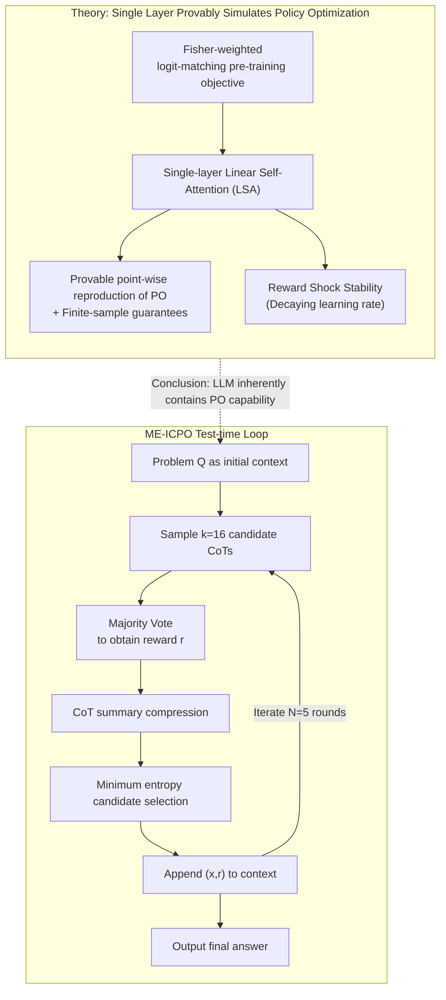

# Provable and Practical In-Context Policy Optimization for Self-Improvement

**Conference**: ICLR 2026  
**arXiv**: [2603.01335](https://arxiv.org/abs/2603.01335)  
**Code**: [https://github.com/UNCSciML/ICPO](https://github.com/UNCSciML/ICPO)  
**Area**: Optimization  
**Keywords**: In-Context Learning, policy optimization, test-time scaling, self-reflection, mathematical reasoning

## TL;DR
This paper proposes the In-Context Policy Optimization (ICPO) framework, theoretically proving that a single-layer Linear Self-Attention Transformer, after sufficient pre-training, can simulate policy optimization algorithms in-context. It designs a practical ME-ICPO algorithm that achieves multi-round self-reflection at test-time through minimum-entropy selection and self-evaluated rewards, yielding significant improvements in mathematical reasoning tasks (e.g., Qwen2.5-Math-7B improved from 11% to 30% on AIME 2024).

## Background & Motivation

**Background**: Test-time scaling has become a crucial paradigm for enhancing the reasoning capabilities of LLMs—models progressively improve answers through multi-round self-reflection during inference without updating parameters. Representative methods include Chain-of-Thought, Tree-of-Thoughts, Best-of-N, and Self-Refine.

**Limitations of Prior Work**: (a) Why does self-reflection capability emerge from pre-training? Existing works (e.g., Park et al. 2024) directly assume LLMs possess posterior sampling/policy optimization capabilities but do not explain the source of this capability; (b) Theoretical analysis of in-context learning mainly focuses on supervised learning (linear regression) and value function learning (TD learning), with no existing theory regarding policy optimization; (c) Existing methods like Tree-of-Thoughts require multi-step searches, incurring high computational overhead.

**Key Challenge**: How can the output policy be optimized in-context using historical attempts and reward feedback? Theoretically, can a Transformer implement such policy optimization without updating parameters?

**Goal**: (1) Provide a theoretical foundation for the self-reflection/self-improvement behavior of LLMs; (2) Design a practical test-time scaling algorithm.

**Key Insight**: Formalizing self-reflection as policy optimization in a K-armed bandit problem—the agent generates an answer (action), receives a reward (reward), and then accumulates history $\{(\mathbf{x}_1, r_1), ..., (\mathbf{x}_t, r_t)\}$ in-context to optimize the next action.

**Core Idea**: The self-attention mechanism of Transformers naturally possesses the inductive bias to simulate FTRL policy optimization. After sufficient pre-training, it can execute policy optimization in-context.

## Method

### Overall Architecture
This paper addresses two questions: why self-reflection capability emerges from pre-training and how to transform this mechanism into a usable test-time algorithm. ICPO formalizes self-reflection as a K-armed bandit: the model generates an answer $\mathbf{x}_t$ for a problem, receives a reward $r_t$ (from self-evaluation or external signals), appends the pair $(\mathbf{x}_t, r_t)$ to the context history, and then generates a better answer $\mathbf{x}_{t+1}$ by reading the increasing history. No parameters are updated throughout the process.

The paper proceeds in two stages: "Provable $\to$ Practical." The theoretical part narrows the analysis to a single-layer Linear Self-Attention (LSA) Transformer, proving it can reproduce a policy optimization algorithm based on FTRL (Follow-The-Regularized-Leader) token-by-token after appropriate pre-training—meaning the forward pass of self-attention is equivalent to running one step of policy optimization in-context. The practical part derives ME-ICPO (Minimum-Entropy ICPO), a pure inference-time multi-round self-reflection loop driven by minimum-entropy selection and self-evaluated rewards. The left half of the diagram below (theoretical chain) explains "why a single layer can do policy optimization," while the right half illustrates the "actual execution" of the ME-ICPO loop.

### Key Designs

**1. Fisher-weighted logit-matching pre-training objective: Turning "learning policy optimization" into a supervised loss**

To enable a Transformer to execute policy optimization in-context, a pre-training signal must be provided. This paper uses a loss that matches the model's predicted logit $\hat{\mathbf{s}}_{\tau,t+1}$ with the target logit $\mathbf{s}_{\tau,t+1}^{\text{PO}}$ provided by an FTRL teacher algorithm:

$$\mathcal{L}(\theta) = \frac{1}{2} \mathbb{E}_{\tau \in \mathcal{D}} \Big[\sum_t \| \text{Proj}(\hat{\mathbf{s}}_{\tau,t+1} - \mathbf{s}_{\tau,t+1}^{\text{PO}}) \|_{\Gamma}^2\Big]$$

Two details are critical: $\Gamma$ uses the Fisher information matrix of the policy for weighting, and $\text{Proj}$ projects out the constant bias (since softmax policies are insensitive to constant shifts in logits). The significance of Fisher-weighting is given by Theorem 4.1—it makes the quadratic loss proportional to the KL divergence between policies. This explains why a standard supervised loss is sufficient to teach a Transformer self-reflection without needing extra reinforcement learning mechanisms.

**2. Single-layer attention is sufficient to reproduce policy optimization: Provability and finite-sample guarantees**

Theorem 4.2 (population equivalence) proves the existence of optimal parameters $\theta^*$ such that the LSA precisely reproduces the output of the target policy optimization algorithm on all possible historical inputs—point-wise equivalence, not just approximation. Theorem 4.3 further provides finite-sample guarantees: the number of trajectories required to reach target accuracy is $\tilde{O}(N^2 K / c_\lambda^2)$ (where $N$ is the number of rounds, $K$ is the number of arms, and $c_\lambda$ is a regularization constant). These together answer how self-reflection emerges: the inductive bias of a single-layer LSA naturally carries policy optimization, unlike prior work (Lin et al. 2023) which required $\tilde{O}(\sqrt{T})$ layers.

**3. Reward Shock Stability: Noisy rewards do not derail the trajectory**

In practice, self-evaluated rewards are noisy. Theorem 4.8 analyzes the sensitivity of the ICPO loop to a single reward perturbation $\delta_r$, proving that if the learning rate $\eta_t = c/t$ decays over time, the impact of the perturbation on the policy decays to zero as rounds progress:

$$\mathbb{E}\big[\|\Delta \hat{\mathbf{p}}_{t+1}^s\|_2\big] \leq \frac{a(1+C_b)}{s} \Big(\frac{t}{s}\Big)^{b-1} |\delta_r|$$

This provides a practical conclusion: driving multi-round self-reflection with noisy self-evaluated rewards is theoretically safe, as individual errors are diluted by subsequent rounds. This justifies using noisy Majority Vote rewards in ME-ICPO.

**4. ME-ICPO: Implementing theoretical principles into a runnable test-time loop**

The theory explains why "reward guidance + decaying learning rate" works. ME-ICPO instantiates this as a pure inference loop (right half of the diagram) without parameter updates, addressing two practical challenges: context growth and unreliable self-evaluation. In each round, the model samples $k=16$ candidate responses (full CoTs); Majority Vote identifies the consensus answer $\hat{a}_t$, and self-evaluated rewards $r_j^{(t)} = \mathbb{1}[a_j^{(t)} = \hat{a}_t]$ are assigned; candidate CoTs are summarized to manage context length; finally, **minimum-entropy selection** is performed—selecting the candidate that minimizes the entropy $H(\widetilde{\mathcal{H}}_j^{(t)})$ of the model's subsequent responses, rather than just picking the highest reward. After $N=5$ iterations, the final answer is output. Minimum-entropy selection corresponds to the "pessimism" principle in offline RL: low entropy implies stable consensus, making it less likely to be misled by reward noise or directed toward random answers.

## Key Experimental Results

### Main Results

| Model | Benchmark | Base Mean@16 | w/ ME-ICPO Mean@16 | Gain |
|------|-----------|-------------|-------------------|------|
| Qwen2.5-Math-7B | AIME 2024 | 11.04 | **30.42** | +19.38 |
| Qwen2.5-Math-7B | AMC | 41.42 | **47.06** | +5.64 |
| Qwen2.5-Math-7B | MATH-L5 | 30.58 | **38.71** | +8.13 |
| Qwen2.5-Math-1.5B | AIME 2024 | 6.46 | **9.79** | +3.31 |
| Qwen2.5-Math-1.5B | MATH-L1 | 49.27 | **57.06** | +12.38 |

The most significant improvement was observed on AIME 2024. The Mean@16 of ME-ICPO can exceed the Maj@k upper bound of the baseline model.

### Ablation Study

| Configuration | AIME 2024 Accuracy (%) |
|------|----------------------|
| w/o Reward | 19.30 |
| w/o Entropy | 5.77 |
| w/o Entropy & Reward | 6.21 |
| **ME-ICPO (full)** | **30.05** |
| ME-ICPO Oracle | 38.19 |

### Key Findings
- **Minimum-entropy selection is the most critical component**: Removing it caused accuracy to plummet from 30.05% to 5.77%, which is worse than doing nothing (6.21%)—indicating that without a proper selection strategy, random context is harmful.
- **Reward signals are also important**: Removing them dropped accuracy from 30.05% to 19.30%.
- **Theoretical Verification**: Policy matching error for LSA converges quickly; the impact of single reward shocks indeed decays over time.
- ME-ICPO's Mean@16 can surpass the baseline's Maj@k upper bound, suggesting that in-context policy optimization learns information beyond simple voting.

## Highlights & Insights
- **Theory-Practice Loop**: Starting from theoretical analysis of LSA, deriving practical design principles (reward guidance + min-entropy selection), and validating them on real LLMs—forming a complete research loop.
- **Insight on Min-Entropy Selection**: Choosing the candidate that makes the model most confident, rather than the one with the highest reward. This is vital when self-evaluated rewards are noisy; high rewards might be accidental, but low entropy signifies stable consensus.
- **Single-Layer Sufficiency**: Unlike prior work requiring $O(\sqrt{T})$ layers, ICPO requires only a single LSA layer and does not require more layers as context length increases—more suitable for the long-context scenarios of actual LLMs.

## Limitations & Future Work
- Theoretical analysis is based on linear self-attention and linear bandit assumptions, which differs significantly from actual LLMs and mathematical reasoning.
- ME-ICPO requires sampling 16 candidates per round; the computational cost of multi-round iteration remains significant.
- Self-evaluated rewards are based on Majority Vote; MV itself may give incorrect signals if the model is systematically wrong.
- Validated only on mathematical tasks; other domains like code generation or logical reasoning are yet to be tested.
- CoT summaries may lose critical reasoning information.

## Related Work & Insights
- **vs Self-Refine/Reflexion**: These works perform self-reflection via natural language feedback but lack theoretical explanation; ICPO provides a foundation from the perspective of policy optimization.
- **vs Tree-of-Thoughts**: ToT searches at each step, while ME-ICPO optimizes the entire CoT per round—coarser-grained but more computationally efficient.
- **vs TTRL**: TTRL performs gradient updates at test-time; ME-ICPO is purely in-context with no parameter updates—making it more lightweight.
- **vs Best-of-N**: BoN selects the single best output; ME-ICPO accumulates contextual information via multi-round iterations to improve progressively.

## Rating
- Novelty: ⭐⭐⭐⭐⭐ First to provide theoretical analysis of LLM self-reflection via policy optimization; min-entropy selection is a novel design.
- Experimental Thoroughness: ⭐⭐⭐⭐ Strong theoretical validation, but LLM experiments are limited to math tasks and the Qwen series.
- Writing Quality: ⭐⭐⭐⭐ Rigorous theoretical derivation, though the transition from theory to practice could be tighter.
- Value: ⭐⭐⭐⭐ Provides a theoretical foundation for test-time scaling; the min-entropy selection strategy has practical utility.

<!-- RELATED:START -->

## Related Papers

- [\[ICLR 2026\] Multi-Action Self-Improvement for Neural Combinatorial Optimization](multi-action_self-improvement_for_neural_combinatorial_optimization.md)
- [\[ICLR 2026\] Toward Principled Flexible Scaling for Self-Gated Neural Activation](toward_principled_flexible_scaling_for_self-gated_neural_activation.md)
- [\[ICML 2025\] Provable In-Context Vector Arithmetic via Retrieving Task Concepts](../../ICML2025/optimization/provable_in-context_vector_arithmetic_via_retrieving_task_concepts.md)
- [\[ICLR 2026\] COLD-Steer: Steering Large Language Models via In-Context One-step Learning Dynamics](cold-steer_steering_large_language_models_via_in-context_one-step_learning_dynam.md)
- [\[ICML 2026\] On the Provable Suboptimality of Momentum SGD in Nonstationary Stochastic Optimization](../../ICML2026/optimization/on_the_provable_suboptimality_of_momentum_sgd_in_nonstationary_stochastic_optimi.md)

<!-- RELATED:END -->
