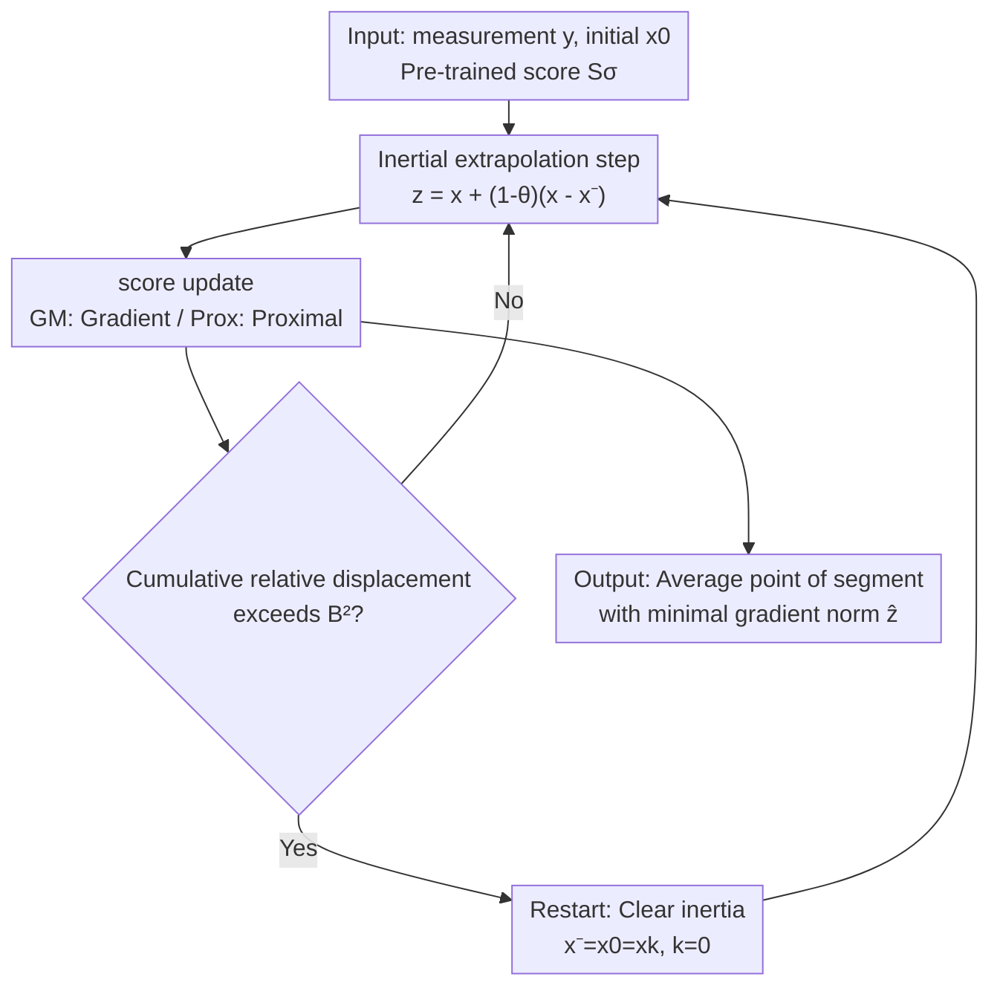

# Provably Accelerated Imaging with Restarted Inertia and Score-based Image Priors

**Conference**: ICLR 2026  
**OpenReview**: [https://openreview.net/forum?id=8pQsiFyTQi](https://openreview.net/forum?id=8pQsiFyTQi)  
**Code**: https://github.com/Hopkins-CIG/RISP  
**Area**: Optimization Algorithms / Imaging Inverse Problems / Diffusion Model Priors  
**Keywords**: Imaging Inverse Problems, RED, Inertial Acceleration, Restart Mechanism, Score-based Priors

## TL;DR
To address the slow convergence of RED-like imaging reconstruction algorithms, this paper proposes RISP, which adds "inertial steps + restart mechanism" to iterations. Without requiring convexity of the prior, it provably improves the convergence rate from $O(n^{-1/2})$ to $O(n^{-4/7})$, achieving up to 24× speedup in large-scale imaging while maintaining reconstruction quality.

## Background & Motivation
**Background**: Imaging inverse problems (deblurring, inpainting, super-resolution, MRI, etc.) are inherently ill-posed and require image priors for regularization. A mainstream approach recently is inserting image denoisers as priors into iterative algorithms, with RED (Regularization by Denoising) being representative. It approximates the gradient of an implicit regularization term using the noise residual $x-D_\sigma(x)$. Via Tweedie's formula, when $D_\sigma$ is an MMSE denoiser, this residual is proportional to the prior's score $S(x)=-(x-D_\sigma(x))/\sigma^2$. Thus, RED naturally integrates pre-trained score networks of diffusion models, yielding strong reconstruction quality.

**Limitations of Prior Work**: RED is essentially an iterative optimization that often requires many iterations to converge, making it unacceptable for real-time processing or large-scale data. While the community has focused on designing more sophisticated denoising priors to improve quality, "convergence acceleration" has rarely been addressed rigorously—acceleration usually relies on heuristic momentum lacking theoretical guarantees.

**Key Challenge**: Learned priors typically make the objective function non-convex, whereas classical acceleration techniques (e.g., Nesterov momentum) are mostly built on convexity assumptions. Applying them directly does not guarantee acceleration and may cause overshooting or divergence from stationary points due to accumulated inertia. While existing works have empirically verified the effectiveness of inertia, they have failed to provide a convergence proof with an "explicit acceleration rate." Worse, existing conclusions suggest that under general Lipschitz gradient conditions, inertia cannot improve worst-case convergence rates.

**Goal**: Construct an algorithm for non-convex score priors that utilizes inertial acceleration with a rigorous proof of being faster than RED, providing continuous-time interpretations.

**Key Insight**: The authors note that recent progress in non-convex optimization relies on the stronger second-order condition of "Hessian Lipschitz continuity" to achieve acceleration, which happens to hold in many imaging problems (satisfied by all linear inverse problems under AWGN). Combined with a "restart" mechanism to clear accumulated inertia and suppress overshooting, an improved acceleration rate can be proven.

**Core Idea**: Replace the pure gradient iterations of RED with "restarted inertia"—normally accelerating via inertia, and restarting (resetting inertia to zero) whenever the accumulated displacement exceeds a threshold, reverting to local gradient updates. This yields provable acceleration without requiring prior convexity.

## Method

### Overall Architecture
RISP (Restarted Inertia with Score-based Priors) is a principled extension of RED. To solve the slow convergence of RED, the general approach is: insert an inertial extrapolation step before each RED iteration to push updates faster, and overlay a restart criterion that resets inertia to zero when relative displacement exceeds a threshold, preventing overshooting in non-convex landscapes. After the iterations, the algorithm returns the average point of the segment with the smallest gradient norm.

RISP provides two instances: **RISP-GM** (Gradient Method, following the $\nabla f$ form of RED-GM) and **RISP-Prox** (Proximal Method, using $\mathrm{prox}_{\eta f}$ for the data fidelity term). Both share the same "Inertia + Restart" skeleton, differing only in how they handle the data fidelity term $f$.

### Key Designs

**1. Inertial Extrapolation Step: Accelerating Slow Iterations with Momentum**

RISP targets the slow convergence of pure gradient iterations in RED. It performs an inertial extrapolation before each score update: $z_k = x_k + (1-\theta)(x_k - x_{k-1})$, where $\theta\in(0,1]$ controls inertial strength, then updates at the extrapolation point $z_k$. The update for RISP-GM is $x_{k+1} = z_k - \eta(\nabla f(z_k) - S(z_k))$, and for RISP-Prox is $x_{k+1} = \mathrm{prox}_{\eta f}(z_k + \eta S(z_k))$. When $\theta=1$, the inertial term disappears and RISP reduces to standard RED, making RISP a strict superset of RED. Compared to original RED, this implementation is cleaner: RISP directly uses the pre-trained score $S$ as the negative gradient of the regularizer, avoiding the weight matching associated with $\tau(x-D_\sigma(x))$ in RED.

**2. Restart Mechanism: Suppressing Non-convex Overshooting**

Adding inertia alone in non-convex landscapes can cause iterations to overshoot or move away from stationary points, which is why prior works lacked acceleration proofs. The critical patch in RISP is a restart criterion: a restart is triggered when the cumulative relative displacement since the last restart exceeds a threshold:
$$\text{if}\quad k\sum_{t=0}^{k-1}\|x_{t+1}-x_t\|^2 > B^2,\quad\text{then}\quad x_{-1}=x_0=x_k,\ k=0$$
where $B>0$ is a user-defined constant. Upon triggering, inertia is cleared, and the algorithm reverts to updates relying on local gradients, thereby suppressing overshooting and pulling iterations back toward stationary points. Intuitively, restarting acts as a periodic brake for a "heavy ball rolling down a hill."

**3. Provable Accelerated Convergence Rate: From $O(n^{-1/2})$ to $O(n^{-4/7})$**

This is the theoretical core. The authors first provide the RED-GM baseline: under the assumptions that the score is a gradient field (Assumption 1) and that $\nabla f$ and $S$ are Lipschitz continuous (Assumption 2), taking $\eta=1/L$ yields $\|\nabla F(\hat x)\|\le A_0/\sqrt{n}=O(n^{-1/2})$ after $n$ steps. By introducing the "Hessian Lipschitz continuity" second-order condition (Assumption 3, satisfied by linear inverse problems under AWGN), it is proven that RISP-GM achieves:
$$\| \nabla F(\hat z) \| \le 82\varepsilon = O(n^{-4/7}), \quad \varepsilon = 2^{4/7}\Delta_F^{4/7}L^{2/7}\rho^{1/7}n^{-4/7}+L^2\rho^{-1}n^{-4}$$
For RISP-Prox (requiring Assumption 4: $f$ is convex, $g$ is weakly convex), using carefully set parameters $\eta=1/(8L)$, $B=\sqrt{\varepsilon/(4\rho)}$, $\theta=4(\varepsilon\rho\eta^2)^{1/4}$, and $K=\theta^{-1}$ also yields the $O(n^{-4/7})$ rate. Crucially, the analysis **does not require the score prior to be convex**, accommodating priors parameterized by deep neural networks.

**4. Bridge to Continuous Time and Heavy-ball ODE**

For a fundamental explanation, the authors derive the continuous-time limit of RISP. Under Assumption 1, the inertial part is characterized by a second-order heavy-ball ODE:
$$\ddot x_t + \alpha \dot x_t + \nabla F(x_t) = 0, \quad \alpha := \lim_{\eta\to 0}\theta(\eta)/\sqrt{\eta}$$
The solution can be viewed as a heavy ball rolling on the $F$ landscape subject to friction $\alpha$. Since pure heavy-ball ODEs lack restarts, the authors introduce "Continuous RISP" (Algorithm 3): the system evolves via heavy-ball dynamics until the restart criterion is met, at which point the velocity term $\dot x$ is zeroed. This continuous system unifies the two discrete instances—RISP-GM is its Euler discretization, and RISP-Prox is a forward-backward discretization. The continuous version also proves an $O(T^{-4/7})$ rate (Theorem 3).

## Key Experimental Results

Experiments focus on three goals: verifying theory on linear inverse problems, testing robustness on non-linear problems, and demonstrating efficiency in large-scale imaging. The score prior uses $g_\sigma(x)=\sigma^{-2}/2\,\|x-N_\sigma(x)\|^2$, where $N_\sigma$ is DRUNet.

### Main Results

| Task | Setting | Key Results |
|------|------|----------|
| Deblurring (Linear) | Grad Norm vs. Iterations | RISP drops grad norm by 5 orders in 200 steps; RED only 3. |
| MRI (Linear) | PSNR vs. Iterations | RISP reaches same PSNR ~5× faster than RED. |
| Rician Denoising (Non-linear) | PSNR vs. Runtime | RISP-Prox reaches 31.55 dB in 160 ms; RED-GM takes ~10× time to catch up. |
| Inverse Scattering (1024×1024) | PSNR vs. Runtime | RISP restores details in 20 min; RED remains blurry after 480 min. |

In the inverse scattering task (ratio ~8.2%, highly ill-posed), RISP-GM reaches 28.54 dB in 20 min, while RED-GM reaches only 25.81 dB in 480 min.

### Ablation Study

| Configuration | Observation | Explanation |
|------|------|------|
| RISP (with Restart) | Stable and fast convergence | Synergy between inertia and restart. |
| Inertia only / θ=1 | Degenerates to RED | Loss of acceleration. |
| θ = 0.2 | Robust to this choice | Restart mechanism enhances stability and reduces sensitivity. |
| Large vs. Small Scale | More significant speedup (≥24×) | When per-step cost is high, reducing iterations produces larger gains. |

### Key Findings
- **Restart is essential for provable acceleration**: Without it, inertial accumulation leads to overshooting, precluding an acceleration proof. With it, $O(n^{-4/7})$ is achievable even under non-convex score priors.
- **Acceleration without quality loss**: PSNR curves show RISP reaches RED-level quality with fewer iterations; images are clean with well-kept edges.
- **Speedup scales with problem size**: In large-scale inverse scattering, speedup is at least 24×, attributed to the higher runtime benefit of reducing iterations when per-step costs are significant.
- **Robustness beyond ideal settings**: For Rician denoising where data fidelity is non-convex (violating Assumption 4), RISP-Prox still converges.

## Highlights & Insights
- **Inertia + Restart Combo**: Adding inertia alone in non-convex settings fails theoretical proofs; restart alone lacks momentum. Combining them is both fast and stable, extending "provable acceleration" from the convex world to the non-convex score prior landscape.
- **Clean Score-as-Gradient Interface**: RISP uses the pre-trained score directly as the negative gradient, simplifying both theory and implementation while remaining compatible with diffusion score networks.
- **Unified Discrete-Continuous View**: A heavy-ball ODE with restarts explains both GM and Prox instances, providing a template for designing other discrete accelerators.
- **Trading Second-order Conditions for Acceleration**: While inertia cannot improve rates under general Lipschitz gradients, many imaging problems satisfy Hessian Lipschitz conditions. Utilizing this "domain-specific second-order smoothness" provides the leverage for acceleration.

## Limitations & Future Work
- **Reliance on Lipschitz Regularity**: Acceleration guarantees rely on Lipschitz Gradient/Hessian conditions, excluding some problems (e.g., Poisson denoising).
- **New Hyperparameters**: Inertial weight $\theta$ and restart threshold $B$ need tuning, though experiments show robustness across a range of values.
- **Score Prior Structure**: Requires gradient-step denoisers + Lipschitz activations to ensure $S$ is a gradient field and Hessian Lipschitz, limiting the types of denoisers.
- **Extensions**: The framework may be generalized to PnP (Plug-and-Play) and the continuous RISP could inspire more discrete acceleration templates.

## Related Work & Insights
- **vs. RED / PnP**: Both use denoisers/scores as priors for MAP estimation, but this work focuses on the neglected "convergence acceleration" dimension, providing explicit rates rather than heuristic momentum.
- **vs. Existing Inertial RED/PnP**: Prior works verified inertia empirically but lacked convergence proofs with explicit rates. This work fills that gap using restarts and Hessian Lipschitz conditions.
- **vs. Diffusion Solvers (DPS, etc.)**: Diffusion solvers sample from the posterior $p(x|y)$, while this work performs MAP optimization. Both share Tweedie's formula, meaning diffusion scores can be directly used in RISP.
- **vs. Convex Acceleration (Nesterov)**: Classical acceleration requires convexity; RISP achieves acceleration under non-convex score priors via "restart + second-order smoothness."

## Rating
- Novelty: ⭐⭐⭐⭐⭐ Extends provable acceleration to non-convex score priors; the inertia+restart combo is elegant.
- Experimental Thoroughness: ⭐⭐⭐⭐ Covers linear/non-linear/large-scale tasks aligned with theory; however, horizontal baselines beyond the RED family are slightly limited.
- Writing Quality: ⭐⭐⭐⭐⭐ Theory and intuition (heavy-ball + braking) are clear; unified discrete-continuous perspective.
- Value: ⭐⭐⭐⭐⭐ 24× speedup for large-scale imaging without quality loss; combines theory with practicality.

<!-- RELATED:START -->

## Related Papers

- [\[ICLR 2026\] Landing with the Score: Riemannian Optimization through Denoising](landing_with_the_score_riemannian_optimization_through_denoising.md)
- [\[ICLR 2026\] Egalitarian Gradient Descent: A Simple Approach to Accelerated Grokking](egalitarian_gradient_descent_a_simple_approach_to_accelerated_grokking.md)
- [\[ICLR 2026\] Incorporating Expert Priors into Bayesian Optimization via Dynamic Mean Decay](incorporating_expert_priors_into_bayesian_optimization_via_dynamic_mean_decay.md)
- [\[CVPR 2026\] Semi-Supervised Conformal Prediction With Unlabeled Nonconformity Score](../../CVPR2026/optimization/semi-supervised_conformal_prediction_with_unlabeled_nonconformity_score.md)
- [\[CVPR 2026\] DABO: Difficulty-Aware Bayesian Optimization with Diffusion-Learned Priors](../../CVPR2026/optimization/dabo_difficulty-aware_bayesian_optimization_with_diffusion-learned_priors.md)

<!-- RELATED:END -->
