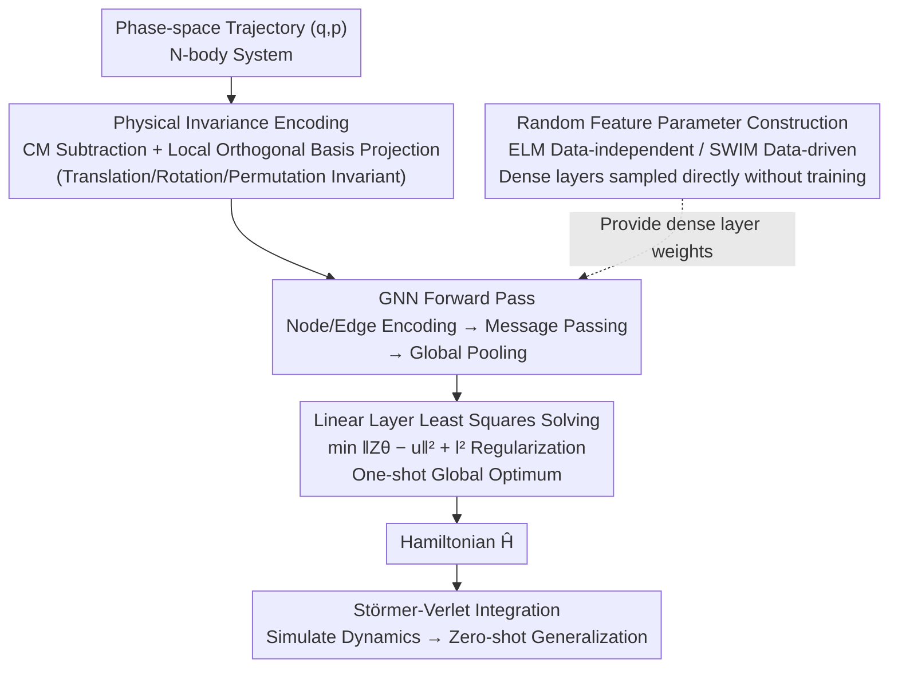

# Rapid Training of Hamiltonian Graph Networks using Random Features

**Conference**: ICLR 2026  
**arXiv**: [2506.06558](https://arxiv.org/abs/2506.06558)  
**Code**: [GitLab](https://gitlab.com/fd-research/swimhgn)  
**Area**: Physical Simulation / Graph Neural Networks  
**Keywords**: Hamiltonian Graph Networks, Random Features, N-body Simulation, Zero-shot Generalization, Gradient-free Training

## TL;DR

This paper proposes RF-HGN, which constructs dense layer parameters through random feature sampling (ELM/SWIM) and solves a linear least squares problem to train Hamiltonian Graph Networks. This approach completely bypasses gradient descent iterative optimization, achieving a 150-600x speedup on N-body physical systems while maintaining comparable accuracy and strong zero-shot generalization.

## Background & Motivation

**Background**: Data-driven modeling of physical systems is a core challenge. Combining physical priors (such as Hamiltonian mechanics) with Graph Neural Networks (GNNs) is the current mainstream paradigm. Hamiltonian Graph Networks (HGNs) encode the topological relationships of N-body systems through graph structures. Coupled with Hamiltonian equation constraints, they can generate precise, permutation-invariant dynamical predictions.

**Limitations of Prior Work**: Training graph networks is extremely slow. Backpropagation in GNNs involves irregular memory access and load imbalance, and physical models are sensitive to hyperparameters. When the model architecture includes numerical integrators (such as Störmer-Verlet), training difficulty is further exacerbated. 15 common optimizers (Adam, LBFGS, etc.) require 23-96 seconds for training on a 3D lattice system, which fails to meet the requirements for rapid prototyping of large-scale systems.

**Key Challenge**: Although the physical inductive biases of GNNs (graph structure + Hamiltonian constraints) improve model quality, these structural constraints make gradient-based iterative optimization more difficult and time-consuming. A fundamental tension exists between accuracy and training efficiency.

**Goal**: (1) How to significantly accelerate HGN training without sacrificing accuracy? (2) How to incorporate random feature methods into graph networks while maintaining physical invariance? (3) Can the trained model generalize zero-shot to systems far exceeding the training scale?

**Key Insight**: Random feature methods have shown potential in approximating physical systems recently but have not yet been applied to graph networks. The core observation is that the HGN architecture can be divided into two parts: nonlinear dense layers and a linear output layer. If the dense layer parameters can be determined through random sampling, training simplifies to a convex linear least squares problem.

**Core Idea**: Use random feature sampling to construct dense layer parameters for HGNs, transforming non-convex network training into solving a convex linear system to achieve ultra-fast training without gradient descent.

## Method

### Overall Architecture

The RF-HGN pipeline consists of three stages: (1) **Invariance Encoding**: converting position and momentum of N-body systems into translation- and rotation-invariant coordinate representations; (2) **GNN Forward Pass**: obtaining graph-level representations through node/edge encoding, message passing, and global pooling; (3) **Random Feature Training**: dense layer parameters are determined by random sampling (ELM or SWIM), and the linear output layer is solved via the least squares method. The input is the phase-space trajectory $(q, p) \in \mathbb{R}^{2d \cdot N}$, and the output is the scalar Hamiltonian $\hat{\mathcal{H}}$. During inference, dynamics are simulated via a Störmer-Verlet integrator. The key is splitting the graph network into "nonlinear dense layers + linear output layer": the former skips training via random sampling, and the latter collapses into a convex linear solve, freeing the entire training chain from gradient descent.

### Key Designs

**1. Physical Invariance Encoding: Normalizing coordinates to translation/rotation/permutation invariance to avoid redundant symmetry learning.**

The energy of a physical system should not change because an observer changes the frame of reference. However, raw coordinates $(q,p)$ are packed with such redundant degrees of freedom, forcing the network to waste capacity learning symmetries and increasing data requirements. RF-HGN eliminates these at the input: translation invariance is achieved by center-of-mass subtraction $q_i \leftarrow q_i - \frac{1}{N}\sum_{i=1}^{N}q_i$; rotation invariance is achieved by constructing a local orthogonal basis—selecting the node closest to the center of mass to define the first basis vector $e_1 = q_1/\|q_1\|$, then completing the orthogonal matrix $\mathcal{B}$ via rotation (2D) or Gram-Schmidt orthogonalization (higher dimensions), and projecting all coordinates into this local system $\bar{q}_i = \mathcal{B}^T q_i$. Permutation invariance requires no additional processing, as the graph structure combined with the summation aggregation of message passing is inherently invariant. Thus, the network sees normalized invariant representations, requiring less learning and less data.

**2. Random Feature Parameter Construction (ELM and SWIM): Direct sampling of dense layer weights to bypass non-convex training.**

This is the core mechanism of the paper. All dense layers of HGN (node encoder $\phi_V$, edge encoder $\phi_E$, message constructor $\phi_M$) would originally rely on gradient descent for fitting, which is the source of slowness and instability. RF-HGN simply does not train them, but samples weights and biases directly. There are two sampling methods: **ELM** (data-independent) is the simplest, with weights $W$ sampled from a standard normal distribution and biases $b$ from a uniform distribution, ignoring the data; **SWIM** (data-driven) is more intelligent, randomly taking two points $(x^{(1)}, x^{(2)})$ from the input data and constructing parameters according to:

$$w_i = s_1(x^{(2)}_i - x^{(1)}_i)\|x^{(2)}_i - x^{(1)}_i\|^{-2}, \quad b_i = -\langle w_i, x^{(1)}_i \rangle - s_2$$

where $(s_1, s_2)$ are constants related to the activation function. This construction "locks" each hyperplane exactly at the position needing distinction between two data points, effectively encoding the prior of the data distribution into the random process. Consequently, experiment results show SWIM generally outperforms ELM by one to two orders of magnitude. Regardless of the sampling method, once the dense layer parameters are fixed, the entire non-convex optimization problem collapses into a linear system, and the troubles of vanishing/exploding gradients and local optima disappear.

**3. Linear Layer Least Squares Solving: The only "trained" output layer is a convex problem, solved for the global optimum in one shot.**

Since the dense layers are fixed by sampling, only the linear output layer in the network needs optimization, which happens to be convex. RF-HGN formulates this as a linear system $Z \cdot \theta_L = u$: $Z$ is composed of the gradient of the global pooling layer output $\nabla\Phi(y)$ and Hamiltonian equation constraints, while $u$ carries time derivative information $J^{-1}\dot{y}$. Finally, least squares with $l^2$ regularization is used to solve for $\theta_L$ in one shot, ensuring a global optimum without iterations. Its time complexity is only $\mathcal{O}(K d_L^2)$, and it is linear with respect to the number of data points $M$, particle count $N$, and spatial dimension $d$—the training cost grows linearly with system scale, which is key to its ability to train large systems.

### Loss & Training

The training objective is to minimize the $l^2$ norm of the Hamiltonian equation residual: $\min_{\theta_L}\|Z\theta_L - u\|^2$. The training data consists of phase-space trajectories and their time derivatives (or pure time-series data). Only one known ground-truth Hamiltonian value $\mathcal{H}(y_0)$ is needed to fix the integration constant. The training process requires no hyperparameter tuning (learning rate, number of epochs, etc.), with only two parameters: dense layer width and the regularization constant.

## Key Experimental Results

### Main Results: Optimizer Comparison

| Optimizer | Test MSE | Training Time (s) | Gain |
|-----------|----------|-------------------|------|
| **RF-HGN (SWIM)** | **8.95e-5** | **0.16** | **—** |
| LBFGS | 3.56e-5 | 23.85 | 149× |
| Adam | 2.90e-3 | 91.64 | 572× |
| AdamW | 2.91e-3 | 92.15 | 576× |
| Adafactor | 2.41e-3 | 96.36 | 602× |
| SGD | 2.36e-2 | 91.75 | 573× |

RF-HGN is 148-602x faster than 15 PyTorch optimizers on 3D lattice systems, with accuracy only slightly lower than the second-order optimizer LBFGS.

### Ablation Study

| Setting | Position MSE (Final) | Description |
|---------|---------------------|-------------|
| SWIM RF-HGN, Train 3×3, Test 100×100 | Low Error | Successful Zero-shot Generalization |
| ELM RF-HGN, Train 3×3, Test 100×100 | Medium Error | SWIM outperforms ELM by approx. one order of magnitude |
| Train 2×2, Test 100×100 | High Error | Edge case for 2×2 system, lacks degree-4 nodes |
| RF-HNN (Non-graph), Train 8, Test 8 | Higher Error | Graph architecture is 1-2 orders of magnitude more accurate |

| Potential Function | Adam HGN | ELM RF-HGN | SWIM RF-HGN |
|--------------------|----------|------------|-------------|
| Spring $V(r)=\frac{1}{2}\beta r^2$ | 3.88e-3 | 2.33e-3 | **3.41e-5** |
| Anharmonic Oscillator | 4.56e-2 | 4.32e-2 | **5.23e-4** |
| Morse Potential | 8.89e-2 | **7.40e-4** | 1.22e-3 |

### Key Findings

- **SWIM significantly outperforms ELM**: SWIM uses data distribution information to place hyperplanes, achieving one to two orders of magnitude higher accuracy in almost all experiments.
- **Strong Zero-shot Generalization**: Training on only $2^3=8$ nodes can accurately predict the dynamics of a $2^{12}=4096$ node system; 3×3 lattice training generalizes to 100×100.
- **Comparison with NeurIPS 2022 benchmark**: RF-HGN training time is only 2-5 seconds, while other physical GNNs (FGNN, LGN, etc.) require 400-53,000 seconds.
- **Applicability to Complex Potentials**: Non-linear force fields such as anharmonic oscillators and Morse potentials can be reasonably approximated by RF-HGN, still maintaining 200-300x acceleration.

## Highlights & Insights

- **Gradient-free Training Paradigm Shift**: Transforming neural network training from non-convex iterative optimization to convex linear solving is a fundamental shift in thinking. For structured physical models, this method may be superior to traditional deep learning training because physical constraints already restrict the solution space.
- **Cleverness of SWIM Data-driven Sampling**: SWIM is not blind sampling; it constructs hyperplane parameters from data pairs so that the activation function's "switching region" precisely aligns with the data's gradient change. This strategy encodes prior knowledge (data distribution) into the random process.
- **Practical Value of Zero-shot Generalization**: Training on small systems and deploying on large systems is extremely valuable in molecular dynamics simulations, as generating training data for large systems is itself very expensive.

## Limitations & Future Work

- **Restricted Graph Types**: Models trained on chain graphs cannot generalize to lattice graphs (different edge degrees); zero-shot generalization is limited to the same type of graph structure.
- **Average Performance in Dynamic Edge Scenarios**: In molecular dynamics using dynamic edges defined by cutoff distances, relative error is about 10%, which is consistent across all optimizers.
- **Lack of Multi-layer Message Passing Support**: Currently uses only single-layer message passing; future work needs to explore random feature boosting to support deeper architectures.
- **Suboptimal for Small Graphs**: For very small systems, fully connected HNN architectures train faster, and the overhead of graph structures becomes a burden.

## Related Work & Insights

- **vs Adam-trained HGN**: RF-HGN trains 100-600x faster, with comparable accuracy on spring systems and slight losses on complex potentials but still within reasonable ranges.
- **vs RF-HNN (Rahma et al., 2024)**: RF-HNN is only suitable for small systems and lacks graph structure. RF-HGN extends this to graph architectures to gain permutation invariance and zero-shot generalization, with accuracy 1-2 orders of magnitude higher.
- **vs Echo State Graph Networks**: Similar random weight concepts, but RF-HGN is specifically designed for physical systems, integrating Hamiltonian constraints and physical invariance.

## Rating

- Novelty: ⭐⭐⭐⭐ First introduction of random feature methods into physics-informed graph networks; the paradigm shift is meaningful.
- Experimental Thoroughness: ⭐⭐⭐⭐⭐ Comparison of 15 optimizers, multiple potential functions, zero-shot generalization, and NeurIPS benchmark reproduction; very comprehensive.
- Writing Quality: ⭐⭐⭐⭐ Clear structure, complete theoretical derivation, high-quality charts.
- Value: ⭐⭐⭐⭐ Extremely valuable to the physical simulation community, though limited by specific types of graph network architectures.

<!-- RELATED:START -->

## Related Papers

- [\[ICLR 2026\] LDT: Layer-Decomposition Training Makes Networks More Generalizable](ldt_layer-decomposition_training_makes_networks_more_generalizable.md)
- [\[ICLR 2026\] HOTA: Hamiltonian Framework for Optimal Transport Advection](hota_hamiltonian_framework_for_optimal_transport_advection.md)
- [\[NeurIPS 2025\] Training Robust Graph Neural Networks by Modeling Noise Dependencies](../../NeurIPS2025/optimization/training_robust_graph_neural_networks_by_modeling_noise_dependencies.md)
- [\[ICLR 2026\] Jacobian Aligned Random Forests](jacobian_aligned_random_forests.md)
- [\[ICLR 2026\] Difference Predictive Coding for Training Spiking Neural Networks](difference_predictive_coding_for_training_spiking_neural_networks.md)

<!-- RELATED:END -->
