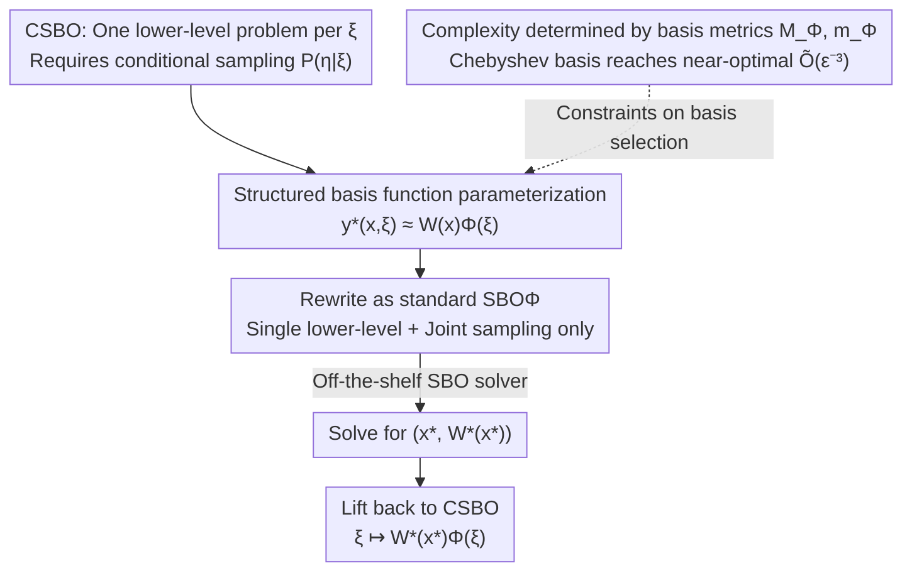

# Reducing Contextual Stochastic Bilevel Optimization via Structured Function Approximation

**Conference**: ICLR 2026  
**OpenReview**: [https://openreview.net/forum?id=3qzgB7QIDl](https://openreview.net/forum?id=3qzgB7QIDl)  
**Code**: https://github.com/mbscry/CSBO-reduction  
**Area**: Optimization Theory / Bilevel Optimization  
**Keywords**: Contextual Stochastic Bilevel Optimization, Bilevel Optimization, Function Approximation, Chebyshev Polynomials, Sample Complexity

## TL;DR
This paper parameterizes the context-dependent lower-level solution $y^\star(x,\xi)$ as $W(x)\Phi(\xi)$ using a set of sufficiently expressive basis functions. This reduces the challenging Contextual Stochastic Bilevel Optimization (CSBO) problem to a standard Stochastic Bilevel Optimization (SBO) problem, eliminating the reliance on conditional sampling oracles and improving the sample complexity of CSBO from $\tilde O(\epsilon^{-4})$ to a near-optimal $\tilde O(\epsilon^{-3})$, matching SBO.

## Background & Motivation
**Background**: Many real-world optimization tasks exhibit a bilevel structure where upper-level decisions $x$ depend on lower-level optimal solutions, which in turn vary with upper-level uncertainty. Formalizing this "context-dependent lower-level problem" structure leads to Contextual Stochastic Bilevel Optimization (CSBO):

$$\min_{x}\ F(x)\triangleq\mathbb{E}_{(\xi,\eta)\sim P_{(\xi,\eta)}}\big[f(x,\,y^\star(x,\xi),\,\xi,\eta)\big]\quad\text{s.t.}\quad y^\star(x,\xi)=\arg\min_{y}\ \mathbb{E}_{\eta\sim P_{\eta|\xi}}\big[g(x,y,\xi,\eta)\big].$$

Here, the upper-level function $f$ can be non-convex in $x$, while the lower-level function $g$ must be $\mu$-strongly convex in $y$ to ensure a unique $y^\star(x,\xi)$. This framework covers meta-learning, personalized federated learning, inverse optimization, RLHF, and robust optimization with side information.

**Limitations of Prior Work**: CSBO is famously difficult because each sampled context $\xi$ corresponds to an **independent** lower-level problem. Naively applying SBO algorithms requires solving $\Theta(\epsilon^{-2})$ lower-level problems for different $\xi$ at each iteration point $x_t$ to estimate the hypergradient $\nabla F(x_t)$, causing the sample complexity to inflate from the $\tilde O(\epsilon^{-4})$ of SBO to $\tilde O(\epsilon^{-6})$ (or $\tilde O(\epsilon^{-5})$ with variance reduction). Hu et al. (2023b) reduced it to $\tilde O(\epsilon^{-4})$ using multilevel Monte Carlo, but this requires the existence and knowledge of a reference point $y_0(x)$ close to $y^\star(x,\xi)$ for all $\xi$, which often fails in practice.

**Key Challenge**: Beyond sample inefficiency, all existing CSBO methods share a more subtle flaw—they require sampling from the conditional distribution $P_{\eta|\xi}$ (the distribution of $\eta$ given $\xi$). In scenarios like inverse optimization or federated learning, samples from the joint distribution $P_{(\xi,\eta)}$ are easily obtained, but data is often offline or privacy-constrained, making **conditional sampling impossible**. Thus, a gap exists between CSBO and SBO in terms of both complexity and usability.

**Goal**: Is it possible to achieve a complexity of $\tilde O(\epsilon^{-3})$ for CSBO, matching SBO, using only i.i.d. samples from the joint distribution $P_{(\xi,\eta)}$?

**Key Insight**: All difficulties in CSBO stem from the coupling of $x$ and $\xi$ through $y^\star(x,\xi)$. The authors observe that if the solution can be explicitly parameterized using **context-independent coefficients + fixed context-dependent basis functions**, the coupling is "unpacked." The lower-level solution then only depends on $x$, while the dependence on $\xi$ is absorbed into the deterministic basis.

**Core Idea**: Rewrite the lower-level solution as $y^\star(x,\xi)\approx W(x)\Phi(\xi)$ (linear coefficients $\times$ non-linear basis). This step transforms CSBO into a standard SBO with a **single lower-level problem**, which can be solved with any off-the-shelf SBO solver. The paper proves this reduction preserves hypergradient accuracy and characterizes near-optimal sample complexity through simple metrics of the basis.

## Method

### Overall Architecture
The method is a three-stage "reduction-solving-lifting" pipeline, with the core being the migration of the dependence on context $\xi$ from optimization variables to a set of pre-selected basis functions. Specifically, the lower-level solution is parameterized via a feature mapping $\Phi[N]:\Xi\to\mathbb{R}^N$:

$$y_{\Phi[N]}(W(x),\xi)\triangleq W(x)\,\Phi[N](\xi),\qquad W(x)\in\mathbb{R}^{d_y\times N},$$

where $W(x)$ is a **context-independent** coefficient matrix and $\Phi[N]$ captures non-linear dependencies on $\xi$. Substituting this into the original problem yields a rewritten SBO (denoted as $\text{SBO}_{\Phi[N]}$): the upper-level remains $\min_x \mathbb{E}_{(\xi,\eta)}[f_\Phi(x,W^\star(x),\xi,\eta)]$, while the lower-level becomes $W^\star(x)=\arg\min_W \mathbb{E}_{(\xi,\eta)}[g_\Phi(x,W,\xi,\eta)]$. Two points are critical: the lower-level optimal $W^\star(x)$ now **depends only on $x$** (a single lower-level problem), and because $y_\Phi$ is linear in $W$, the lower-level objective remains strongly convex in $W$ (provided the basis is not ill-conditioned). Furthermore, the expectations for both levels are now taken over the **joint distribution** $P_{(\xi,\eta)}$, completely eliminating the need for conditional sampling. Any existing SBO algorithm can then solve for $(x^\star,W^\star(x^\star))$, and the solution is "lifted" back to CSBO via $\xi\mapsto y_{\Phi}(W^\star(x^\star),\xi)$.

### Key Designs

**1. Structured basis function parameterization: Moving context dependence from variable to fixed basis**

The difficulty of CSBO lies in $x$ and $\xi$ being entangled via $y^\star(x,\xi)$, resulting in "one lower-level problem per $\xi$." This design severs this entanglement: let $y^\star(x,\xi)\approx W(x)\Phi[N](\xi)$, pushing all non-linear dependence on context into the **pre-selected, optimization-independent** basis $\Phi[N]$, leaving only the context-independent coefficient matrix $W(x)$ as the optimization target. This merges infinitely many (continuous $\xi$) or $m$ (discrete $\xi$) lower-level problems into a **single lower-level problem for $W$**. Since $g_\Phi(x,W,\xi,\eta)=g(x,W\Phi(\xi),\xi,\eta)$ takes expectations over the joint distribution $P_{(\xi,\eta)}$, conditional sampling of $P_{\eta|\xi}$ is no longer required. Strong convexity is preserved because $y_\Phi$ is linear in $W$, ensuring the reduction satisfies the structural assumptions of standard SBO solvers. This contrasts with "approximating the lower-level with neural networks": while NNs are expressive, their non-linearity and over-parameterization make error bounds loose and uninterpretable, whereas regional linear coefficients $\times$ classical bases preserve structure and yield explicit bounds.

**2. Reduction fidelity: Solving the rewritten SBO equals solving the original CSBO**

Parameterization is a means to an end; it must be proven that "the lifted solution from $\text{SBO}_\Phi$ is a qualified CSBO solution." The authors first bound the hypergradient error (Proposition 4.1):

$$\big\|\nabla F(x)-\nabla F_{\Phi_\epsilon}(x)\big\|\le K\cdot\mathbb{E}_\xi\big\|y_{\Phi_\epsilon}(W^\star(x),\xi)-y^\star(x,\xi)\big\|,$$

meaning if the parameterized solution approximates the true solution in expectation, the hypergradient of the rewritten objective $F_\Phi$ approximates the true hypergradient. The potential difficulty of $W^\star(x)$ being implicitly defined is resolved using strong convexity and optimality to relate the "error at $W^\star$" to "error at any $W$" (Proposition 4.2). When the basis satisfies **expresivity** (Definition 3.4, i.e., there exists $W^\dagger$ such that the error is small), Theorem 4.3 concludes: **If $(x^\star,W^\star(x^\star))$ is an $\tfrac{\epsilon}{\sqrt2}$-stationary solution of $\text{SBO}_\Phi$, then the lifted $(x^\star,\xi\mapsto y_\Phi(W^\star,\xi))$ is an $\epsilon$-stationary solution of CSBO.** This allows any off-the-shelf SBO solver to be "plugged and played."

**3. Characterizing sample complexity via two simple basis metrics**

Expressivity alone does not guarantee efficiency, as the basis dimension $N_\Phi(\epsilon)$ might be huge. The authors define two finer metrics:

$$M_\Phi(\epsilon)=\max\Big(1,\ \sup_{\xi\in\Xi}\|\Phi_\epsilon(\xi)\|\Big),\qquad m_\Phi(\epsilon)=\min\big(1,\ \lambda_{\min}(\Sigma_{\Phi_\epsilon})\big),$$

where $\Sigma_{\Phi_\epsilon}=\mathbb{E}_\xi[\Phi_\epsilon(\xi)\Phi_\epsilon(\xi)^\top]$ is the feature covariance. $M_\Phi$ bounds the maximum magnitude, and $m_\Phi$ captures the non-degeneracy of the features via the minimum eigenvalue. $m_\Phi>0$ **if and only if** the rewritten lower-level remains strongly convex. Incorporating these into standard SBO constants yields Theorem 4.4:

$$\text{Sample Complexity}=\tilde O\Big(\epsilon^{-3}\cdot \text{poly}\big(M_\Phi(\epsilon),\ 1/m_\Phi(\epsilon)\big)\Big).$$

Intuitively, as long as the magnitude $M_\Phi$ grows slowly and the condition number $1/m_\Phi$ degrades slowly, the complexity is controlled. **Any expressive basis satisfying $M_\Phi(\epsilon)=\tilde O(1)$ and $1/m_\Phi(\epsilon)=\tilde O(1)$ yields a near-optimal $\tilde O(\epsilon^{-3})$.**

**4. Chebyshev Polynomials: A concrete basis achieving near-optimal complexity**

The authors address the validity of these conditions with a counterexample: monomial bases $(1,\xi,\xi^2,\dots)$ grow slowly in $N_\Phi$ but have a Hilbert matrix covariance, leading to exponential degradation of $m_\Phi$ and ill-conditioning as $\epsilon \to 0$. In contrast, Chebyshev polynomials are naturally bounded ($M_\Phi \le \sqrt{N_\Phi}$) and well-conditioned ($1/m_\text{Chebyshev}(\epsilon)=O(N_\text{Chebyshev}(\epsilon))$). Theorem 4.5 provides sufficient conditions—(c.1) $P_\xi$ density has a positive lower bound or $\Xi$ is finite, (c.2) $\Xi$ is bounded, (c.3) $G(x,y,\xi)=\mathbb{E}_{\eta|\xi}[g]$ is analytic in $(y, \xi)$. Under these, the Chebyshev basis satisfies the metrics. Utilizing the **exponential convergence** of Chebyshev series for analytic functions, Corollary 4.6 gives the final result: Solving the reduced $\text{SBO}_\Phi$ with Chebyshev basis requires $\tilde O(\epsilon^{-3})$ samples, **an order of magnitude faster than existing CSBO methods and matching the lower bound for non-convex stochastic optimization (up to log factors).**

## Key Experimental Results

### Main Results: Sample complexity and oracle comparison
The core of the paper is theoretical. Table 1 compares the requirements and complexity of various methods:

| Method | Sampling Oracle | CSBO Sample Complexity | Scope |
|------|------------|----------------|----------|
| Guo et al. (2021) | Conditional $P_{\eta\|\xi}$ | $O(m\epsilon^{-3})$ | Finite $\Xi$ only (cardinality $m$) |
| Hu et al. (2023b) | Conditional $P_{\eta\|\xi}$ | $\tilde O(\epsilon^{-4})$ | Needs reference point $y_0(x)$ |
| **Ours** | **Joint $P_{(\xi,\eta)}$ only** | $\tilde O\!\big(\epsilon^{-3}\,\text{poly}(M_\Phi,1/m_\Phi)\big)$; $\tilde O(\epsilon^{-3})$ for Chebyshev | Continuous/Discrete, No conditional sampling |

Ours is the only method using joint sampling that reaches $\tilde O(\epsilon^{-3})$ under mild conditions.

### Numerical Verification: Inverse Optimization and Hyperparameter Optimization
Benchmarks are compared against STOCBIO[N], which partitions $\Xi$ into $N$ regions as independent subproblems. Our method $R_\Phi[N]$ uses $N$ features with a standard solver.

| Task | Setting | Key Finding |
|------|------|----------|
| Inverse Optimization (STA) | Two-terminal network, estimate capacity | $N=3$ basis functions yield reasonable solutions; precision matches STOCBIO with $N=50$. |
| Hyperparameter Optimization (MNIST) | Upper-level validates training weights, lower-level solves regularized training for temperature $\xi$ | $R_\text{Chebyshev}[5]$ converges fastest with the lowest loss; adding more bases provides diminishing returns. |

### Key Findings
- **Basis choice matters**: Chebyshev and Fourier bases are well-conditioned; monomial bases fail to improve as $N$ increases due to ill-conditioning ($m_\Phi$ degradation).
- **Efficiency via shared structure**: STOCBIO optimizes adjacent context intervals independently and redundantly. Our method learns global coefficients $W(x)$, automatically allocating resources to "hard" regions where $y^\star$ changes rapidly.
- **Sufficiency of small $N$**: Only 3–5 basis functions reach the accuracy of 50 subproblems in STOCBIO, demonstrating the sample and memory advantages of parameterization over brute-force discretization.

## Highlights & Insights
- **Decoupling via parameterization**: For nested optimization where decisions vary continuously with context, embedding context dependence into a fixed basis instead of per-context solving collapses infinite subproblems into one and eliminates conditional sampling requirements.
- **Eigenvalues as "Quality Probes"**: $m_\Phi=\lambda_{\min}(\Sigma_{\Phi_\epsilon})$ transforms the structural preservation of the lower-level problem into a verifiable scalar, making basis selection a diagnostic process rather than trial-and-error.
- **Approximation theory meets optimization**: Linking Chebyshev exponential convergence to hypergradient error bounds saves an order of magnitude in complexity by using the "right" mathematical tools.
- **Theory-Empirical Consistency**: The failure of monomial bases due to ill-conditioning is observed in both the theory (Hilbert matrix) and experiments ($N$ increasing leads to worse performance).

## Limitations & Future Work
- **Strong Assumptions**: Requires $\mu$-strong convexity, Lipschitz continuity of gradients, and (for Chebyshev) **analyticity** of $G$. Non-smooth or weakly convex lower-levels are not covered.
- **Fixed Basis**: The basis is pre-fixed. Learning instance-dependent bases online could improve fit for non-analytic or highly anisotropic $y^\star$.
- **Dimensionality**: The impact of high-dimensional context $d_\xi$ (potential exponential growth in basis dimension) is tucked away in the poly items and needs further discussion.
- **Scale**: Experiments are on a smaller scale (MNIST, small networks). Performance in high-dimensional real-world Federated Learning or RLHF remains to be seen.

## Related Work & Insights
- **vs Hu et al. (2023b) (CSBO + MLMC)**: They rely on MLMC but solve lower-level problems per sample without warm starts and require conditional sampling. Ours merges subproblems, uses joint sampling, and improves complexity to $\tilde O(\epsilon^{-3})$.
- **vs Guo et al. (2021) (Discrete CSBO)**: Their complexity scales linearly with the number of contexts $m$. Ours is independent of $m$ and handles continuous contexts unifiedly.
- **vs Contextual Optimization (CO) / NN Proxies**: Our approach uses a structural linear policy (boosted by non-linear basis $\Phi$). Unlike NN proxies, classical orthogonal polynomials provide interpretable and provably tight error bounds.
- **Insight**: When the complexity of a hard optimization problem arises from the coupling of two variables via an implicit solution, "structural parameterization" can often explicitize the dependence, reducing the problem to a standard form with known efficient solvers.

## Rating
- Novelty: ⭐⭐⭐⭐⭐ Links classical approximation theory to CSBO to achieve a clean framework and order-of-magnitude complexity reduction.
- Experimental Thoroughness: ⭐⭐⭐ Solid theory, but numerical scales are relatively small; high-dimensional real-world verification is limited.
- Writing Quality: ⭐⭐⭐⭐⭐ Logical progression from motivation to reduction, complexity metrics, and concrete bases with clear theorems.
- Value: ⭐⭐⭐⭐ Provides a plug-and-play, conditional-sampling-free tool for contextual bilevel optimization with significant theoretical weight.

<!-- RELATED:START -->

## Related Papers

- [\[ICLR 2026\] Faster Gradient Methods for Highly-Smooth Stochastic Bilevel Optimization](faster_gradient_methods_for_highly-smooth_stochastic_bilevel_optimization.md)
- [\[ICLR 2026\] Towards Efficient Optimizer Design for LLM via Structured Fisher Approximation with a Low-Rank Extension](towards_efficient_optimizer_design_for_llm_via_structured_fisher_approximation_w.md)
- [\[ICML 2025\] Efficient Curvature-Aware Hypergradient Approximation for Bilevel Optimization](../../ICML2025/optimization/efficient_curvature-aware_hypergradient_approximation_for_bilevel_optimization.md)
- [\[ICLR 2026\] Submodular Function Minimization with Dueling Oracle](submodular_function_minimization_with_dueling_oracle.md)
- [\[ICLR 2026\] Single-Loop Byzantine-Resilient Federated Bilevel Optimization](single-loop_byzantine-resilient_federated_bilevel_optimization.md)

<!-- RELATED:END -->
