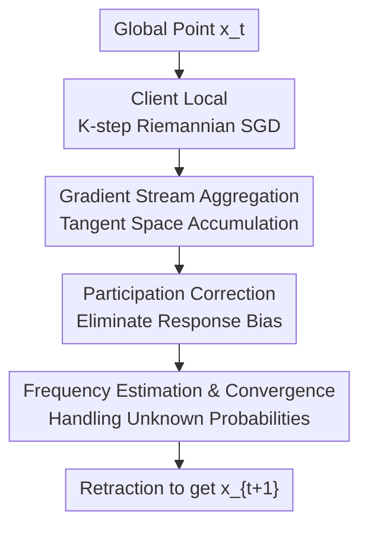

# Riemannian Federated Learning via Averaging Gradient Streams

**Conference**: ICLR 2026  
**OpenReview**: [https://openreview.net/forum?id=oEtrDiFOFF](https://openreview.net/forum?id=oEtrDiFOFF)  
**Code**: https://github.com/zhenwei-huang/RFedAGS.git  
**Area**: Riemannian Optimization / Federated Optimization  
**Keywords**: Riemannian Federated Learning, Gradient Stream Aggregation, Arbitrary Partial Participation, Non-IID Data, Convergence Analysis  

## TL;DR

This paper proposes RFedAGS, which, in the context of Federated Learning on Riemannian manifolds, replaces the averaging of client model points with the weighted averaging of local stochastic gradients transported back to the server's tangent space. This approach provides convergence guarantees even when arbitrary partial participation and non-IID data coexist, outperforming existing Riemannian FL methods on tasks such as PCA, Hyperbolic Structured Prediction, and SPD Fréchet mean.

## Background & Motivation

**Background**: The fundamental paradigm of Federated Learning (FL) involves a server maintaining a global model, while clients perform several local update steps on their local data before sending the results back to the server for aggregation. 
In Euclidean space, FedAvg directly performs a weighted average of client model parameters. However, when machine learning problems have geometric constraints, parameters often reside on Riemannian manifolds such as Stiefel, Grassmann, Hyperbolic spaces, or SPD matrix manifolds. In these cases, "adding two model points and dividing by two" is not a valid operation. 
Existing Riemannian FL works typically bridge the intuition of Euclidean FedAvg to manifolds using exponential maps, inverse exponential maps, parallel transport, or projections.

**Limitations of Prior Work**: These adaptations face two core challenges. 
First, many manifolds do not have closed-form solutions for inverse exponential maps and parallel transport; for instance, the Stiefel manifold often requires iterative approximations, imposing a heavy computational burden on server aggregation. 
Second, existing theories mostly handle idealized scenarios: full client participation, near-IID client data, or only one local update step per round. 
Once partial participation with non-uniform probabilities, heterogeneous data distributions, and local updates $K > 1$ appear simultaneously, local models drift toward their respective local optima. Traditional "end-point averaging" aggregation can easily skew toward the wrong direction.

**Key Challenge**: Riemannian geometric constraints and federated system constraints overlap at the server aggregation point. 
Geometrically, the server cannot linearly average multiple manifold points. Systemically, participating clients are not a uniform random mini-batch but may respond with unknown and varying probabilities. 
If simple averaging is still used, the expected direction is no longer equivalent to the gradient of the global objective $F(x) = \frac{1}{N}\sum_i f_i(x)$, but becomes the gradient of a reweighted objective $\tilde F$ based on participation probabilities. 
This means the algorithm, while appearing to perform federated optimization, might actually be optimizing a biased objective.

**Goal**: The authors aim to design a federated optimization algorithm applicable to general Riemannian manifolds. 
It must allow for multiple local stochastic gradient steps per client, non-IID data, and arbitrary partial participation, while also correcting bias through estimation even when true participation probabilities are unknown to the server. 
Simultaneously, the algorithm should avoid reliance on expensive or unavailable geometric operators like the inverse exponential map.

**Key Insight**: The authors observe that parameter increments in Euclidean FedAvg can be viewed as the average of local gradient sequences, rather than necessarily the "average of client endpoint models." 
On a Riemannian manifold, while gradients in different tangent spaces cannot be directly summed, vector transport can be used to move each local gradient back to the tangent space $T_{x_t}M$ of the current global point $x_t$. 
Thus, the object of server aggregation shifts from non-linear manifold points to "gradient streams" within the same linear tangent space.

**Core Idea**: Replace "client endpoint averaging" with "average gradient streams" and use inverse probability weighting to correct the bias introduced by arbitrary partial participation.

## Method

### Overall Architecture

RFedAGS addresses the expectation-based federated optimization problem on Riemannian manifolds:
$$
\min_{x\in M} F(x)=\frac{1}{N}\sum_{i=1}^N f_i(x),\qquad f_i(x)=\mathbb{E}_{\xi\sim D_i}[f_i(x;\xi)].
$$
At the start of each communication round, the server broadcasts the current global point $x_t$ to all clients. Each client starts from $x_t$, performs $K$ steps of local Riemannian stochastic gradient updates, and during this process, transports each gradient back to $T_{x_t}M$ via vector transport to accumulate a "gradient stream." 
Participating clients upload this tangent space vector. The server then averages these gradient streams using weights corrected by participation probabilities and performs a retraction to return to the manifold to obtain $x_{t+1}$.

Compared to Riemannian tangent mean methods, the key difference in RFedAGS is that the server no longer processes the client endpoint $x^j_{t,K}$. 
Traditional tangent mean methods roughly require computing $\operatorname{Exp}_{x_t}^{-1}(x^j_{t,K})$ before averaging, which involves compositions of multiple non-linear maps that are difficult to compute and analyze. 
RFedAGS directly sums each local gradient pulled back to $T_{x_t}M$, preserving the linear structure where "increment equals sum of gradients," much like in Euclidean space.

### Key Designs

**1. Gradient Stream Aggregation: Averaging Tangent Directions Instead of Points**

The core design of this paper is shifting the server aggregation target from "local final model points" to "local gradient streams." 
Client $j$ at round $t$ and step $k$ first computes a mini-batch Riemannian stochastic gradient $\eta^j_{t,k}$, then performs a local update $x^j_{t,k+1}=R_{x^j_{t,k}}(-\alpha_t\eta^j_{t,k})$ via retraction. 
Since $\eta^j_{t,k}$ resides in $T_{x^j_{t,k}}M$, gradients from different clients or different local steps belong to different tangent spaces and cannot be added directly. 
The authors use vector transport $T_{\tilde\eta^j_{t,k}}$ to move gradients back to $T_{x_t}M$, where $\tilde\eta^j_{t,k}$ satisfies $R_{x^j_{t,k}}(\tilde\eta^j_{t,k})=x_t$.

The client uploads not $x^j_{t,K}$, but:
$$
\zeta^j_{t,K}=\alpha_t\sum_{k=0}^{K-1}\frac{1}{B_t}\sum_{b\in B^j_{t,k}}T_{\tilde\eta^j_{t,k}}\bigl(\operatorname{grad} f_j(x^j_{t,k};\xi^j_{t,k,b})\bigr).
$$
In the random sampling scenario, the server update is $x_{t+1}=R_{x_t}\bigl(-\frac{1}{|S_t|}\sum_{j\in S_t}\zeta^j_{t,K}\bigr)$. 
This formulation transforms complex "averaging of manifold points" into "averaging of vectors in the same tangent space," avoiding dependence on the inverse exponential map and allowing the descent lemma to be developed around gradient sums, similar to Euclidean FedAvg. This is particularly crucial for non-IID data, where averaging endpoints tends to pull toward local optima, whereas gradient stream aggregation more directly clusters direction information toward the global objective.

**2. Participation Probability Correction: Aligning with the Global Objective**

Partial participation is not merely a matter of fewer clients; it changes the expected optimization objective. 
If each client $i$ responds with a fixed but potentially different probability $p_i$, a simple $1/|S_t|$ average over the responding set $S_t$ results in an expected direction equivalent to $\sum_i \tilde p_i\operatorname{grad} f_i(x)$, where $\tilde p_i$ is determined by all participation probabilities. 
When $p_i$ are unequal, there generally exists no constant $\chi$ such that $\sum_i \tilde p_i\operatorname{grad} f_i(x)=\chi\operatorname{grad}F(x)$. 
This implies that uncorrected algorithms optimize a reweighted objective $\tilde F = \sum_i \tilde p_i f_i$ rather than the original problem.

RFedAGS correction is straightforward: if true probabilities are known, the server uses a weight of $1/(p_iN)$ for each responding client:
$$
 x_{t+1}=R_{x_t}\left(-\varpi\sum_{i\in S_t}\frac{1}{p_iN}\zeta^i_{t,K}\right).
$$
Since $\mathbb{E}[\mathbf{1}_{S_t}(i)/(p_iN)]=1/N$, the corrected expected direction realigns with $\operatorname{grad}F(x)$. This is not a minor implementation detail but a theoretical prerequisite, turning arbitrary participation into a "unbiased but variance-prone gradient stream aggregation."

**3. Frequency Estimation and Probability Error Assumption**

In real systems, the server typically does not know $p_i$ and can only observe past responses. 
The paper adopts frequency estimation: round $t$ uses the participation frequency $q^i_t$ of client $i$ over the past $t-1$ rounds as an approximation for $p_i$. This frequency is calculated before the current round to maintain independence between $q^i_t$ and the current participation set $S_t$. 
The update replaces $p_i$ with $q^i_t$.

Theoretically, the authors abstract this approximation error into Assumption 3.8: $|1/q^i_t-1/p_i|\le \sqrt{G}\alpha_t$, with $q^i_t$ being bounded away from zero. 
The paper rigorously justifies this using the Law of Large Numbers for Bernoulli trials, Hoeffding's inequality, and Chebyshev's inequality, showing that when $q^i_t$ is the historical frequency and the step size $\alpha_t=O(t^{-a})$ for $a\in(1/2,1]\cup\{0\}$, this condition holds with high probability.

**4. Convergence Analysis for Decaying and Fixed Step Sizes**

The core of the analysis is establishing a descent lemma for RFedAGS. 
Because the aggregated amount $R_{x_t}^{-1}(x_{t+1})$ is already expressed as a sum of gradient flows in the tangent space, the authors can separately control four types of errors: agent drift caused by local updates and non-IID data, probability estimation error, partial participation variance, and mini-batch stochastic gradient noise. 
The term $Q(K,B_t,\alpha_t,\varpi)$ in the paper encapsulates these errors.

Under general non-convex objectives, with decaying step sizes satisfying $\sum_t \alpha_t = \infty$ and $\sum_t \alpha_t^2 < \infty$, RFedAGS achieves global convergence, specifically $\liminf_t \mathbb{E}\|\operatorname{grad}F(x_t)\|^2 = 0$. 
If $\alpha_t = \alpha_0/(\beta+t)^p$ for $p \in (1/2, 1]$, the sublinear rate is $O(1/\log T)$ for $p=1$ and $O(1/T^{1-p})$ for $p \in (1/2, 1)$. 
Under the RPL condition, the paper provides an $O(1/t)$ convergence for the expected optimality gap. For fixed step sizes, RFedAGS converges to a neighborhood of the stationary point or solution, with the neighborhood size controlled by the step size and the aforementioned error terms.

## Key Experimental Results

### Main Results

The paper evaluates RFedAGS on three typical manifold learning problems: PCA on the Stiefel manifold, hyperbolic structured prediction (HSP) on the Hyperbolic manifold, and Fréchet mean computation (FMC) on the SPD manifold. 
Baselines include RFedAvg, RFedSVRG, RFedProj, and ZO-RFedProj; note that RFedProj/ZO-RFedProj are only applicable to compact embedded submanifolds and cannot cover Hyperbolic or SPD scenarios.

| Task | Manifold | Data | Baselines | Main Conclusions |
|------|----------|------|-----------|------------------|
| PCA | Stiefel | Synthetic non-IID, CIFAR10 | RFedAvg, RFedSVRG, RFedProj, ZO-RFedProj | RFedAGS is overall better in solution accuracy and CPU time. |
| HSP | Hyperbolic Lorentz | WordNet mammal subtree | RFedAvg, RFedSVRG | RFedAGS achieves lower distance to the true hyperbolic point and faster convergence. |
| FMC | SPD Matrix | PATHMNIST covariance descriptors | RFedAvg, RFedSVRG | RFedAGS consistently outperforms both baselines on the Fréchet mean objective. |
| LRMC (Appdx) | Grassmann | Synthetic, MovieLens 1M | RSD, RCG, LRBFGS | With appropriate $K$, RFedAGS approaches the RMSE of centralized Riemannian optimizers. |

In the PCA experiment on synthetic data, RFedAGS outperformed existing RFL algorithms, reaching a significantly lower optimality gap. Results on CIFAR10 with non-IID partitioning and unequal participation probabilities further demonstrated that RFedAGS descends faster and more stably.

### Ablation Study

The appendix performs several ablation experiments analyzing the core assumptions, especially the impact of the aggregation method, participation schemes, data heterogeneity, and local steps $K$.

| Configuration / Variable | Experimental Object | Observed Results | Explanation |
|--------------------------|---------------------|------------------|-------------|
| AGS-AP vs AGS-RS | Principal eigenvector on MNIST | AGS-AP gets lower gap; AGS-RS optimizes the reweighted objective $\tilde F$ | Probability correction is essential to avoid bias. |
| Random Sampling vs Arbitrary Participation | Same expected rate (0.3/0.5/0.7) | Performance is almost identical | Arbitrary participation model generalizes random sampling. |
| True Prob. vs Freq. Estimation | Scenarios with stragglers | Freq. estimation curves are very close to true prob. | Historical frequency is a sufficient proxy for participation statistics. |
| Increased Heterogeneity | IID, mild non-IID, heavy non-IID MNIST | Solution quality degrades as heterogeneity increases | Agent drift remains a challenge, but RFedAGS is stable. |
| Local Steps $K$ Variation | Fixed step size PEC | Larger $K$ is faster initially but has larger neighborhood error | Consistent with the error term expansion in the theory. |

### Key Findings

- Gradient stream aggregation is better suited for multi-step local updates than tangent mean or endpoint averaging, as it keeps the analysis within the linear structure of $T_{x_t}M$.
- Failing to correct for participation probabilities causes a systematic bias toward clients with higher participation rates, optimizing a reweighted objective.
- Frequency estimation is highly accurate in practice, supporting the use of unknown participation statistics in RFedAGS.
- Data heterogeneity and larger $K$ amplify agent drift; RFedAGS provides a clear error decomposition to manage these factors via step size adjustment.
- RFedAGS is more broadly applicable than RFedProj as it requires only general retraction and bounded vector transport, rather than orthogonal projections on compact submanifolds.

## Highlights & Insights

- **Reinterpreting FedAvg as Gradient Flow Averaging**: Instead of defining "manifold means," the paper returns to the increment expansion of Euclidean FedAvg, identifying that the server truly needs the direction information from local gradient sequences. This solves both computational feasibility and theoretical tractability.

- **Clarifying Arbitrary Participation Bias**: Theorem 2.1 explicitly shows how simple averaging over response sets optimizes $\tilde F$ instead of $F$. This makes the $1/(p_iN)$ correction a necessary theoretical requirement rather than just a practical trick.

- **Comprehensive Theoretical Framework**: The analysis incorporates multi-step local updates, vector transport, retraction smoothness, and estimation errors into a single descent framework. The final error terms provide a clear mapping to system factors like agent drift and noise.

- **Manifold Friendliness**: Avoiding the inverse exponential map is a major practical advantage. For many matrix manifolds, the exponential map is elegant but computationally expensive; using retraction and vector transport allows for seamless integration with optimization toolboxes like Manopt.

## Limitations & Future Work

- **Time-Invariant Statistics**: The current arbitrary participation model assumes constant participation probabilities $p_i$. Real-world availability varies with time (day/night cycles, congestion), and the authors list time-varying participation as future work.
- **Cold-Start Estimation**: Frequency estimation works well in the long run but may be less reliable in the early stages or when probabilities shift abruptly.
- **Manifold Assumptions**: The theory relies on standard but strong assumptions (totally retractive sets, bounded variance/vector transport). While natural for compact manifolds, maintaining these in non-compact spaces like Hyperbolic or SPD manifolds requires careful engineering.
- **Scale of Experiments**: While effective for geometric learning tasks, the utility of RFedAGS in end-to-end training of large-scale deep networks or manifold layers remains to be explored.

## Related Work & Insights

- **vs FedAvg / Local SGD**: FedAvg averages models in Euclidean space; RFedAGS interprets those increments as gradient sequence averages and extends this to Riemannian manifolds, handling tangent space inconsistencies via retraction.
- **vs RFedSVRG / Riemannian FedAvg**: Previous methods using exponential maps and parallel transport are theoretically elegant but computationally heavy. RFedAGS uses general retraction and is the first to systematically handle arbitrary partial participation and non-IID data simultaneously.
- **vs RFedProj**: Projection-based methods are limited to compact embedded submanifolds. RFedAGS operates at a higher level of abstraction, covering a wider range of manifolds (e.g., Hyperbolic, SPD).

## Rating

- Novelty: ⭐⭐⭐⭐⭐ (The shift to "gradient flow averaging" is a powerful perspective for solving RFL challenges.)
- Experimental Thoroughness: ⭐⭐⭐⭐ (Covers various manifolds and ablations, though lacks large-scale deep learning experiments.)
- Writing Quality: ⭐⭐⭐⭐ (Clear theoretical structure, though the proof-heavy constants make it dense.)
- Value: ⭐⭐⭐⭐⭐ (Highly valuable for the intersection of Riemannian optimization and FL; a strong baseline for future work.)

<!-- RELATED:START -->

## Related Papers

- [\[ICLR 2026\] Riemannian Zeroth-Order Gradient Estimation with Structure-Preserving Metrics for Geodesically Incomplete Manifolds](riemannian_zeroth-order_gradient_estimation_with_structure-preserving_metrics_fo.md)
- [\[ICLR 2026\] FedDAG: Clustered Federated Learning via Global Data and Gradient Integration for Heterogeneous Environments](feddag_clustered_federated_learning_via_global_data_and_gradient_integration_for.md)
- [\[ICLR 2026\] DADA: Dual Averaging with Distance Adaptation](dada_dual_averaging_with_distance_adaptation.md)
- [\[ICLR 2026\] Byzantine-Robust Federated Learning with Learnable Aggregation Weights](byzantine-robust_federated_learning_with_learnable_aggregation_weights.md)
- [\[ICLR 2026\] Strongly Convex Sets in Riemannian Manifolds](strongly_convex_sets_in_riemannian_manifolds.md)

<!-- RELATED:END -->
## Related Papers

- [\[ICLR 2026\] Riemannian Zeroth-Order Gradient Estimation with Structure-Preserving Metrics for Geodesically Incomplete Manifolds](riemannian_zeroth-order_gradient_estimation_with_structure-preserving_metrics_fo.md)
- [\[ICLR 2026\] FedDAG: Clustered Federated Learning via Global Data and Gradient Integration for Heterogeneous Environments](feddag_clustered_federated_learning_via_global_data_and_gradient_integration_for.md)
- [\[ICLR 2026\] DADA: Dual Averaging with Distance Adaptation](dada_dual_averaging_with_distance_adaptation.md)
- [\[ICLR 2026\] Byzantine-Robust Federated Learning with Learnable Aggregation Weights](byzantine-robust_federated_learning_with_learnable_aggregation_weights.md)
- [\[ICLR 2026\] Strongly Convex Sets in Riemannian Manifolds](strongly_convex_sets_in_riemannian_manifolds.md)

<!-- RELATED:END -->
