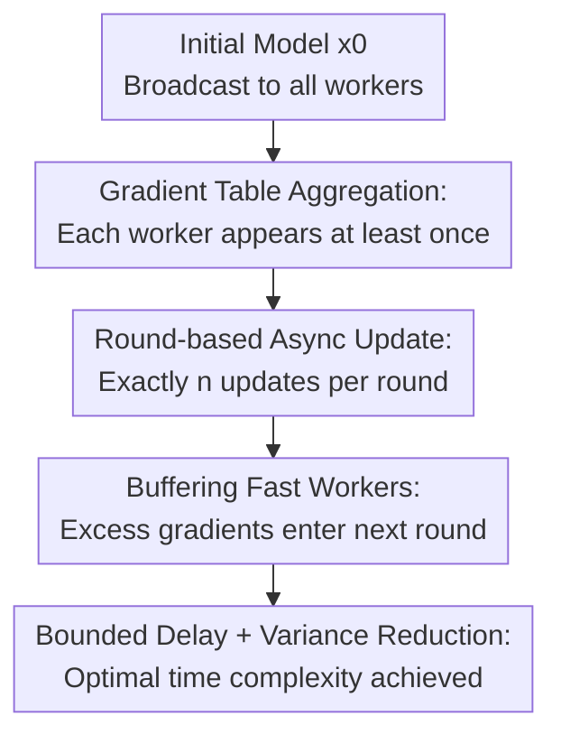

# Ringleader ASGD: The First Asynchronous SGD with Optimal Time Complexity under Data Heterogeneity

**Conference**: ICLR2026  
**OpenReview**: [https://openreview.net/forum?id=5wqTal0EuC](https://openreview.net/forum?id=5wqTal0EuC)  
**Code**: To be confirmed  
**Area**: Asynchronous SGD Optimization Theory / Heterogeneous Data Federated Optimization  
**Keywords**: Asynchronous Optimization, Stochastic Gradient Descent, Data Heterogeneity, Time Complexity, Delay Control  

## TL;DR
Ringleader ASGD utilizes a "gradient table + round-based buffering + exactly one update per worker per round" asynchronous mechanism to avoid training dominance by fast devices in non-convex stochastic optimization under arbitrary data heterogeneity. It achieves the optimal time complexity for parallel first-order stochastic methods within a fixed computation time model.

## Background & Motivation
**Background**: Distributed training and federated learning typically involve computing stochastic gradients in parallel across a large number of workers. Classic synchronous SGD waits for all workers to return a gradient before updating each round. While theoretically clean, these methods are bottlenecked by the slowest workers (stragglers) in systems with diverse hardware speeds, network statuses, and device availability. Asynchronous SGD follows the opposite intuition: whoever finishes first submits first, allowing the server to update without waiting and keeping fast devices active.

**Limitations of Prior Work**: This intuition is difficult to prove optimal even under IID (Independent and Identically Distributed) settings and becomes more problematic under data heterogeneity. If the local objective $f_i$ for each worker comes from a different distribution, naive asynchronous updates allow fast workers to contribute more gradients, pulling the model toward the local distribution of fast devices. Gradients from slow workers are not only fewer but often more stale. Consequently, while the algorithm avoids waiting, it effectively trades a "biased data distribution" for progress.

**Key Challenge**: Scenarios with data heterogeneity require retaining information from all workers in every update; otherwise, the global objective $f(x)=\frac{1}{n}\sum_{i=1}^n f_i(x)$ will be contaminated by local objectives. At the same time, asynchronous systems aim to keep fast workers active without discarding computation. Existing methods often satisfy only part of these needs: Naive Minibatch SGD ensures unbiasedness but waits for the slowest device; IA2SGD uses a gradient table to include all workers but lacks effective delay control for slow workers; Malenia SGD achieves optimal time complexity but is a synchronous algorithm that discards in-progress computations at synchronization boundaries.

**Goal**: The authors aim to bridge a specific theoretical gap: under the conditions of smooth non-convex stochastic optimization, arbitrary worker data heterogeneity, and heterogeneous worker computation times, does there exist a truly asynchronous SGD method that requires no data similarity assumptions, causes no worker idling, discards no gradient computations, and matches the time complexity lower bound for parallel first-order stochastic methods established by Tyurin and Richtárik?

**Key Insight**: The paper observes that the failure of asynchronous methods is not just due to "delay," but because "fast workers have low delay and high frequency, while slow worker entries in the table lag behind perpetually." Thus, one cannot simply discard stale gradients as in Ringmaster ASGD, because discarding a slow worker's gradient in a heterogeneous setting removes its local distribution information from the global update. A better approach is to place the redundant gradients of fast workers into a buffer, to be used only when the algorithmic structure permits.

**Core Idea**: Ringleader ASGD combines the gradient table from IA2SGD, the delay control from Ringmaster ASGD, and the round-based collection idea from Malenia SGD. Each round first ensures every worker appears at least once, then performs $n$ updates asynchronously following the arrival order of workers. Excess gradients from fast workers are neither used for immediate updates nor discarded; instead, they are buffered for the next round.

## Method
Ringleader ASGD addresses the following distributed stochastic optimization problem:

$$
\min_{x\in\mathbb{R}^d} f(x)=\frac{1}{n}\sum_{i=1}^n f_i(x),\quad f_i(x)=\mathbb{E}_{\xi_i\sim D_i}[f_i(x;\xi_i)].
$$

Each worker $i$ has its own data distribution $D_i$, and computing a stochastic gradient takes $\tau_i$ seconds. In a fixed computation time model, it is assumed that $0<\tau_1\le\tau_2\le\cdots\le\tau_n$, where $\tau_n$ is the time of the slowest worker and $\tau_{avg}=\frac{1}{n}\sum_i\tau_i$ is the average computation time. The paper focuses on the "wall-clock time" required to find a point such that $\mathbb{E}\|\nabla f(x)\|^2\le\varepsilon$, rather than the number of iterations.

### Overall Architecture
The Ringleader ASGD server maintains a gradient accumulation table $(G_i,b_i)$ for each worker: $G_i$ is the sum of gradients for worker $i$ currently in the table, and $b_i$ is the count of those gradients. An update uses the average of all table entries:

$$
\bar g^k=\frac{1}{n}\sum_{i=1}^n \bar g_i^k,
\quad
\bar g_i^k=\frac{1}{b_i^k}\sum_{j=1}^{b_i^k} g_{i}^{k,j},
\quad
x^{k+1}=x^k-\gamma \bar g^k.
$$

The algorithm operates in rounds, with each round performing exactly $n$ model updates. Phase 1 only collects gradients until every worker has at least one gradient in the main table. Phase 2 performs model updates sequentially as new worker gradients arrive, ensuring each worker receives a new model at most once per round. If a fast worker that has already been updated in the current round sends another gradient, it is placed in a temporary table $(G_i^+,b_i^+)$ and transferred to the main table at the start of the next round.

### Key Designs
**1. Gradient Table Aggregation: Every Step Sees All Local Distributions**

Naive asynchronous SGD updates immediately upon receiving a gradient from any worker, taking the form $x^{k+1}=x^k-\gamma\nabla f_{i_k}(x^{k-\delta_k};\xi)$. If fast workers arrive more frequently, the distribution of $i_k$ is not uniform, biasing the update toward the $f_i$ of fast workers. Ringleader ASGD's first correction is the use of a gradient table: every update uses $\frac{1}{n}\sum_i G_i/b_i$, meaning each worker averages locally first, followed by a uniform average across workers.

This design directly addresses the key requirement of heterogeneous data: it does not assume $f_i$ are similar, nor does it require local distributions to match the global one. As long as every entry contains the latest batch of gradients from worker $i$, the update estimator structurally covers all local objectives. Compared to IA2SGD, Ringleader ASGD inherits the benefit of "every worker has a slot" but prevents entries from becoming infinitely stale due to speed differences.

**2. Round-based Async Update: Compressing Delay to $2n-2$**

Simply maintaining a table is insufficient because a slow worker's entry might stay stagnant while the server pushes the model forward using new entries from fast workers. Ringleader ASGD thus partitions time into rounds: Phase 1 waits until every worker submits at least one gradient; Phase 2 performs exactly $n$ updates, giving each worker a new model only once per round. This ensures that the time from when a worker starts computing on an old model to when its gradient is used in the table update spans a limited number of server updates.

The paper proves a clear delay bound: for any worker and any iteration, the delay satisfies $\delta_i^k\le 2n-2$. This bound does not depend on the ratio of worker speeds or data similarity. Its significance lies in transforming the "stale gradient" problem—the hardest part of asynchronous analysis—into a controllable residual term, allowing the convergence proof to close under smoothness assumptions.

**3. Buffering Fast Workers: No Discarded Work**

While Ringmaster ASGD can control delay in IID settings by discarding old gradients, this is dangerous in heterogeneous settings: if a slow worker's gradient is discarded, its local distribution information disappears from the update. Ringleader ASGD chooses to "buffer instead of discard." In Phase 2, if a fast worker sends a new gradient after it has already been updated, the server does not immediately trigger an update; instead, it accumulates it into the temporary table $(G_i^+,b_i^+)$.

This solves two problems simultaneously. First, workers do not need to idle, preserving the "idle-free" asynchronous attribute. Second, extra computation is not wasted; it becomes a valid gradient in the next round. More importantly, the extra gradients computed by fast workers form a larger local minibatch, reducing stochastic noise without changing the uniform weight across workers.

**4. New Smoothness Assumption: Controlling Global Gradient Bias on Heterogeneous Entries**

To analyze the estimator where "each worker's gradient may be computed at a different old point $y_i$," the paper introduces an assumption positioned between global smoothness and individual local function smoothness: there exists $L>0$ such that

$$
\left\|\nabla f(x)-\frac{1}{n}\sum_{i=1}^n \nabla f_i(y_i)\right\|^2
\le
\frac{L^2}{n}\sum_{i=1}^n \|x-y_i\|^2.
$$

This condition is stronger than requiring $f$ to be $L_f$-smooth but weaker than requiring every $f_i$ to be controlled by the same worst-case constant $L_{max}$. The paper yields the relationship $L_f\le L\le \sqrt{\frac{1}{n}\sum_i L_{f_i}^2}\le L_{max}$, explaining that $L=L_f$ when all $f_i$ are identical. Thus, the $L$ in the final complexity is not an arbitrary constant but a specific smoothness measure for heterogeneous gradient table analysis.

### Mechanism
Consider 4 workers with speeds $\tau_1<\tau_2<\tau_3<\tau_4$. All workers start from $x^0$. In Phase 1, worker 1 might return multiple gradients, and workers 2 and 3 might return several, but the server does not update until the first gradient from worker 4 arrives. At this point, the main table count might be $b=(4,2,1,1)$, and the update direction is the uniform average of the four workers' local average gradients, rather than a simple average of 8 gradients.

Upon entering Phase 2, assuming worker 4 has just finished Phase 1, the server first performs an update using the current main table and sends $x^1$ to worker 4. Subsequently, worker 1 might quickly send another gradient, but since worker 1 is no longer in the "pending update set" for this round, this gradient enters the temporary table instead of triggering an update. As workers 2, 3, and 1 finish their current computations, the server sequentially adds their new gradients to the main table, performs updates, and sends back new models. After all four workers have received a new model, the round ends, and the temporary table transfers to the main table for the next round.

In this example, fast worker 1 never idles or gets force-stopped; slow worker 4 still enters at least one update per round; and the server still aggregates uniformly by worker. The algorithm sacrifices the greediness of "every fast gradient triggers an update" to gain an unbiased structure and provable delay bounds under data heterogeneity.

### Loss & Training
The training goal is standard $\varepsilon$-stationarity in non-convex stochastic optimization: finding a random iterate such that $\mathbb{E}\|\nabla f(x)\|^2\le\varepsilon$. Under the bounded variance assumption, the stochastic gradient for each worker satisfies

$$
\mathbb{E}_{\xi_i}[\nabla f_i(x;\xi_i)]=\nabla f_i(x),
\quad
\mathbb{E}_{\xi_i}\|\nabla f_i(x;\xi_i)-\nabla f_i(x)\|^2\le\sigma^2.
$$

The theoretical step size is set as

$$
\gamma=\min\left\{\frac{1}{8nL},\frac{\varepsilon B}{10L\sigma^2}\right\},
\quad
B=\inf_k\left(\frac{1}{n}\sum_{i=1}^n \frac{1}{b_i^k}\right)^{-1}.
$$

Here $B$ is a lower bound on the harmonic mean of local minibatch sizes across workers in each round. Its presence in the complexity is intuitive: fast workers accumulate more gradients while waiting for the slowest worker, and while the worker-level weight remains uniform, the variance of the local average decreases. The paper proves that in the fixed computation time model, every $n$ updates take no more than $2\tau_n$ time, and $B\ge \tau_n/(2\tau_{avg})$. Combined with the iteration complexity, the time complexity is

$$
O\left(\frac{L\Delta}{\varepsilon}\left(\tau_n+\tau_{avg}\frac{\sigma^2}{n\varepsilon}\right)\right),
$$

which matches the lower bound for parallel stochastic first-order methods when $L=O(L_f)$. The paper also extends the algorithm to a universal computation model with varying times in the appendix, matching Tyurin's lower bound.

## Key Experimental Results

### Main Results
The experiments are toy simulations aimed at verifying theoretical trends rather than setting SOTA on large-scale models. The setup uses MNIST and Fashion-MNIST image classification with 100 clients, utilizing a Dirichlet concentration $\alpha=0.1$ to construct strong non-IID data. The model is a two-layer MLP (`Linear(d,128) -> ReLU -> Linear(128,10)`) with a client minibatch size of 4. Results report the squared gradient norm $\|\nabla f(x_k)\|^2$ on full data over wall-clock time. Learning rates are swept for each method, and results represent the median and IQR of 30 random seeds.

| Evaluation Dimension | Ringleader ASGD | Malenia SGD | IA2SGD |
|--------|------------------|-------------|--------|
| Execution | Async, $n$ sequential updates/round | Sync, single broadcast update in Phase 2 | Async, update-on-arrival table |
| Similarity Assumption | Not required | Not required | Not required |
| Optimal Time Complexity | Yes, when $L=O(L_f)$ | Yes | No |
| Worker Idling | No | No, but discards work during sync | No |
| Experimental Conclusion | Fastest descent on MNIST/Fashion-MNIST | Theoretically same order but slower | Significantly affected by stale table |

### Ablation Study
Rather than a traditional ablation table, the paper uses mechanism comparisons with neighboring algorithms to support design choices: IA2SGD is Ringleader without round-based delay control; Malenia SGD is Phase 1 collection with a synchronous Phase 2 that discards in-progress work; Naive Minibatch SGD keeps a minibatch structure but makes fast workers wait for the slowest.

| Config / Method | Key Complexity or Phenomenon | Explanation |
|------|------------------|------|
| Naive Minibatch SGD | $O\left(\frac{L_f\Delta}{\varepsilon}(\tau_n+\tau_n\frac{\sigma^2}{n\varepsilon})\right)$ | Variance term multiplied by $\tau_n$; extra computation of fast workers yields no time gain |
| IA2SGD | Similar order to Naive Minibatch | Has gradient table but lacks delay control; async execution does not yield optimal time complexity |
| Malenia SGD | $O\left(\frac{L_f\Delta}{\varepsilon}(\tau_n+\tau_{avg}\frac{\sigma^2}{n\varepsilon})\right)$ | Theoretically optimal but synchronous; Phase 2 has only one global update and discards work |
| Ringleader ASGD | $O\left(\frac{L\Delta}{\varepsilon}(\tau_n+\tau_{avg}\frac{\sigma^2}{n\varepsilon})\right)$ | Async, no idle, no discarded work; matches lower bound up to smoothness constant $L$ vs $L_f$ |

### Key Findings
- Ringleader's gains are most evident in high-noise regimes: the stochastic noise term in synchronous minibatch is dominated by the slowest worker's time $\tau_n$, whereas Ringleader replaces this with the average computation time $\tau_{avg}$.
- Theoretically, Ringleader ASGD and Malenia SGD are of the same order, but Ringleader is faster in practice because it performs $n$ model updates in Phase 2, while Malenia performs only one synchronous update.
- IA2SGD demonstrates that "async + gradient table" alone is insufficient; without restricting table entry delay, stale gradients from slow workers still hinder convergence.
- When stochastic noise is very low, the advantage of the asynchronous structure diminishes because fewer gradient evaluations suffice to drive optimization, making the waiting cost of Naive Minibatch SGD less dominant.

## Highlights & Insights
- Framing the "asynchronous optimality" problem around time complexity rather than iteration complexity is critical. In parallel training, more iterations do not necessarily mean slower time; the key is how worker calculation time is utilized.
- The most clever aspect of the paper is not treating fast workers as noise sources to be suppressed, but converting their extra gradients into local minibatch variance reduction. This preserves the resource utilization of asynchronous systems while preventing fast workers from gaining excessive weight under data heterogeneity.
- Uniform averaging at the worker level in the gradient table is core to handling arbitrary heterogeneity. It reminds us that "more samples means more weight" is not always rational in federated optimization, especially when client data does not represent the global distribution.
- The new Assumption 2 is a valuable theoretical tool. It directly characterizes the bias between the "global gradient at $x$" and the "average of local gradients at different old points $y_i$," which is more nuanced than using $L_{max}$ and more useful for async analysis than just $L_f$-smoothness.
- The relationship between Ringleader and Malenia is enlightening: optimal synchronous algorithms are not necessarily the opposite of optimal asynchronous ones. Often, the collection rules of synchronous algorithms can be preserved; what needs to change is the update and buffering strategy.

## Limitations & Future Work
- The theory is built on a computation-only model where communication is instantaneous. The authors clarify this is a standard model for this line of lower and upper bounds, but real systems still require mechanisms for communication compression, bandwidth contention, and server-to-worker broadcast latency.
- Optimality depends on $L=O(L_f)$. Although the paper proves $L_f\le L\le L_{max}$, in highly heterogeneous objective families, $L$ might be significantly larger than the global smoothness constant, leaving a non-constant gap with the lower bound.
- Experiments are toy-scale, verifying trends only on two-layer MLPs and MNIST/Fashion-MNIST. For large model training, real federated device drops, and non-stationary client participation, systematic experiments are needed to judge the memory, scheduling, and communication overhead of the buffer table.
- Step size settings still require values like $\varepsilon, B, \sigma^2$ to match theoretical rates. The paper notes the structure is more parameter-free than Malenia, but practical tuning remains a key deployment issue.
- Future work could combine Ringleader's delay control with communication compression, local multi-step updates, client sampling, or privacy constraints to form versions closer to practical federated learning systems.

## Related Work & Insights
- **vs Naive Minibatch SGD**: Naive Minibatch SGD waits for all workers every round; gradient estimates are unbiased, but time is dominated by $\tau_n$. Ringleader maintains uniform worker contributions while using fast workers' extra calculations to reduce the variance term.
- **vs IA2SGD**: IA2SGD also maintains a fresh gradient table and requires no similarity assumptions. Ringleader's distinction lies in using rounds and buffering to control table delay, preventing slow workers from stalling on excessively old models.
- **vs Malenia SGD**: Malenia is an existing synchronous optimal method under data heterogeneity. Ringleader inherits its "collect sufficient gradients first" idea but replaces Phase 2 with asynchronous sequential updates to avoid discarding work and gain more update opportunities.
- **vs Ringmaster ASGD**: Ringmaster solves asynchronous optimality under IID data by discarding stale gradients. Ringleader, facing data heterogeneity, cannot discard slow worker information and thus uses buffering instead.
- **Insight for Optimization Theory**: By simultaneously achieving "no sync, no idle, no discard, no similarity assumptions, and optimal time complexity," this paper demonstrates that theoretical bottlenecks in asynchronous optimization do not necessarily stem from asynchrony itself, but from the imbalance between update frequency and data weights.

## Rating
- Novelty: ⭐⭐⭐⭐⭐ First to provide an asynchronous SGD reaching optimal time complexity under data heterogeneity without similarity assumptions.
- Experimental Thoroughness: ⭐⭐⭐ Sufficient to verify theoretical trends, but task and model scales are small; system-level evidence is limited.
- Writing Quality: ⭐⭐⭐⭐⭐ Problem positioning and relationships with IA2SGD/Malenia/Ringmaster are very clear; the complexity table explicitly highlights current contribution boundaries.
- Value: ⭐⭐⭐⭐⭐ Highly valuable for both asynchronous federated optimization and distributed training theory, particularly clarifying why "more contributions from fast workers" does not simply equate to acceleration under data heterogeneity.

<!-- RELATED:START -->

## Related Papers

- [\[ICLR 2026\] Unified Analyses for Hierarchical Federated Learning: Topology Selection under Data Heterogeneity](unified_analyses_for_hierarchical_federated_learning_topology_selection_under_da.md)
- [\[ICLR 2026\] Birch SGD: A Tree Graph Framework for Local and Asynchronous SGD Methods](birch_sgd_a_tree_graph_framework_for_local_and_asynchronous_sgd_methods.md)
- [\[ICLR 2026\] Decentralized Nonconvex Optimization under Heavy-Tailed Noise: Normalization and Optimal Convergence](decentralized_nonconvex_optimization_under_heavy-tailed_noise_normalization_and_.md)
- [\[AAAI 2026\] Data Heterogeneity and Forgotten Labels in Split Federated Learning](../../AAAI2026/optimization/data_heterogeneity_and_forgotten_labels_in_split_federated_learning.md)
- [\[AAAI 2026\] Tackling Resource-Constrained and Data-Heterogeneity in Federated Learning with Double-Weight Sparse Pack](../../AAAI2026/optimization/tackling_resource-constrained_and_data-heterogeneity_in_federated_learning_with_.md)

<!-- RELATED:END -->
